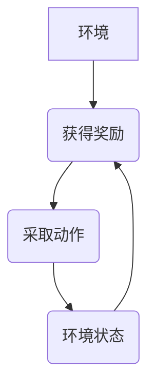
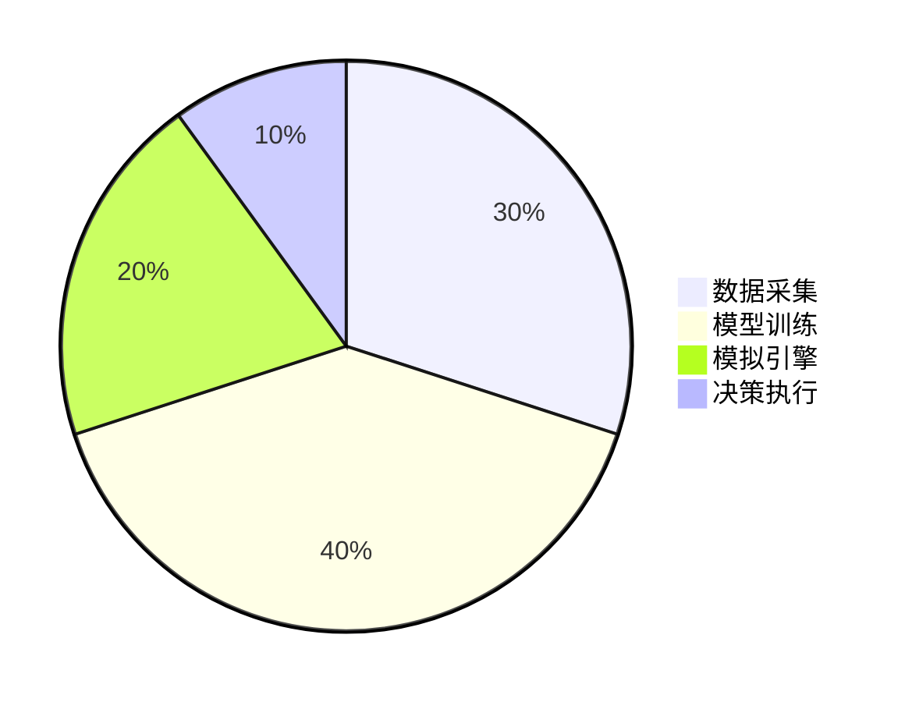

                 


# AI Agent在企业风险预测与情景模拟中的前沿应用

## 关键词：
AI Agent, 风险预测, 情景模拟, 企业应用, 机器学习, 强化学习, 系统架构

## 摘要：
本文详细探讨了AI Agent在企业风险预测与情景模拟中的前沿应用。首先介绍了AI Agent的基本概念和其在企业中的应用背景，接着深入分析了AI Agent的核心原理与技术，包括决策机制、学习机制和感知交互方式。然后，从算法原理、系统架构设计、项目实战等多个维度展开，详细讲解了AI Agent在企业风险预测和情景模拟中的具体实现和应用场景。最后，结合实际案例，总结了AI Agent的优势、挑战及未来发展方向，为读者提供了全面的视角和深入的分析。

---

## 正文

### 第一部分：AI Agent的基本概念与背景

#### 第1章：AI Agent的定义与特点

##### 1.1 AI Agent的定义
AI Agent（人工智能代理）是指能够感知环境、自主决策并采取行动以实现特定目标的智能实体。AI Agent可以是软件程序、机器人或其他智能系统，其核心在于具备自主性、反应性、目标导向性和学习能力。

##### 1.2 AI Agent的特点
| 特性 | 描述 |
|------|------|
| 自主性 | 能够自主决策，无需人工干预。 |
| 反应性 | 能够实时感知环境并做出响应。 |
| 目标导向性 | 具备明确的目标，并采取行动以实现目标。 |
| 学习能力 | 能够通过经验或数据不断优化自身的性能。 |

##### 1.3 AI Agent与传统算法的区别
传统的算法（如机器学习模型）通常需要明确的规则和数据输入，而AI Agent具备自主性和目标导向性，能够根据环境动态调整行为。AI Agent的核心在于其能够与环境交互并采取行动，而不仅仅是进行预测或分类。

---

#### 第2章：企业风险预测与情景模拟的背景

##### 2.1 企业风险预测的重要性
企业风险预测是指通过分析内外部环境因素，预测可能对企业造成负面影响的事件或趋势。传统的风险预测方法依赖于统计分析和专家经验，但随着数据量的增加和复杂性的提升，传统的方法已难以满足需求。

##### 2.2 情景模拟在企业管理中的作用
情景模拟是一种通过构建虚拟场景来预测和分析不同决策可能带来的结果的方法。它可以帮助企业在复杂环境中制定更加科学和有效的策略。

##### 2.3 AI Agent在其中的应用价值
AI Agent能够通过实时数据感知、自主决策和动态调整行为，显著提升企业风险预测和情景模拟的效率和准确性。它可以帮助企业在复杂环境中快速做出决策，降低风险，并优化资源分配。

---

### 第二部分：AI Agent的核心原理与技术

#### 第3章：AI Agent的决策机制

##### 3.1 基于强化学习的决策过程
强化学习是一种通过试错机制来优化决策策略的方法。AI Agent通过与环境的交互，不断学习最优策略以最大化奖励函数。

##### 3.2 基于概率论的决策模型
概率论在AI Agent的决策过程中起到关键作用。通过概率模型，AI Agent可以评估不同决策的可能性和风险，从而做出更合理的决策。

##### 3.3 多智能体协作的决策方式
在复杂的企业环境中，单个AI Agent往往难以独立完成任务，因此需要多个AI Agent协作完成复杂的决策过程。多智能体协作可以通过分布式计算和通信机制实现。

---

#### 第4章：AI Agent的学习机制

##### 4.1 监督学习在AI Agent中的应用
监督学习是一种通过标注数据进行训练的方法。AI Agent可以通过监督学习掌握特定任务的规律，并在实际应用中进行预测和分类。

##### 4.2 无监督学习在AI Agent中的应用
无监督学习适用于处理无标签数据。AI Agent可以通过聚类分析等无监督学习方法，发现数据中的潜在模式和结构。

##### 4.3 强化学习在AI Agent中的应用
强化学习是AI Agent实现自主决策的核心技术之一。通过不断试错和优化策略，AI Agent可以在复杂环境中做出最优决策。

---

#### 第5章：AI Agent的感知与交互

##### 5.1 多模态数据的感知方式
AI Agent可以通过多种模态（如文本、图像、语音等）感知环境信息，并根据这些信息做出决策。

##### 5.2 自然语言处理在交互中的应用
自然语言处理技术使AI Agent能够理解和生成人类语言，从而实现人机交互。

##### 5.3 图像识别在交互中的应用
图像识别技术使AI Agent能够通过视觉信息感知环境，并根据图像内容做出相应的决策。

---

### 第三部分：AI Agent的算法原理

#### 第6章：强化学习算法的实现与应用

##### 6.1 强化学习的基本原理
强化学习通过试错机制优化决策策略。AI Agent通过与环境交互，获得奖励信号，并通过策略优化算法最大化累计奖励。

##### 6.2 Q-learning算法的实现
Q-learning是一种经典的强化学习算法，通过维护Q值表记录状态-动作对的期望奖励值，并通过策略迭代更新Q值表。

##### 6.3 Deep Q-Network (DQN)的实现
DQN是一种基于深度神经网络的强化学习方法，通过神经网络近似Q函数，从而实现端到端的策略优化。

##### 6.4 算法流程图（mermaid）


##### 6.5 Python代码示例
```python
import numpy as np
class DQN:
    def __init__(self, state_space, action_space, gamma=0.99, epsilon=1.0):
        self.state_space = state_space
        self.action_space = action_space
        self.gamma = gamma
        self.epsilon = epsilon
        self.q_table = np.zeros((state_space, action_space))
    
    def take_action(self, state):
        if np.random.random() < self.epsilon:
            return np.random.randint(self.action_space)
        else:
            return np.argmax(self.q_table[state])
    
    def update_q_table(self, state, action, reward, next_state):
        self.q_table[state][action] = reward + self.gamma * np.max(self.q_table[next_state])
```

---

### 第四部分：AI Agent的系统架构设计

#### 第7章：企业级AI Agent系统架构

##### 7.1 系统功能设计
企业级AI Agent系统通常包括数据采集、模型训练、模拟引擎和决策执行四个主要功能模块。

##### 7.2 系统架构图（mermaid）


##### 7.3 系统接口设计
系统接口设计包括数据输入接口、模型调用接口和决策输出接口，确保各个模块之间的高效协同。

##### 7.4 系统交互流程图（mermaid）
```mermaid
sequenceDiagram
    Actor --> 数据采集模块: 提供环境数据
    数据采集模块 --> 模型训练模块: 传递数据
    模型训练模块 --> 模拟引擎: 传递训练好的模型
    模拟引擎 --> 决策执行模块: 提供模拟结果
    决策执行模块 --> Actor: 执行决策
```

---

### 第五部分：项目实战

#### 第8章：AI Agent在企业风险预测中的应用

##### 8.1 环境安装与数据准备
安装必要的Python库（如numpy、pandas、keras等），并准备企业相关的风险数据集。

##### 8.2 核心代码实现
实现AI Agent的基本功能，包括数据预处理、模型训练和决策执行。

##### 8.3 案例分析
通过具体案例分析AI Agent在企业风险预测中的实际应用效果。

##### 8.4 项目小结
总结项目的实现过程和取得的成果，分析存在的问题和改进方向。

---

### 第六部分：总结与展望

#### 第9章：总结与展望

##### 9.1 总结
总结全文，强调AI Agent在企业风险预测和情景模拟中的重要性和应用价值。

##### 9.2 展望
展望未来，AI Agent在企业中的应用将更加广泛和深入，技术也将不断进步，为企业创造更大的价值。

---

### 作者信息

作者：AI天才研究院/AI Genius Institute & 禅与计算机程序设计艺术 /Zen And The Art of Computer Programming

---

通过以上内容，读者可以全面了解AI Agent在企业风险预测与情景模拟中的前沿应用，从基本概念到具体实现，再到实际案例，都能得到深入的讲解和分析。

