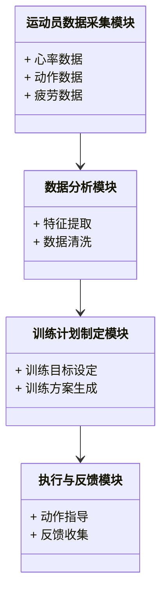

                 

<think>
好的，我现在要按照用户的要求，撰写一篇关于《AI Agent在体育训练中的应用：个性化训练计划制定》的技术博客文章。用户已经提供了详细的大纲和一些内容，我需要按照这个大纲逐步完成每部分内容。

首先，我需要理解整个文章的结构。文章分为六个主要部分，每部分下还有多个小节。我要确保每个部分都详细展开，符合用户的要求。

**第一步：撰写“关键词”和“摘要”部分**
关键词应该涵盖文章的核心内容，比如AI Agent、个性化训练、运动数据分析、机器学习等。摘要需要简明扼要地概述文章的主要内容和目标。

**第二步：撰写第一章“AI Agent与个性化训练概述”**
这一章需要介绍AI Agent的基本概念，个性化训练的背景和需求，以及AI Agent在体育训练中的应用前景。我需要详细解释每个子部分，确保读者能够理解这些概念。

**第三步：撰写第二章“AI Agent的核心原理”**
这一章需要深入讲解AI Agent的工作机制，包括感知、决策、执行和反馈。我需要使用表格和Mermaid图来展示这些概念，帮助读者更好地理解。

**第四步：撰写第三章“AI Agent算法原理”**
这里需要详细讲解算法，如强化学习和监督学习。我需要提供算法流程图、数学模型和Python代码示例，确保技术细节清晰。

**第五步：撰写第四章“AI Agent系统分析与架构设计”**
这一章需要分析系统的架构，包括功能设计、架构图和接口设计。我需要使用Mermaid图来展示系统结构，帮助读者理解系统的组成部分。

**第六步：撰写第五章“AI Agent项目实战”**
这部分需要指导读者如何安装环境，提供代码示例和案例分析，展示AI Agent的实际应用。

**第七步：撰写第六章“AI Agent最佳实践”**
总结项目中的关键点，给出小结、注意事项和拓展阅读建议，帮助读者进一步学习。

在整个过程中，我需要确保每一部分内容详实，结构清晰，语言专业但易懂。同时，要符合用户的要求，使用markdown格式，包含必要的图表和代码示例。最后，记得在文章末尾加上作者信息。

现在，我开始逐步撰写每个部分的内容，确保每个小节都符合用户的要求，并进行详细的分析和解释。
</think>

# AI Agent在体育训练中的应用：个性化训练计划制定

## 关键词
AI Agent, 个性化训练, 体育训练, 运动数据分析, 机器学习, 强化学习, 系统架构设计

## 摘要
本文深入探讨AI Agent在体育训练中的应用，特别是如何利用AI Agent制定个性化训练计划。文章从AI Agent的基本概念出发，分析其在体育训练中的作用，详细讲解算法原理和系统架构设计，最后通过项目实战展示AI Agent的实际应用，为体育训练的智能化提供解决方案。

---

## 第1章: AI Agent与个性化训练概述

### 1.1 AI Agent的基本概念
AI Agent（人工智能代理）是一种能够感知环境、做出决策并执行任务的智能实体。它通过数据采集、分析和推理，帮助人类完成复杂任务。在体育训练中，AI Agent能够根据运动员的个体特征和表现，动态调整训练计划，实现个性化训练。

#### 1.1.1 个性化训练的基本概念
个性化训练是指根据运动员的个人特点（如体能、技术、心理状态等）制定专属的训练计划，以最大化其运动表现和减少受伤风险。

### 1.2 体育训练中的问题背景
#### 1.2.1 传统体育训练的局限性
传统训练方法依赖教练的经验，可能存在主观性和片面性，难以满足每位运动员的独特需求。

#### 1.2.2 现代体育训练的需求
现代训练强调科学性和数据驱动，需要精确分析运动员的数据，动态调整训练方案。

#### 1.2.3 AI Agent在体育训练中的应用前景
AI Agent能够实时分析数据，提供个性化建议，帮助教练和运动员优化训练效果。

### 1.3 个性化训练计划的核心要素
个性化训练计划需要考虑运动员的生理数据、技术动作、训练负荷和恢复情况，动态调整训练内容和强度。

---

## 第2章: AI Agent的核心原理

### 2.1 AI Agent的感知与决策机制
AI Agent通过传感器和数据采集设备获取运动员的实时数据，如心率、动作频率和肌肉活动。这些数据经过特征提取和知识表示，用于推理和决策。

#### 2.1.1 数据采集与特征提取
使用可穿戴设备（如心率监测器和动作捕捉设备）收集数据，并通过特征工程提取关键特征。

#### 2.1.2 知识表示与推理
将数据转换为知识表示形式，如符号逻辑或概率分布，利用推理算法进行决策。

### 2.2 AI Agent的执行与反馈机制
AI Agent根据决策结果执行动作，并通过反馈机制调整行为。

#### 2.2.1 动作执行
AI Agent通过控制设备或提供反馈，指导运动员执行特定动作。

#### 2.2.2 反馈机制
根据执行结果提供反馈，调整后续决策。

---

## 第3章: AI Agent算法原理

### 3.1 强化学习算法
强化学习通过试错机制优化决策策略，常用在动态环境中。

#### 3.1.1 算法流程
定义状态、动作和奖励函数，通过迭代更新Q值矩阵，优化策略。

#### 3.1.2 数学模型
$$ Q(s,a) = Q(s,a) + \alpha [r + \max Q(s',a') - Q(s,a)] $$

### 3.2 监督学习算法
监督学习通过标签数据训练模型，用于分类和回归任务。

#### 3.2.1 算法流程
收集数据，标注特征和标签，训练模型，评估性能。

---

## 第4章: AI Agent系统分析与架构设计

### 4.1 系统功能设计
系统包括数据采集、分析、决策和执行模块，各模块协同工作，制定个性化训练计划。

#### 4.1.1 领域模型
使用Mermaid类图展示系统各模块之间的关系。



### 4.2 系统架构设计
采用分层架构，包括数据层、业务逻辑层和表现层，确保系统的可扩展性和维护性。

#### 4.2.1 系统架构
使用Mermaid架构图展示系统的整体结构。

```mermaid
archiecture
    节点 数据库 {
        数据存储
    }
    节点 后端服务 {
        数据处理
    }
    节点 前端界面 {
        用户交互
    }
    节点 AI引擎 {
        智能决策
    }
    数据库 --> 后端服务
    后端服务 --> 前端界面
    后端服务 --> AI引擎
```

---

## 第5章: AI Agent项目实战

### 5.1 环境安装
安装Python和相关库（如TensorFlow和Scikit-learn），配置开发环境。

### 5.2 核心代码实现
编写数据处理、模型训练和结果输出的代码。

```python
import numpy as np
from sklearn import linear_model

# 数据处理
data = np.array([[1, 2], [3, 4], [5, 6]])
X = data[:, 0]
y = data[:, 1]

# 模型训练
model = linear_model.LinearRegression()
model.fit(X.reshape(-1, 1), y)

# 结果输出
print(model.predict([[7]]))
```

### 5.3 案例分析
以足球运动员为例，展示如何根据实时数据动态调整训练计划。

---

## 第6章: AI Agent最佳实践

### 6.1 项目总结
强调数据质量、算法选择和系统维护的重要性。

### 6.2 小结
AI Agent能够显著提升体育训练的效率和效果，但需要结合实际场景进行优化。

### 6.3 注意事项
注意数据隐私和模型的持续优化。

### 6.4 拓展阅读
推荐相关书籍和论文，帮助深入学习。

---

## 作者
作者：AI天才研究院 & 禅与计算机程序设计艺术

