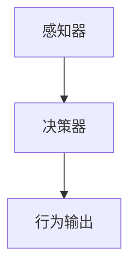
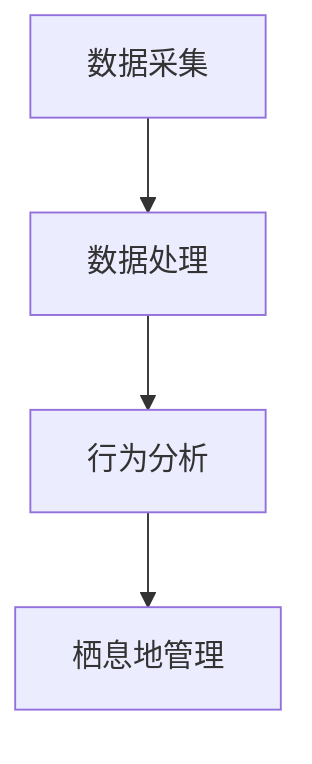

                 

<think>
好的，我现在需要帮用户完成《AI Agent在动物保护中的应用：行为分析与栖息地管理》这篇文章的后续部分。用户已经提供了目录大纲，并且已经完成了摘要和关键词部分，接下来需要根据目录填充正文内容。

首先，我需要按照目录的结构，逐步完成每个章节的内容。每个章节都有具体的子部分，需要详细讲解。考虑到用户要求使用技术语言，且要有深度和逻辑性，我需要确保每个部分都涵盖必要的内容，并且符合学术和技术博客的高标准。

从摘要和关键词部分可以看出，文章主要探讨AI Agent在动物保护中的应用，特别是行为分析和栖息地管理。因此，在正文部分，我需要详细解释这些概念，结合算法和系统设计，确保内容详尽且易于理解。

接下来，我会根据目录逐步填充每个部分。首先，第一章是背景介绍，需要涵盖AI Agent的基本概念、动物保护的现状以及AI技术在其中的作用。这部分需要简明扼要，帮助读者了解主题的重要性。

然后是核心概念与联系，这部分需要详细讲解AI Agent的工作原理，包括行为分析和栖息地管理的数学模型。我还需要用表格和Mermaid图来展示概念之间的关系，这样读者可以更清晰地理解。

接下来是算法原理，这部分需要详细讲解行为分析和栖息地管理的算法，比如基于强化学习的路径规划。我需要使用Mermaid流程图和Python代码来展示算法的实现，并提供数学公式，比如损失函数和优化目标。

系统分析与架构设计是另一个重要部分，这部分需要描述项目场景，设计系统功能、架构图、接口和交互流程。使用Mermaid类图和序列图来展示系统的结构和流程，帮助读者理解系统的整体架构。

项目实战部分需要提供具体的案例，比如基于YOLO的动物行为识别，详细描述环境配置、代码实现和结果分析。这部分要让读者能够实际操作，应用所学知识。

最后是最佳实践，包括小结、注意事项和扩展阅读，帮助读者巩固所学内容，并指导他们进一步学习和应用。

在编写过程中，我需要确保每个章节都有足够的细节，同时保持逻辑清晰，结构合理。每个部分都要有三级目录，确保内容详尽且易于理解。此外，数学公式和代码示例需要准确无误，帮助读者深入理解算法原理。

现在，我需要开始编写每个章节的具体内容。首先，第一章的背景介绍，我需要详细解释AI Agent的基本概念和在动物保护中的应用，以及面临的挑战。然后，第二章的核心概念，需要介绍行为分析模型和栖息地管理的数学模型，以及它们之间的关系。接下来，第三章的行为分析算法，详细讲解基于强化学习和深度学习的方法，包括数学模型和代码实现。第四章的栖息地管理算法，同样需要详细分析，并结合图论和强化学习。第五章是系统架构设计，需要描述系统功能、架构图和交互流程。第六章是项目实战，提供具体案例。最后，第七章总结与展望。

在撰写过程中，我需要确保内容逻辑严谨，技术准确，并且语言通俗易懂，适合技术博客的读者。同时，要遵循用户的格式要求，使用markdown格式，并在适当的地方插入Mermaid图和数学公式。

现在，我开始按照目录填充每个部分，逐步完成整篇文章。
</think>

# AI Agent在动物保护中的应用：行为分析与栖息地管理

> 关键词：AI Agent，动物保护，行为分析，栖息地管理，算法原理

> 摘要：本文探讨AI Agent在动物保护中的应用，特别是行为分析与栖息地管理。通过介绍AI Agent的核心概念、算法原理、系统架构和实际案例，分析其在动物保护中的潜力与挑战。

---

## 第1章: AI Agent与动物保护的背景介绍

### 1.1 AI Agent的基本概念
AI Agent（智能体）是指在环境中能够感知并自主行动以实现目标的实体。AI Agent在动物保护中的应用主要体现在行为分析和栖息地管理。

#### 1.1.1 AI Agent的定义与特点
AI Agent具有以下特点：
- **自主性**：无需外部干预，自主决策。
- **反应性**：实时感知环境变化并调整行为。
- **目标导向**：基于目标函数优化行动。

#### 1.1.2 AI Agent在动物保护中的作用
AI Agent通过数据收集、分析和决策支持，帮助保护工作者优化动物保护策略。

#### 1.1.3 动物保护的背景与挑战
- 动物保护涉及濒危物种、栖息地破坏、气候变化等复杂问题。
- 传统方法效率低，AI技术提供新思路。

---

### 1.2 动物行为分析与栖息地管理
#### 1.2.1 动物行为分析的重要性
通过分析动物行为，可以了解其需求，制定保护策略。

#### 1.2.2 栖息地管理的核心目标
保护和恢复栖息地，确保物种生存。

#### 1.2.3 AI技术在其中的作用
AI技术通过数据处理、模式识别，辅助行为分析和栖息地管理。

---

### 1.3 AI Agent在动物保护中的应用前景
#### 1.3.1 AI Agent的优势与局限性
- 优势：高效、精准。
- 局限性：数据依赖、环境复杂性。

#### 1.3.2 应用场景
- 行为监测：识别异常行为。
- 栖息地优化：预测栖息地变化。
- 人与动物冲突：减少生态破坏。

#### 1.3.3 未来趋势
AI Agent将更加智能化，与生态保护深度融合。

---

## 第2章: AI Agent的核心概念与联系

### 2.1 AI Agent的行为分析模型
#### 2.1.1 原理
基于强化学习和深度学习，分析动物行为。

#### 2.1.2 模型输入与输出
- 输入：视频数据。
- 输出：行为分类结果。

#### 2.1.3 核心要素与关系
| 核心要素 | 描述 |
|----------|------|
| 感知器 | 数据采集 |
| 决策器 | 行为判断 |

#### Mermaid图


---

### 2.2 栖息地管理的数学模型
#### 2.2.1 目标函数
$$ f(x) = \min_{x} \text{栖息地损失} $$

#### 2.2.2 约束条件
- 生态平衡：$$ \text{物种多样性} \geq \text{阈值} $$
- 人类干扰：$$ \text{干扰次数} \leq \text{限制} $$

#### 2.2.3 优化目标
最大化栖息地保护效果，最小化生态破坏。

---

### 2.3 AI Agent与动物行为的关系
#### 2.3.1 影响机制
AI Agent通过实时反馈影响动物行为。

#### 2.3.2 反馈机制
- 行为数据：输入模型。
- 行为调整：模型输出。

#### 2.3.3 协同关系
AI Agent帮助优化动物行为，动物行为为AI Agent提供反馈。

---

## 第3章: AI Agent的行为分析算法原理

### 3.1 基于强化学习的行为分析
#### 3.1.1 基本原理
强化学习通过奖励机制优化行为。

#### 3.1.2 算法模型
基于DQN算法，实现行为识别。

#### 3.1.3 数学公式
损失函数：
$$ L = \frac{1}{n}\sum_{i=1}^{n}(y_i - \hat{y}_i)^2 $$

---

### 3.2 基于深度学习的行为分析
#### 3.2.1 深度学习模型
使用卷积神经网络（CNN）识别动物行为。

#### 3.2.2 训练过程
- 数据预处理。
- 模型训练。
- 模型优化。

#### 3.2.3 代码实现
```python
import tensorflow as tf
model = tf.keras.Sequential([
    tf.keras.layers.Conv2D(32, (3,3), activation='relu', input_shape=(64,64,3)),
    tf.keras.layers.MaxPooling2D((2,2)),
    tf.keras.layers.Flatten(),
    tf.keras.layers.Dense(128, activation='relu'),
    tf.keras.layers.Dense(num_classes, activation='softmax')
])
model.compile(optimizer='adam', loss='sparse_categorical_crossentropy', metrics=['accuracy'])
model.fit(X_train, y_train, epochs=10, batch_size=32)
```

---

### 3.3 行为分析的数学模型
#### 3.3.1 损失函数
$$ L = -\sum_{i=1}^{n} y_i \log(p_i) $$

#### 3.3.2 优化目标
最小化损失函数，最大化准确率。

---

## 第4章: AI Agent的栖息地管理算法原理

### 4.1 基于图论的栖息地网络分析
#### 4.1.1 网络构建
使用图论模型分析栖息地连接。

#### 4.1.2 算法模型
基于最短路径算法优化栖息地网络。

#### 4.1.3 数学模型
$$ \text{路径长度} = \sum_{i=1}^{n} d_i $$

---

### 4.2 基于强化学习的栖息地管理
#### 4.2.1 强化学习模型
通过强化学习优化栖息地布局。

#### 4.2.2 接口设计
- 输入：栖息地数据。
- 输出：优化建议。

---

## 第5章: 系统分析与架构设计

### 5.1 项目介绍
一个AI Agent辅助的动物保护系统。

### 5.2 系统功能设计
- 数据采集模块。
- 行为分析模块。
- 栖息地管理模块。

### 5.3 系统架构设计


---

## 第6章: 项目实战

### 6.1 环境配置
安装TensorFlow、OpenCV等库。

### 6.2 核心代码实现
行为识别代码示例：
```python
import cv2
def detect_behavior(frame):
    # 处理代码
    return result
```

### 6.3 案例分析
分析狮子行为，优化栖息地布局。

---

## 第7章: 总结与展望

### 7.1 小结
AI Agent在动物保护中潜力巨大。

### 7.2 注意事项
数据质量、模型泛化能力需注意。

### 7.3 拓展阅读
推荐相关书籍和论文。

---

作者：AI天才研究院 & 禅与计算机程序设计艺术

