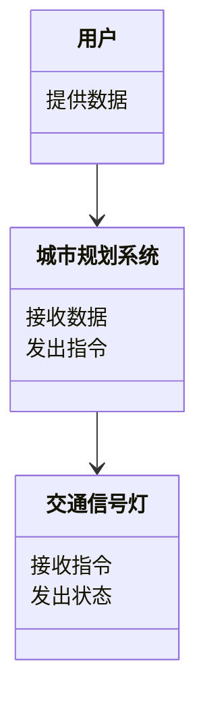

                 


# AI Agent在城市规划中的应用：智能交通与基础设施优化

> **关键词**: AI Agent, 城市规划, 智能交通, 基础设施优化, 算法原理, 系统架构, 项目实战

> **摘要**: 本文探讨了AI Agent在城市规划中的应用，特别是在智能交通和基础设施优化方面的创新。通过详细分析AI Agent的核心概念、算法原理、系统架构以及实际案例，展示了如何利用AI技术解决城市交通问题，优化资源配置，实现城市可持续发展。

---

## 第一部分: 背景介绍

### 第1章: AI Agent与城市规划概述

#### 1.1 AI Agent的基本概念
- **1.1.1 AI Agent的定义与特点**
  - AI Agent（人工智能代理）是能够感知环境并采取行动以实现目标的智能体。
  - 特点：自主性、反应性、目标导向、学习能力。

- **1.1.2 AI Agent与传统算法的区别**
  - 传统算法基于规则和预定义逻辑，而AI Agent具备学习和适应能力。
  - AI Agent能够处理复杂和动态的环境。

- **1.1.3 AI Agent在城市规划中的作用**
  - 优化资源配置、提高效率、改善生活质量。
  - 通过实时数据调整交通信号灯，优化道路使用。

#### 1.2 城市规划中的问题背景
- **1.2.1 传统城市规划的挑战**
  - 交通拥堵、资源浪费、环境污染。
  - 传统方法难以应对动态变化的需求。

- **1.2.2 智能化与数据驱动的规划需求**
  - 利用大数据和AI技术优化城市运营。
  - 实现城市基础设施的智能化管理。

- **1.2.3 AI Agent在城市规划中的应用前景**
  - 提高城市运行效率，降低资源消耗。
  - 为未来城市提供可持续发展的解决方案。

---

## 第二部分: AI Agent的核心概念与联系

### 第2章: AI Agent的核心原理

#### 2.1 AI Agent的核心原理
- **2.1.1 多智能体系统（MAS）的定义**
  - 多智能体系统由多个相互作用的智能体组成，共同完成复杂任务。
  - 各智能体之间通过通信和协调实现目标。

- **2.1.2 AI Agent的决策机制**
  - 基于感知环境的信息，通过学习和推理做出决策。
  - 使用强化学习和监督学习算法优化决策过程。

- **2.1.3 状态空间与动作空间的构建**
  - 状态空间：系统当前的状态，如交通信号灯状态。
  - 动作空间：智能体可采取的行动，如调整信号灯。

#### 2.2 AI Agent的属性特征对比

| **属性**         | **传统算法**             | **AI Agent**               |
|------------------|--------------------------|-----------------------------|
| 决策方式         | 基于规则和逻辑           | 基于学习和经验             |
| 环境适应性       | 静态，适应性差           | 动态，适应性强             |
| 复杂问题处理     | 适用于简单问题           | 适用于复杂和动态问题       |

- **2.2.3 实体关系图与流程图**
  - **ER图**: 描述系统中实体及其关系。
  - **流程图**: 展示AI Agent在交通优化中的步骤。

```mermaid
erDiagram
    actor "用户" {
    }
    actor "城市规划系统" {
    }
    actor "交通信号灯" {
    }
    "用户" -- "城市规划系统": 提供数据
    "城市规划系统" -- "交通信号灯": 调整信号
```

---

## 第三部分: AI Agent的算法原理

### 第3章: 强化学习算法原理

#### 3.1 强化学习的基本概念
- 强化学习：通过试错和奖励机制，学习最优策略。
- 核心要素：状态、动作、奖励、策略。

#### 3.2 强化学习的数学模型


数学公式：
$$ Q(s, a) = Q(s, a) + \alpha (r + \max Q(s', a') - Q(s, a)) $$
其中：
- \( Q(s, a) \)：状态s下采取动作a的期望奖励。
- \( \alpha \)：学习率。
- \( r \)：即时奖励。
- \( \max Q(s', a') \)：下一步状态s'下的最大期望奖励。

#### 3.3 强化学习的Python代码示例

```python
import numpy as np

class QLearning:
    def __init__(self, state_space, action_space, learning_rate=0.1, gamma=0.9):
        self.state_space = state_space
        self.action_space = action_space
        self.lr = learning_rate
        self.gamma = gamma
        self.q_table = np.zeros((state_space, action_space))

    def choose_action(self, state):
        return np.argmax(self.q_table[state])

    def update_q_table(self, state, action, reward, next_state):
        self.q_table[state, action] += self.lr * (reward + self.gamma * np.max(self.q_table[next_state]) - self.q_table[state, action])
```

---

## 第四部分: 系统分析与架构设计

### 第4章: 系统分析与架构设计

#### 4.1 项目背景与目标
- 项目背景：优化城市交通信号灯系统。
- 项目目标：减少交通拥堵，提高通行效率。

#### 4.2 系统功能设计



#### 4.3 系统架构设计


---

## 第五部分: 项目实战

### 第5章: 项目实战

#### 5.1 环境安装
- 安装Python和相关库（如numpy、scikit-learn）。
- 安装Jupyter Notebook用于开发和测试。

#### 5.2 核心代码实现

```python
# 优化交通信号灯的代码示例
def optimize_traffic_lights():
    import numpy as np
    from collections import deque

    # 初始化Q表
    q_table = np.zeros((4, 2))  # 4种状态，2种动作
    learning_rate = 0.1
    gamma = 0.9

    # 训练过程
    for episode in range(1000):
        state = 0  # 初始状态
        for step in range(100):
            action = choose_action(q_table, state)
            next_state = get_next_state(state, action)
            reward = get_reward(action, next_state)
            update_q_table(q_table, state, action, reward, next_state, learning_rate, gamma)
            state = next_state

    return q_table
```

#### 5.3 案例分析
- **案例1**: 优化交通信号灯，减少高峰时期拥堵。
- **案例2**: 分析交通流量，调整信号灯周期。

---

## 第六部分: 最佳实践

### 第6章: 最佳实践

#### 6.1 小结
- AI Agent在城市规划中的应用潜力巨大，能够显著提升城市运行效率。

#### 6.2 注意事项
- 数据质量：确保数据准确性和实时性。
- 系统稳定性：确保AI Agent在复杂环境下的稳定性。

#### 6.3 拓展阅读
- 推荐阅读《强化学习入门》和《多智能体系统设计》。

---

**作者：AI天才研究院 & 禅与计算机程序设计艺术**

