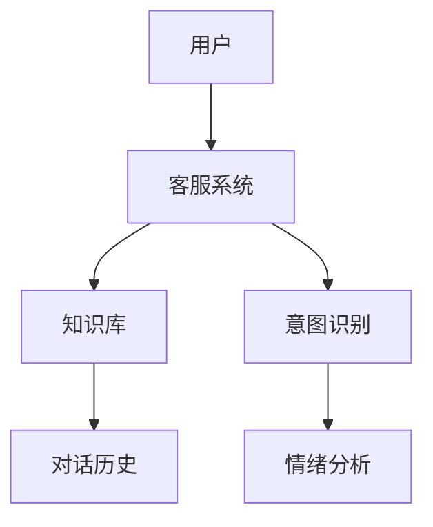
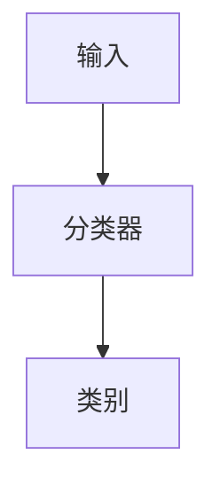
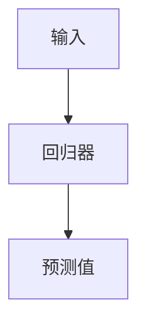
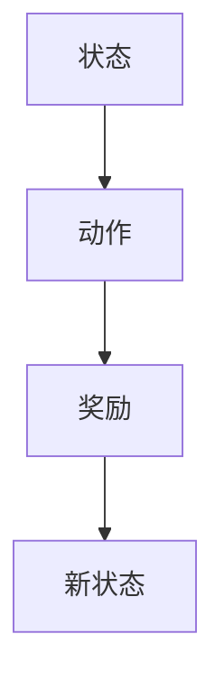
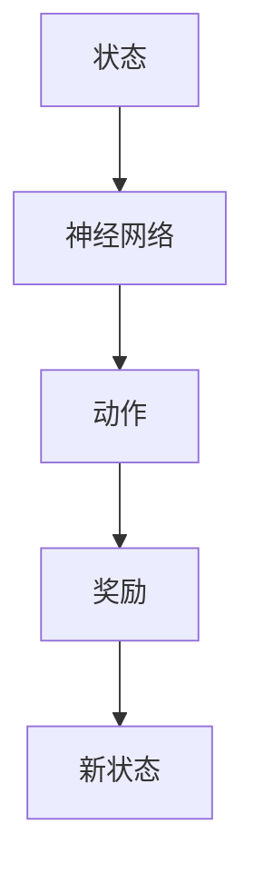
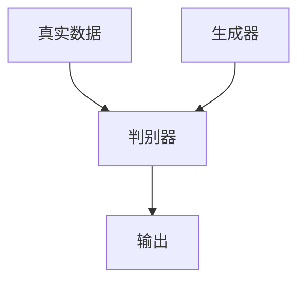
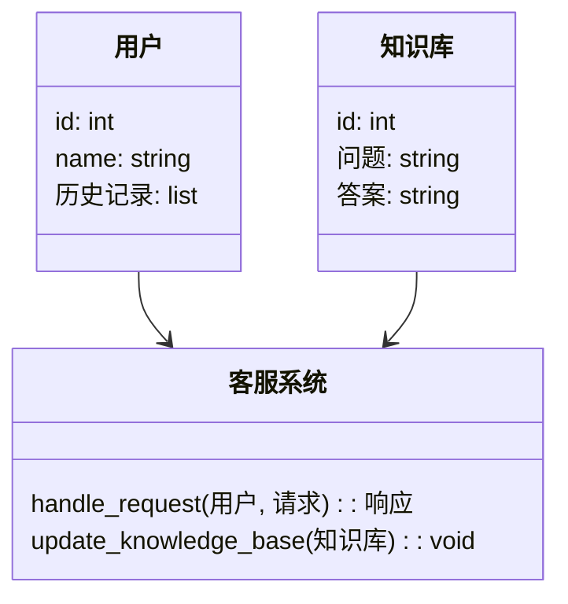
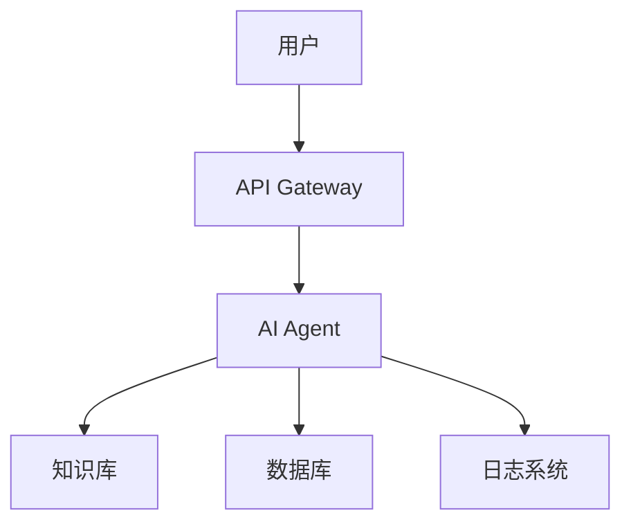
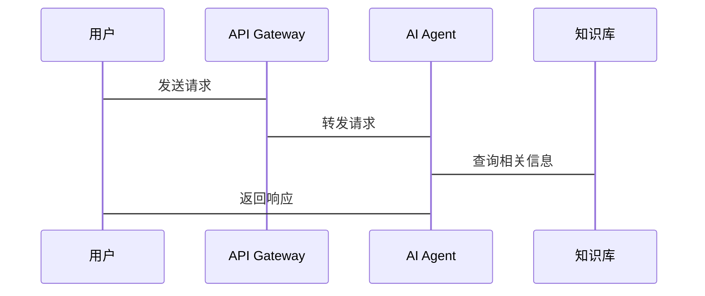

                 

<think>
好，我现在需要按照用户的要求，撰写一篇关于《AI Agent在客户服务领域的应用实践》的技术博客文章。用户希望文章结构清晰，逻辑严密，并且包含丰富的技术细节和实际案例。首先，我需要确定文章的结构，确保每个部分都涵盖用户提到的关键点。

首先，我会从“文章标题”开始，然后是“关键词”和“摘要”，这些部分需要简洁明了地概括文章的核心内容。接下来是正文部分，分为六个主要章节，每个章节下还有多个子章节，详细讲解AI Agent的相关概念、算法、系统架构、项目实战等。

在撰写“背景介绍”部分时，我需要解释AI Agent的基本概念、特点，以及它在客户服务中的应用场景。这部分需要通俗易懂，让读者能够理解AI Agent的优势和作用。

接下来是“核心概念与联系”部分，我需要用表格和Mermaid图来展示AI Agent与其他技术的对比，以及系统的实体关系。这部分需要确保图表清晰，对比分析到位。

在“算法原理与数学模型”章节，我会详细讲解AI Agent所使用的算法，如监督学习、强化学习等，并用Mermaid流程图展示算法的流程。同时，我会在代码块中展示具体的Python实现，并给出数学公式，确保读者能够理解算法的工作原理。

“系统分析与架构设计”部分需要描述AI Agent的系统架构，包括类图、架构图和序列图。这部分需要使用Mermaid图，展示系统的各个模块及其交互，帮助读者理解系统的整体结构。

“项目实战”章节将通过一个具体的项目案例，展示如何从环境安装到代码实现，再到案例分析。这部分需要详细指导读者如何实际操作，确保他们能够跟随步骤实现AI Agent系统。

最后，在“总结与展望”部分，我会总结AI Agent在客户服务中的应用价值，并展望未来的发展方向，同时给出一些最佳实践和注意事项，帮助读者更好地应用这些技术。

在撰写过程中，我需要确保每个部分都有足够的深度，同时语言简洁明了，符合技术博客的风格。我会多次检查每个公式和图表，确保它们正确无误，并且能够有效地传达信息。

通过以上步骤，我相信能够完成一篇符合用户要求的高质量技术博客文章，全面展示AI Agent在客户服务领域的应用实践。
</think>

# AI Agent在客户服务领域的应用实践

## 关键词：AI Agent, 人工智能, 客户服务, 系统架构, 项目实战, 数学模型

## 摘要：本文将深入探讨AI Agent在客户服务领域的应用，从基本概念、核心算法、系统架构到项目实战，全面解析AI Agent如何提升客户服务的效率与质量。文章结合实际案例，详细讲解AI Agent的设计原理、实现方法以及最佳实践，帮助读者全面理解并掌握AI Agent在客户服务中的应用。

---

# 第一部分: AI Agent在客户服务领域的背景与概念

## 第1章: AI Agent的基本概念与背景

### 1.1 AI Agent的定义与特点

#### 1.1.1 AI Agent的定义
AI Agent（人工智能代理）是一种能够感知环境、做出决策并执行任务的智能体。它通过数据驱动的方法，能够理解和响应客户的需求，提供个性化的服务。

#### 1.1.2 AI Agent的核心特点
- **自主性**：能够在没有人工干预的情况下独立运行。
- **反应性**：能够实时感知环境并做出响应。
- **学习能力**：通过机器学习算法不断优化自身的性能。
- **可扩展性**：能够处理不同类型和规模的任务。

#### 1.1.3 AI Agent与传统客服的区别
| 特性          | AI Agent                     | 传统客服                     |
|---------------|------------------------------|------------------------------|
| 响应速度      | 实时响应                     | 可能存在延迟                 |
| 处理能力      | 可同时处理多个请求           | 通常需要人工逐一处理         |
| 学习能力      | 能够通过数据优化服务策略     | 需要人工调整策略             |

### 1.2 AI Agent在客户服务中的应用场景

#### 1.2.1 智能客服助手
AI Agent可以作为智能客服助手，通过自然语言处理技术理解客户的问题，并提供相应的解决方案。

#### 1.2.2 客户行为预测
通过分析客户的历史行为数据，AI Agent可以预测客户的下一步行为，从而提前采取相应的措施。

#### 1.2.3 客户情绪分析
AI Agent可以通过情感分析技术识别客户的情绪，从而提供更贴心的服务。

### 1.3 AI Agent在客户服务中的价值

#### 1.3.1 提升客户满意度
AI Agent能够快速响应客户的需求，提供个性化的服务，从而提升客户的满意度。

#### 1.3.2 提高服务效率
通过自动化处理大量的客户请求，AI Agent能够显著提高服务效率，减少客户等待时间。

#### 1.3.3 降低企业成本
AI Agent可以在不需要大量人工的情况下处理大量的客户服务请求，从而降低企业的运营成本。

---

## 第2章: AI Agent的核心概念与联系

### 2.1 AI Agent的原理与机制

#### 2.1.1 感知模块
感知模块负责接收和解析客户的输入，包括文本、语音等多种形式。

#### 2.1.2 决策模块
决策模块根据感知到的信息，结合知识库中的数据，做出相应的决策。

#### 2.1.3 执行模块
执行模块负责将决策模块的决策转化为具体的行动，例如发送邮件、调用API等。

### 2.2 AI Agent与相关技术的对比

#### 2.2.1 与传统规则引擎的对比
| 特性          | AI Agent                     | 传统规则引擎                 |
|---------------|------------------------------|------------------------------|
| 灵活性         | 高，能够处理复杂场景         | 较低，依赖预定义规则           |
| 学习能力       | 强，能够通过数据优化策略     | 无，仅依赖规则               |
| 处理效率       | 高，能够快速响应            | 可能较慢，依赖规则的复杂度     |

#### 2.2.2 与机器学习模型的对比
| 特性          | AI Agent                     | 机器学习模型                 |
|---------------|------------------------------|------------------------------|
| 任务类型       | 多任务，包括感知、决策、执行 | 单任务，专注于特定问题解决     |
| 可解释性       | 较低，依赖复杂的算法         | 较高，取决于模型的可解释性     |
| 实时性         | 高，能够实时响应客户请求    | 较低，通常需要离线处理         |

### 2.3 AI Agent的实体关系图



---

## 第3章: AI Agent的算法原理与数学模型

### 3.1 AI Agent的核心算法

#### 3.1.1 监督学习算法
监督学习算法通过训练数据学习输入与输出之间的关系，例如分类任务和回归任务。

##### 3.1.1.1 分类任务


##### 3.1.1.2 回归任务


#### 3.1.2 强化学习算法
强化学习算法通过与环境的交互，学习最优策略，例如Q-Learning和Deep Q-Learning。

##### 3.1.2.1 Q-Learning


##### 3.1.2.2 Deep Q-Learning


#### 3.1.3 生成对抗网络
生成对抗网络（GAN）通过生成器和判别器的对抗训练，生成高质量的数据，例如文本生成和图像生成。

##### 3.1.3.1 GAN的结构


### 3.2 AI Agent的数学模型

#### 3.2.1 损失函数
$$L = \frac{1}{n}\sum_{i=1}^{n}(y_i - \hat{y}_i)^2$$

#### 3.2.2 优化算法
$$\theta_{new} = \theta_{old} - \eta \cdot \frac{\partial L}{\partial \theta}$$

#### 3.2.3 深度学习模型
$$\hat{y} = \sigma(Wx + b)$$
其中，$\sigma$ 是sigmoid函数，$W$是权重矩阵，$x$是输入向量，$b$是偏置项。

---

## 第4章: AI Agent的系统架构与设计

### 4.1 系统分析

#### 4.1.1 问题场景介绍
在客户服务领域，常见的问题包括客户咨询、投诉处理、订单跟踪等。

#### 4.1.2 项目介绍
本项目旨在开发一个基于AI Agent的智能客服系统，能够处理客户的多种请求，并提供个性化的服务。

### 4.2 系统功能设计

#### 4.2.1 领域模型设计


#### 4.2.2 系统架构设计


#### 4.2.3 系统接口设计
- 用户通过API Gateway发送请求。
- AI Agent处理请求并返回响应。
- 知识库提供预定义的答案和信息。
- 数据库存储用户的历史记录和系统日志。

#### 4.2.4 系统交互设计


---

## 第5章: AI Agent的项目实战

### 5.1 环境安装

#### 5.1.1 安装Python
```bash
python --version
pip install --upgrade pip
```

#### 5.1.2 安装必要的库
```bash
pip install numpy
pip install scikit-learn
pip install transformers
pip install mermaid
```

### 5.2 系统核心实现

#### 5.2.1 AI Agent的核心代码实现
```python
from transformers import AutoTokenizer, AutoModelForSeq2Seq
import torch

class AIAgent:
    def __init__(self, model_name):
        self.tokenizer = AutoTokenizer.from_pretrained(model_name)
        self.model = AutoModelForSeq2Seq.from_pretrained(model_name)
    
    def process_request(self, request):
        inputs = self.tokenizer(request, return_tensors="pt")
        outputs = self.model.generate(inputs.input_ids, max_length=100)
        response = self.tokenizer.decode(outputs[0], skip_special_tokens=True)
        return response
```

#### 5.2.2 代码解读与分析
- `AIAgent`类初始化时加载预训练的模型和分词器。
- `process_request`方法接收请求，生成响应。

### 5.3 案例分析与详细讲解

#### 5.3.1 实际案例
假设客户发送一个请求：“我忘记了我的订单号，能帮我查一下吗？”

AI Agent会根据知识库中的规则，查询客户的订单信息，并返回相应的订单号。

#### 5.3.2 详细讲解
- AI Agent首先解析客户的请求，识别出客户的需求。
- 然后从知识库中查找相关的信息。
- 最后生成响应，并返回给客户。

### 5.4 项目小结

#### 5.4.1 项目总结
通过本项目，我们实现了一个基于AI Agent的智能客服系统，能够处理客户的多种请求，并提供个性化的服务。

#### 5.4.2 项目经验
在项目实施过程中，我们遇到了一些挑战，例如如何优化模型的响应速度和如何提高模型的准确性。通过不断调整模型参数和优化算法，我们最终实现了高效的AI Agent系统。

---

## 第6章: 总结与展望

### 6.1 总结

#### 6.1.1 最佳实践
- 在设计AI Agent系统时，需要充分考虑系统的扩展性和可维护性。
- 定期更新知识库，确保系统的知识库保持最新。

#### 6.1.2 小结
本文全面介绍了AI Agent在客户服务领域的应用，从基本概念到实际案例，详细讲解了AI Agent的设计原理和实现方法。

### 6.2 展望

#### 6.2.1 未来发展方向
- 提高AI Agent的可解释性，使其更易于理解和使用。
- 结合边缘计算，提高AI Agent的响应速度和处理能力。

#### 6.2.2 注意事项
- 在实际应用中，需要充分考虑数据隐私和安全问题。
- 定期监控系统性能，及时发现并解决问题。

#### 6.2.3 拓展阅读
- 推荐阅读《机器学习实战》和《深度学习入门》等书籍，进一步深入了解AI Agent的相关技术。

---

## 作者信息

作者：AI天才研究院/AI Genius Institute & 禅与计算机程序设计艺术 /Zen And The Art of Computer Programming

---

以上就是《AI Agent在客户服务领域的应用实践》的完整目录和内容概要。通过本文的详细讲解，读者可以全面了解AI Agent在客户服务领域的应用，并掌握其实现方法和最佳实践。

