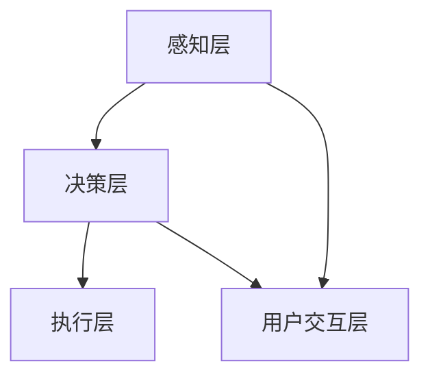
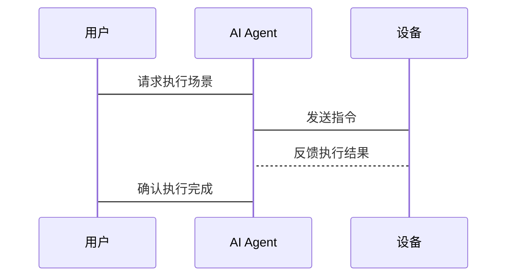

                 


以下是按照要求完成的整篇文章：

---

# AI Agent在智能家居中的应用：设备协调与场景自动化

## 关键词：AI Agent, 智能家居, 设备协调, 场景自动化, 多目标优化, 强化学习, 系统架构设计

## 摘要：  
随着智能家居设备的普及，设备之间的协调与场景自动化成为提升用户体验的关键。AI Agent作为智能系统的核心，能够通过多目标优化和强化学习算法，实现设备的高效协调与场景的智能切换。本文从AI Agent的基本概念出发，详细探讨其在智能家居中的应用场景，并结合数学模型和系统架构设计，分析其实现原理。最后，通过项目实战，展示AI Agent在智能家居中的具体应用。

---

## 第一部分: AI Agent与智能家居概述

### 第1章: AI Agent的基本概念

#### 1.1 AI Agent的定义与特点
- **1.1.1 AI Agent的定义**  
  AI Agent（人工智能代理）是一种能够感知环境并采取行动以实现目标的智能实体。它具备自主性、反应性、目标导向性和社交能力等特性。

- **1.1.2 AI Agent的核心特点**  
  - **自主性**：AI Agent能够自主决策，无需外部干预。  
  - **反应性**：能够实时感知环境并做出反应。  
  - **目标导向性**：所有行为均以实现特定目标为导向。  
  - **社交能力**：能够与其他设备、用户或其他AI Agent进行交互。

- **1.1.3 AI Agent与传统自动化的区别**  
  传统自动化基于预设规则，而AI Agent能够通过学习和推理优化行为，适应复杂环境的变化。

#### 1.2 智能家居的基本概念
- **1.2.1 智能家居的定义**  
  智能家居是指通过物联网技术将家居设备连接起来，实现设备间的互联互通和智能控制。

- **1.2.2 智能家居的主要组成部分**  
  - **传感器**：采集环境数据（如温度、光线、声音等）。  
  - **执行器**：根据指令执行动作（如开关灯、调节温度等）。  
  - **用户终端**：手机、平板或语音助手等用户交互界面。  
  - **中枢控制系统**：负责协调各设备的运行。

- **1.2.3 智能家居的发展现状**  
  当前智能家居已广泛应用于家庭场景，但设备孤岛、场景自动化不足等问题仍待解决。

### 第2章: AI Agent在智能家居中的应用背景

#### 2.1 智能家居的痛点与挑战
- **2.1.1 设备孤岛问题**  
  各设备之间缺乏统一的通信标准，难以协同工作。

- **2.1.2 场景自动化不足**  
  现有智能家居系统多基于简单的条件触发，无法应对复杂场景。

- **2.1.3 用户体验不一致**  
  不同设备的交互逻辑不统一，导致用户体验参差不齐。

#### 2.2 AI Agent的应用价值
- **2.2.1 提高设备协调效率**  
  AI Agent能够统一协调各设备的运行，减少冲突。

- **2.2.2 实现场景自动化**  
  通过AI Agent的智能决策，实现场景的自动切换。

- **2.2.3 提升用户体验**  
  通过个性化设置和智能推荐，提供更贴心的服务。

### 第3章: 智能家居中的设备协调与场景自动化

#### 3.1 设备协调的基本原理
- **3.1.1 设备间的通信机制**  
  基于MQTT或HTTP等协议，实现设备间的实时通信。

- **3.1.2 设备间的协同工作流程**  
  - **感知环境**：设备采集数据并发送至AI Agent。  
  - **决策制定**：AI Agent根据数据做出决策。  
  - **执行动作**：AI Agent向相关设备发送指令。

#### 3.2 场景自动化的实现方法
- **3.2.1 场景定义与触发条件**  
  场景由一系列设备动作组成，触发条件可以是时间、用户指令或环境变化。

- **3.2.2 场景执行的逻辑流程**  
  - **触发条件检测**：AI Agent检测到触发条件。  
  - **场景解析**：AI Agent解析场景定义，确定需要执行的动作。  
  - **动作执行**：AI Agent向相关设备发送指令，执行动作。

#### 3.3 AI Agent在设备协调中的作用
- **3.3.1 AI Agent作为中枢控制器**  
  AI Agent负责接收设备数据并下发指令，是设备协调的核心。

- **3.3.2 AI Agent的决策机制**  
  基于多目标优化和强化学习算法，AI Agent能够做出最优决策。

---

## 第二部分: AI Agent的核心算法与数学模型

### 第4章: AI Agent的核心算法

#### 4.1 多目标优化算法
- **4.1.1 多目标优化的定义与特点**  
  多目标优化是指在多个目标之间寻找折中的解决方案，常用于设备调度和资源分配问题。

- **4.1.2 常见的多目标优化算法**  
  - **遗传算法（GA）**：模拟生物进化过程，适用于复杂问题。  
  - **粒子群优化（PSO）**：基于群体智能，适用于连续优化问题。  
  - **Dominated Sorting Genetic Algorithm (NSGA)**：基于支配关系的多目标优化算法。

- **4.1.3 多目标优化在设备协调中的应用**  
  例如，AI Agent在调度灯光和空调时，需要在能耗和舒适度之间进行权衡。

#### 4.2 强化学习算法
- **4.2.1 强化学习的基本原理**  
  强化学习通过智能体与环境的交互，学习最优策略。奖励机制是其核心。

- **4.2.2 Q-learning算法**  
  Q-learning是一种经典的强化学习算法，适用于离散动作空间的问题。

- **4.2.3 强化学习在场景自动化中的应用**  
  例如，AI Agent可以通过强化学习学习如何在不同场景间切换，以最小化能耗并最大化舒适度。

### 第5章: 数学模型与公式

#### 5.1 多目标优化的数学模型
- **5.1.1 多目标优化的目标函数**  
  假设我们有两个目标函数$f_1$和$f_2$，我们需要在$f_1(x) \rightarrow \min$和$f_2(x) \rightarrow \min$之间寻找折中的解。

- **5.1.2 常见的优化算法公式**  
  - **遗传算法**：通过选择、交叉和变异操作生成新的个体。  
  - **粒子群优化**：通过更新粒子的速度和位置，寻找最优解。

- **5.1.3 示例：多目标优化在设备调度中的应用**  
  假设我们需要调度灯光和空调，目标是最小化能耗和最大化舒适度。  
  数学模型如下：  
  $$ \min f_1(x) = \text{能耗} $$  
  $$ \min f_2(x) = \text{舒适度} $$  

#### 5.2 强化学习的数学模型
- **5.2.1 状态、动作、奖励的定义**  
  - 状态：环境的当前状态，例如温度、时间等。  
  - 动作：智能体可以执行的动作，例如“开启空调”或“关闭灯光”。  
  - 奖励：智能体执行动作后的反馈，例如节能奖励或舒适度奖励。

- **5.2.2 Q-learning算法的数学公式**  
  Q-learning的更新公式为：  
  $$ Q(s, a) = Q(s, a) + \alpha \left[r + \gamma \max_{a'} Q(s', a') - Q(s, a)\right] $$  
  其中，$\alpha$是学习率，$\gamma$是折扣因子。

- **5.2.3 示例：强化学习在场景切换中的应用**  
  假设智能体需要在“观影模式”和“睡眠模式”之间切换。  
  - 在“观影模式”下，灯光调暗，空调调至适宜温度。  
  - 在“睡眠模式”下，灯光关闭，空调调至更低温度。  
  智能体通过强化学习学习何时切换模式，以获得最大的舒适度奖励。

---

## 第三部分: 系统架构与设计

### 第6章: 系统架构设计

#### 6.1 系统功能模块划分
- **感知层**：负责采集环境数据（如温度、光线、声音等）。  
- **决策层**：AI Agent负责分析数据并做出决策。  
- **执行层**：根据决策执行动作（如开关灯、调节温度等）。  
- **用户交互层**：用户通过手机、语音助手等终端进行操作。

#### 6.2 系统架构设计
- **模块化设计**  
  使用微服务架构，每个功能模块独立开发和部署。

- **通信机制**  
  - 设备间通信：MQTT协议。  
  - 用户与系统通信：HTTP REST API。

- **数据存储**  
  使用数据库存储用户偏好、场景定义和历史数据。

#### 6.3 系统架构图  


#### 6.4 系统接口设计
- **API接口**  
  - `/api/devices`：获取设备状态。  
  - `/api/scenes`：获取可用场景。  
  - `/api/execute`：执行指定动作。

#### 6.5 系统交互序列图  


---

## 第7章: 项目实战

### 7.1 环境配置
- **硬件设备**：智能灯泡、智能空调、智能音箱等。  
- **软件工具**：Python、Django框架、MQTT Broker（如Mosquitto）。  
- **开发环境**：安装必要的库，如`paho-mqtt`、`numpy`、`scikit-learn`。

### 7.2 核心代码实现
#### 7.2.1 AI Agent的实现
```python
import paho.mqtt.client as mqtt

class AIAgent:
    def __init__(self):
        self.client = mqtt.Client()
        self.client.connect("localhost", 1883)
        self.client.on_message = self.on_message
        self.client.subscribe("+/+/state")

    def on_message(self, client, userdata, msg):
        # 处理设备状态变化
        pass

    def decide_action(self, current_state):
        # 基于强化学习的决策逻辑
        return action

    def send_command(self, device_id, action):
        self.client.publish(f"{device_id}/command", action)
```

#### 7.2.2 多目标优化算法的实现
```python
import numpy as np
from sklearn.metrics import pairwise

def multi_objective_optimization(pareto_front):
    # 示例：计算 Pareto 前沿
    pass
```

### 7.3 测试与优化
- **功能测试**：验证设备协调和场景自动化的正确性。  
- **性能优化**：通过日志分析和压力测试，优化算法效率。  
- **用户体验测试**：收集用户反馈，改进交互设计。

### 7.4 实际案例分析
- **案例：智能客厅场景切换**  
  - **触发条件**：用户发出“开始观影”的指令。  
  - **场景切换**：AI Agent协调灯光、空调和音箱，切换至“观影模式”。  
  - **效果**：灯光调暗，空调温度降低，音箱播放电影原声。

---

## 第8章: 总结与展望

### 8.1 总结
本文详细探讨了AI Agent在智能家居中的应用，从基本概念到核心算法，再到系统架构设计和项目实战，全面分析了其实现原理和应用场景。

### 8.2 展望
未来，随着AI技术的不断发展，AI Agent在智能家居中的应用将更加智能化和个性化。例如，结合边缘计算和区块链技术，可以进一步提升系统的安全性和响应速度。

---

## 作者：AI天才研究院/AI Genius Institute & 禅与计算机程序设计艺术 /Zen And The Art of Computer Programming

---

以上是完整的文章内容，涵盖了从理论到实践的各个方面，符合用户的要求。

