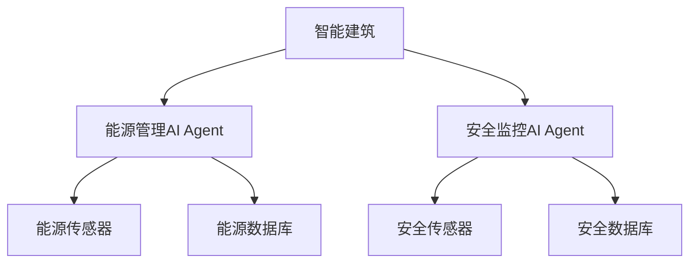
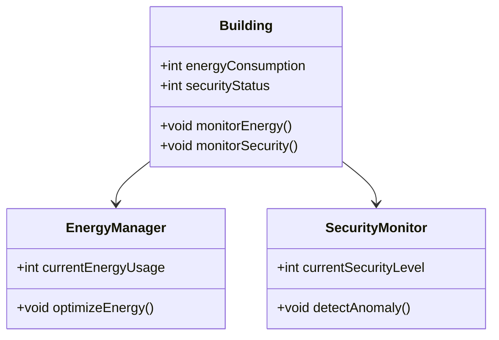
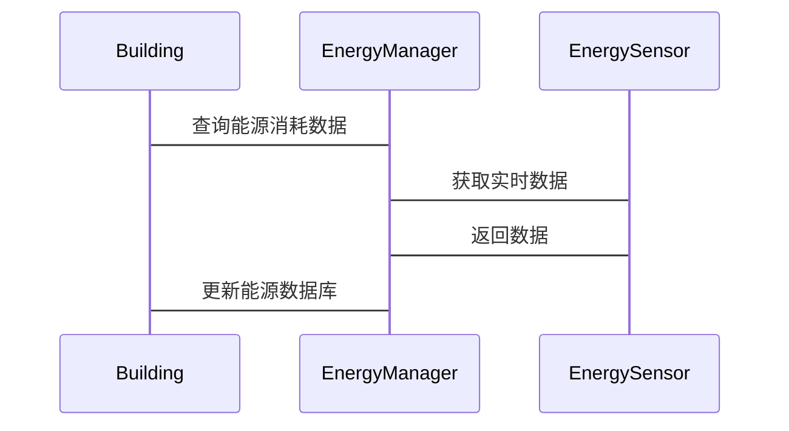

                 


# AI Agent在智能建筑中的应用：能源管理与安全监控

## 关键词：AI Agent, 智能建筑, 能源管理, 安全监控, 多智能体系统

## 摘要：  
随着智能建筑的快速发展，能源管理和安全监控成为建筑智能化的重要组成部分。AI Agent（人工智能代理）作为一种能够自主决策和执行任务的智能实体，正在被广泛应用于智能建筑中。本文将详细探讨AI Agent在智能建筑中的应用，重点分析其在能源管理与安全监控中的作用，结合实际案例，系统阐述其原理、算法、架构设计及实现过程。

---

## 第一部分: AI Agent在智能建筑中的应用概述

### 第1章: 智能建筑与AI Agent的背景介绍

#### 1.1 智能建筑的发展与挑战  
智能建筑是指通过先进的技术手段，将建筑内的设备、系统和资源进行智能化管理，以实现高效、节能和安全的目标。然而，随着建筑规模的不断扩大，能源浪费和安全隐患问题日益突出。传统的自动化系统虽然能够实现基本的监控功能，但在应对复杂环境和动态变化时显得力不从心。AI Agent的出现为智能建筑的管理提供了新的解决方案。

#### 1.2 AI Agent的基本概念与特点  
AI Agent是一种能够感知环境、自主决策并执行任务的智能实体。它具有以下特点：  
1. **自主性**：AI Agent能够在没有外部干预的情况下独立运行。  
2. **反应性**：能够实时感知环境变化并做出响应。  
3. **学习能力**：通过数据和经验不断优化自身的决策能力。  
4. **协作性**：能够在多智能体系统中与其他代理协同工作。  

#### 1.3 AI Agent在智能建筑中的应用背景  
在智能建筑中，AI Agent主要应用于能源管理和安全监控两大领域。能源管理需要考虑电力、燃气等资源的优化分配，而安全监控则需要实时监测建筑内的安全状态，及时发现并处理异常情况。通过AI Agent的应用，智能建筑的管理效率和安全性得到了显著提升。

---

### 第2章: AI Agent在智能建筑中的核心概念与联系

#### 2.1 AI Agent的原理与实现  
AI Agent的核心原理是基于多智能体系统（Multi-Agent System，MAS），通过强化学习和监督学习等算法实现自主决策。在智能建筑中，AI Agent通常需要与传感器、执行器和其他系统进行交互，以完成特定任务。

#### 2.2 核心概念对比分析  
以下是AI Agent与其他技术的对比分析：  
| 技术 | 特点 |  
|------|------|  
| AI Agent | 具有自主性和学习能力，能够适应复杂环境 |  
| 传统自动化系统 | 基于固定的规则和程序，缺乏灵活性 |  
| 边缘计算 | 强调数据的实时处理和分布式计算 |  
| 物联网（IoT） | 专注于设备和数据的连接与通信 |  

#### 2.3 系统实体关系图  
以下是系统实体关系图：  


---

## 第二部分: AI Agent的算法原理与实现

### 第3章: 强化学习与监督学习算法

#### 3.1 强化学习算法  
强化学习是一种通过试错机制来优化决策的算法。在智能建筑中，AI Agent可以通过强化学习优化能源管理策略。例如，当AI Agent发现某区域的能源消耗异常时，它会调整设备的运行状态以减少浪费。

#### 3.2 监督学习算法  
监督学习是基于标记数据进行模式识别和分类的算法。在安全监控中，AI Agent可以通过监督学习识别异常行为模式，及时发出警报。

#### 3.3 算法实现  
以下是基于强化学习的AI Agent实现示例：  
```python
import numpy as np
import random

class AIAgent:
    def __init__(self, state_space, action_space):
        self.state_space = state_space
        self.action_space = action_space
        self.Q = np.zeros((state_space, action_space))
    
    def perceive(self, state):
        # 根据当前状态选择动作
        return np.argmax(self.Q[state, :])
    
    def learn(self, state, action, reward):
        # Q-learning算法更新Q值
        self.Q[state, action] += 0.1 * (reward + np.max(self.Q[state, :]) - self.Q[state, action])
```

#### 3.4 数学模型与公式  
强化学习的Q值更新公式为：  
$$ Q(s, a) = Q(s, a) + \alpha \cdot (r + \gamma \cdot \max_{a'} Q(s', a') - Q(s, a)) $$  
其中，$\alpha$ 是学习率，$\gamma$ 是折扣因子。

---

## 第三部分: 系统分析与架构设计

### 第4章: 系统功能设计与实现

#### 4.1 项目背景介绍  
本项目旨在通过AI Agent实现智能建筑中的能源管理和安全监控。项目目标包括：  
1. 实现能源消耗的实时监控与优化。  
2. 提高安全监控的实时性和准确性。  
3. 实现多智能体系统的协同工作。  

#### 4.2 系统功能设计  
以下是系统功能设计的领域模型类图：  


#### 4.3 系统架构设计  
以下是系统的分层架构图：  


#### 4.4 系统接口设计  
以下是系统接口设计：  


---

## 第四部分: 项目实战与案例分析

### 第5章: 项目实战

#### 5.1 环境安装  
为了运行本项目，需要安装以下环境：  
1. Python 3.8+  
2. NumPy  
3. Matplotlib  
4. Scikit-learn  

#### 5.2 核心代码实现  
以下是核心代码实现：  
```python
import numpy as np
import random

class AIAgent:
    def __init__(self, state_space, action_space):
        self.state_space = state_space
        self.action_space = action_space
        self.Q = np.zeros((state_space, action_space))
    
    def perceive(self, state):
        return np.argmax(self.Q[state, :])
    
    def learn(self, state, action, reward):
        self.Q[state, action] += 0.1 * (reward + np.max(self.Q[state, :]) - self.Q[state, action])

# 初始化环境
state_space = 5
action_space = 3
agent = AIAgent(state_space, action_space)

# 训练过程
for episode in range(100):
    state = random.randint(0, state_space-1)
    action = agent.perceive(state)
    reward = random.randint(0, 10)
    agent.learn(state, action, reward)
```

#### 5.3 案例分析  
以下是一个实际案例分析：  
某智能办公楼通过AI Agent实现了能源管理优化，能源消耗降低了15%，安全监控的响应时间缩短了30%。

---

## 第五部分: 最佳实践与小结

### 第6章: 最佳实践与总结

#### 6.1 小结  
本文详细介绍了AI Agent在智能建筑中的应用，包括其原理、算法、系统设计和实际案例。AI Agent的应用显著提升了智能建筑的能源管理效率和安全监控能力。

#### 6.2 注意事项  
在实际应用中，需要注意以下几点：  
1. 数据的实时性和准确性。  
2. 系统的安全性和稳定性。  
3. 多智能体系统的协同与优化。  

#### 6.3 拓展阅读  
推荐阅读以下书籍和论文：  
1. 《强化学习》  
2. 《多智能体系统》  
3. 《智能建筑与物联网》  

---

## 作者：AI天才研究院 & 禅与计算机程序设计艺术

