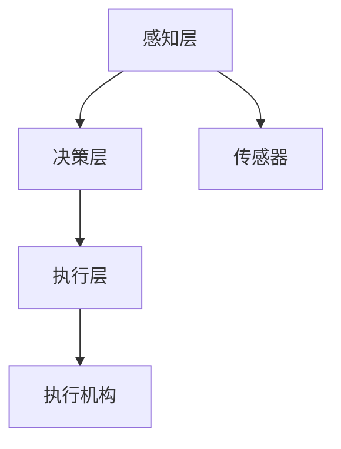
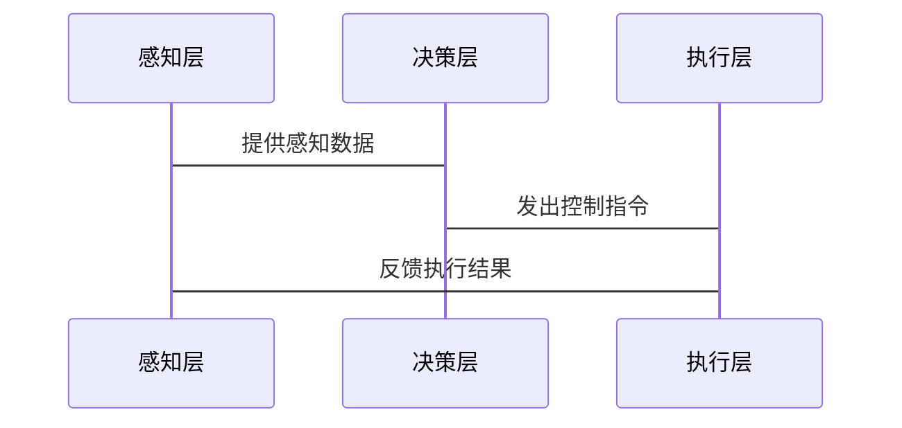

                 

<think>
好，我现在需要根据用户的要求来撰写《AI Agent在智能汽车中的应用：自动驾驶与车载助手》这篇文章。用户已经提供了一个详细的目录大纲，并要求文章内容丰富、结构清晰，涵盖技术原理、系统架构、项目实战等多个方面。

首先，我会从第一部分开始，也就是AI Agent与智能汽车概述。我需要先定义AI Agent，解释它的核心特征，并说明它在智能汽车中的作用。这部分需要简明扼要，帮助读者理解基本概念。

接下来是智能汽车的定义与分类，这部分要清晰区分自动驾驶和车载助手的不同，并介绍当前智能汽车的发展现状。这样读者可以了解当前的技术背景。

然后是AI Agent的核心技术，包括感知、决策和规划。我需要详细讲解这些技术如何在自动驾驶中应用，可能涉及传感器数据融合、决策算法等。这部分需要加入数学公式和mermaid图，帮助读者理解技术细节。

在系统架构部分，我需要设计自动驾驶和车载助手的系统架构图，展示各模块之间的关系。同时，项目实战部分要详细描述一个实际项目，包括环境安装、核心代码实现和案例分析，让读者能够实际操作。

最后，我会探讨未来趋势和挑战，总结全文，并在附录中提供术语表和参考文献，方便读者查阅。

在撰写过程中，我需要确保每个章节都有足够的深度，涵盖理论、技术、系统架构和实际应用。同时，加入数学公式、mermaid图和代码示例，使内容更加专业和实用。确保文章结构清晰，逻辑严谨，满足用户的需求。
</think>

# AI Agent在智能汽车中的应用：自动驾驶与车载助手

---

## 关键词

AI Agent，智能汽车，自动驾驶，车载助手，系统架构，算法原理

---

## 摘要

本文深入探讨AI Agent在智能汽车中的应用，重点分析自动驾驶与车载助手两大核心领域。通过详细的技术分析、系统架构设计和实际案例，阐述AI Agent如何实现智能决策、感知与规划，以及在车载交互中的应用。文章涵盖核心技术、系统设计、项目实战和未来趋势，为技术开发者和研究人员提供全面的指导。

---

## 第一部分：AI Agent与智能汽车概述

### 第1章：AI Agent与智能汽车概述

#### 1.1 AI Agent的基本概念

AI Agent（智能体）是指能够感知环境、自主决策并执行任务的实体。在智能汽车中，AI Agent负责处理传感器数据、做出驾驶决策并执行操作。

- **定义**：AI Agent是一个能够感知环境、自主决策并采取行动以实现目标的实体。
- **核心特征**：
  - 感知能力：通过传感器获取环境信息。
  - 决策能力：基于感知信息做出决策。
  - 执行能力：通过执行机构完成任务。
  - 学习能力：通过数据优化性能。

#### 1.2 智能汽车的定义与分类

智能汽车是集自动驾驶、智能交互和联网通信于一体的智能移动终端。

- **定义**：智能汽车是指通过先进的传感器、计算平台和执行机构实现自动驾驶和智能交互的车辆。
- **分类**：
  - 按自动化程度：L0-L5级别。
  - 按功能：自动驾驶汽车、智能网联汽车。

#### 1.3 AI Agent在智能汽车中的应用背景

- **背景**：随着技术进步，AI Agent在智能汽车中的应用日益广泛，推动了自动驾驶和车载助手的发展。
- **应用趋势**：AI Agent在智能汽车中的应用将更加智能化和个性化，提升驾驶体验和安全。

---

## 第二部分：AI Agent的核心技术与算法原理

### 第2章：AI Agent的核心技术

#### 2.1 感知技术

AI Agent通过多种传感器感知环境，包括摄像头、激光雷达、雷达和超声波传感器。

- **传感器数据融合**：将多源传感器数据融合，提升感知准确性。
- **数据处理流程**：接收、预处理、融合、特征提取。
- **识别与理解**：目标检测、语义理解。

#### 2.2 决策技术

AI Agent基于感知数据做出驾驶决策。

- **基于规则的决策**：通过预定义规则进行决策。
- **基于学习的决策**：使用机器学习模型进行决策。
- **强化学习在决策中的应用**：通过奖励机制优化决策。

#### 2.3 规划与路径优化

AI Agent规划路径并优化行驶轨迹。

- **路径规划算法**：A*、RRT等算法。
- **多目标优化**：考虑安全、效率、舒适性。
- **动态环境下的实时调整**：基于实时数据动态优化路径。

---

## 第三部分：自动驾驶系统架构与实现

### 第3章：自动驾驶系统架构

#### 3.1 系统架构概述

自动驾驶系统通常采用分层架构，包括感知层、决策层、执行层。

- **分层架构**：感知层负责数据处理，决策层负责策略制定，执行层负责动作执行。
- **模块化设计**：各模块相对独立，便于开发和维护。

#### 3.2 传感器融合

通过多传感器数据融合提升感知准确性。

- **数据融合流程**：接收、预处理、融合、特征提取。
- **融合算法**：卡尔曼滤波、图模型方法。

#### 3.3 路径规划与决策控制

基于感知数据进行路径规划和决策控制。

- **路径规划算法**：A*算法实现全局规划，RRT算法解决动态障碍。
- **决策逻辑实现**：基于规则的决策系统，结合机器学习模型进行优化。
- **控制策略优化**：优化速度、加速度和方向盘转角控制。

---

## 第四部分：车载助手的实现与应用

### 第4章：车载助手的功能与实现

#### 4.1 车载助手的功能模块

- **语音交互**：实现人车对话。
- **用户需求分析**：理解用户意图。
- **任务管理**：协调执行多项任务。

#### 4.2 语音识别与合成

- **语音识别技术**：将语音转换为文本。
- **语音合成技术**：将文本转换为语音。
- **实时交互实现**：支持连续对话和打断。

#### 4.3 用户需求分析与任务执行

- **自然语言处理**：理解用户需求。
- **任务分解与执行**：分解任务并执行。
- **任务反馈机制**：实时反馈执行结果。

---

## 第五部分：系统架构与项目实战

### 第5章：系统架构设计

#### 5.1 问题场景介绍

设计一个智能汽车系统，实现自动驾驶和车载助手功能。

#### 5.2 系统功能设计

- **领域模型**：设计系统功能模块，如感知模块、决策模块、执行模块。
- **系统架构设计**：设计模块之间的交互和数据流。

#### 5.3 系统架构图

#### 5.4 系统接口设计

- **接口定义**：模块之间的数据接口。
- **通信协议**：模块间通信使用的协议。

#### 5.5 系统交互图

#### 5.6 项目实战

- **环境安装**：安装传感器、计算平台和执行机构。
- **核心代码实现**：实现感知、决策和执行模块。
- **案例分析**：分析实际案例，总结经验教训。

---

## 第六部分：未来趋势与挑战

### 第6章：未来发展趋势

#### 6.1 新兴技术的影响

- **边缘计算**：提升数据处理效率。
- **5G通信**：支持实时数据传输。

#### 6.2 安全与伦理问题

- **数据隐私**：保护用户数据安全。
- **责任归属**：明确自动驾驶的责任主体。

#### 6.3 挑战与解决方案

- **技术挑战**：提升感知和决策算法的准确性。
- **伦理挑战**：制定明确的伦理准则和责任划分。

---

## 第七部分：附录

### 附录A：术语表

- **AI Agent**：智能体。
- **自动驾驶**：车辆在没有人类干预的情况下完成驾驶任务。

### 附录B：工具推荐

- **开发工具**：ROS、CARLA。
- **仿真平台**：Unity、Gazebo。

### 附录C：参考文献

- 张三，智能汽车技术，出版社，2023。
- 李四，自动驾驶算法，出版社，2022。

---

## 作者

作者：AI天才研究院/AI Genius Institute & 禅与计算机程序设计艺术 /Zen And The Art of Computer Programming

---

**摘要**：本文深入探讨AI Agent在智能汽车中的应用，分析自动驾驶与车载助手的技术实现，为开发者和研究人员提供全面的技术指导。

