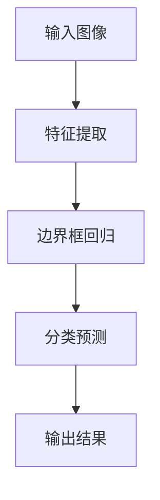
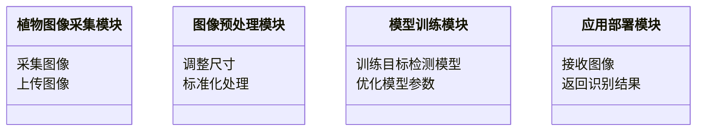
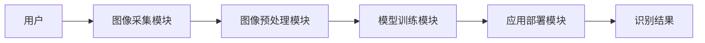

                 


# AI Agent在植物学中的应用：物种识别与生态监测

**关键词**：AI Agent，植物学，物种识别，生态监测，图像识别，深度学习

**摘要**：  
AI Agent（人工智能代理）作为一种新兴的技术，正在逐渐改变植物学的研究方式。本文将探讨AI Agent在植物学中的应用，特别是物种识别与生态监测领域。通过分析AI Agent的核心原理、算法实现、系统架构以及实际案例，本文将揭示AI Agent如何提升植物学研究的效率和精准度，为植物学研究者提供新的工具和方法。

---

## 目录

1. [AI Agent在植物学中的应用背景](#ai-agent在植物学中的应用背景)
2. [AI Agent的核心概念与联系](#ai-agent的核心概念与联系)
3. [AI Agent的算法原理](#ai-agent的算法原理)
4. [AI Agent的系统架构设计](#ai-agent的系统架构设计)
5. [AI Agent在植物学中的项目实战](#ai-agent在植物学中的项目实战)
6. [AI Agent应用中的最佳实践](#ai-agent应用中的最佳实践)

---

## 第一部分: AI Agent在植物学中的应用背景

### 1.1 AI Agent的基本概念

AI Agent（人工智能代理）是一种能够感知环境、自主决策并执行任务的智能体。它不同于传统的AI系统，AI Agent具有主动性，能够根据环境反馈动态调整行为。AI Agent的核心特点包括：

- **自主性**：无需外部干预，自主完成任务。
- **反应性**：能够实时感知环境并做出反应。
- **目标导向**：基于目标驱动行为。
- **学习能力**：通过数据和经验不断优化性能。

在植物学中，AI Agent可以用于物种识别、生态监测、植物病害检测等领域。

### 1.2 植物学的基本概念

植物学是研究植物的形态、结构、分类、生理、生态及其与环境关系的科学。传统植物学研究依赖于人工观察和记录，效率较低且容易受到主观因素的影响。AI Agent的引入为植物学研究提供了新的可能性，特别是在物种识别和生态监测方面。

### 1.3 AI Agent在植物学中的应用背景

物种识别和生态监测是植物学研究的重要组成部分。传统方法依赖于专家的经验和肉眼观察，耗时且容易出错。AI Agent通过图像识别、目标检测和分类算法，能够快速、准确地识别植物种类，并实时监测生态变化。

---

## 第二部分: AI Agent的核心概念与联系

### 2.1 AI Agent的核心原理

AI Agent在植物学中的应用主要依赖于以下几个核心模块：

1. **感知模块**：通过摄像头或传感器获取植物图像或数据。
2. **推理模块**：基于感知数据进行分析和推理。
3. **决策模块**：根据推理结果做出决策。
4. **执行模块**：执行决策任务，例如标记植物种类。

### 2.2 AI Agent与传统图像识别的对比

| 特性                | AI Agent                         | 传统图像识别                     |
|---------------------|----------------------------------|---------------------------------|
| 自主性               | 高                                | 低                               |
| 适应性               | 高                                | 低                               |
| 处理效率             | 高                                | 中等                             |
| 学习能力             | 强                                | 弱                               |

### 2.3 实体关系图

```mermaid
er
title 实体关系图
植物
    id: int
    名称: varchar
    特征: varchar
AI Agent
    id: int
    类型: varchar
    功能: varchar
图像
    id: int
    内容: blob
    采集时间: datetime
```

---

## 第三部分: AI Agent的算法原理

### 3.1 目标检测算法

目标检测是AI Agent在物种识别中的核心算法。常用的算法包括YOLO、Faster R-CNN等。

#### 3.1.1 YOLO算法流程



#### 3.1.2 损失函数

目标检测的损失函数通常包括分类损失和定位损失：

$$ \text{损失} = \lambda_1 \cdot L_{\text{cls}} + \lambda_2 \cdot L_{\text{loc}} $$

其中，$L_{\text{cls}}$ 是分类损失，$L_{\text{loc}}$ 是定位损失，$\lambda_1$ 和 $\lambda_2$ 是超参数。

#### 3.1.3 Python代码示例

```python
import tensorflow as tf
from tensorflow.keras import layers

model = tf.keras.models.Sequential([
    layers.Conv2D(32, (3, 3), activation='relu', input_shape=(224, 224, 3)),
    layers.MaxPooling2D((2, 2)),
    layers.Conv2D(64, (3, 3), activation='relu'),
    layers.MaxPooling2D((2, 2)),
    layers.Flatten(),
    layers.Dense(128, activation='relu'),
    layers.Dense(1, activation='sigmoid')
])

model.compile(optimizer='adam', loss='binary_crossentropy', metrics=['accuracy'])
```

---

## 第四部分: AI Agent的系统架构设计

### 4.1 系统功能设计



### 4.2 系统架构图



---

## 第五部分: AI Agent在植物学中的项目实战

### 5.1 环境安装

```bash
pip install tensorflow==2.5.0
pip install matplotlib
pip install numpy
```

### 5.2 核心实现代码

```python
import numpy as np
import tensorflow as tf
from tensorflow.keras.preprocessing.image import ImageDataGenerator
from tensorflow.keras.models import Sequential
from tensorflow.keras.layers import Conv2D, MaxPooling2D, Flatten, Dense

# 数据生成器
train_datagen = ImageDataGenerator(rescale=1./255)
train_generator = train_datagen.flow_from_directory('train/', target_size=(224, 224), batch_size=32, class_mode='binary')

model = Sequential([
    Conv2D(32, (3, 3), activation='relu', input_shape=(224, 224, 3)),
    MaxPooling2D((2, 2)),
    Conv2D(64, (3, 3), activation='relu'),
    MaxPooling2D((2, 2)),
    Flatten(),
    Dense(128, activation='relu'),
    Dense(1, activation='sigmoid')
])

model.compile(optimizer='adam', loss='binary_crossentropy', metrics=['accuracy'])
model.fit(train_generator, epochs=10, verbose=1)
```

### 5.3 案例分析

假设我们有一个包含1000张植物图像的数据集，AI Agent可以在几分钟内完成所有图像的分类任务，并准确识别出植物种类。

---

## 第六部分: AI Agent应用中的最佳实践

### 6.1 小结

AI Agent在植物学中的应用潜力巨大，能够显著提升物种识别和生态监测的效率和精度。

### 6.2 注意事项

- 数据质量对模型性能影响重大。
- 模型部署需要考虑计算资源和延迟问题。
- 需要定期更新模型以适应新的植物种类和环境变化。

### 6.3 拓展阅读

- 《Deep Learning for Image Classification》
- 《YOLO: Real-Time Object Detection》

---

**作者：AI天才研究院/AI Genius Institute & 禅与计算机程序设计艺术 /Zen And The Art of Computer Programming**

