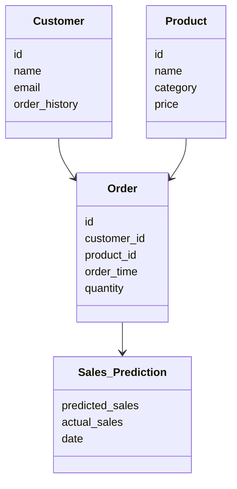
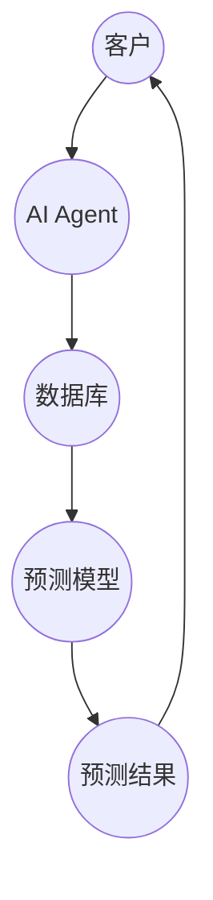

                 


# AI Agent在电子商务中的应用：智能客服与销售预测

> 关键词：AI Agent, 智能客服, 销售预测, 自然语言处理, 机器学习, 电子商务

> 摘要：随着人工智能技术的飞速发展，AI Agent（人工智能代理）在电子商务中的应用越来越广泛。本文将深入探讨AI Agent在智能客服和销售预测两大领域的具体应用。通过分析自然语言处理、推荐系统等技术原理，结合实际案例，展示AI Agent如何提升电子商务的效率和用户体验。本文还提供了系统架构设计和项目实现方案，帮助读者更好地理解AI Agent在电子商务中的潜力和价值。

---

# 第1章: AI Agent与电子商务的背景介绍

## 1.1 AI Agent的基本概念

### 1.1.1 什么是AI Agent
AI Agent（人工智能代理）是指能够感知环境、自主决策并执行任务的智能系统。它能够通过传感器获取信息，利用算法进行分析和推理，并通过执行器与外部环境交互。

### 1.1.2 AI Agent的核心属性
- **自主性**：能够独立执行任务，无需人工干预。
- **反应性**：能够实时感知环境并做出响应。
- **目标导向**：具有明确的目标，能够优化决策以实现目标。
- **学习能力**：能够通过数据和经验不断优化自身性能。

### 1.1.3 AI Agent在电子商务中的作用
在电子商务中，AI Agent主要应用于智能客服、个性化推荐、销售预测等领域，能够显著提升用户体验和商业效率。

---

## 1.2 电子商务中的问题背景

### 1.2.1 传统客服的局限性
- **效率低下**：人工客服需要花费大量时间处理简单重复的问题。
- **响应速度慢**：在高峰期，客户可能需要等待较长时间才能得到回复。
- **一致性问题**：不同客服人员的知识水平和响应速度可能不一致。

### 1.2.2 销售预测的挑战
- **数据复杂性**：销售数据受到多种因素影响，如市场波动、季节性变化等。
- **模型精度**：传统统计模型在处理非线性关系时表现不佳，难以准确预测销售趋势。
- **实时性要求**：企业需要实时调整销售策略，对预测模型的实时性要求较高。

### 1.2.3 AI Agent如何解决这些问题
AI Agent通过自动化处理和智能分析，能够显著提高客服效率和预测精度。例如，智能客服可以实时响应客户需求，而销售预测系统可以通过机器学习算法快速分析数据并生成预测结果。

---

## 1.3 AI Agent的应用场景

### 1.3.1 智能客服系统
AI Agent可以替代传统的人工客服，通过自然语言处理技术理解和回答客户的问题。

### 1.3.2 销售预测系统
AI Agent可以通过分析历史销售数据，预测未来的销售趋势，帮助企业制定更精准的销售策略。

### 1.3.3 其他潜在应用场景
- **个性化推荐**：基于客户的购买历史和偏好，推荐相关产品。
- ** fraud detection**：通过异常检测技术，识别 fraudulent transactions。
- **供应链优化**：通过实时数据分析，优化库存管理和物流配送。

---

## 1.4 本章小结

### 1.4.1 AI Agent的核心价值
AI Agent通过自动化和智能化的方式，显著提高了电子商务的效率和用户体验。

### 1.4.2 电子商务中的关键问题
- 传统客服效率低下。
- 销售预测精度不足。
- 数据分析的复杂性。

### 1.4.3 未来发展趋势
随着技术的进步，AI Agent在电子商务中的应用将更加广泛和深入，尤其是在个性化推荐和实时决策领域。

---

# 第2章: 自然语言处理技术

## 2.1 自然语言处理的概述

### 2.1.1 NLP的基本概念
自然语言处理（NLP）是指让计算机能够理解、生成和处理人类语言的技术。它是实现智能对话系统的核心技术之一。

### 2.1.2 NLP的核心技术
- **分词**：将连续的文本分割成有意义的词语。
- **实体识别**：识别文本中的实体（如人名、地名、组织名等）。
- **意图识别**：理解用户表达的意图。
- **情感分析**：分析文本中表达的情感倾向。

### 2.1.3 NLP在智能客服中的应用
- **意图识别**：通过分析客户的问题，判断客户的真实需求。
- **实体识别**：提取客户问题中的关键信息，如产品名称、订单号等。
- **对话生成**：根据客户的问题生成合适的回答。

---

## 2.2 智能对话系统的实现

### 2.2.1 对话系统的流程
1. **输入处理**：接收客户的输入文本。
2. **意图识别**：分析文本，确定客户意图。
3. **知识库查询**：根据意图检索相关信息。
4. **生成回复**：根据检索结果生成回复。
5. **输出回复**：将回复返回给客户。

### 2.2.2 意图识别与实体抽取
- **意图识别**：使用机器学习模型（如SVM、随机森林、神经网络等）进行分类。
- **实体抽取**：使用命名实体识别（NER）技术，提取文本中的实体信息。

### 2.2.3 基于NLP的对话生成
- **模板化生成**：根据预定义的模板生成回复。
- **基于生成模型**：使用生成式模型（如GPT）生成回复。

---

## 2.3 实例分析

### 2.3.1 智能客服对话案例
客户：我收到的商品与描述不符。
AI Agent：非常抱歉给您带来不便。请您提供订单号，我们将为您处理退货事宜。

### 2.3.2 销售预测中的NLP应用
通过分析客户评论，提取情感倾向，帮助企业了解产品口碑，辅助销售预测。

---

# 第3章: 推荐系统与销售预测

## 3.1 推荐系统的概述

### 3.1.1 推荐系统的定义
推荐系统是指根据用户的行为和偏好，推荐相关产品的系统。

### 3.1.2 推荐系统的类型
- **基于协同过滤的推荐系统**：根据用户的相似性推荐产品。
- **基于内容的推荐系统**：根据产品的特征推荐相似产品。
- **混合推荐系统**：结合协同过滤和内容推荐的优点。

### 3.1.3 推荐系统在电商中的价值
- 提高用户购买转化率。
- 增加用户粘性。
- 提升销售额。

---

## 3.2 销售预测的算法原理

### 3.2.1 时间序列分析
时间序列分析是一种通过分析历史数据，预测未来趋势的方法。

### 3.2.2 机器学习模型
- **线性回归**：适用于线性关系的预测。
- **支持向量机**：适用于非线性关系的预测。
- **神经网络**：适用于复杂关系的预测。

### 3.2.3 销售预测的流程
1. **数据收集**：收集历史销售数据、市场数据、客户数据等。
2. **数据预处理**：清洗数据，处理缺失值、异常值等。
3. **特征工程**：提取有助于预测的特征。
4. **模型训练**：选择合适的算法，训练模型。
5. **模型评估**：通过交叉验证等方法评估模型性能。
6. **模型部署**：将模型部署到生产环境，实时预测销售趋势。

---

## 3.3 项目实战

### 3.3.1 项目背景
某电商平台希望利用AI Agent预测未来三个月的销售量。

### 3.3.2 数据收集
- 销售数据：过去三年的每日销售量。
- 市场数据：节假日、促销活动等信息。
- 客户数据：客户购买记录、客户评价等。

### 3.3.3 系统实现
1. 数据预处理：
```python
import pandas as pd
data = pd.read_csv('sales_data.csv')
data = data.dropna()
data = data[data['date'] <= '2023-03-31']
```

2. 特征工程：
```python
from sklearn.preprocessing import OneHotEncoder
encoder = OneHotEncoder()
encoded_data = encoder.fit_transform(data[['category', 'region']])
```

3. 模型训练：
```python
from sklearn.ensemble import RandomForestRegressor
model = RandomForestRegressor(n_estimators=100, random_state=42)
model.fit(encoded_data, data['sales'])
```

4. 模型预测：
```python
import datetime
today = datetime.date.today()
next_month = today + datetime.timedelta(days=30)
predicted_sales = model.predict(encoded_data)
```

### 3.3.4 案例分析
通过模型预测，发现某产品的销售量在即将到来的促销活动期间会激增，因此建议企业提前备货。

---

## 3.4 本章小结

### 3.4.1 推荐系统的核心价值
推荐系统能够显著提高用户的购买转化率和平台的销售额。

### 3.4.2 销售预测的实现步骤
1. 数据收集与预处理。
2. 特征工程。
3. 模型训练与评估。
4. 模型部署与应用。

### 3.4.3 未来发展趋势
- 更加精准的预测模型。
- 更加实时的预测能力。
- 更加个性化的推荐策略。

---

# 第4章: 系统分析与架构设计方案

## 4.1 问题场景介绍

### 4.1.1 智能客服系统
- **目标**：实现24/7的智能客服，提高客户满意度。
- **关键问题**：如何准确理解客户意图，如何快速响应客户需求。

### 4.1.2 销售预测系统
- **目标**：预测未来销售趋势，优化库存管理和销售策略。
- **关键问题**：如何选择合适的算法，如何处理高维数据。

---

## 4.2 系统功能设计

### 4.2.1 领域模型设计


### 4.2.2 系统架构设计


### 4.2.3 系统接口设计
- **输入接口**：客户输入问题或数据。
- **输出接口**：系统输出回复或预测结果。
- **数据库接口**：与数据库交互，获取或存储数据。

---

## 4.3 项目实现方案

### 4.3.1 环境安装
```bash
pip install numpy pandas scikit-learn
```

### 4.3.2 核心实现代码
```python
from sklearn.ensemble import RandomForestRegressor
import pandas as pd
import datetime

# 数据加载
data = pd.read_csv('sales_data.csv')
data = data.dropna()

# 特征工程
encoder = OneHotEncoder()
encoded_data = encoder.fit_transform(data[['category', 'region']])

# 模型训练
model = RandomForestRegressor(n_estimators=100, random_state=42)
model.fit(encoded_data, data['sales'])

# 预测未来销售
today = datetime.date.today()
next_month = today + datetime.timedelta(days=30)
predicted_sales = model.predict(encoded_data)
```

---

## 4.4 本章小结

### 4.4.1 系统分析的意义
通过系统分析，明确了系统的功能需求和实现方案。

### 4.4.2 系统架构设计的重要性
系统架构设计是实现复杂系统的基石。

### 4.4.3 项目实现的关键点
- 数据预处理。
- 特征工程。
- 模型选择与调优。

---

# 第5章: 项目实战与案例分析

## 5.1 项目背景

### 5.1.1 智能客服系统
某电商平台希望实现24/7的智能客服，提高客户满意度。

### 5.1.2 销售预测系统
某电子产品企业希望预测未来三个月的销售量，优化库存管理。

---

## 5.2 项目实现

### 5.2.1 智能客服系统实现
```python
from transformers import AutoTokenizer, AutoModelForSeq2Seq
import torch

tokenizer = AutoTokenizer.from_pretrained('facebook/blender')
model = AutoModelForSeq2Seq.from_pretrained('facebook/blender')

def generate_response(input_text):
    inputs = tokenizer(input_text, return_tensors='pt')
    outputs = model.generate(inputs['input_ids'], max_length=100)
    response = tokenizer.decode(outputs[0], skip_special_tokens=True)
    return response
```

### 5.2.2 销售预测系统实现
```python
from sklearn.ensemble import RandomForestRegressor
import pandas as pd
import datetime

data = pd.read_csv('sales_data.csv')
data = data.dropna()

encoder = OneHotEncoder()
encoded_data = encoder.fit_transform(data[['category', 'region']])

model = RandomForestRegressor(n_estimators=100, random_state=42)
model.fit(encoded_data, data['sales'])

today = datetime.date.today()
next_month = today + datetime.timedelta(days=30)
predicted_sales = model.predict(encoded_data)
```

---

## 5.3 案例分析

### 5.3.1 智能客服案例
客户：我的订单还没有发货。
AI Agent：尊敬的客户，您的订单预计将在3个工作日内发货。如有任何问题，请随时联系我们。

### 5.3.2 销售预测案例
通过模型预测，某产品的销售量在即将到来的促销活动期间预计增长30%。

---

## 5.4 本章小结

### 5.4.1 项目实战的意义
通过实际案例，验证了AI Agent在智能客服和销售预测中的有效性。

### 5.4.2 实现过程中的关键点
- 数据预处理。
- 模型选择与调优。
- 系统部署与维护。

---

# 第6章: 未来展望与总结

## 6.1 未来展望

### 6.1.1 AI Agent在电子商务中的发展趋势
- 更加智能化的客服系统。
- 更加精准的销售预测模型。
- 更加个性化的推荐系统。

### 6.1.2 技术挑战
- 数据隐私问题。
- 模型的实时性要求。
- 多语言支持的实现难度。

### 6.1.3 研究方向
- 更高效的算法研究。
- 更智能的对话系统设计。
- 更精准的推荐算法开发。

---

## 6.2 总结

### 6.2.1 AI Agent的核心价值
AI Agent通过智能化的方式，显著提升了电子商务的效率和用户体验。

### 6.2.2 本文的主要内容
- AI Agent的基本概念。
- 智能客服与销售预测的具体应用。
- 系统架构设计与实现方案。

### 6.2.3 未来展望
随着技术的进步，AI Agent在电子商务中的应用将更加广泛和深入。

---

# 作者：AI天才研究院/AI Genius Institute & 禅与计算机程序设计艺术 /Zen And The Art of Computer Programming

