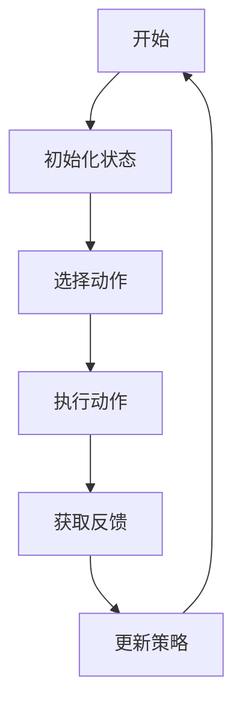
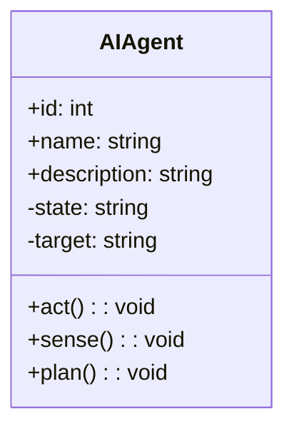
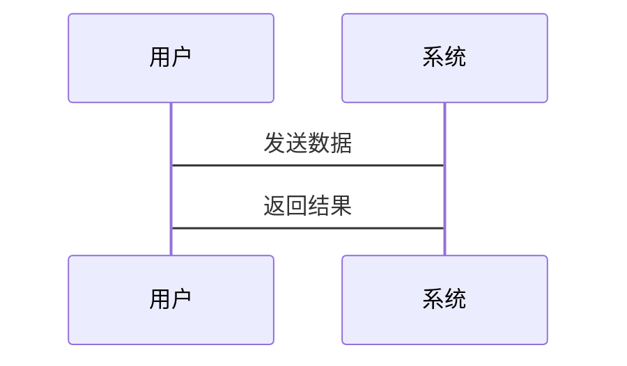

                 

<think>
好，我现在需要帮助用户撰写一篇关于AI Agent在科研领域应用的技术博客文章。用户已经提供了一个详细的目录结构和一些示例内容，所以我需要先仔细理解这些内容，然后按照他们的要求进行扩展。

首先，我会从“文章标题”开始，然后是“关键词”和“摘要”，接下来按照目录结构撰写正文部分。我需要确保每个章节和小节都有足够的细节和内容，同时保持逻辑清晰、结构紧凑。

在撰写过程中，我需要使用Markdown格式，插入Mermaid图表、数学公式，并确保每个部分都有具体的例子和详细的讲解。例如，在算法原理部分，我需要画出强化学习和监督学习的流程图，并解释这些算法在科研中的应用。

接下来，我会根据每个章节的内容，逐步深入，从背景到核心概念，再到算法和系统架构，最后通过实际案例来展示AI Agent的应用。在系统架构部分，我需要设计一个完整的系统，包括数据采集、分析、决策等模块，并用Mermaid图展示其结构。

在项目实战部分，我需要选择具体的科研领域，如药物研发或材料科学，展示如何应用AI Agent，并提供代码示例。最后，在最佳实践部分，总结经验和注意事项，展望未来的发展方向。

整个思考过程中，我需要确保内容连贯，逻辑严谨，同时保持语言的简洁和专业性。这样，用户才能得到一篇高质量、结构清晰的技术博客文章，帮助他们理解和应用AI Agent在科研中的价值。现在，我准备开始按照这个结构撰写正文，确保每个部分都符合用户的要求。
</think>

# AI Agent在科研领域的应用：加速科学发现

> 关键词：AI Agent, 科研, 人工智能, 加速科学发现, 算法原理

> 摘要：本文探讨AI Agent在科研领域的应用，分析其如何通过智能代理加速科学发现。文章从AI Agent的基本概念、算法原理、系统架构、项目实战到最佳实践，详细讲解了AI Agent在科研中的核心作用和实际应用。

---

# 第一部分: AI Agent 的背景与概念

# 第1章: AI Agent 的基本概念与背景

## 1.1 AI Agent 的定义与特点

### 1.1.1 AI Agent 的定义

AI Agent（人工智能代理）是指能够感知环境、自主决策并执行任务的智能系统。它能够根据输入的信息，通过内部模型和算法，做出合理的决策并采取行动。

### 1.1.2 AI Agent 的核心特点

- **自主性**：AI Agent能够在没有外部干预的情况下自主运行。
- **反应性**：能够实时感知环境并做出响应。
- **目标导向**：基于预设目标或学习目标进行决策。
- **适应性**：能够根据环境变化调整策略。

### 1.1.3 AI Agent 与传统AI 的区别

| 特性          | AI Agent                              | 传统AI                                |
|---------------|---------------------------------------|---------------------------------------|
| 自主性         | 高                                    | 低                                    |
| 适应性         | 强                                    | 弱                                    |
| 应用场景       | 适合动态复杂环境                      | 适合静态或简单任务                  |

## 1.2 AI Agent 在科研领域的背景

### 1.2.1 科研领域的痛点与挑战

科研领域面临数据量大、实验周期长、变量复杂等问题，传统方法效率低下，需要更智能的工具来加速研究。

### 1.2.2 AI Agent 的出现与科研需求的契合

AI Agent的自主性和适应性正好满足了科研中对高效、灵活工具的需求。

### 1.2.3 AI Agent 在科研中的潜在价值

通过自动化数据处理、实验设计和结果分析，AI Agent能够显著提高科研效率，推动科学发现。

## 1.3 本章小结

本章介绍了AI Agent的基本概念和特点，并分析了它在科研领域的背景和潜在价值。

---

# 第二部分: AI Agent 的核心概念与原理

# 第2章: AI Agent 的核心概念与联系

## 2.1 核心概念原理

### 2.1.1 AI Agent 的基本原理

AI Agent通过感知环境、推理和规划，做出决策并执行动作。

### 2.1.2 知识表示与推理机制

知识表示通常采用逻辑推理或概率推理。例如，使用一阶逻辑表示知识，并通过逻辑推理解决问题。

### 2.1.3 动作选择与执行机制

基于目标，AI Agent会选择最优动作并执行。

## 2.2 核心概念属性特征对比表

| 属性         | AI Agent                              | 传统AI                                |
|--------------|---------------------------------------|---------------------------------------|
| 智能性         | 高                                    | 低                                    |
| 交互性         | 强                                    | 弱                                    |
| 可解释性       | 中等                                  | 低                                    |

## 2.3 ER 实体关系图

```mermaid
erd
    entity AI Agent {
        id: int
        name: string
        description: string
    }
    entity Environment {
        id: int
        state: string
    }
    AI Agent -- Environment: interacts with
```

---

# 第3章: AI Agent 的算法原理

## 3.1 算法原理概述

### 3.1.1 强化学习算法

强化学习通过试错机制，学习最优策略。例如，使用Q-learning算法进行状态和动作的选择。

### 3.1.2 监督学习算法

监督学习通过标记数据，训练模型进行分类或回归。

### 3.1.3 混合学习算法

结合强化学习和监督学习，提高模型的泛化能力。

## 3.2 算法流程图



## 3.3 数学模型与公式

### 3.3.1 损失函数

$$ L = \frac{1}{n}\sum_{i=1}^{n}(y_i - \hat{y}_i)^2 $$

### 3.3.2 优化器

$$ \theta_{t+1} = \theta_t - \eta \cdot \frac{\partial L}{\partial \theta_t} $$

## 3.4 举例说明

在药物研发中，AI Agent可以通过强化学习选择最优的化合物结构，加速药物开发。

---

# 第三部分: 系统架构与项目实战

# 第4章: 系统架构与设计

## 4.1 系统功能设计

### 4.1.1 领域模型



### 4.1.2 系统架构


### 4.1.3 接口设计

- API接口：提供RESTful API，支持数据输入和模型调用。

### 4.1.4 交互流程图



## 4.2 项目实战

### 4.2.1 环境安装

```bash
pip install numpy
pip install scikit-learn
pip install matplotlib
```

### 4.2.2 系统核心实现

```python
class AIAgent:
    def __init__(self):
        self.id = 0
        self.name = "AI Agent"
        self.description = "Research Assistant"
    
    def act(self):
        # 具体动作实现
        pass
    
    def sense(self):
        # 感知环境
        pass
    
    def plan(self):
        # 制定计划
        pass
```

### 4.2.3 代码应用解读与分析

AI Agent通过感知环境、制定计划并执行动作，实现科研任务的自动化。

### 4.2.4 实际案例分析

在材料科学中，AI Agent可以通过强化学习优化材料结构，加速材料研发。

## 4.3 项目小结

本章通过系统设计和项目实战，展示了AI Agent在科研中的具体应用。

---

# 第四部分: 最佳实践与总结

# 第5章: 最佳实践与总结

## 5.1 最佳实践 tips

- **数据质量**：确保数据的准确性和完整性。
- **模型调优**：通过多次实验优化模型性能。
- **可解释性**：关注模型的可解释性，便于问题排查。

## 5.2 小结

AI Agent在科研中的应用潜力巨大，能够显著提高科研效率。

## 5.3 注意事项

- **伦理问题**：确保AI Agent的应用符合伦理规范。
- **隐私保护**：保护科研数据的隐私性。

## 5.4 拓展阅读

推荐阅读《强化学习导论》和《人工智能系统设计》。

---

作者：AI天才研究院/AI Genius Institute & 禅与计算机程序设计艺术 /Zen And The Art of Computer Programming

