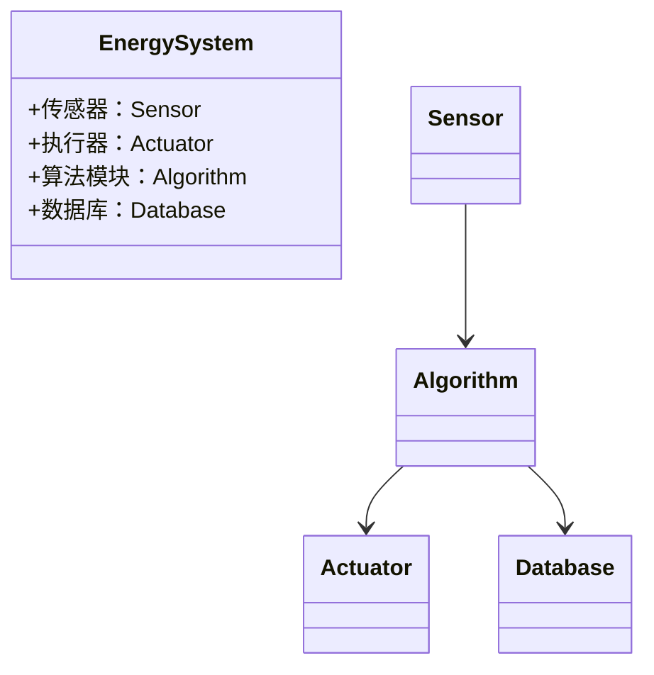
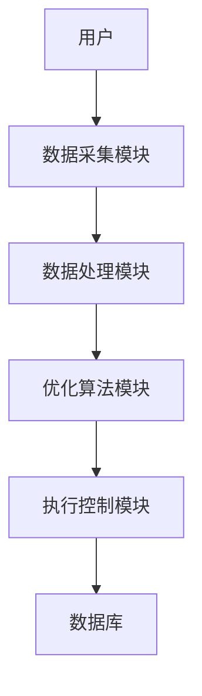
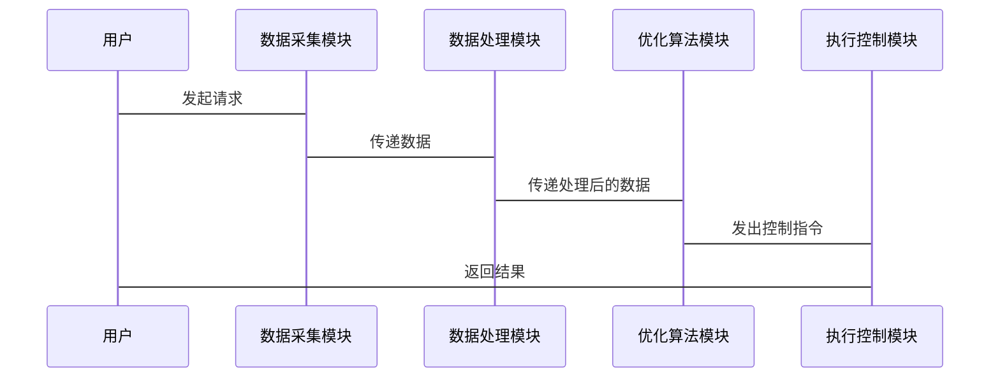

                 


# AI Agent在能源管理中的应用：优化能源使用效率

## 关键词：AI Agent, 能源管理, 优化算法, 系统架构, 项目实战, 能源效率

## 摘要：  
本文探讨AI Agent在能源管理中的应用，详细分析其在能源需求预测、优化调度和消耗监控等领域的优势。通过数学模型与算法、系统架构设计以及实际项目案例，深入剖析AI Agent如何提升能源使用效率，为读者提供全面的技术解读和实践指南。

---

## 第一部分: AI Agent与能源管理概述

### 第1章: AI Agent与能源管理的背景介绍

#### 1.1 AI Agent的基本概念

##### 1.1.1 AI Agent的定义  
AI Agent（人工智能代理）是指能够感知环境、自主决策并执行任务的智能实体。它通过传感器获取数据，利用算法进行分析，并通过执行器与环境交互。

##### 1.1.2 AI Agent的核心特征  
- **自主性**：能够自主决策和行动。  
- **反应性**：能够实时感知环境变化并做出响应。  
- **学习能力**：通过数据和经验不断优化性能。  

##### 1.1.3 AI Agent与传统能源管理的区别  
| 特性          | AI Agent                      | 传统能源管理                |  
|---------------|-------------------------------|-----------------------------|  
| 决策方式      | 基于AI算法自主决策            | 依赖人工制定规则和策略      |  
| 响应速度      | 实时响应                      | 延迟较高                    |  
| 可扩展性      | 支持大规模数据处理            | 适应性有限                  |  

#### 1.2 能源管理的基本概念

##### 1.2.1 能源管理的定义  
能源管理是指通过技术手段对能源的生产、传输、分配和使用进行监控和优化，以提高能源利用效率和降低能源成本。

##### 1.2.2 能源管理的主要目标  
- **提高能源利用效率**：通过优化能源分配和使用，减少浪费。  
- **降低能源成本**：通过预测和调度，避免不必要的能源消耗。  
- **减少环境影响**：通过优化能源结构，降低碳排放。  

##### 1.2.3 能源管理的实现方式  
- **数据采集**：通过传感器实时采集能源使用数据。  
- **数据分析**：利用算法对数据进行处理和分析。  
- **决策优化**：基于分析结果制定最优策略。  
- **执行控制**：通过执行器实现能源设备的控制。  

#### 1.3 AI Agent在能源管理中的应用背景

##### 1.3.1 当前能源管理的挑战  
- **数据量大**：能源系统涉及大量数据，传统方法难以处理。  
- **动态性高**：能源需求和供应随时变化，需要实时响应。  
- **复杂性高**：能源系统涉及多个环节和参与者，协调困难。  

##### 1.3.2 AI Agent如何解决能源管理问题  
AI Agent能够实时感知能源系统的变化，利用机器学习算法快速做出决策，优化能源使用效率。

##### 1.3.3 AI Agent在能源管理中的优势  
- **高效性**：能够快速处理大量数据并做出决策。  
- **适应性**：能够根据环境变化自动调整策略。  
- **准确性**：通过算法优化，提高决策的准确性。  

---

## 第二部分: AI Agent的核心概念与原理

### 第2章: AI Agent的核心概念与原理

#### 2.1 AI Agent的定义与分类

##### 2.1.1 AI Agent的定义  
AI Agent是一种能够感知环境、自主决策并执行任务的智能实体。

##### 2.1.2 AI Agent的分类  
- **基于规则的AI Agent**：根据预定义的规则进行决策。  
- **基于模型的AI Agent**：利用数学模型进行预测和优化。  
- **基于机器学习的AI Agent**：通过机器学习算法不断优化决策策略。  

##### 2.1.3 各类AI Agent的特点对比  
| 类型             | 基于规则的AI Agent | 基于模型的AI Agent | 基于机器学习的AI Agent |  
|------------------|--------------------|--------------------|--------------------------|  
| 决策方式         | 预定义规则          | 数学模型驱动        | 机器学习算法驱动        |  
| 适应性           | 低                 | 中                 | 高                      |  
| 学习能力         | 无                 | 有限               | 强                     |  

#### 2.2 AI Agent的工作原理

##### 2.2.1 感知层  
AI Agent通过传感器或其他数据源获取环境信息。  

##### 2.2.2 决策层  
AI Agent利用算法对感知到的信息进行分析，生成决策。  

##### 2.2.3 执行层  
AI Agent通过执行器将决策转化为实际操作。  

#### 2.3 AI Agent与传统能源管理系统的区别

##### 2.3.1 传统能源管理系统的特点  
- **规则驱动**：依赖预定义的规则进行决策。  
- **静态性**：难以适应环境变化。  
- **效率低**：处理复杂问题时效率较低。  

##### 2.3.2 AI Agent在能源管理中的创新点  
- **智能化**：能够自主学习和优化。  
- **实时性**：能够快速响应环境变化。  
- **高效性**：能够处理大规模数据并做出优化决策。  

##### 2.3.3 AI Agent的优势与局限性  
| 优势           | 局限性             |  
|----------------|-------------------|  
| 高效性          | 高计算资源需求    |  
| 适应性          | 算法复杂性高       |  
| 学习能力强       | 数据依赖性强       |  

---

## 第三部分: AI Agent在能源管理中的具体应用

### 第3章: AI Agent在能源管理中的具体应用

#### 3.1 能源需求预测

##### 3.1.1 需求预测的基本概念  
能源需求预测是指根据历史数据和当前情况，预测未来的能源需求。

##### 3.1.2 AI Agent在需求预测中的作用  
AI Agent能够利用机器学习算法，基于历史数据和实时数据，预测未来的能源需求。

##### 3.1.3 典型案例分析  
某电力公司利用AI Agent进行电力需求预测，准确率提高了20%，降低了能源浪费。

#### 3.2 能源优化调度

##### 3.2.1 优化调度的基本概念  
能源优化调度是指通过优化能源分配，提高能源利用效率。

##### 3.2.2 AI Agent在优化调度中的应用  
AI Agent能够根据实时数据，优化能源分配，减少能源浪费。

##### 3.2.3 典型案例分析  
某供电公司利用AI Agent进行电力调度优化，降低了电力成本15%。

#### 3.3 能源消耗监控

##### 3.3.1 监控的基本概念  
能源消耗监控是指对能源使用情况进行实时监控。

##### 3.3.2 AI Agent在监控中的作用  
AI Agent能够实时监控能源使用情况，发现异常情况并及时处理。

##### 3.3.3 典型案例分析  
某工厂利用AI Agent进行能源消耗监控，发现了多个浪费点，降低了能源消耗20%。

---

## 第四部分: AI Agent优化能源使用效率的数学模型与算法

### 第4章: AI Agent优化能源使用效率的数学模型与算法

#### 4.1 优化算法的基本原理

##### 4.1.1 算法选择与优化  
AI Agent通常采用强化学习算法，通过与环境的交互不断优化决策策略。

##### 4.1.2 强化学习算法的数学模型  
$$ V(s) = \max_{a} [ r(s,a) + \gamma V(s') ] $$  
其中，\( V(s) \) 表示状态 \( s \) 的价值函数，\( r(s,a) \) 表示在状态 \( s \) 下采取动作 \( a \) 的奖励，\( \gamma \) 表示折扣因子，\( s' \) 表示下一个状态。

##### 4.1.3 算法流程  
1. 初始化状态 \( s \) 和价值函数 \( V(s) \)。  
2. 在状态 \( s \) 下选择动作 \( a \)。  
3. 执行动作 \( a \)，进入下一个状态 \( s' \)，并获得奖励 \( r(s,a) \)。  
4. 更新价值函数 \( V(s) = r(s,a) + \gamma V(s') \)。  
5. 重复上述步骤，直到达到终止条件。  

#### 4.2 算法实现与优化

##### 4.2.1 算法实现  
```python
class AI-Agent:
    def __init__(self, states, actions):
        self.states = states
        self.actions = actions
        self.V = {s: 0 for s in states}
    
    def choose_action(self, s):
        # 随机选择动作
        return random.choice(self.actions)
    
    def update_value(self, s, a, r, s'):
        self.V[s] = r + gamma * self.V[s']
```

##### 4.2.2 算法优化  
通过增加经验回放和目标网络，可以提高算法的稳定性和收敛速度。

#### 4.3 算法的数学推导

##### 4.3.1 算法的收敛性分析  
通过数学推导可以证明，强化学习算法在一定条件下能够收敛到最优策略。

##### 4.3.2 算法的复杂性分析  
算法的时间复杂度主要取决于状态空间和动作空间的大小。

---

## 第五部分: AI Agent能源管理系统架构设计

### 第5章: AI Agent能源管理系统架构设计

#### 5.1 系统应用场景

##### 5.1.1 能源管理系统的场景介绍  
能源管理系统通常应用于电力、石油、天然气等领域，帮助企业和个人优化能源使用效率。

##### 5.1.2 系统功能需求  
- 数据采集与传输  
- 数据分析与处理  
- 优化决策与执行  
- 实时监控与反馈  

#### 5.2 系统功能设计

##### 5.2.1 领域模型类图  


##### 5.2.2 系统架构设计  


##### 5.2.3 系统接口设计  
- 数据采集接口：从传感器获取数据。  
- 数据处理接口：对数据进行清洗和预处理。  
- 优化算法接口：根据数据生成优化策略。  
- 执行控制接口：根据策略控制执行器。  

#### 5.3 系统交互设计

##### 5.3.1 系统交互流程  


##### 5.3.2 系统交互示例  
用户发起能源优化请求，系统采集数据，处理数据，生成优化策略，并通过执行器进行控制。

---

## 第六部分: AI Agent能源管理项目实战

### 第6章: AI Agent能源管理项目实战

#### 6.1 项目环境安装

##### 6.1.1 环境需求  
- Python 3.6及以上版本  
- NumPy、Pandas、Scikit-learn等库  

##### 6.1.2 安装步骤  
```bash
pip install numpy pandas scikit-learn
```

#### 6.2 系统核心实现

##### 6.2.1 核心代码实现  
```python
import numpy as np
import pandas as pd
from sklearn import linear_model

class AI-Agent:
    def __init__(self):
        self.model = linear_model.LinearRegression()
    
    def train(self, X, y):
        self.model.fit(X, y)
    
    def predict(self, X):
        return self.model.predict(X)
```

##### 6.2.2 代码实现解读  
- **数据预处理**：对数据进行清洗和特征工程。  
- **模型训练**：利用训练数据训练机器学习模型。  
- **模型预测**：基于训练好的模型，预测未来的能源需求。  

#### 6.3 实际案例分析

##### 6.3.1 案例背景  
某电力公司希望利用AI Agent优化电力调度。

##### 6.3.2 数据准备  
```python
data = pd.read_csv('energy_data.csv')
X = data[['温度', '湿度', '时间']]
y = data['电力需求']
```

##### 6.3.3 模型训练与预测  
```python
agent = AI-Agent()
agent.train(X, y)
预测结果 = agent.predict(X)
```

##### 6.3.4 模型优化  
通过交叉验证和超参数调优，提高模型的准确率。

#### 6.4 项目小结

##### 6.4.1 项目成果  
通过AI Agent优化电力调度，降低了电力成本。  

##### 6.4.2 经验总结  
- 数据质量对模型性能影响较大，需要重视数据预处理。  
- 模型选择和调优是关键，需要根据具体场景选择合适的算法。  

---

## 第七部分: 总结与展望

### 第7章: 总结与展望

#### 7.1 总结

##### 7.1.1 AI Agent的核心优势  
- 高效性：能够快速处理大量数据并做出决策。  
- 适应性：能够根据环境变化自动调整策略。  
- 学习能力：通过机器学习算法不断优化决策策略。  

##### 7.1.2 本文的主要内容  
本文详细探讨了AI Agent在能源管理中的应用，包括背景介绍、核心概念、算法原理、系统架构设计以及项目实战。

#### 7.2 未来展望

##### 7.2.1 当前技术的局限性  
- 算法复杂性高，计算资源需求大。  
- 数据依赖性强，需要高质量的数据支持。  

##### 7.2.2 未来发展方向  
- **算法优化**：开发更高效的算法，降低计算资源需求。  
- **数据融合**：结合多源数据，提高模型的准确率。  
- **智能决策**：进一步提升AI Agent的自主决策能力，实现更智能的能源管理。  

#### 7.3 最佳实践Tips

##### 7.3.1 数据质量  
- 数据预处理是关键，需要清洗和特征工程。  

##### 7.3.2 模型选择  
- 根据具体场景选择合适的算法，避免盲目使用复杂模型。  

##### 7.3.3 系统设计  
- 系统架构要清晰，模块化设计有助于后期维护和优化。  

---

## 作者：AI天才研究院/AI Genius Institute & 禅与计算机程序设计艺术 /Zen And The Art of Computer Programming

