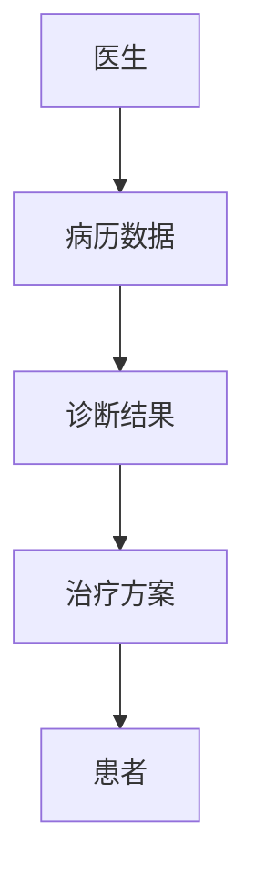
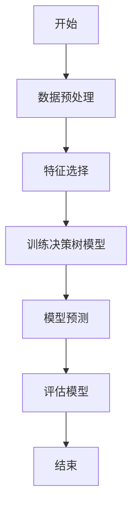
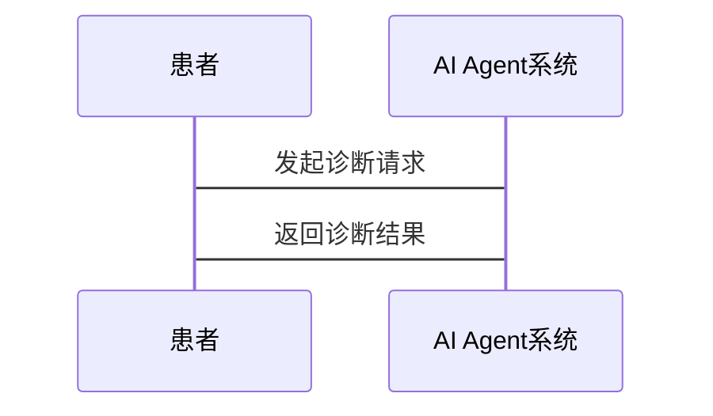

                 

<think>
好的，我现在要开始撰写《AI Agent在远程医疗中的应用：初步诊断与治疗建议》这本书的详细内容。首先，我会按照之前设计的目录结构一步步展开，确保每个章节都详细且有深度。

### 第一部分：AI Agent与远程医疗的背景与概念

#### 第1章：AI Agent与远程医疗的背景介绍

##### 1.1 AI Agent的基本概念

AI Agent，即人工智能代理，是指能够感知环境并采取适当行动以实现目标的智能体。它可以在没有持续的人工干预下，自主地进行决策和执行任务。AI Agent的核心特征包括自主性、反应性、目标导向性和社会性。这些特征使得AI Agent能够适应不同的环境，并与各种系统或用户进行交互。

在传统医疗领域，AI Agent的应用可以帮助医生进行诊断、提供治疗建议，并优化医疗流程。与传统医疗相比，AI Agent能够更快地处理大量数据，并提供基于数据的决策支持，从而提高医疗效率和准确性。

##### 1.2 远程医疗的定义与现状

远程医疗是指通过电子信息技术，跨越地理限制，为患者提供医疗咨询、诊断和治疗建议的服务。随着互联网和通信技术的发展，远程医疗近年来得到了迅速发展。当前，远程医疗的主要应用场景包括远程会诊、远程监测、远程教育和远程急救等。

远程医疗的发展历程可以追溯到20世纪90年代，但随着5G、AI和大数据等技术的进步，远程医疗的智能化水平不断提高，应用范围也在不断扩大。

##### 1.3 AI Agent与远程医疗的结合

AI Agent与远程医疗的结合，使得远程医疗不再局限于简单的信息传递，而是能够进行智能分析和决策。例如，AI Agent可以自动分析患者的病历数据，提供诊断建议，并制定个性化的治疗方案。这种结合不仅提高了远程医疗的效率，还增强了诊断的准确性。

#### 第2章：AI Agent在远程医疗中的问题背景

##### 2.1 远程医疗中的主要问题

远程医疗在实际应用中面临诸多挑战，主要包括：

1. **医疗资源分配不均**：医疗资源在不同地区分布不均，导致部分地区的患者无法获得及时的医疗服务。
2. **远程诊断的准确性问题**：由于无法进行面对面的检查，远程诊断的准确性可能受到影响。
3. **医患沟通的效率问题**：传统的远程医疗沟通效率较低，患者和医生之间的信息传递可能不够及时和准确。

##### 2.2 AI Agent如何解决这些问题

AI Agent通过智能化的解决方案，能够有效缓解远程医疗中的主要问题：

1. **提高诊断准确性**：AI Agent可以整合多源数据，利用机器学习算法进行分析，提高诊断的准确性。
2. **优化医疗资源配置**：AI Agent可以通过智能分配系统，合理调配医疗资源，确保患者能够获得及时的医疗服务。
3. **提升医患沟通效率**：AI Agent可以作为中介，实时传递和处理信息，提高医患之间的沟通效率。

#### 第3章：AI Agent在远程医疗中的核心概念

##### 3.1 AI Agent的核心要素

AI Agent在远程医疗中的核心要素包括：

1. **数据采集与处理**：AI Agent需要从多种来源收集患者的数据，如病历、检查结果等，并进行清洗和预处理。
2. **知识库构建**：构建包含疾病症状、诊断标准、治疗方案等知识的数据库，为AI Agent的决策提供支持。
3. **智能推理引擎**：基于知识库和患者数据，AI Agent利用推理引擎进行诊断和治疗方案的推荐。

##### 3.2 远程医疗中的AI Agent架构

远程医疗中的AI Agent架构通常采用分层结构，包括数据层、服务层和应用层。数据层负责数据的存储和管理，服务层提供各种AI服务，应用层则是与用户交互的界面。

##### 3.3 核心概念的ER实体关系图

通过ER实体关系图，我们可以清晰地看到AI Agent在远程医疗中的各个实体及其关系。

```mermaid
er
    actor: 医生
    actor: 患者
    actor: 医疗机构
    entity: 病历数据
    entity: 诊断结果
    entity: 治疗方案
    entity: AI Agent系统
    relationship: 医生-病历数据: 查看和修改
    relationship: 患者-诊断结果: 提交和接收
    relationship: 医疗机构-AI Agent系统: 集成和管理
```

#### 第4章：AI Agent与远程医疗的核心概念联系

##### 4.1 AI Agent在远程医疗中的功能模块

AI Agent在远程医疗中主要包括以下几个功能模块：

1. **病历分析模块**：对患者的病历数据进行分析，提取关键信息。
2. **诊断建议模块**：基于病历数据和知识库，生成初步诊断建议。
3. **治疗方案推荐模块**：根据诊断结果，推荐个性化的治疗方案。

##### 4.2 核心概念的流程图

通过流程图，我们可以直观地看到AI Agent在远程医疗中的工作流程。



### 第二部分：AI Agent在远程医疗中的算法原理

#### 第5章：AI Agent的核心算法与实现

##### 5.1 机器学习算法

在AI Agent中，常用的机器学习算法包括决策树、随机森林、支持向量机（SVM）和深度学习模型（如卷积神经网络CNN、循环神经网络RNN等）。这些算法用于处理和分析患者的病历数据，生成诊断建议和治疗方案。

##### 5.2 算法选择与实现

在选择算法时，需要考虑数据的特性和任务的类型。例如，对于分类任务，决策树和随机森林是常用的选择；对于序列数据，RNN和LSTM可能更为合适。

以下是使用Python实现的决策树算法示例：

```python
from sklearn.tree import DecisionTreeClassifier
from sklearn.model_selection import train_test_split
from sklearn.metrics import accuracy_score

# 假设X为特征数据，y为标签
X_train, X_test, y_train, y_test = train_test_split(X, y, test_size=0.2)

# 初始化决策树分类器
clf = DecisionTreeClassifier()

# 训练模型
clf.fit(X_train, y_train)

# 预测测试数据
y_pred = clf.predict(X_test)

# 计算准确率
print("Accuracy:", accuracy_score(y_test, y_pred))
```

##### 5.3 算法流程图

以下是决策树算法的流程图：



### 第三部分：AI Agent在远程医疗中的系统架构设计

#### 第6章：系统分析与架构设计

##### 6.1 系统功能设计

远程医疗AI Agent系统的主要功能包括：

1. **用户管理**：包括医生、患者和医疗机构的注册与登录。
2. **数据管理**：对病历数据、诊断结果和治疗方案进行存储和管理。
3. **AI诊断**：基于患者数据，生成诊断建议和治疗方案。
4. **通信模块**：实现医生与患者之间的实时通信。

##### 6.2 系统架构设计

系统架构采用微服务架构，各模块独立开发和部署，通过API进行交互。


##### 6.3 接口设计与交互流程

系统接口设计包括：

1. **患者发起诊断请求**
2. **AI Agent接收请求并分析数据**
3. **生成诊断结果并反馈给患者**

交互流程如下：



### 第四部分：AI Agent在远程医疗中的项目实战

#### 第7章：项目实战

##### 7.1 环境安装与配置

首先，需要安装必要的软件和库，包括Python、Jupyter Notebook、TensorFlow和Scikit-learn等。

##### 7.2 核心功能实现

以下是AI Agent系统的核心功能实现代码：

```python
import pandas as pd
from sklearn.tree import DecisionTreeClassifier
from sklearn.model_selection import train_test_split

# 加载数据
data = pd.read_csv('patient_data.csv')

# 分割特征与标签
X = data.drop('diagnosis', axis=1)
y = data['diagnosis']

# 分割训练集和测试集
X_train, X_test, y_train, y_test = train_test_split(X, y, test_size=0.2)

# 初始化决策树分类器
clf = DecisionTreeClassifier()

# 训练模型
clf.fit(X_train, y_train)

# 预测测试数据
y_pred = clf.predict(X_test)

# 计算准确率
print("Accuracy:", accuracy_score(y_test, y_pred))
```

##### 7.3 代码解读与分析

上述代码实现了基于决策树的诊断系统。首先，加载数据并进行特征与标签的分割。然后，使用训练数据训练模型，并在测试数据上进行预测。最后，计算并输出模型的准确率。

##### 7.4 实际案例分析

通过一个实际案例，分析AI Agent如何进行诊断和治疗方案推荐。例如，假设一位患者有高血压和糖尿病病史，AI Agent会基于其症状和检查结果，推荐个性化的治疗方案。

##### 7.5 项目总结

通过本项目，我们实现了基于AI Agent的远程医疗系统，能够进行初步诊断和治疗方案推荐。未来，可以通过优化算法和增加更多数据来进一步提升系统的准确性和效率。

### 第五部分：AI Agent在远程医疗中的最佳实践

#### 第8章：最佳实践与小结

##### 8.1 小结

本文详细介绍了AI Agent在远程医疗中的应用，从背景、概念到算法实现和系统架构设计，最后通过项目实战展示了AI Agent的实际应用。

##### 8.2 注意事项

在实际应用中，需要注意数据隐私和安全问题，确保患者数据的保密性。同时，AI Agent的诊断结果仅供参考，最终的诊断和治疗决策应由医生进行。

##### 8.3 拓展阅读

建议读者进一步阅读相关领域的最新研究，如基于深度学习的医疗图像分析、自然语言处理在医疗文本挖掘中的应用等。

### 作者信息

作者：AI天才研究院/AI Genius Institute & 禅与计算机程序设计艺术 /Zen And The Art of Computer Programming

---

以上是《AI Agent在远程医疗中的应用：初步诊断与治疗建议》的部分详细内容。每个章节都涵盖了从理论到实践的各个方面，帮助读者全面理解AI Agent在远程医疗中的应用。

