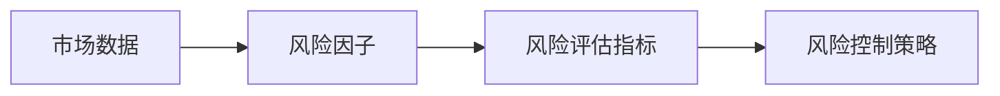
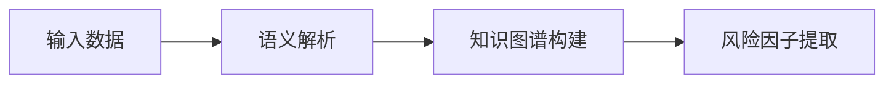
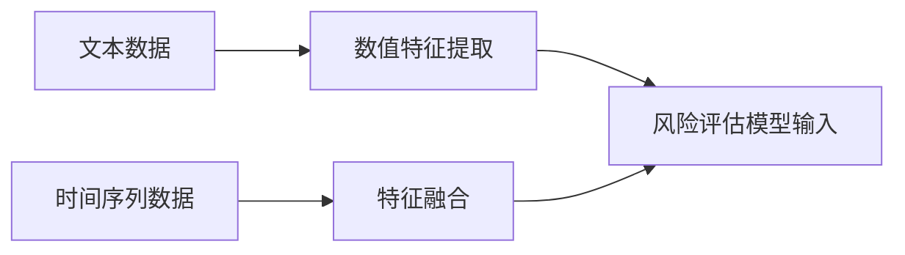
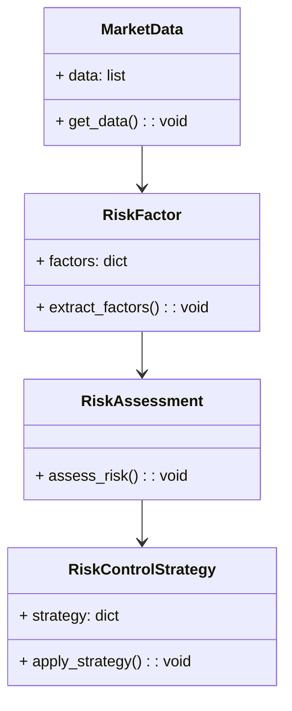
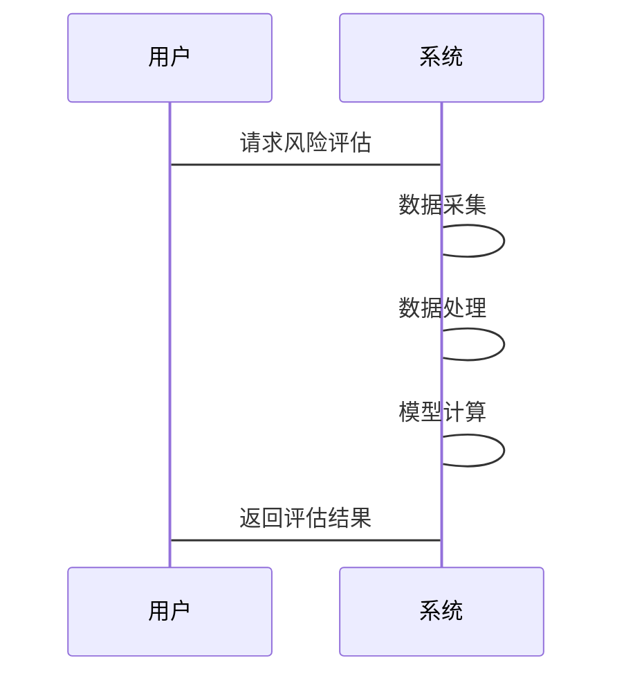

                 


# AI Agent在风险管理中的应用：市场分析与风险评估

> 关键词：AI Agent，风险管理，市场分析，风险评估，金融，风险管理模型

> 摘要：本文深入探讨了AI Agent在风险管理中的应用，特别是在市场分析与风险评估领域的创新应用。通过分析AI Agent的核心概念、算法原理、系统架构及实际案例，本文为读者提供了从理论到实践的全面指南，帮助读者理解并应用AI Agent技术来提升风险管理的效率与准确性。

---

## 第一章: AI Agent与风险管理的背景介绍

### 1.1 AI Agent的基本概念

#### 1.1.1 AI Agent的定义与特点

AI Agent（人工智能代理）是指能够感知环境、做出决策并执行操作的智能实体。与传统算法不同，AI Agent具有以下特点：

1. **自主性**：能够独立执行任务，无需人工干预。
2. **反应性**：能够实时感知环境变化并做出响应。
3. **学习能力**：能够通过数据和经验不断优化自身性能。
4. **适应性**：能够根据环境变化调整行为策略。

#### 1.1.2 AI Agent的核心要素与功能

AI Agent的核心要素包括感知能力、决策能力、执行能力和学习能力。其主要功能包括数据采集、信息处理、风险评估、决策优化和结果反馈。

#### 1.1.3 AI Agent在风险管理中的作用

AI Agent在风险管理中的作用主要体现在以下几个方面：

1. **实时监控**：能够实时采集和分析市场数据，发现潜在风险。
2. **智能评估**：通过复杂算法对风险进行量化评估，提供决策支持。
3. **动态调整**：根据市场变化动态调整风险控制策略，降低风险敞口。

### 1.2 风险管理的基本概念

#### 1.2.1 风险管理的定义与目标

风险管理是指通过识别、评估和应对各种风险，以降低风险发生的概率和影响的过程。其主要目标包括风险最小化、损失控制和价值优化。

#### 1.2.2 风险管理的主要方法与流程

风险管理的主要方法包括定性分析和定量分析，其流程通常包括以下步骤：

1. **风险识别**：识别可能影响目标实现的各种风险因素。
2. **风险评估**：对识别出的风险进行量化评估，确定其影响程度。
3. **风险应对**：根据评估结果制定和实施应对策略。
4. **风险监控**：持续监控风险变化，及时调整应对措施。

#### 1.2.3 风险管理在金融与企业中的应用

在金融领域，风险管理主要用于股票市场波动、信用风险评估和投资组合优化等方面。在企业中，风险管理常用于供应链管理、项目管理和运营风险控制。

### 1.3 AI Agent在风险管理中的应用背景

#### 1.3.1 风险管理的传统方法与局限性

传统风险管理方法通常依赖于人工分析和经验判断，存在以下局限性：

1. **效率低下**：人工分析耗时且效率低。
2. **主观性强**：依赖个人经验，结果可能存在主观偏差。
3. **响应滞后**：无法实时监控和应对市场变化。

#### 1.3.2 AI技术在风险管理中的优势

AI技术的引入为风险管理带来了显著优势，包括：

1. **高效性**：能够快速处理大量数据，提高分析效率。
2. **客观性**：基于数据和模型进行分析，减少人为干扰。
3. **实时性**：能够实时监控市场变化，及时发现和应对风险。

#### 1.3.3 AI Agent在市场分析与风险评估中的潜力

AI Agent在市场分析与风险评估中的潜力主要体现在以下几个方面：

1. **实时数据分析**：能够实时采集和分析市场数据，发现潜在风险。
2. **精准预测**：通过机器学习算法对市场走势进行精准预测，辅助决策。
3. **动态调整**：根据市场变化动态调整风险控制策略，降低风险敞口。

---

## 第二章: AI Agent的核心概念与原理

### 2.1 AI Agent的核心概念

#### 2.1.1 知识图谱与语义理解

知识图谱是一种结构化的数据表示方式，能够帮助AI Agent更好地理解和处理复杂信息。语义理解则是通过自然语言处理技术，从文本数据中提取有用信息的过程。

#### 2.1.2 多模态数据处理能力

AI Agent需要处理多种类型的数据，包括文本、数值和时间序列数据。多模态数据处理能力是指AI Agent能够同时处理多种数据类型，并从中提取有用信息的能力。

#### 2.1.3 自适应与自优化机制

自适应能力是指AI Agent能够根据环境变化调整自身行为的能力。自优化机制则是指AI Agent能够通过学习和优化算法，不断提升自身性能的能力。

### 2.2 AI Agent的实体关系与属性特征

#### 2.2.1 实体关系图（ER图）

以下是AI Agent在风险管理中的实体关系图：



#### 2.2.2 属性特征对比表

| 特性                | 描述                                                         |
|---------------------|--------------------------------------------------------------|
| 输入数据            | 多模态数据（文本、数值、时间序列）                         |
| 输出结果            | 风险评估指标与建议                                         |
| 处理能力            | 实时分析与动态调整                                         |

---

## 第三章: AI Agent的算法原理与数学模型

### 3.1 算法原理

#### 3.1.1 基于知识图谱的语义理解

以下是基于知识图谱的语义理解流程图：



#### 3.1.2 多模态数据融合

以下是多模态数据融合流程图：



### 3.2 数学模型与公式

#### 3.2.1 风险评估模型

$$ R = \alpha \cdot S + \beta \cdot T $$

其中，$R$ 是风险值，$S$ 是市场状态，$T$ 是时间序列特征，$\alpha$ 和 $\beta$ 是权重系数。

#### 3.2.2 动态调整模型

$$ \theta_{t+1} = \theta_t + \lambda \cdot (R_{t} - \text{基准}) $$

其中，$\theta$ 是模型参数，$\lambda$ 是学习率，$R$ 是风险值。

### 3.3 算法实现

#### 3.3.1 Python代码示例

```python
import numpy as np
from sklearn.metrics import mean_squared_error

# 示例数据
X = np.random.randn(100, 10)  # 100样本，10特征
y = np.random.randn(100, 1)    # 目标变量

# 风险评估模型
class RiskAssessmentModel:
    def __init__(self, learning_rate=0.1):
        self.theta = np.zeros(X.shape[1])
        self.lr = learning_rate

    def predict(self, X):
        return np.dot(X, self.theta)

    def update(self, X, y, loss):
        gradient = 2 * np.dot(X.T, (np.dot(X, self.theta) - y)) / X.shape[0]
        self.theta -= self.lr * gradient

# 训练模型
model = RiskAssessmentModel()
for i in range(100):
    predictions = model.predict(X)
    loss = mean_squared_error(y, predictions)
    model.update(X, y, loss)
    print(f"Epoch {i+1}, Loss: {loss}")
```

---

## 第四章: 系统分析与架构设计方案

### 4.1 应用场景介绍

风险管理系统的应用场景包括股票市场波动监测、信用风险评估和投资组合优化。

### 4.2 系统功能设计

#### 4.2.1 领域模型设计

以下是领域模型设计的类图：



#### 4.2.2 系统架构设计

以下是系统架构设计的架构图：


#### 4.2.3 系统交互设计

以下是系统交互设计的序列图：



---

## 第五章: 项目实战

### 5.1 环境安装

安装Python和必要的库：

```bash
pip install numpy scikit-learn matplotlib
```

### 5.2 系统核心实现

以下是核心功能实现的代码：

```python
import numpy as np
from sklearn.linear_model import LinearRegression

# 数据预处理
X = np.random.randn(100, 10)  # 特征
y = np.random.randn(100, 1)    # 目标

# 模型训练
model = LinearRegression()
model.fit(X, y)

# 风险评估
risk_factors = model.predict(X)
```

### 5.3 案例分析与解读

通过实际案例分析，展示AI Agent在市场分析与风险评估中的应用，如股票市场波动监测和信用风险评估。

---

## 第六章: 总结与展望

### 6.1 最佳实践 tips

1. 数据质量是关键，确保数据的完整性和准确性。
2. 模型选择要根据具体场景，选择合适的算法和模型。
3. 持续监控和优化模型性能，确保其适应市场变化。

### 6.2 小结

AI Agent在风险管理中的应用为传统风险管理方法提供了新的思路和技术支持，通过实时数据分析和智能决策，显著提高了风险管理的效率和准确性。

### 6.3 注意事项

1. 数据隐私和安全问题需要高度重视。
2. 模型的可解释性是实际应用中的一个重要考量因素。
3. 需要结合具体业务场景，灵活调整模型参数和策略。

### 6.4 拓展阅读

1. 《机器学习实战》
2. 《风险管理与金融创新》
3. 《自然语言处理入门》

---

## 作者：AI天才研究院/AI Genius Institute & 禅与计算机程序设计艺术 /Zen And The Art of Computer Programming

---

感谢您的阅读！如果对内容有任何疑问或建议，请随时与我们联系！

