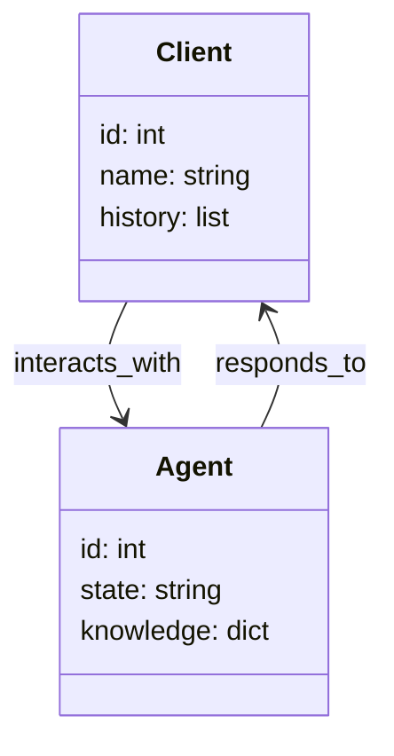
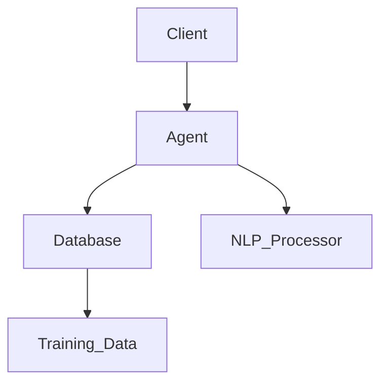
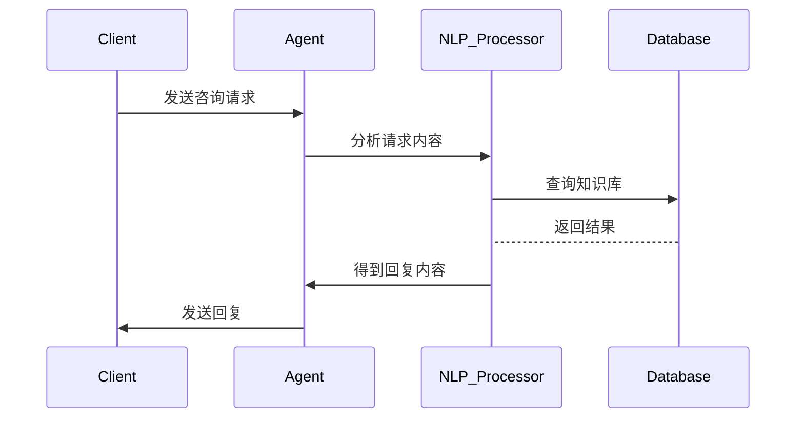

                 


# AI Agent基础：企业应用中的核心概念与重要性

> 关键词：AI Agent，人工智能代理，企业应用，系统架构，算法原理，项目实战

> 摘要：本文深入探讨了AI Agent的核心概念、算法原理、系统架构及其在企业应用中的重要性。通过详细分析，本文旨在帮助读者理解AI Agent的背景、核心要素、算法实现、系统设计以及实际应用案例，从而为企业在AI Agent技术的落地和应用提供有价值的指导。

---

## 第1章: AI Agent的基本概念与背景

### 1.1 AI Agent的定义与特点

#### 1.1.1 AI Agent的定义
AI Agent（人工智能代理）是指能够感知环境、做出决策并采取行动以实现特定目标的智能实体。它能够通过与环境的交互，动态调整自己的行为以优化结果。

#### 1.1.2 AI Agent的核心特点
- **自主性**：AI Agent能够在没有外部干预的情况下自主运行。
- **反应性**：能够实时感知环境并做出反应。
- **目标导向**：所有行为都以实现特定目标为导向。
- **学习能力**：能够通过经验改进自身的决策能力。

#### 1.1.3 AI Agent与传统软件的区别
| 属性         | 传统软件          | AI Agent             |
|--------------|-------------------|----------------------|
| 行为方式      | 预定义的规则      | 动态决策与学习       |
| 交互能力     | 单向             | 双向交互             |
| 环境适应性    | 固定             | 高度适应环境变化     |
| 智能水平      | 低               | 高（基于AI技术）     |

### 1.2 AI Agent的历史与发展

#### 1.2.1 AI Agent的起源
AI Agent的概念可以追溯到20世纪50年代，随着人工智能技术的发展逐步成熟。早期的AI Agent主要用于学术研究，解决简单的自动化问题。

#### 1.2.2 AI Agent技术的发展历程
- **20世纪50-60年代**：初步概念提出，基于逻辑推理的AI Agent。
- **20世纪70年代**：知识表示与推理技术的进步推动了AI Agent的发展。
- **20世纪80-90年代**：专家系统和基于知识的AI Agent开始应用于企业。
- **21世纪以来**：机器学习、深度学习等技术的引入，使AI Agent具备更强的自适应能力和学习能力。

#### 1.2.3 当前AI Agent技术的现状
当前，AI Agent技术结合了自然语言处理、计算机视觉、强化学习等先进技术，已在企业应用中展现出巨大潜力。

### 1.3 AI Agent在企业中的应用背景

#### 1.3.1 企业数字化转型的需求
企业数字化转型要求提高效率、降低成本和提升客户体验，AI Agent能够很好地满足这些需求。

#### 1.3.2 AI Agent在企业中的潜在价值
- **自动化处理**：提升企业运营效率。
- **智能决策**：优化企业资源配置。
- **客户体验**：提供个性化服务。

#### 1.3.3 企业应用AI Agent的主要场景
- **客户服务**：智能客服系统。
- **数据分析**：自动化数据处理与分析。
- **流程优化**：优化企业内部流程。

---

## 第2章: AI Agent的核心概念与重要性

### 2.1 AI Agent的核心概念

#### 2.1.1 AI Agent的基本构成
AI Agent的构成包括感知模块、推理模块和执行模块。感知模块负责收集环境信息，推理模块负责分析信息并做出决策，执行模块负责执行决策并反馈结果。

#### 2.1.2 AI Agent的类型与分类
AI Agent可以根据智能水平、应用场景和决策方式分类：

- **按智能水平**：分为基于规则的AI Agent和基于机器学习的AI Agent。
- **按应用场景**：分为客户服务、数据分析和流程优化等类型。
- **按决策方式**：分为反应式AI Agent和基于模型的AI Agent。

#### 2.1.3 AI Agent的功能与能力
AI Agent的核心功能包括信息处理、决策制定和行动执行。它能够通过学习和适应不断优化自己的行为。

### 2.2 AI Agent的核心要素

#### 2.2.1 感知与理解能力
AI Agent需要能够理解输入的信息，通常通过自然语言处理和计算机视觉技术实现。

#### 2.2.2 决策与推理能力
AI Agent需要基于感知的信息做出决策，通常依赖于逻辑推理和机器学习算法。

#### 2.2.3 执行与反馈能力
AI Agent需要能够执行决策并根据反馈结果进行调整。

### 2.3 AI Agent的重要性

#### 2.3.1 提升企业效率的作用
AI Agent能够自动化处理大量重复性任务，显著提高企业效率。

#### 2.3.2 优化企业资源分配的价值
通过智能决策，AI Agent能够优化企业资源的分配，降低成本。

#### 2.3.3 支持企业创新的意义
AI Agent能够为企业创新提供新的思路和技术支持，推动企业业务模式的变革。

---

## 第3章: AI Agent的核心原理

### 3.1 AI Agent的基本原理

#### 3.1.1 状态空间与动作空间
AI Agent通过状态空间和动作空间来描述问题。状态空间是所有可能的状态的集合，动作空间是AI Agent在给定状态下可以执行的所有动作的集合。

#### 3.1.2 知识表示与推理机制
知识表示是将问题领域中的知识表示为数据结构的过程，推理机制是根据知识做出决策的过程。

#### 3.1.3 行为
AI Agent的行为是其基于当前状态和目标做出的决策。

### 3.2 AI Agent的算法原理

#### 3.2.1 状态空间搜索
状态空间搜索是一种典型的AI Agent算法，通过搜索状态空间找到最优路径。

#### 3.2.2 强化学习
强化学习是一种通过试错机制优化决策的算法，适用于动态环境中的AI Agent。

#### 3.2.3 例子：一个简单的AI Agent算法实现
以下是Python代码实现一个简单的强化学习算法：

```python
class AIAgent:
    def __init__(self, state_space, action_space):
        self.state_space = state_space
        self.action_space = action_space
        self.q_table = {}  # Q-learning表格

    def get_action(self, state):
        if state not in self.q_table:
            self.q_table[state] = [0.0 for _ in range(self.action_space)]
        max_value = max(self.q_table[state])
        return self.action_space.index(max_value)

    def update_q_table(self, state, action, reward, next_state):
        current_q = self.q_table[state][action]
        next_max_q = max(self.q_table.get(next_state, [0.0]*self.action_space))
        new_q = current_q + 0.1*(reward + next_max_q - current_q)
        self.q_table[state][action] = new_q
```

### 3.3 AI Agent的核心要素

#### 3.3.1 感知与理解能力
AI Agent需要能够感知环境并理解输入的信息，通常通过自然语言处理和计算机视觉技术实现。

#### 3.3.2 决策与推理能力
AI Agent需要基于感知的信息做出决策，通常依赖于逻辑推理和机器学习算法。

#### 3.3.3 执行与反馈能力
AI Agent需要能够执行决策并根据反馈结果进行调整。

---

## 第4章: AI Agent的系统架构与设计

### 4.1 企业应用场景分析

#### 4.1.1 问题场景介绍
以智能客服系统为例，AI Agent需要处理客户的咨询和问题解决。

#### 4.1.2 项目介绍
设计一个智能客服系统，实现客户咨询的自动化处理。

### 4.2 系统功能设计

#### 4.2.1 领域模型
以下是智能客服系统的领域模型：



#### 4.2.2 系统架构设计
以下是智能客服系统的系统架构图：



### 4.3 系统接口设计

#### 4.3.1 接口设计
以下是智能客服系统的接口设计：



### 4.4 系统交互设计

#### 4.4.1 交互流程
以下是智能客服系统的交互流程：


---

## 第5章: AI Agent的项目实战

### 5.1 环境安装

#### 5.1.1 安装Python
需要安装Python 3.8及以上版本。

#### 5.1.2 安装必要的库
安装以下Python库：

```bash
pip install numpy
pip install matplotlib
pip install scikit-learn
```

### 5.2 核心代码实现

#### 5.2.1 代码实现
以下是AI Agent的核心代码实现：

```python
class AIAgent:
    def __init__(self, state_space, action_space):
        self.state_space = state_space
        self.action_space = action_space
        self.q_table = {}

    def get_action(self, state):
        if state not in self.q_table:
            self.q_table[state] = [0.0 for _ in range(self.action_space)]
        max_value = max(self.q_table[state])
        return self.action_space.index(max_value)

    def update_q_table(self, state, action, reward, next_state):
        current_q = self.q_table[state][action]
        next_max_q = max(self.q_table.get(next_state, [0.0]*self.action_space))
        new_q = current_q + 0.1*(reward + next_max_q - current_q)
        self.q_table[state][action] = new_q
```

#### 5.2.2 代码解读
上述代码实现了一个基于Q-learning算法的AI Agent，通过不断试错优化决策策略。

### 5.3 案例分析与详细讲解

#### 5.3.1 案例分析
以智能客服系统为例，分析AI Agent在客户服务中的具体应用。

#### 5.3.2 详细讲解
详细讲解AI Agent在智能客服系统中的实现过程，包括需求分析、系统设计、代码实现和测试优化。

### 5.4 项目小结

#### 5.4.1 项目总结
总结项目实现的关键点和经验教训。

#### 5.4.2 实际案例分析
分析实际案例中AI Agent的应用效果和改进空间。

---

## 第6章: 总结与展望

### 6.1 总结

#### 6.1.1 核心内容回顾
回顾本文的核心内容，包括AI Agent的基本概念、算法原理、系统架构和项目实战。

#### 6.1.2 重要性总结
总结AI Agent在企业应用中的重要性和潜在价值。

### 6.2 当前趋势与未来展望

#### 6.2.1 当前趋势
当前，AI Agent技术正在向更智能、更自主的方向发展，结合边缘计算和物联网技术的应用越来越广泛。

#### 6.2.2 未来展望
未来，AI Agent技术将更加普及，应用场景也将更加多样化，特别是在智能城市和智能制造领域。

### 6.3 最佳实践 tips

#### 6.3.1 实践建议
- 在实际应用中，建议结合具体业务需求设计AI Agent的架构和功能。
- 注意数据质量和模型的可解释性，确保AI Agent的决策透明和可追溯。

#### 6.3.2 注意事项
- 在设计AI Agent时，需要充分考虑系统的可扩展性和可维护性。
- 确保数据安全和隐私保护，避免潜在的法律风险。

#### 6.3.3 拓展阅读
推荐相关领域的书籍和论文，供读者进一步学习和研究。

---

## 作者

作者：AI天才研究院/AI Genius Institute & 禅与计算机程序设计艺术 /Zen And The Art of Computer Programming

---

通过以上内容，我们系统地探讨了AI Agent的核心概念、算法原理、系统架构及其在企业应用中的重要性。希望本文能够为企业在AI Agent技术的落地和应用提供有价值的指导和参考。

