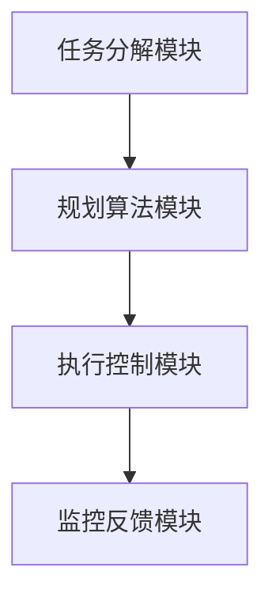

                 


# AI Agent的任务规划与执行框架

> 关键词：AI Agent，任务规划，执行框架，算法原理，系统架构，项目实战

> 摘要：本文将详细探讨AI Agent的任务规划与执行框架，从基本概念到核心算法，从系统架构到项目实战，全面解析AI Agent如何通过任务规划与执行框架实现智能决策与行动。通过本文，读者将能够理解AI Agent的任务规划与执行框架的核心原理，并能够将其应用于实际项目中。

---

# 第一部分: AI Agent的任务规划与执行框架概述

## 第1章: AI Agent的基本概念与演进

### 1.1 AI Agent的定义与特点

AI Agent（人工智能代理）是指在计算机系统中，能够感知环境、自主决策并执行任务的智能实体。与传统的程序不同，AI Agent具备以下特点：

- **自主性**：AI Agent能够自主决策，无需外部干预。
- **反应性**：能够实时感知环境并做出反应。
- **目标导向**：具备明确的目标，并根据目标进行规划和执行。
- **学习能力**：能够通过经验不断优化自身的决策能力。

### 1.2 AI Agent的演进历程

AI Agent的发展经历了多个阶段：

1. **基于规则的AI Agent**：早期的AI Agent主要基于预定义的规则进行决策，适用于简单的任务。
2. **基于知识的AI Agent**：引入知识库和推理引擎，能够处理更复杂的问题。
3. **基于学习的AI Agent**：通过机器学习算法，AI Agent能够从数据中学习，提升决策能力。
4. **基于大模型的AI Agent**：近年来，随着大语言模型的兴起，AI Agent的能力得到了质的提升，能够处理复杂的语义理解和生成任务。

### 1.3 AI Agent的任务规划与执行框架

AI Agent的核心任务是通过任务规划与执行框架，将目标转化为具体的行动步骤。任务规划与执行框架包括以下几个关键步骤：

1. **任务分解**：将复杂任务分解为多个子任务。
2. **规划算法选择**：根据任务特点选择合适的规划算法。
3. **执行控制**：根据规划结果执行任务，并实时调整执行策略。

---

## 第2章: 任务规划的核心概念

### 2.1 任务分解与组合

任务分解是任务规划的第一步。通过将复杂任务分解为多个子任务，AI Agent能够更高效地处理问题。例如，一个复杂的任务可以分解为以下几个步骤：

1. **目标识别**：识别任务的核心目标。
2. **子任务划分**：将任务分解为多个子任务。
3. **子任务优先级排序**：根据子任务的重要性进行排序。

### 2.2 状态空间与动作空间

在任务规划中，状态空间和动作空间是两个重要的概念：

- **状态空间**：表示系统在某一时刻的状态。例如，AI Agent的位置、当前任务进度等。
- **动作空间**：表示系统可以执行的动作。例如，移动到下一个位置、执行某个任务步骤等。

### 2.3 目标表示与约束条件

目标表示是任务规划的核心，AI Agent需要将目标转化为可执行的行动步骤。目标表示可以采用多种形式，例如：

- **显式目标**：明确的目标描述，例如“将文件从A点移动到B点”。
- **隐式目标**：通过上下文推导出的目标，例如“帮助用户完成一个复杂的任务”。

---

## 第3章: 任务规划的算法原理与实现

### 3.1 A*算法的原理与实现

A*算法是一种常用的路径规划算法，其基本原理如下：

1. **初始化**：设置起点和目标点。
2. **生成候选节点**：根据当前节点生成所有可能的候选节点。
3. **评估候选节点**：计算候选节点的评估函数值（f(n) = g(n) + h(n)）。
4. **选择最优节点**：选择评估函数值最小的节点进行扩展。
5. **终止条件**：当当前节点为目标节点时，算法终止。

### 3.2 Dijkstra算法的原理与实现

Dijkstra算法是一种用于寻找最短路径的算法，其基本原理如下：

1. **初始化**：设置起点和目标点。
2. **优先队列初始化**：将起点加入优先队列。
3. **提取最小距离节点**：从优先队列中提取距离最小的节点。
4. **扩展候选节点**：将当前节点的所有邻居节点加入优先队列。
5. **更新距离**：如果候选节点的距离比当前记录的距离更小，则更新距离。
6. **终止条件**：当目标节点被提取时，算法终止。

---

## 第4章: 系统架构与实现

### 4.1 系统功能设计

AI Agent的任务规划与执行框架需要具备以下功能模块：

1. **任务分解模块**：将复杂任务分解为多个子任务。
2. **规划算法模块**：根据子任务选择合适的规划算法。
3. **执行控制模块**：根据规划结果执行任务，并实时调整执行策略。
4. **监控反馈模块**：监控任务执行情况，并根据反馈调整任务规划。

### 4.2 系统架构图

以下是AI Agent的任务规划与执行框架的系统架构图：



---

## 第5章: 项目实战与优化

### 5.1 项目背景

以一个智能助手为例，我们需要设计一个能够帮助用户完成复杂任务的AI Agent。例如，用户希望AI Agent能够自动整理文件夹中的文件。

### 5.2 环境配置

以下是项目所需的环境配置：

- **Python版本**：3.8+
- **依赖库**：numpy、pandas、scikit-learn

### 5.3 核心代码实现

以下是AI Agent的任务规划与执行框架的核心代码实现：

```python
import heapq

def a_star_search(graph, start, goal):
    open_list = []
    heapq.heappush(open_list, (0, start))
    g_score = {start: 0}
    f_score = {start: 0}
    visited = set()

    while open_list:
        current_cost, current_node = heapq.heappop(open_list)
        if current_node == goal:
            return current_cost
        if current_node in visited:
            continue
        visited.add(current_node)
        for neighbor, cost in graph[current_node].items():
            new_g = g_score[current_node] + cost
            if neighbor not in g_score or new_g < g_score[neighbor]:
                g_score[neighbor] = new_g
                f_score[neighbor] = new_g + heuristic(neighbor, goal)
                heapq.heappush(open_list, (f_score[neighbor], neighbor))
    return None

def heuristic(a, b):
    return abs(a[0] - b[0]) + abs(a[1] - b[1])

graph = {
    'A': {'B': 1, 'C': 2},
    'B': {'D': 3},
    'C': {'D': 4},
    'D': {}
}

print(a_star_search(graph, 'A', 'D'))
```

### 5.4 优化建议

为了提高AI Agent的任务规划与执行框架的效率，可以采取以下优化措施：

1. **优化规划算法**：选择更适合具体任务的规划算法。
2. **增强学习能力**：通过强化学习优化任务规划策略。
3. **提高并行能力**：利用多线程或分布式计算提高任务执行效率。

---

## 第6章: 总结与展望

### 6.1 本章小结

本文详细探讨了AI Agent的任务规划与执行框架，从基本概念到核心算法，从系统架构到项目实战，全面解析了AI Agent如何通过任务规划与执行框架实现智能决策与行动。

### 6.2 未来展望

随着大语言模型的不断发展，AI Agent的任务规划与执行框架将变得更加智能化和高效化。未来的研究方向包括：

1. **强化学习的应用**：通过强化学习优化任务规划策略。
2. **多智能体协作**：实现多个AI Agent的协作，提高任务执行效率。
3. **边缘计算的应用**：将AI Agent的任务规划与执行框架应用于边缘计算场景。

---

# 作者：AI天才研究院/AI Genius Institute & 禅与计算机程序设计艺术 /Zen And The Art of Computer Programming

