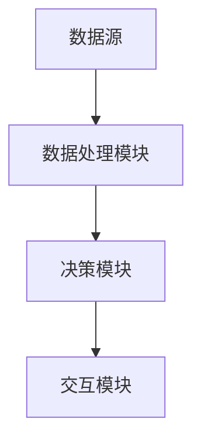
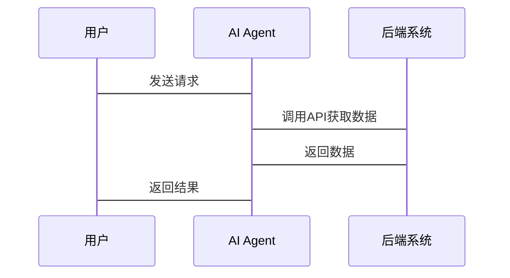

                 


# AI Agent的安全性设计：防御攻击和隐私保护

> 关键词：AI Agent, 安全防御, 隐私保护, 加密算法, 系统架构, 人工智能

> 摘要：本文深入探讨了AI Agent的安全性设计，重点分析了防御攻击和隐私保护的核心技术与实践。通过系统化的结构，从基本概念到实际应用，详细阐述了AI Agent面临的安全威胁、隐私保护策略、安全防御机制、系统架构设计以及项目实战案例。文章结合理论与实践，为读者提供了全面的技术指导和解决方案。

---

# 第1章: AI Agent的核心概念与技术背景

## 1.1 AI Agent的定义与技术特点

### 1.1.1 AI Agent的定义

AI Agent（人工智能代理）是指能够感知环境、自主决策并执行任务的智能实体。它具备以下核心特点：

- **自主性**：能够在没有外部干预的情况下独立运作。
- **反应性**：能够实时感知环境变化并做出响应。
- **学习能力**：通过数据和经验不断优化自身的决策能力。
- **交互性**：能够与用户或其他系统进行自然交互。

### 1.1.2 AI Agent的技术特点

AI Agent的设计依赖于多种人工智能技术，包括：

- **机器学习**：用于模式识别和决策优化。
- **自然语言处理（NLP）**：实现与人类的自然语言交互。
- **知识图谱**：构建领域知识以支持决策。
- **推理引擎**：基于知识和规则进行逻辑推理。

### 1.1.3 AI Agent的应用场景

AI Agent广泛应用于多个领域，例如：

- **智能助手**：如Siri、Alexa，帮助用户完成日常任务。
- **推荐系统**：根据用户行为推荐个性化内容。
- **自动化系统**：在工业生产中实现自动监控和控制。

## 1.2 AI Agent的背景与发展趋势

### 1.2.1 人工智能与AI Agent的演进

人工智能技术的快速发展推动了AI Agent的演进。从最初的简单规则引擎到现在的深度学习模型，AI Agent的能力不断提升。

### 1.2.2 当前AI Agent技术的发展趋势

- **智能化**：结合深度学习和强化学习，提升决策能力。
- **实时性**：优化响应速度，适应实时交互需求。
- **安全性**：加强安全防护，保护用户隐私。

### 1.2.3 AI Agent在各领域的应用现状

AI Agent已在金融、医疗、教育等领域展现出强大的应用潜力。例如，在金融领域，AI Agent可以用于实时欺诈检测和风险评估。

---

# 第2章: AI Agent面临的安全威胁与隐私问题

## 2.1 AI Agent的安全威胁分析

### 2.1.1 恶意攻击

AI Agent可能面临多种恶意攻击，包括：

- **注入攻击**：攻击者通过输入非法数据，破坏系统正常运行。
- **数据劫持**：窃取AI Agent处理的数据，获取敏感信息。
- **拒绝服务攻击（DoS）**：通过消耗资源使系统无法正常运行。

### 2.1.2 隐私泄露问题

AI Agent在处理用户数据时，可能因以下原因导致隐私泄露：

- **数据滥用**：未经授权的数据使用。
- **数据窃取**：黑客攻击获取数据。
- **数据泄露**：因疏忽或漏洞导致数据外泄。

## 2.2 AI Agent的隐私保护挑战

### 2.2.1 数据隐私的核心问题

- **数据所有权**：明确数据的归属和使用权限。
- **数据匿名化**：通过技术手段去除数据中的个人身份信息。

### 2.2.2 用户隐私与数据安全的平衡

在确保功能的同时，如何平衡隐私保护与数据利用是关键挑战。

### 2.2.3 法律法规的影响

如GDPR（通用数据保护条例）等法规对数据处理提出了严格要求，AI Agent的设计需符合相关法律。

---

# 第3章: AI Agent的安全防御机制

## 3.1 基于访问控制的安全机制

### 3.1.1 访问控制模型

- **基于角色的访问控制（RBAC）**：通过角色和权限管理访问权限。
- **基于属性的访问控制（ABAC）**：根据属性动态调整访问权限。

### 3.1.2 加密技术

- **数据加密**：使用对称加密（如AES）或非对称加密（如RSA）保护数据。
- **数据完整性验证**：通过哈希函数确保数据未被篡改。

### 3.1.3 身份认证

- **多因素认证（MFA）**：结合多种认证方式提高安全性。
- **零知识证明**：验证身份而不泄露额外信息。

## 3.2 基于隐私保护的防御策略

### 3.2.1 数据匿名化处理

- **数据脱敏**：在不泄露个人身份的前提下，对数据进行处理。

### 3.2.2 数据最小化原则

- **最小必要原则**：仅收集实现功能所需的最少数据。

---

# 第4章: AI Agent的隐私保护技术

## 4.1 数据加密与隐私保护

### 4.1.1 同态加密

- **定义**：允许在加密数据上执行计算，结果与对明文计算相同。
- **应用**：用于隐私保护下的数据处理。

### 4.1.2 安多方计算（SMC）

- **定义**：在不泄露各方数据的情况下，协同完成计算。

## 4.2 数据匿名化与隐私保护

### 4.2.1 数据匿名化技术

- **数据混淆**：通过随机化或其他技术破坏数据关联性。
- **K-anonymity**：确保数据在至少K个个体中不可区分。

---

# 第5章: AI Agent的安全架构与系统设计

## 5.1 系统架构设计

### 5.1.1 功能模块划分

- **数据处理模块**：负责数据的收集、处理和存储。
- **决策模块**：基于数据做出决策。
- **交互模块**：与用户或其他系统进行交互。

### 5.1.2 架构图



## 5.2 接口设计与交互流程

### 5.2.1 API接口设计

- **RESTful API**：常用HTTP方法（GET、POST、PUT、DELETE）进行数据交互。

### 5.2.2 交互流程



---

# 第6章: 项目实战——构建一个安全的AI Agent

## 6.1 环境搭建

- **工具安装**：安装Python、TensorFlow、Flask等框架。
- **依赖管理**：使用pip安装所需的库。

## 6.2 核心代码实现

### 6.2.1 数据加密模块

```python
import AES

def encrypt_data(data, key):
    cipher = AES.new(key, AES.MODE_ECB)
    return cipher.encrypt(data)
```

### 6.2.2 身份认证模块

```python
from flask import Flask
from flask_httpauth import HTTPBasicAuth

app = Flask(__name__)
auth = HTTPBasicAuth()

@app.route('/')
@auth.login_required
def protected():
    return "Protected route"
```

## 6.3 案例分析与优化

### 6.3.1 案例分析

通过具体案例，分析AI Agent在实际应用中的安全性和隐私保护效果。

### 6.3.2 优化建议

- **定期安全审计**：检查系统漏洞。
- **更新加密算法**：应对不断变化的攻击手段。

---

# 第7章: 总结与最佳实践

## 7.1 总结

AI Agent的安全性设计需要综合考虑技术实现、系统架构和隐私保护等多个方面。

## 7.2 最佳实践

- **定期安全培训**：提升开发人员的安全意识。
- **遵循数据最小化原则**：仅收集必要的数据。
- **使用经过验证的库和框架**：减少潜在的安全风险。

## 7.3 小结

AI Agent的安全性设计是一个复杂而重要的任务，需要结合多种技术手段，确保系统的安全性和用户隐私的保护。

---

# 作者：AI天才研究院 & 禅与计算机程序设计艺术

