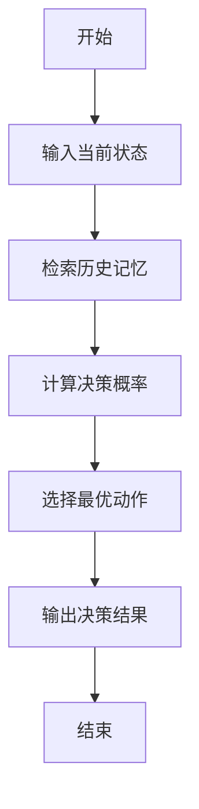
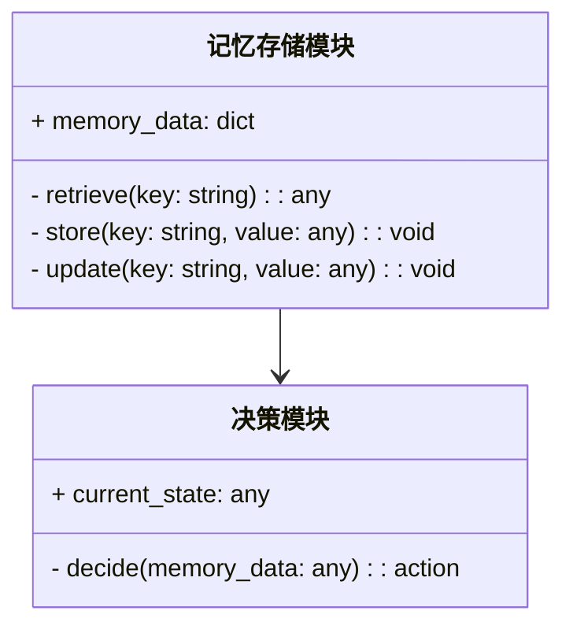
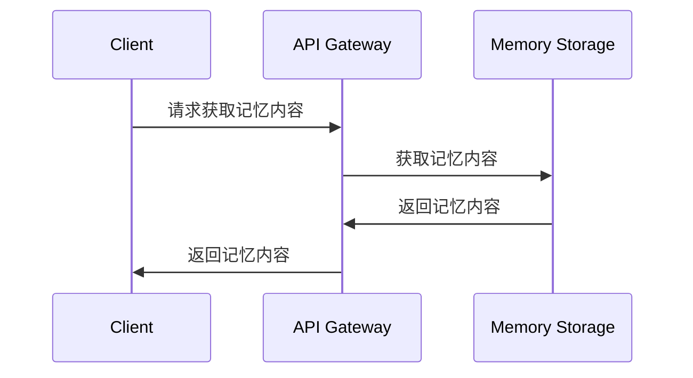

                 


# AI Agent的记忆机制：设计与实现

> 关键词：AI Agent，记忆机制，算法原理，系统设计，项目实战

> 摘要：AI Agent的记忆机制是实现智能决策和自主学习的核心技术之一。本文从AI Agent的记忆机制的基本概念、核心问题、算法原理、系统架构到项目实战，全面分析和探讨了AI Agent记忆机制的设计与实现。通过对记忆机制的数学模型、算法流程、系统架构以及具体案例的详细阐述，本文为读者提供了一套完整的AI Agent记忆机制解决方案。

---

# 第一部分: AI Agent记忆机制的背景与核心概念

## 第1章: AI Agent与记忆机制概述

### 1.1 AI Agent的基本概念

#### 1.1.1 AI Agent的定义与特点
- **定义**: AI Agent（智能体）是指在环境中能够感知并自主行动以实现目标的实体。
- **特点**: 智能性、自主性、反应性、主动性。

#### 1.1.2 AI Agent的分类与应用场景
- **分类**: 基于任务型AI Agent、服务型AI Agent、自主型AI Agent。
- **应用场景**: 智能助手、自动驾驶、机器人控制、推荐系统。

#### 1.1.3 AI Agent与传统程序的区别
- **智能性**: AI Agent具备学习和推理能力，而传统程序依赖固定的规则。
- **自主性**: AI Agent能够自主决策，而传统程序需要外部干预。
- **适应性**: AI Agent能够根据环境变化调整行为，而传统程序无法做到。

### 1.2 记忆机制在AI Agent中的作用

#### 1.2.1 记忆机制的基本概念
- **定义**: AI Agent的记忆机制是指智能体在与环境交互过程中，存储和检索相关信息的能力。
- **作用**: 提供决策所需的历史信息，增强智能体的智能性和自主性。

#### 1.2.2 记忆机制的核心问题与挑战
- **核心问题**: 记忆内容的选择、存储、检索和更新。
- **挑战**: 如何高效存储和检索信息，如何处理信息的过时性和冗余性。

#### 1.2.3 记忆机制在AI Agent中的应用价值
- **提升决策能力**: 通过记忆机制，AI Agent能够更好地理解当前环境和历史信息，从而做出更优的决策。
- **增强自主性**: 记忆机制使AI Agent能够基于历史经验进行推理和判断，从而实现更复杂的任务。

## 第2章: AI Agent记忆机制的背景与问题背景

### 2.1 AI Agent的记忆机制问题背景

#### 2.1.1 AI Agent的智能决策需求
- **智能决策的必要性**: AI Agent需要根据环境信息做出合理的决策。
- **记忆机制的必要性**: 记忆机制为智能决策提供了历史信息支持。

#### 2.1.2 记忆机制在智能决策中的重要性
- **历史信息的支持**: 记忆机制能够存储和检索历史信息，为当前决策提供参考。
- **经验的积累**: 记忆机制能够积累经验，从而提高AI Agent的智能性。

#### 2.1.3 当前AI Agent记忆机制的局限性
- **存储容量限制**: 记忆机制的存储容量有限，难以处理大规模信息。
- **信息检索效率**: 信息检索效率低下，影响决策的实时性。

### 2.2 AI Agent记忆机制的核心问题

#### 2.2.1 记忆的内容与范围
- **记忆内容**: 包括环境信息、任务目标、历史行为等。
- **记忆范围**: 需要根据任务需求确定记忆的深度和广度。

#### 2.2.2 记忆的存储与检索
- **存储方式**: 可以采用数据库、知识图谱等多种方式存储记忆。
- **检索策略**: 需要设计高效的检索算法，确保快速获取所需信息。

#### 2.2.3 记忆的更新与维护
- **更新机制**: 需要定期更新记忆内容，确保信息的准确性和时效性。
- **维护策略**: 需要设计合理的维护策略，避免信息过载和冗余。

## 第3章: AI Agent记忆机制的核心概念与联系

### 3.1 核心概念原理

#### 3.1.1 记忆机制的数学模型
- **数学模型**: 记忆机制可以通过向量、矩阵等数学工具进行建模。
- **模型的作用**: 通过数学模型描述记忆的存储和检索过程。

#### 3.1.2 记忆机制的算法原理
- **算法原理**: 记忆机制的实现依赖于特定的算法，如记忆增强网络、强化学习等。
- **算法的作用**: 算法决定了记忆内容的存储、检索和更新方式。

#### 3.1.3 记忆机制与AI Agent行为的关系
- **行为驱动**: AI Agent的行为决策依赖于记忆机制提供的信息。
- **行为反馈**: AI Agent的行为结果会影响记忆内容的更新和优化。

### 3.2 核心概念属性特征对比表

| **属性**       | **描述**                                                                 |
|----------------|--------------------------------------------------------------------------|
| 内容类型       | 包括环境信息、任务目标、历史行为等                                         |
| 存储方式       | 数据库、知识图谱、神经网络等                                               |
| 检索效率       | 高效检索算法能够快速获取所需信息                                           |
| 更新频率       | 根据任务需求定期更新记忆内容                                               |
| 信息准确性     | 依赖于存储和检索算法的准确性                                               |

### 3.3 ER实体关系图架构

```mermaid
erd
    title 记忆机制实体关系图
    Student {
        id: int
        name: string
        memory: Memory
    }
    Memory {
        id: int
        content: string
        timestamp: datetime
    }
    学生 ↔ 记忆内容
```

---

# 第二部分: AI Agent记忆机制的算法原理与实现

## 第4章: AI Agent记忆机制的算法原理

### 4.1 记忆增强网络模型

#### 4.1.1 模型的基本结构
- **基本结构**: 记忆增强网络模型由记忆单元和处理单元组成。
- **记忆单元**: 负责存储和检索记忆内容。
- **处理单元**: 负责对记忆内容进行处理和分析。

#### 4.1.2 模型的输入与输出
- **输入**: 当前环境信息和历史记忆内容。
- **输出**: 基于记忆内容的决策结果。

#### 4.1.3 模型的训练与优化
- **训练数据**: 包括历史记忆内容和对应的决策结果。
- **优化目标**: 提高记忆内容的存储和检索效率。

### 4.2 基于强化学习的记忆机制

#### 4.2.1 强化学习的基本原理
- **基本原理**: 强化学习通过奖励机制，使智能体学习如何做出最优决策。
- **应用**: 在记忆机制中，强化学习可以用于优化记忆内容的存储和检索策略。

#### 4.2.2 记忆机制在强化学习中的应用
- **应用**: 将记忆内容作为强化学习的输入，提高决策的准确性和效率。

#### 4.2.3 强化学习算法的改进与优化
- **改进方向**: 提高强化学习算法的收敛速度和稳定性。
- **优化策略**: 通过记忆机制优化强化学习的决策过程。

### 4.3 基于图神经网络的记忆机制

#### 4.3.1 图神经网络的基本原理
- **基本原理**: 图神经网络通过构建图结构，对数据进行建模和分析。
- **应用**: 在记忆机制中，图神经网络可以用于构建知识图谱，提高记忆内容的关联性和准确性。

#### 4.3.2 图神经网络在记忆机制中的应用
- **应用**: 将记忆内容表示为图结构，通过图神经网络进行分析和推理。

#### 4.3.3 图神经网络的记忆机制与性能分析
- **性能分析**: 图神经网络的记忆机制能够提高记忆内容的关联性和推理能力。

## 第5章: AI Agent记忆机制的数学模型与公式

### 5.1 基本数学模型

#### 5.1.1 记忆机制的数学表达式
- **表达式**: $$M = \{ (s_t, a_t, r_t) | t \in [1, T] \}$$
  其中，$s_t$ 表示状态，$a_t$ 表示动作，$r_t$ 表示奖励。

#### 5.1.2 记忆内容的表示方法
- **表示方法**: 使用向量或矩阵表示记忆内容。
- **向量表示**: $$s_t = [s_{t1}, s_{t2}, ..., s_{tn}]$$

#### 5.1.3 记忆检索的概率模型
- **概率模型**: $$P(a_t | s_t, M) = \frac{exp(\theta \cdot s_t)}{\sum_{i=1}^{n} exp(\theta \cdot s_{ti})}$$

### 5.2 记忆机制的算法流程

#### 5.2.1 算法流程图的绘制



#### 5.2.2 算法流程的详细说明
- **步骤1**: 输入当前状态。
- **步骤2**: 检索与当前状态相关的历史记忆。
- **步骤3**: 基于历史记忆计算决策概率。
- **步骤4**: 选择最优动作。
- **步骤5**: 输出决策结果。

#### 5.2.3 算法流程的优化与改进
- **优化方向**: 提高检索效率和决策准确性。
- **改进策略**: 通过强化学习优化决策概率计算。

### 5.3 具体案例分析

#### 5.3.1 案例背景介绍
- **案例名称**: 基于记忆增强网络的智能助手。
- **应用场景**: 个人任务管理。

#### 5.3.2 案例的数学模型建立
- **数学模型**: 使用记忆增强网络模型，构建记忆内容的向量表示。

#### 5.3.3 案例的算法实现与结果分析
- **算法实现**: 基于记忆增强网络模型，实现记忆内容的存储和检索。
- **结果分析**: 提高了决策的准确性和效率。

---

# 第三部分: AI Agent记忆机制的系统架构与设计

## 第6章: AI Agent记忆机制的系统架构设计

### 6.1 问题场景介绍

#### 6.1.1 系统目标
- **目标**: 设计一个高效的AI Agent记忆机制，支持智能决策和自主学习。

#### 6.1.2 问题分析
- **问题**: 如何实现高效的记忆存储、检索和更新。

### 6.2 系统功能设计

#### 6.2.1 领域模型设计
- **领域模型**: 使用Mermaid类图描述系统功能模块。



#### 6.2.2 系统架构设计
- **系统架构**: 使用Mermaid架构图描述系统架构。

```mermaid
archi
    title AI Agent记忆机制系统架构
    Client --> API Gateway
    API Gateway --> Memory Storage
    Memory Storage --> Decision Module
    Decision Module --> Client
```

#### 6.2.3 系统接口设计
- **接口设计**: 设计RESTful API接口，支持记忆内容的存储、检索和更新。

#### 6.2.4 系统交互设计
- **交互设计**: 使用Mermaid序列图描述系统交互流程。



## 第7章: AI Agent记忆机制的系统实现

### 7.1 项目实战

#### 7.1.1 环境安装
- **环境要求**: Python 3.8以上版本，安装必要的库，如numpy、pandas、tensorflow等。

#### 7.1.2 系统核心实现源代码

```python
class MemoryStorage:
    def __init__(self):
        self.memory_data = {}

    def retrieve(self, key):
        return self.memory_data.get(key, None)

    def store(self, key, value):
        self.memory_data[key] = value

    def update(self, key, value):
        self.memory_data[key] = value

class DecisionModule:
    def __init__(self, memory_storage):
        self.memory_storage = memory_storage

    def decide(self, current_state):
        memory_content = self.memory_storage.retrieve(current_state)
        if memory_content:
            return self.make_decision(memory_content)
        else:
            return self.default_decision()

    def make_decision(self, memory_content):
        # 具体决策逻辑
        pass

    def default_decision(self):
        # 默认决策逻辑
        pass
```

#### 7.1.3 代码实现与解读
- **代码实现**: 如上所示，实现记忆存储模块和决策模块。
- **代码解读**: 内存存储模块负责存储和检索记忆内容，决策模块基于记忆内容做出决策。

#### 7.1.4 案例分析与结果展示
- **案例分析**: 通过具体案例分析，展示记忆机制在AI Agent中的应用。
- **结果展示**: 展示记忆内容的存储、检索和更新过程。

---

# 第四部分: 总结与展望

## 第8章: 总结与展望

### 8.1 核心内容总结
- **总结**: AI Agent的记忆机制是实现智能决策和自主学习的核心技术之一。通过合理的记忆存储、检索和更新策略，可以显著提高AI Agent的智能性和自主性。

### 8.2 未来展望
- **研究方向**: 探索更高效的记忆存储和检索算法，优化记忆机制的性能。
- **技术趋势**: 结合强化学习和图神经网络，进一步提升记忆机制的智能性和效率。

### 8.3 注意事项与最佳实践
- **注意事项**: 在设计记忆机制时，需要考虑存储容量、检索效率和信息准确性等问题。
- **最佳实践**: 建议结合具体应用场景，选择合适的记忆机制实现方式，定期优化和维护记忆内容。

---

# 作者：AI天才研究院/AI Genius Institute & 禅与计算机程序设计艺术 /Zen And The Art of Computer Programming

