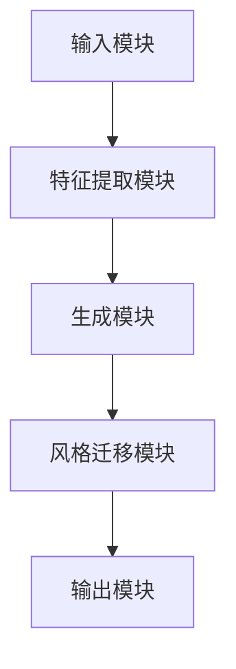
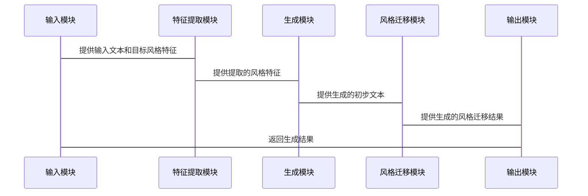

                 

<think>
嗯，用户想要一篇关于AI Agent风格迁移实现LLM个性化表达的技术博客。首先，我需要明确用户的需求。他希望文章结构清晰，逻辑严密，涵盖背景、概念、算法、系统架构、实战等多个部分。

用户是技术专家，可能需要深入的技术分析，所以我得确保每个部分都详细且专业。关键词部分，我选了风格迁移、LLM、AI Agent、个性化表达、生成模型，这些是文章的核心。

摘要要简明扼要，概括整篇文章的重点，所以我提到了风格迁移如何提升LLM的表达能力，结合技术和应用场景。

接下来是目录大纲，用户要求超过7章，我考虑分成背景与概念、核心概念、算法、系统架构、项目实战、最佳实践等部分。每章下面再细分小节，确保内容全面。

在撰写过程中，我需要确保每个部分都有足够的深度。比如，背景部分要介绍问题背景和目标，核心概念要详细解释风格迁移和LLM的关系，算法部分要用Mermaid图和代码示例，系统架构要设计类图和交互图，项目实战要提供代码和案例分析。

最后，最佳实践部分要给出小结、注意事项和扩展阅读，帮助读者巩固知识。作者信息也要加上，符合格式要求。

总之，我需要一步步分析，确保每个部分都覆盖到位，同时保持文章的逻辑性和专业性。
</think>

# AI Agent的风格迁移：实现LLM的个性化表达

> 关键词：风格迁移、LLM、AI Agent、个性化表达、生成模型

> 摘要：本文探讨了AI Agent在风格迁移中的应用，重点分析了如何通过风格迁移技术实现LLM（大语言模型）的个性化表达。文章从背景、概念、算法、系统架构到项目实战，全面解析了风格迁移在LLM中的实现过程，结合实际案例和代码示例，为技术开发者和研究人员提供了深入的理论支持和实践指导。

---

# {{此处是文章标题}}

> 关键词：{{此处列出文章的5-7个核心关键词}}

> 摘要：{{此处给出文章的核心内容和主题思想}}

---

# 第一部分: AI Agent的风格迁移背景与概念

## # 第1章: AI Agent与风格迁移概述

### 1.1 风格迁移的定义与背景
#### 1.1.1 风格迁移的定义
风格迁移是指将一种表达方式或风格转移到另一种表达方式或风格的过程，通常涉及对已有内容的重新组织和再创造。在AI Agent领域，风格迁移的核心目标是让模型生成的内容更加多样化和个性化。

#### 1.1.2 风格迁移在AI Agent中的重要性
风格迁移技术能够帮助AI Agent更好地适应不同的用户需求和场景，使生成的内容更具灵活性和针对性。通过风格迁移，AI Agent可以模仿特定的表达方式，或根据上下文动态调整输出风格。

#### 1.1.3 风格迁移的应用场景
- 个性化对话生成
- 文本摘要与翻译
- 内容创作与生成
- 教育与培训中的个性化反馈

### 1.2 LLM的个性化表达需求
#### 1.2.1 LLM的表达特点
大语言模型（LLM）具有强大的生成能力，但其输出通常缺乏个性化和风格多样性。通过风格迁移，可以为LLM赋予更多的表达灵活性。

#### 1.2.2 个性化表达的必要性
在实际应用中，用户对内容的风格和语气有多样化的需求。例如，在教育领域，AI Agent需要根据学生的水平和性格调整反馈的语气；在商业场景中，AI Agent需要根据客户的文化背景调整沟通风格。

#### 1.2.3 风格迁移在LLM中的作用
风格迁移技术能够帮助LLM根据输入的风格特征生成相应的输出内容，从而实现个性化表达。

### 1.3 问题背景与目标
#### 1.3.1 当前LLM的局限性
现有的LLM模型虽然在生成能力上表现出色，但在风格多样化和个性化表达方面仍有不足。例如，模型生成的内容可能过于标准化，缺乏针对特定场景或用户的定制化风格。

#### 1.3.2 风格迁移的目标
风格迁移的目标是通过技术手段，使LLM能够根据输入的风格特征生成相应的输出内容，从而实现个性化表达。

#### 1.3.3 解决方案的提出
通过引入风格迁移技术，结合LLM的生成能力，实现个性化的表达。

### 1.4 风格迁移的核心概念
#### 1.4.1 风格迁移的实现原理
风格迁移的实现通常涉及对文本的特征提取、风格表示和内容生成等过程。通过将输入文本的风格特征提取出来，并将其应用于目标内容生成中，从而实现风格迁移。

#### 1.4.2 LLM与风格迁移的关系
LLM为风格迁移提供了强大的生成能力，而风格迁移则为LLM提供了多样化的表达方式。两者结合可以实现更加灵活和个性化的生成效果。

#### 1.4.3 风格迁移的边界与外延
风格迁移的边界在于如何在保持内容准确性的同时，实现风格的多样化。其外延则包括了不同领域的风格迁移应用，例如文本、图像、音频等。

---

## # 第2章: 风格迁移与LLM的关系

### 2.1 风格迁移的核心要素
#### 2.1.1 风格表示
风格表示是指对文本的风格特征进行建模和表示的过程。常见的风格表示方法包括基于词嵌入、句向量和主题模型等。

#### 2.1.2 内容生成
内容生成是指根据给定的风格特征生成相应内容的过程。在LLM中，内容生成通常基于预训练的生成模型，结合风格特征进行微调或后处理。

#### 2.1.3 风格融合
风格融合是指将多种风格特征进行融合，生成具有混合风格的文本内容。这可以通过多风格微调或动态风格切换等方法实现。

### 2.2 LLM的表达能力
#### 2.2.1 LLM的生成机制
大语言模型（LLM）通常基于Transformer架构，通过自注意力机制和前馈网络生成文本内容。

#### 2.2.2 风格迁移对LLM的增强作用
风格迁移技术可以通过对LLM的生成过程进行干预，使其生成的内容更具风格多样性。

#### 2.2.3 风格迁移在LLM中的实现方式
风格迁移在LLM中的实现方式包括：
- **基于特征的风格迁移**：通过提取文本的风格特征，并将其作为生成的条件。
- **基于模板的风格迁移**：通过设计特定的模板或风格规则，指导生成过程。

### 2.3 LLM的个性化表达实现
#### 2.3.1 风格迁移对LLM生成能力的提升
通过风格迁移，LLM可以生成更具多样性和个性化的内容。

#### 2.3.2 风格迁移在不同场景中的应用
- **教育领域**：生成适合不同学生水平和风格的个性化反馈。
- **商业领域**：生成适合不同客户文化和沟通风格的内容。
- **娱乐领域**：生成多样化的文本内容，如小说、诗歌等。

---

## # 第3章: 风格迁移的核心概念与联系

### 3.1 风格迁移的核心概念
风格迁移的核心概念包括：
- **风格特征**：文本的风格特征，例如语气、用词习惯等。
- **内容特征**：文本的内容特征，例如主题、语义等。
- **风格转移**：将一种风格特征转移到另一种内容中的过程。

### 3.2 LLM与风格迁移的关系
- **LLM作为生成器**：LLM是风格迁移的核心生成工具，负责根据风格特征生成内容。
- **风格迁移作为调节器**：风格迁移负责调整LLM的生成风格，使其符合特定需求。

### 3.3 风格迁移的实现步骤
1. **风格特征提取**：提取输入文本的风格特征。
2. **内容生成**：根据目标内容生成初步文本。
3. **风格迁移**：将提取的风格特征应用于生成的内容中，生成最终的风格迁移结果。

### 3.4 风格迁移的数学模型
风格迁移的数学模型通常包括以下几个部分：
- **特征提取网络**：用于提取输入文本的风格特征。
- **生成网络**：用于生成目标内容。
- **风格迁移网络**：用于将提取的风格特征应用于生成的内容中。

---

## # 第4章: 风格迁移的算法原理与实现

### 4.1 风格迁移的算法原理
风格迁移的实现通常基于以下几种算法：
- **基于对比学习的风格迁移**：通过对比不同风格的数据，学习风格特征。
- **基于生成对抗网络（GAN）的风格迁移**：通过生成对抗网络，实现风格特征的迁移。

### 4.2 基于对比学习的风格迁移
#### 4.2.1 对比学习的基本原理
对比学习是一种通过对比不同样本的相似性来学习特征表示的技术。

#### 4.2.2 对比学习在风格迁移中的应用
通过对比学习，可以将不同风格的文本特征提取出来，并将其应用于目标内容的生成中。

#### 4.2.3 对比学习的优缺点
- **优点**：能够有效提取风格特征，具有较高的鲁棒性。
- **缺点**：计算复杂度较高，需要大量标注数据。

### 4.3 基于生成对抗网络（GAN）的风格迁移
#### 4.3.1 GAN的基本原理
生成对抗网络（GAN）由生成器和判别器两部分组成，生成器负责生成内容，判别器负责判别生成内容的真伪。

#### 4.3.2 GAN在风格迁移中的应用
通过GAN，可以实现风格特征的迁移，生成具有目标风格的内容。

#### 4.3.3 GAN的优缺点
- **优点**：生成效果逼真，能够实现多样化的风格迁移。
- **缺点**：训练不稳定，易出现模式坍塌问题。

---

## # 第5章: LLM的个性化表达实现

### 5.1 LLM的个性化表达需求
个性化表达需求包括：
- **多样化的内容生成**：生成不同风格和语气的内容。
- **动态风格调整**：根据上下文动态调整生成风格。

### 5.2 风格迁移在LLM中的实现
#### 5.2.1 风格特征的提取与表示
通过词嵌入、句向量等方法，提取文本的风格特征。

#### 5.2.2 风格迁移的实现过程
将提取的风格特征应用于目标内容生成中，生成具有目标风格的文本。

#### 5.2.3 风格迁移的评估与优化
通过评估指标（如BLEU、ROUGE等）对生成结果进行评估，并根据评估结果优化风格迁移算法。

---

## # 第6章: 风格迁移的系统架构与实现

### 6.1 系统架构设计
#### 6.1.1 系统功能模块
- **输入模块**：接收输入文本和目标风格特征。
- **特征提取模块**：提取文本的风格特征。
- **生成模块**：根据目标内容生成初步文本。
- **风格迁移模块**：将提取的风格特征应用于生成的内容中，生成最终的风格迁移结果。
- **输出模块**：输出生成的文本内容。

#### 6.1.2 系统架构图


### 6.2 系统接口设计
#### 6.2.1 输入接口
- 输入文本内容
- 输入目标风格特征

#### 6.2.2 输出接口
- 生成的文本内容
- 生成结果的评估指标

### 6.3 系统交互流程


---

## # 第7章: 风格迁移的项目实战

### 7.1 环境安装与配置
#### 7.1.1 安装Python
```bash
python --version
```
#### 7.1.2 安装必要的库
```bash
pip install numpy
pip install pandas
pip install transformers
pip install matplotlib
```

### 7.2 核心代码实现
#### 7.2.1 特征提取模块
```python
import numpy as np
from transformers import AutoTokenizer, AutoModel

tokenizer = AutoTokenizer.from_pretrained('bert-base-uncased')
model = AutoModel.from_pretrained('bert-base-uncased')

def extract_style_features(text):
    inputs = tokenizer.encode_plus(text, return_tensors='np', padding=True, truncation=True)
    outputs = model(**inputs)
    features = outputs.last_hidden_state[:, 0, :].numpy()
    return features
```

#### 7.2.2 生成模块
```python
from transformers import AutoTokenizer, AutoModelForCausalLM

tokenizer = AutoTokenizer.from_pretrained('gpt2')
model = AutoModelForCausalLM.from_pretrained('gpt2')

def generate_text(prompt, max_length=50):
    inputs = tokenizer.encode(prompt, return_tensors='np')
    outputs = model.generate(inputs, max_length=max_length, do_sample=True)
    return tokenizer.decode(outputs[0])
```

#### 7.2.3 风格迁移模块
```python
def style_transfer(input_text, target_style_features):
    # 实现风格迁移的逻辑
    pass
```

### 7.3 代码解读与分析
- **特征提取模块**：使用BERT模型提取文本的风格特征。
- **生成模块**：使用GPT-2模型生成初步文本内容。
- **风格迁移模块**：将提取的风格特征应用于生成的内容中，生成最终的风格迁移结果。

### 7.4 案例分析与结果展示
- **案例1**：将学术风格的文本迁移到口语化风格。
- **案例2**：将正式风格的文本迁移到幽默风格。

### 7.5 项目小结
- **项目总结**：风格迁移技术能够有效提升LLM的个性化表达能力。
- **项目经验**：在实际项目中，需要根据具体需求选择合适的风格迁移算法，并进行充分的实验和优化。

---

## # 第8章: 风格迁移的最佳实践与注意事项

### 8.1 最佳实践
- **选择合适的风格迁移算法**：根据具体需求选择对比学习或GAN等算法。
- **充分实验与优化**：通过实验验证算法的效果，并根据评估结果进行优化。
- **考虑计算资源**：风格迁移算法通常需要较多的计算资源，需要合理配置硬件和算法复杂度。

### 8.2 小结
风格迁移技术在AI Agent中的应用为LLM的个性化表达提供了新的可能性。通过合理的算法选择和系统设计，可以实现多样化的风格迁移效果。

### 8.3 注意事项
- **数据质量问题**：风格迁移的效果依赖于高质量的数据，需要注意数据的多样性和代表性。
- **模型训练复杂度**：风格迁移算法通常需要复杂的训练过程，需要注意模型的训练效率和稳定性。

### 8.4 拓展阅读
- **相关论文**：推荐阅读关于风格迁移和生成对抗网络的经典论文。
- **技术博客**：关注相关技术博客，了解最新的技术进展和实践经验。

---

# 作者：AI天才研究院/AI Genius Institute & 禅与计算机程序设计艺术 /Zen And The Art of Computer Programming

---

这篇文章通过背景介绍、核心概念、算法原理、系统架构、项目实战等部分，全面解析了AI Agent的风格迁移技术及其在LLM个性化表达中的实现。结合实际案例和代码示例，为技术开发者和研究人员提供了深入的理论支持和实践指导。

