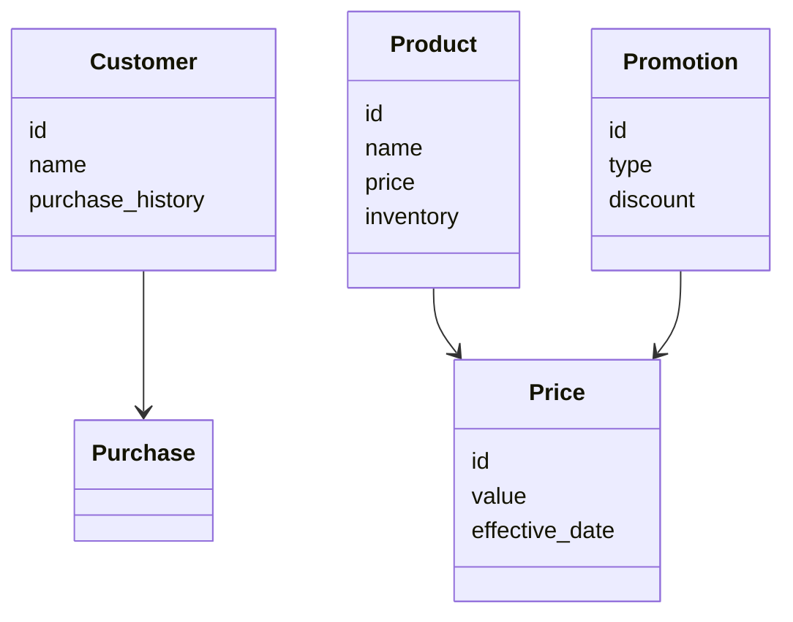

                 


# AI Agent辅助产品定价与促销策略制定的方法

> 关键词：AI Agent，产品定价，促销策略，机器学习，数据驱动决策

> 摘要：本文详细探讨了如何利用AI Agent辅助制定产品定价与促销策略。通过分析AI Agent的核心概念、算法原理、系统架构及项目实战，本文为商业决策者提供了基于AI技术的定价与促销策略优化方法。文章内容涵盖从理论到实践的各个方面，帮助读者理解并应用AI Agent在定价与促销策略中的重要作用。

---

# 第一部分: AI Agent辅助产品定价与促销策略的背景与核心概念

## 第1章: 问题背景与问题描述

### 1.1 问题背景

#### 1.1.1 传统定价与促销策略的局限性
传统的定价与促销策略依赖于人工经验或简单的统计分析，存在以下问题：
- **信息滞后**：无法实时捕捉市场变化和消费者行为。
- **决策低效**：缺乏数据支持，导致策略调整缓慢。
- **精准度不足**：难以针对不同客户群体制定个性化策略。

#### 1.1.2 数据驱动决策的兴起
随着大数据技术的普及，企业开始依赖数据进行决策优化。数据驱动决策的优势包括：
- 提高决策的准确性和及时性。
- 降低决策成本，减少试错次数。
- 支持大规模个性化服务。

#### 1.1.3 AI技术在商业决策中的应用
AI技术的快速发展使其在商业决策中的应用越来越广泛。AI Agent（智能代理）通过自动化分析和优化，能够实时响应市场变化，为定价与促销策略提供支持。

---

### 1.2 问题描述

#### 1.2.1 产品定价与促销策略的核心挑战
定价与促销策略的制定面临以下挑战：
- **市场竞争激烈**：需要快速响应竞争对手的策略。
- **客户需求多样**：不同客户群体对价格敏感度不同。
- **数据复杂性**：需要处理大量异构数据（如销售数据、客户行为数据等）。

#### 1.2.2 数据不足与决策不确定性
在某些情况下，企业可能面临数据不足的问题，例如：
- 新产品上市初期缺乏历史销售数据。
- 小众市场的数据稀缺性。

#### 1.2.3 竞争环境的动态变化
市场环境的变化（如经济波动、政策调整）会影响定价与促销策略的有效性，需要AI Agent具备动态调整能力。

---

## 第2章: AI Agent的核心概念与定义

### 2.1 AI Agent的基本原理

#### 2.1.1 AI Agent的定义与特征
AI Agent是一种能够感知环境、自主决策并执行任务的智能实体。其主要特征包括：
- **自主性**：能够在没有外部干预的情况下运行。
- **反应性**：能够实时感知环境变化并做出反应。
- **目标导向**：通过优化目标函数（如利润最大化）来制定策略。

#### 2.1.2 AI Agent在商业决策中的角色
AI Agent在定价与促销策略中的角色包括：
- **数据收集与分析**：从多源数据中提取有用信息。
- **模型构建与优化**：基于机器学习模型生成定价和促销策略。
- **策略执行与反馈**：根据实时数据调整策略并提供反馈。

#### 2.1.3 AI Agent与传统决策工具的区别
AI Agent与传统决策工具的主要区别在于：
- **自动化**：AI Agent能够自动收集数据、分析和优化，而传统工具依赖人工操作。
- **动态调整**：AI Agent能够实时调整策略，而传统工具通常需要手动更新。

---

### 2.2 AI Agent辅助定价与促销的核心要素

#### 2.2.1 数据输入与特征工程
AI Agent的输入数据包括：
- **销售数据**：如历史销售量、价格、时间等。
- **客户数据**：如客户画像、购买行为、偏好等。
- **市场数据**：如竞争对手价格、行业趋势等。

特征工程是将原始数据转换为适合模型输入的特征，例如：
- **价格敏感性特征**：计算客户对价格变化的敏感程度。
- **时间特征**：分析销售周期性（如季节性）。

#### 2.2.2 模型构建与优化算法
AI Agent需要构建能够预测价格和促销效果的模型，常用的算法包括：
- **回归模型**：用于预测销售量与价格的关系。
- **分类模型**：用于分类客户群体并制定个性化策略。
- **强化学习**：用于动态调整策略以最大化收益。

#### 2.2.3 策略生成与执行反馈
策略生成是基于模型预测结果制定具体的定价和促销方案，执行反馈则通过实时数据调整策略。

---

## 第3章: AI Agent辅助定价与促销的边界与外延

### 3.1 定价与促销策略的边界

#### 3.1.1 定价策略的类型与适用场景
定价策略包括：
- **成本导向定价**：基于产品成本制定价格。
- **需求导向定价**：基于市场需求和竞争情况制定价格。
- **动态定价**：根据实时市场数据调整价格。

#### 3.1.2 促销策略的类型与适用场景
促销策略包括：
- **折扣促销**：直接降价吸引消费者。
- **赠品促销**：通过赠送小礼品增加购买量。
- **捆绑销售**：将多个产品组合销售以提高销量。

#### 3.1.3 边界条件对AI Agent的影响
AI Agent的性能受到数据质量和模型假设的影响，例如：
- 数据不足可能导致模型预测不准确。
- 模型假设与实际市场情况不符可能导致策略执行失败。

---

### 3.2 AI Agent的外延与扩展

#### 3.2.1 多产品定价与促销的复杂性
多产品定价需要考虑产品之间的相互影响，例如：
- **产品替代性**：同类产品之间的竞争关系。
- **产品互补性**：相关产品之间的协同效应。

#### 3.2.2 多渠道销售的协调问题
AI Agent需要协调多渠道销售策略，例如：
- **线上与线下渠道的定价差异**。
- **渠道间的价格协调**。

#### 3.2.3 不同市场环境下的策略调整
AI Agent需要根据市场环境的变化动态调整策略，例如：
- **经济波动**：在经济衰退期降低价格以刺激需求。
- **政策变化**：遵守新的法规和税收政策。

---

# 第二部分: AI Agent辅助定价与促销的核心概念与联系

## 第4章: AI Agent辅助定价与促销的核心概念与联系

### 4.1 核心概念原理

#### 4.1.1 数据驱动的定价与促销策略
数据驱动的定价与促销策略依赖于数据分析技术，例如：
- **客户细分**：基于客户特征制定个性化策略。
- **市场趋势分析**：基于市场数据预测未来趋势。

#### 4.1.2 强化学习在动态定价中的应用
强化学习是一种通过试错优化策略的算法，适合应用于动态定价场景。

---

### 4.2 核心概念属性对比表

| 概念           | 特性                     |
|----------------|--------------------------|
| 数据输入       | 多源性、实时性、异构性   |
| 模型构建       | 复杂性、动态性、可解释性 |
| 策略生成       | 个性化、动态调整、可优化 |

---

### 4.3 ER实体关系图

```mermaid
erd
    Customer
    Product
    Price
    Promotion
    Sales
```

---

## 第5章: AI Agent辅助定价与促销的核心要素

### 5.1 数据输入与特征工程

#### 5.1.1 数据输入
AI Agent的输入数据包括：
- **销售数据**：销售量、价格、时间。
- **客户数据**：客户画像、购买行为。
- **市场数据**：竞争对手价格、行业趋势。

#### 5.1.2 特征工程
特征工程的关键步骤包括：
- 数据清洗与预处理。
- 特征选择与降维。
- 特征转换与工程化。

---

### 5.2 模型构建与优化算法

#### 5.2.1 算法原理
常用的算法包括：
- **线性回归**：用于预测销售量与价格的关系。
- **决策树**：用于分类客户群体并制定个性化策略。
- **强化学习**：用于动态调整策略以最大化收益。

#### 5.2.2 算法流程图
```mermaid
graph TD
    A[开始] -> B[数据输入]
    B -> C[特征工程]
    C -> D[模型训练]
    D -> E[策略生成]
    E -> F[执行反馈]
    F -> G[结束]
```

---

## 第6章: AI Agent辅助定价与促销的系统架构设计

### 6.1 问题场景介绍

#### 6.1.1 电商定价系统
一个典型的电商定价系统需要实时调整价格以应对市场竞争和客户需求。

---

### 6.2 系统功能设计

#### 6.2.1 领域模型类图


---

### 6.3 系统架构设计

#### 6.3.1 系统架构图
```mermaid
graph TD
    UI -> API Gateway
    API Gateway -> AI Agent
    AI Agent -> Database
    Database -> Model
```

---

## 第7章: AI Agent辅助定价与促销的项目实战

### 7.1 环境安装

#### 7.1.1 安装Python
```bash
python --version
pip install --upgrade pip
```

#### 7.1.2 安装TensorFlow
```bash
pip install tensorflow
pip install scikit-learn
pip install pandas
```

---

### 7.2 系统核心实现

#### 7.2.1 核心代码
```python
import pandas as pd
from sklearn.tree import DecisionTreeRegressor
from tensorflow.keras import Sequential
from tensorflow.keras.layers import Dense

# 数据预处理
data = pd.read_csv('pricing_data.csv')
X = data[['feature1', 'feature2']]
y = data['target']

# 模型训练
model = Sequential()
model.add(Dense(64, activation='relu', input_dim=X.shape[1]))
model.add(Dense(1))
model.compile(optimizer='adam', loss='mse')
model.fit(X, y, epochs=100, batch_size=32)

# 策略生成
predictions = model.predict(X)
```

---

### 7.3 项目小结

通过以上步骤，我们可以看到AI Agent在定价与促销策略中的强大能力。通过实时数据处理和模型优化，AI Agent能够显著提高定价和促销策略的效率和效果。

---

# 第三部分: AI Agent辅助定价与促销的最佳实践

## 第8章: 最佳实践与注意事项

### 8.1 数据质量的重要性
- 数据的完整性和准确性直接影响模型的性能。
- 数据的实时性是动态定价的关键。

### 8.2 模型的可解释性
- 可解释性是模型在实际应用中获得信任的重要因素。
- 需要平衡模型的准确性和可解释性。

### 8.3 持续优化
- 定期回顾和优化模型，以适应市场变化。
- 结合人工干预，确保策略的合理性。

---

## 第9章: 总结与展望

### 9.1 总结
通过本文的详细讲解，我们可以看到AI Agent在定价与促销策略中的巨大潜力。AI Agent不仅能够提高决策效率，还能通过实时数据分析优化策略执行。

### 9.2 展望
未来，随着AI技术的进一步发展，AI Agent在商业决策中的应用将更加广泛和深入。我们需要持续关注技术进步，以更好地利用AI Agent提升企业的竞争力。

---

# 作者：AI天才研究院/AI Genius Institute & 禅与计算机程序设计艺术 /Zen And The Art of Computer Programming

