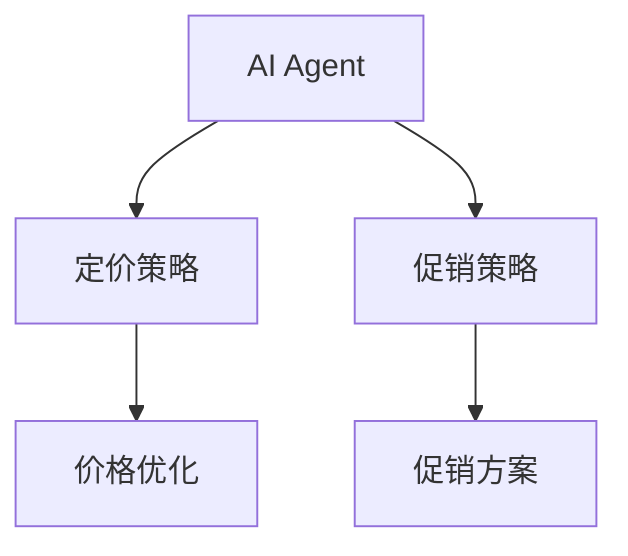
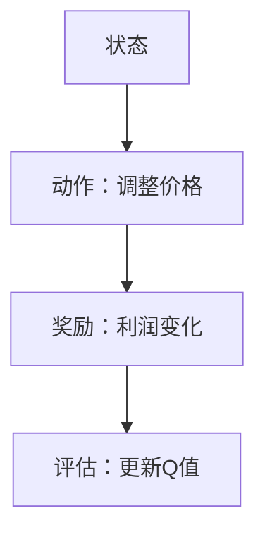
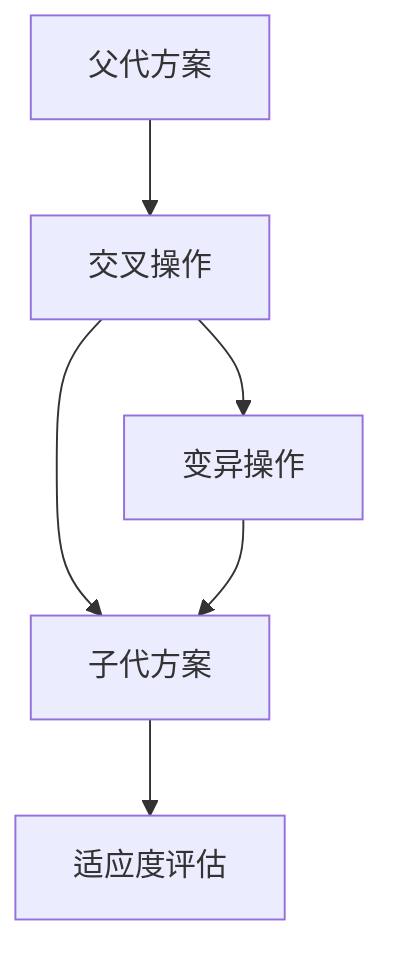
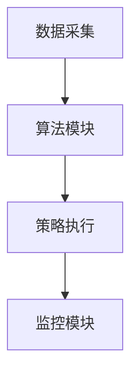
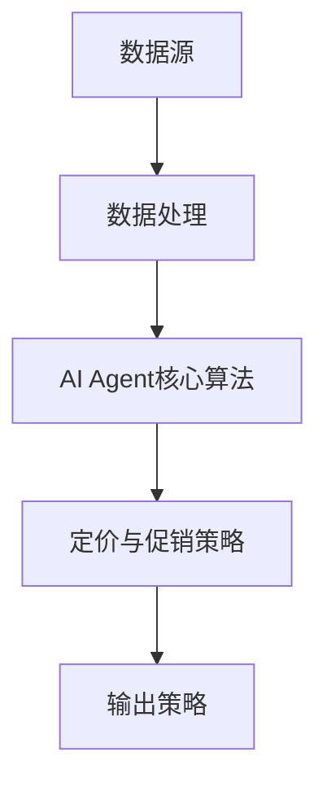

                 


# AI Agent辅助企业产品定价与促销策略制定

> 关键词：AI Agent，定价策略，促销策略，强化学习，遗传算法，系统架构

> 摘要：本文探讨了AI Agent如何辅助企业制定定价与促销策略，结合实际案例分析，详细讲解了定价和促销策略的基本概念、AI Agent在其中的核心算法、系统架构设计，以及实战项目和最佳实践。通过数学模型和图表的辅助，文章深入浅出地展示了AI Agent在定价和促销中的应用价值和未来发展趋势。

---

# 第一部分：AI Agent与企业定价促销概述

## 第1章：AI Agent与企业定价促销的背景

### 1.1 AI Agent的基本概念

AI Agent（人工智能代理）是指能够感知环境、自主决策并执行任务的智能实体。它通过数据驱动的方法，利用机器学习算法优化企业决策过程，提高效率和准确性。AI Agent在商业领域的应用越来越广泛，特别是在定价和促销策略的制定中，能够帮助企业在复杂多变的市场环境中做出最优决策。

### 1.2 AI Agent在企业中的应用背景

传统的企业定价和促销策略往往依赖于人工经验或简单的统计分析，难以应对市场环境的快速变化和消费者需求的多样化。随着大数据和人工智能技术的发展，AI Agent逐渐成为企业优化定价和促销策略的重要工具。通过实时数据采集、分析和预测，AI Agent能够快速调整策略，提高企业的竞争力。

### 1.3 本章小结

本章介绍了AI Agent的基本概念和其在企业定价促销中的应用背景，强调了AI Agent在优化定价和促销策略中的重要性。

---

## 第2章：AI Agent辅助定价与促销的核心概念

### 2.1 定价策略的制定过程

定价策略是企业实现利润最大化的重要手段。常见的定价方法包括成本导向定价法、需求导向定价法和竞争导向定价法。AI Agent可以通过分析市场需求和竞争环境，优化定价策略，确保价格既具有竞争力又能够覆盖成本并实现利润。

#### 2.1.1 成本导向定价法

成本导向定价法以产品成本为主要依据，考虑固定成本和变动成本，加上预期利润，确定产品价格。公式为：$P = C + M$，其中$P$为产品价格，$C$为总成本，$M$为利润。

#### 2.1.2 需求导向定价法

需求导向定价法基于市场需求和消费者 willingness-to-pay（WTP）来确定价格。通过分析需求弹性，AI Agent可以优化价格以最大化收益。例如，使用需求弹性模型：$E_p = \frac{\%ΔQ}{\%ΔP}$，其中$E_p$为价格弹性，$Q$为需求量，$P$为价格。

#### 2.1.3 竞争导向定价法

竞争导向定价法以竞争对手的定价为参考，结合自身产品优势和市场定位，制定具有竞争力的价格。AI Agent可以通过分析竞争对手的历史数据和市场动态，提供实时价格建议。

### 2.2 促销策略的制定过程

促销策略旨在通过短期的价格优惠或营销活动，吸引消费者购买，提升销售量和市场份额。常见的促销方式包括折扣促销、满减促销和秒杀促销。

#### 2.2.1 折扣促销

折扣促销通过直接降低产品价格，吸引消费者购买。折扣率的计算公式为：$D = \frac{\text{原价} - \text{促销价}}{\text{原价}} \times 100\%$。

#### 2.2.2 满减促销

满减促销是通过设定消费门槛，消费者在达到一定金额后可以享受额外折扣。例如，满200减50，满500减150等。这种促销方式可以提高客单价，促进消费者增加购买量。

#### 2.2.3 秒杀促销

秒杀促销是一种限时优惠活动，通常在特定时间段内提供极低的价格，吸引消费者快速下单。秒杀活动的优惠力度大，但时间短，可以有效提升产品的曝光度和销售量。

### 2.3 AI Agent在定价与促销中的角色

AI Agent在定价和促销策略中的作用主要体现在数据分析与预测、策略优化与推荐以及实时监控与调整三个方面。

#### 2.3.1 数据分析与预测

AI Agent通过收集和分析销售数据、市场趋势、消费者行为等信息，预测未来的价格走势和需求变化，为定价和促销策略的制定提供数据支持。

#### 2.3.2 策略优化与推荐

基于机器学习算法，AI Agent能够优化定价和促销策略，推荐最佳的价格和促销方案，帮助企业在竞争激烈的市场中占据优势。

#### 2.3.3 实时监控与调整

AI Agent实时监控市场动态和消费者反馈，根据数据变化动态调整定价和促销策略，确保策略的有效性和适应性。

### 2.4 核心概念对比分析

#### 2.4.1 定价策略与促销策略的对比表格

| 定价策略       | 促销策略       |
|----------------|----------------|
| 长期价格制定   | 短期价格优惠   |
| 目标：利润最大化 | 目标：提升销量   |
| 基于成本和需求 | 基于市场需求    |

#### 2.4.2 AI Agent在定价与促销中的实体关系图



---

## 第3章：AI Agent辅助定价与促销的算法原理

### 3.1 强化学习算法在定价中的应用

强化学习是一种通过试错方式优化决策的算法。在定价策略中，强化学习可以通过不断调整价格，观察销售量和利润的变化，优化价格模型。以下是强化学习的简单流程：

1. 初始化价格为基准价格。
2. 根据当前价格，预测销售量和利润。
3. 根据预测结果调整价格，接近最优价格。
4. 重复以上步骤，直到达到收敛条件。

### 3.2 遗传算法在促销策略中的应用

遗传算法是一种基于自然选择和遗传机制的优化算法。在促销策略中，可以将不同的促销方案视为基因，通过选择、交叉和变异操作优化促销方案。以下是遗传算法的简单流程：

1. 初始化促销方案集合。
2. 评估每个方案的适应度（如销售量）。
3. 根据适应度进行选择，保留适应度高的方案。
4. 对选中的方案进行交叉和变异，生成新的方案。
5. 重复步骤2-4，直到达到收敛条件。

### 3.3 算法流程图

#### 3.3.1 强化学习算法流程图



#### 3.3.2 遗传算法流程图



### 3.4 算法数学模型

#### 3.4.1 强化学习模型

强化学习通过Q-learning算法优化定价策略，Q值的更新公式为：

$$ Q(s, a) = Q(s, a) + \alpha [r + \gamma Q(s', a') - Q(s, a)] $$

其中，$\alpha$为学习率，$\gamma$为折扣率，$s$为当前状态，$a$为动作，$r$为奖励，$s'$为下一个状态。

#### 3.4.2 遗传算法模型

遗传算法通过适应度函数评估促销方案的优劣，适应度函数可以是销售量、利润或转化率的函数。例如，适应度函数可以表示为：

$$ f = a \times \text{销售量} + b \times \text{利润} + c \times \text{转化率} $$

其中，$a$、$b$、$c$为权重系数。

---

## 第4章：AI Agent辅助定价与促销的系统设计

### 4.1 系统架构设计

AI Agent辅助定价与促销的系统架构包括数据采集模块、算法模块、策略执行模块和监控模块。

#### 4.1.1 系统模块划分



#### 4.1.2 系统架构图



### 4.2 系统功能设计

#### 4.2.1 数据采集模块

数据采集模块负责收集市场数据、竞争对手数据和消费者行为数据，为AI Agent提供决策支持。

#### 4.2.2 算法模块

算法模块包括定价算法和促销算法，分别用于优化定价策略和促销方案。

#### 4.2.3 策略执行模块

策略执行模块将优化后的定价和促销策略应用于实际业务，实时调整策略。

#### 4.2.4 监控模块

监控模块实时跟踪策略执行效果，收集反馈数据，为后续优化提供依据。

---

## 第5章：AI Agent辅助定价与促销的系统实现

### 5.1 项目实战

#### 5.1.1 环境安装

需要安装Python、TensorFlow、Scikit-learn和Mermaid工具。

#### 5.1.2 核心代码实现

以下是定价策略优化的Python代码示例：

```python
import numpy as np
import tensorflow as tf

# 定价数据
prices = np.array([10, 20, 30], dtype=np.float32)
rewards = np.array([5, 10, 8], dtype=np.float32)

# 初始化Q值
Q = tf.Variable(tf.random.uniform([3, 1], 0, 1), dtype=tf.float32)

# 强化学习模型
def update_Q(price_index, reward):
    with tf.GradientTape() as tape:
        Q_value = Q[price_index]
        loss = tf.nn.compute_loss(reward - Q_value)
    gradients = tape.gradient(loss, Q)
    optimizer = tf.keras.optimizers.Adam(learning_rate=0.1)
    optimizer.apply_gradients(zip(gradients, [Q]))
    return Q.numpy()

# 训练模型
for i in range(100):
    for idx, price in enumerate(prices):
        reward = rewards[idx]
        Q = update_Q(idx, reward)
print(Q.numpy())
```

---

## 第6章：总结与展望

### 6.1 本章总结

本文详细探讨了AI Agent在企业定价与促销策略中的应用，通过强化学习和遗传算法优化定价和促销策略，结合系统设计和项目实战，展示了AI Agent在商业中的巨大潜力。

### 6.2 未来展望

随着AI技术的不断发展，AI Agent在定价和促销中的应用将更加智能化和个性化。未来的研究方向包括多目标优化、实时动态调整和多场景应用。

### 6.3 最佳实践 Tips

- 定价策略与促销策略需要结合企业实际情况灵活调整。
- 数据质量和实时性是AI Agent决策的关键。
- 系统架构设计需要考虑可扩展性和可维护性。

---

# 作者：AI天才研究院/AI Genius Institute & 禅与计算机程序设计艺术 /Zen And The Art of Computer Programming

---

希望这篇文章能够为您提供关于AI Agent在企业定价与促销策略中的深入见解，并为实际应用提供有价值的参考。

