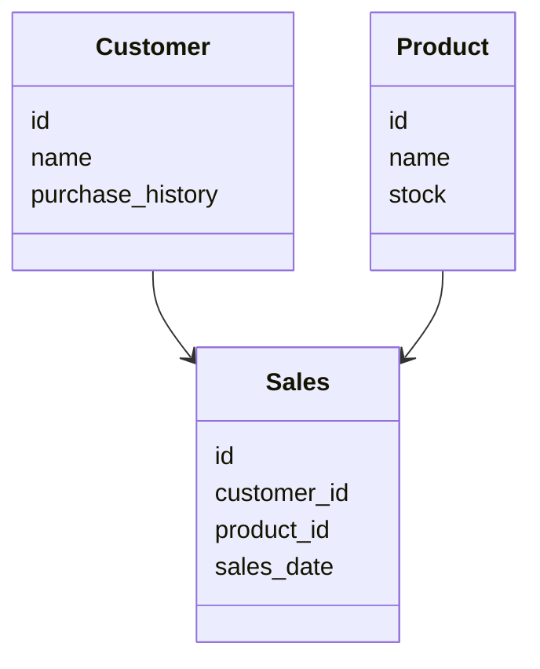
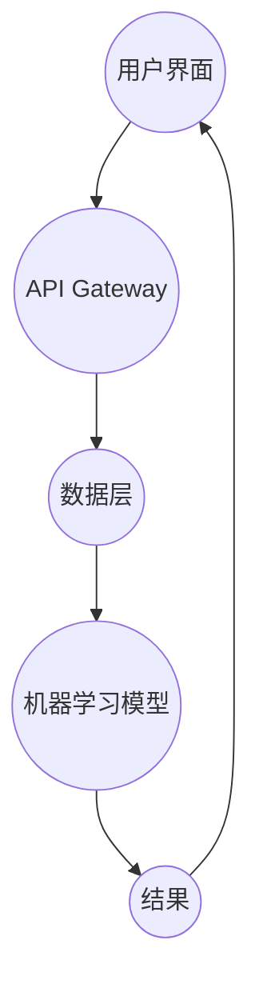
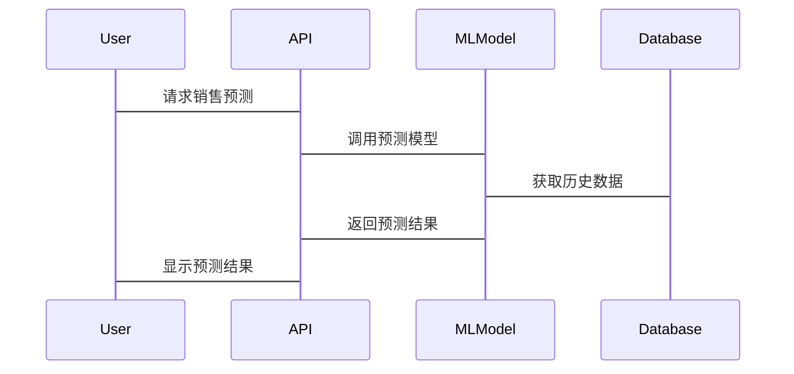

                 

<think>
好，我现在要写一篇关于AI Agent辅助企业商业智能与数据驱动决策的技术博客。首先，我需要明确文章的核心主题：AI Agent如何帮助企业实现商业智能和数据驱动的决策。

接下来，我应该从AI Agent的基本概念开始，介绍什么是AI Agent，它的特点和与传统软件的区别。这部分需要简单明了，让读者能够理解AI Agent的基本概念。

然后，我需要讨论商业智能和数据驱动决策的背景。这里，我需要解释商业智能的定义、作用，以及为什么数据驱动决策对企业如此重要。同时，我还需要说明AI Agent在商业智能中的应用前景，让读者了解AI Agent的实际价值。

接下来，我需要详细讲解AI Agent的核心原理与技术。这部分包括AI Agent的工作流程、不同类型和核心技术。我需要通过图表和示例来说明这些概念，确保读者能够清晰理解。

在应用部分，我需要探讨AI Agent在企业中的具体应用，比如销售预测、客户分析、供应链优化等。同时，我还需要说明AI Agent如何与数据驱动决策相结合，帮助企业做出更明智的决策。

接下来，算法原理和实现是关键部分。我需要介绍常见的AI Agent算法，如强化学习和监督学习，并通过Mermaid流程图和Python代码来展示它们的实现过程。此外，我还需要解释数学模型，例如Q-learning的公式，帮助读者理解算法的内在逻辑。

系统分析与架构设计也是不可忽视的部分。我需要描述系统的工作场景，设计领域模型和系统架构图，展示系统的各个模块和它们之间的交互。同时，我还需要提供接口设计和交互序列图，说明系统的运行流程。

在项目实战部分，我需要选择一个具体的案例，比如电商客服系统，展示如何部署和实现AI Agent。我需要详细说明环境的安装步骤，提供核心代码，并解读代码的功能。通过实际案例分析，帮助读者理解AI Agent的实际应用。

最后，我需要总结全文，强调最佳实践、注意事项和未来的发展方向。这部分可以包括一些实用的建议，比如数据隐私保护、模型优化等，帮助读者在实际应用中避免常见问题。

总体来说，我需要确保文章结构清晰，内容详实，既有理论分析，又有实际案例，让读者能够全面理解AI Agent在企业中的应用和价值。
</think>

# AI Agent辅助企业商业智能与数据驱动决策

> 关键词：AI Agent, 商业智能, 数据驱动决策, 企业智能系统, 人工智能, 强化学习

> 摘要：本文将详细探讨AI Agent如何辅助企业实现商业智能与数据驱动决策。从AI Agent的基本概念到其在企业中的具体应用，从算法原理到系统架构设计，再到项目实战，我们将全面解析AI Agent在商业智能中的重要角色和实际价值。

---

# 第一部分: AI Agent与商业智能概述

## 第1章: AI Agent的基本概念

### 1.1 AI Agent的定义与特点
#### 1.1.1 AI Agent的定义
AI Agent（人工智能代理）是一种智能系统，能够感知环境、自主决策并执行任务，以实现特定目标。它能够通过数据输入、状态感知和行为输出与外部环境交互。

#### 1.1.2 AI Agent的核心特点
1. **自主性**：能够在没有外部干预的情况下运行。
2. **反应性**：能够实时感知环境变化并做出反应。
3. **目标导向**：所有行为都以实现特定目标为导向。
4. **学习能力**：能够通过经验或数据不断优化自身行为。

#### 1.1.3 AI Agent与传统软件的区别
| 特性 | AI Agent | 传统软件 |
|------|----------|----------|
| 自主性 | 高       | 低       |
| 学习能力 | 高       | 无       |
| 决策能力 | 高       | 无       |
| 环境感知 | 高       | 无       |

### 1.2 商业智能与数据驱动决策的背景
#### 1.2.1 商业智能的定义与作用
商业智能（Business Intelligence, BI）是指通过收集、整合、分析企业数据，为企业决策提供支持的过程。其作用包括数据可视化、预测分析和业务优化。

#### 1.2.2 数据驱动决策的必要性
在数据量爆炸的时代，企业需要依赖数据而非直觉进行决策。数据驱动决策能够提高决策的准确性和效率，为企业创造更大的价值。

#### 1.2.3 AI Agent在商业智能中的应用前景
AI Agent能够通过自动化数据处理、实时分析和智能决策，显著提升商业智能系统的效率和效果。它在客户行为分析、市场预测等领域具有广阔的应用前景。

---

## 第2章: AI Agent的核心原理与技术

### 2.1 AI Agent的工作原理
#### 2.1.1 信息感知与数据收集
AI Agent通过传感器、API或其他数据源获取环境数据。例如，电商平台的AI Agent可以通过API获取最新的销售数据和客户反馈。

#### 2.1.2 数据分析与决策制定
AI Agent利用机器学习算法对数据进行分析，生成决策建议。例如，使用监督学习模型预测客户购买行为。

#### 2.1.3 行动执行与反馈优化
AI Agent根据决策建议执行操作，并根据反馈优化自身模型。例如，调整广告投放策略以提高点击率。

### 2.2 AI Agent的类型与分类
#### 2.2.1 基于规则的AI Agent
通过预定义的规则进行决策，适用于规则明确的场景。例如，简单的库存补货系统。

#### 2.2.2 基于模型的AI Agent
基于数学模型进行决策，适用于复杂场景。例如，使用强化学习模型进行投资组合优化。

#### 2.2.3 基于学习的AI Agent
通过机器学习算法不断优化决策策略。例如，使用深度学习模型进行自然语言处理任务。

### 2.3 AI Agent的核心技术
#### 2.3.1 自然语言处理
用于理解和生成自然语言文本。例如，客服AI Agent通过自然语言处理理解客户问题并生成回答。

#### 2.3.2 机器学习
用于数据分析和模式识别。例如，使用随机森林算法进行客户 churn 预测。

#### 2.3.3 数据挖掘与分析
用于从海量数据中提取有价值的信息。例如，使用聚类分析识别客户群体。

---

## 第3章: AI Agent在企业中的应用

### 3.1 企业商业智能的核心需求
#### 3.1.1 数据分析与可视化
通过BI工具将数据可视化，帮助管理层快速理解数据。例如，使用Tableau进行销售数据可视化。

#### 3.1.2 预测与决策支持
利用AI Agent进行市场趋势预测和决策支持。例如，使用时间序列模型预测未来销售量。

#### 3.1.3 业务流程优化
通过AI Agent优化业务流程，提高效率。例如，使用强化学习优化供应链管理。

### 3.2 AI Agent在商业智能中的应用场景
#### 3.2.1 销售预测与客户分析
通过分析历史销售数据和客户行为，预测未来销售趋势并进行客户细分。

#### 3.2.2 供应链优化与库存管理
通过实时监控库存和物流数据，优化供应链管理。例如，使用强化学习优化库存补货策略。

#### 3.2.3 市场趋势分析与竞争情报
通过分析市场数据和竞争对手信息，制定市场策略。例如，使用NLP技术分析竞争对手的产品评论。

### 3.3 AI Agent与企业数据驱动决策的结合
#### 3.3.1 数据驱动决策的定义与特点
数据驱动决策是指基于数据而非直觉进行决策。其特点是实时性、科学性和可追溯性。

#### 3.3.2 AI Agent在数据驱动决策中的作用
AI Agent能够快速处理海量数据，提供实时决策支持。例如，使用实时数据分析优化广告投放策略。

#### 3.3.3 数据驱动决策的实施步骤
1. 数据收集与整合
2. 数据分析与建模
3. 决策支持与执行
4. 反馈优化

---

## 第4章: AI Agent的算法原理与实现

### 4.1 常见AI Agent算法概述
#### 4.1.1 强化学习
通过试错机制优化决策策略。例如，使用Q-learning算法优化投资组合。

#### 4.1.2 监督学习
通过标注数据进行分类或回归预测。例如，使用随机森林模型预测客户 churn。

#### 4.1.3 非监督学习
通过无监督方法发现数据中的模式。例如，使用聚类分析进行客户群体细分。

### 4.2 强化学习在AI Agent中的应用
#### 4.2.1 Q-learning算法
Q-learning是一种基于值的强化学习算法，通过更新Q值表来优化决策策略。

#### 4.2.2 Deep Q-Network (DQN)算法
DQN算法通过神经网络近似Q值函数，适用于高维状态空间的问题。

#### 4.2.3 算法实现步骤
1. 定义状态、动作和奖励空间。
2. 初始化Q值表或神经网络模型。
3. 环境交互并更新Q值。
4. 策略优化与测试。

### 4.3 监督学习在AI Agent中的应用
#### 4.3.1 分类算法
通过分类模型预测类别标签。例如，使用SVM模型分类客户群体。

#### 4.3.2 回归算法
通过回归模型预测连续值。例如，使用线性回归模型预测房价。

#### 4.3.3 算法实现步骤
1. 数据预处理与特征提取。
2. 训练模型并进行验证。
3. 模型优化与部署。

---

## 第5章: 系统分析与架构设计

### 5.1 问题场景介绍
我们以一个电商平台为例，设计一个AI Agent辅助商业智能的系统。该系统需要实现客户行为分析、销售预测和库存管理等功能。

### 5.2 系统功能设计
#### 5.2.1 领域模型设计


#### 5.2.2 系统架构设计


#### 5.2.3 系统接口设计
| 接口名称 | 输入 | 输出 |
|----------|------|------|
| get_customer_info | customer_id | customer_info |
| predict_sales | product_id | predicted_sales |
| update_stock | product_id | stock_updated |

#### 5.2.4 系统交互设计


---

## 第6章: 项目实战

### 6.1 环境安装
1. 安装Python和必要的库（如TensorFlow、Scikit-learn）。
2. 安装数据可视化工具（如Matplotlib、Seaborn）。
3. 安装BI工具（如Tableau、Power BI）。

### 6.2 核心代码实现
#### 6.2.1 Q-learning算法实现
```python
import numpy as np

class QLearning:
    def __init__(self, state_space, action_space, learning_rate=0.1, gamma=0.9):
        self.q_table = np.zeros(state_space)
        self.learning_rate = learning_rate
        self.gamma = gamma

    def update(self, state, action, reward, next_state):
        self.q_table[state][action] = self.q_table[state][action] * (1 - self.learning_rate) + \
                                      self.learning_rate * (reward + self.gamma * np.max(self.q_table[next_state]))
```

#### 6.2.2 数据分析与可视化
```python
import pandas as pd
import matplotlib.pyplot as plt

data = pd.read_csv('sales_data.csv')
data.plot('date', 'sales')
plt.show()
```

### 6.3 案例分析与解读
以电商平台为例，部署AI Agent进行客户行为分析和销售预测。通过实际数据展示AI Agent如何优化库存管理和广告投放策略。

---

## 第7章: 最佳实践与总结

### 7.1 最佳实践
1. 数据隐私保护：确保数据处理符合相关法律法规。
2. 模型优化：定期更新模型以适应数据变化。
3. 人机协作：AI Agent应与人类专家协同工作，而非完全替代人类。

### 7.2 小结
AI Agent通过自动化数据处理和智能决策，显著提升了企业商业智能系统的效率和效果。随着技术的不断发展，AI Agent将在企业数据驱动决策中发挥越来越重要的作用。

---

## 作者：AI天才研究院/AI Genius Institute & 禅与计算机程序设计艺术 /Zen And The Art of Computer Programming

