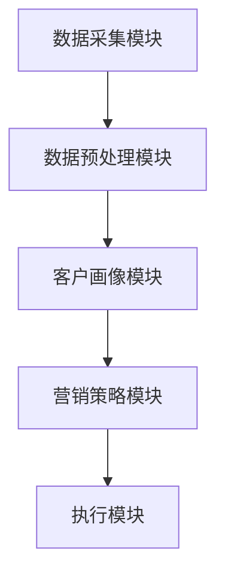

                 


# AI Agent辅助企业客户细分与精准营销

## 关键词：AI Agent, 客户细分, 精准营销, 数据驱动, 机器学习, 系统架构

## 摘要：  
本文探讨AI Agent如何辅助企业进行客户细分与精准营销，从背景、原理到系统架构，再到项目实战，详细分析AI Agent在营销中的应用，提供深度见解和实践指导。

---

## 第一部分: AI Agent与客户细分的背景介绍

### 第1章: 问题背景与描述

#### 1.1 问题背景  
客户细分是企业营销的核心，传统方法依赖人工经验，效率低、成本高且难以实时调整。企业需要更高效、动态的解决方案。

#### 1.2 问题描述  
传统客户细分存在以下问题：  
- 数据量大，人工处理耗时  
- 细分标准单一，难以捕捉复杂需求  
- 难以实时调整策略  

#### 1.3 AI Agent的作用  
AI Agent通过自动化数据处理、实时反馈和策略优化，解决传统方法的局限性。

#### 1.4 边界与外延  
AI Agent主要负责数据分析与策略生成，不涉及实际营销执行。

---

## 第二部分: AI Agent的核心概念与原理

### 第2章: 核心概念与原理

#### 2.1 AI Agent的基本原理  
AI Agent通过任务分解、意图识别和策略优化，实现客户细分与精准营销。

#### 2.2 核心概念对比  
| 比较维度 | AI Agent | 传统营销工具 |
|----------|-----------|---------------|
| 数据处理 | 自动化学习 | 依赖人工经验   |
| 精准度   | 高         | 低             |
| 实时性   | 实时调整   | 周期性调整     |

---

## 第三部分: AI Agent辅助客户细分的数学模型

### 第3章: 聚类算法原理

#### 3.1 K-means算法  
K-means是一种常用的聚类算法，步骤如下：  
1. 初始化质心  
2. 计算每个点的最近质心  
3. 更新质心位置  
4. 重复直到收敛  

**代码示例**：  
```python
from sklearn.cluster import KMeans

# 初始化模型
kmeans = KMeans(n_clusters=3, random_state=0)
# 训练模型
kmeans.fit(X)
# 预测聚类结果
clusters = kmeans.predict(X)
```

---

## 第四部分: AI Agent辅助精准营销的系统架构

### 第4章: 系统架构设计

#### 4.1 功能模块设计  
- 数据采集模块：从CRM等系统获取数据  
- 客户画像模块：生成客户画像  
- 营销策略模块：制定精准策略  

#### 4.2 系统架构图  


---

## 第五部分: 项目实战与代码实现

### 第5章: 项目实战

#### 5.1 环境安装  
安装Python和相关库：  
```bash
pip install numpy scikit-learn matplotlib
```

#### 5.2 核心实现代码  
```python
import numpy as np
from sklearn import datasets
from sklearn.cluster import DBSCAN

# 加载数据集
X, y = datasets.load_iris(return_X_y=True)
# 初始化模型
dbscan = DBSCAN(eps=0.5, min_samples=5)
# 训练模型
dbscan.fit(X)
# 预测聚类结果
clusters = dbscan.labels_
```

---

## 第六部分: 最佳实践与总结

### 第6章: 最佳实践

#### 6.1 数据质量的重要性  
确保数据准确性和完整性，提升模型效果。

#### 6.2 模型调优  
定期更新模型，适应市场变化。

#### 6.3 伦理与隐私  
遵守数据隐私法规，保护客户信息。

### 总结与展望  
AI Agent正在改变企业营销方式，未来将更智能化和个性化。

---

## 第七部分: 参考文献与进一步阅读

### 参考文献  
1. 《机器学习实战》  
2. 《数据挖掘导论》  
3. 《Python机器学习》  

---

## 作者：AI天才研究院 & 禅与计算机程序设计艺术

