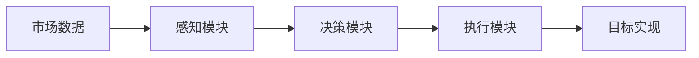
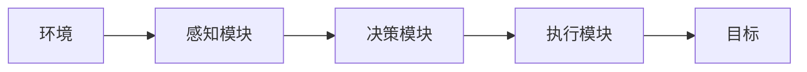
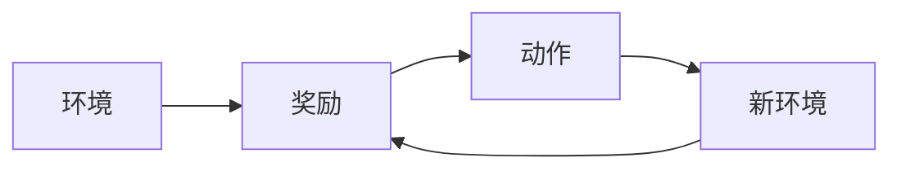
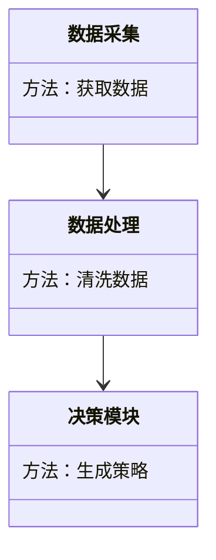
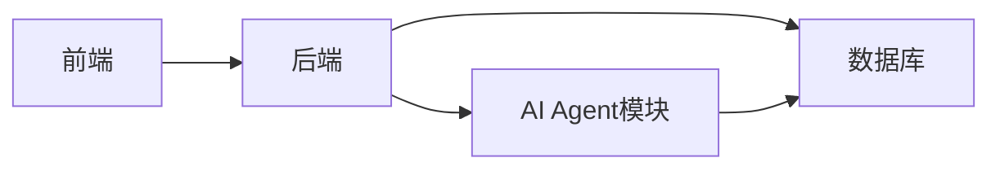
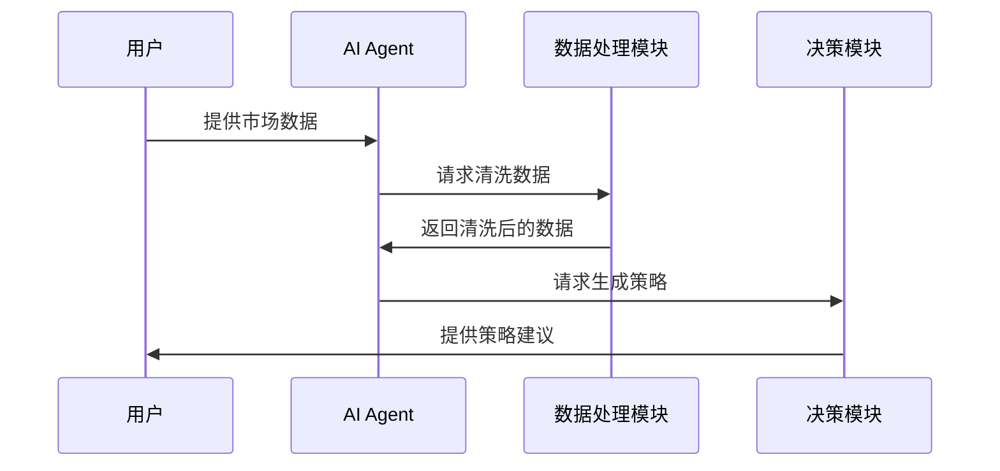

                 


# AI Agent辅助企业市场分析与战略规划

> 关键词：AI Agent，市场分析，战略规划，企业应用，算法原理，系统架构

> 摘要：本文深入探讨了AI Agent在企业市场分析与战略规划中的应用，从基本概念到技术原理，再到实际案例，全面分析了其对企业决策的支持作用。通过详细的技术解析和系统设计，展示了如何利用AI Agent提升企业的市场分析能力和战略规划效率。

---

## 第一部分: AI Agent辅助企业市场分析与战略规划背景介绍

### 第1章: AI Agent的基本概念与背景

#### 1.1 AI Agent的核心概念

##### 1.1.1 什么是AI Agent
AI Agent（人工智能代理）是一种能够感知环境、自主决策并采取行动以实现特定目标的智能体。它通过数据输入、信息处理和决策输出，为企业提供自动化、智能化的支持。

##### 1.1.2 AI Agent的核心属性
- **自主性**：无需外部干预，自主执行任务。
- **反应性**：能够实时感知环境变化并做出反应。
- **目标导向**：基于明确的目标进行决策和行动。
- **学习能力**：通过数据和经验不断优化自身行为。

##### 1.1.3 AI Agent与传统自动化工具的区别
| 属性 | AI Agent | 传统自动化工具 |
|------|-----------|----------------|
| 决策能力 | 自主学习优化 | 预定义规则执行 |
| 数据处理 | 处理复杂非结构化数据 | 处理结构化数据 |
| 环境适应 | 能够适应动态变化 | 适应性有限 |

#### 1.2 企业市场分析与战略规划的背景

##### 1.2.1 企业市场分析的重要性
市场分析是企业制定战略决策的基础，涉及市场规模、竞争对手分析、客户行为研究等方面。传统的市场分析依赖人工调研和经验判断，效率低下且容易受到主观因素影响。

##### 1.2.2 战略规划的传统方法与局限性
传统战略规划方法通常基于历史数据和专家经验，缺乏动态性和实时性。面对市场环境的快速变化，传统方法难以及时调整策略。

##### 1.2.3 AI Agent在现代企业中的应用价值
AI Agent能够实时收集、处理大量数据，提供精准的市场洞察和预测，辅助企业制定动态战略规划，提升决策效率和准确性。

### 第2章: AI Agent在企业中的应用现状

#### 2.1 AI Agent在市场分析中的应用

##### 2.1.1 数据采集与处理
AI Agent能够从多种数据源（如社交媒体、行业报告、新闻媒体）实时采集数据，并通过自然语言处理技术进行清洗和结构化。

##### 2.1.2 市场趋势预测
利用机器学习算法，AI Agent可以分析历史数据，识别市场趋势，预测未来走势。

##### 2.1.3 竞争对手分析
通过爬取竞争对手的公开信息，AI Agent能够生成竞争分析报告，帮助企业制定差异化策略。

#### 2.2 AI Agent在战略规划中的应用

##### 2.2.1 战略目标设定
AI Agent可以根据市场分析结果，辅助企业设定科学合理的战略目标。

##### 2.2.2 资源分配优化
通过优化算法，AI Agent可以帮助企业在有限资源下最大化目标实现。

##### 2.2.3 风险评估与应对策略
AI Agent可以实时监控市场变化，评估潜在风险，并提出应对策略。

#### 2.3 当前应用中的挑战与未来趋势

##### 2.3.1 技术层面的挑战
- 数据隐私与安全
- 复杂场景下的决策准确性
- 多模态数据处理能力

##### 2.3.2 企业层面的挑战
- 技术集成与现有系统的兼容性
- 人才储备与技术能力
- 组织文化的适应性

##### 2.3.3 未来发展趋势与创新方向
- 更强的自主学习能力
- 多模态数据处理
- 更高的决策透明度

---

## 第二部分: AI Agent的核心概念与技术原理

### 第3章: AI Agent的核心概念与联系

#### 3.1 AI Agent的感知、决策与执行机制

##### 3.1.1 感知模块
感知模块负责收集和处理环境数据，包括数据清洗、特征提取和数据结构化。

##### 3.1.2 决策模块
决策模块基于感知到的数据，利用机器学习模型生成决策方案。

##### 3.1.3 执行模块
执行模块将决策方案转化为具体行动，确保目标的实现。

#### 3.2 AI Agent的实体关系与架构

##### 3.2.1 实体关系图


##### 3.2.2 架构设计


### 第4章: AI Agent的算法原理与实现

#### 4.1 强化学习算法

##### 4.1.1 强化学习流程


##### 4.1.2 算法实现
```python
class AI-Agent:
    def __init__(self, learning_rate=0.01):
        self.learning_rate = learning_rate
        self.weights = np.random.randn(4, 1)

    def感知(self, 输入):
        return 输入.dot(self.weights)

    def决策(self, 输入):
        return np.argmax(self.感知(输入))

    def执行(self, 决策):
        return 决策
```

##### 4.1.3 数学模型
$$ V = \sum_{i=1}^{n} r_i \cdot p_i $$
其中，$V$ 是价值函数，$r_i$ 是奖励，$p_i$ 是概率。

### 第5章: 系统分析与架构设计

#### 5.1 系统功能设计

##### 5.1.1 领域模型


##### 5.1.2 系统架构


#### 5.2 接口与交互设计

##### 5.2.1 接口设计
| 方法 | 描述 |
|------|------|
| get_data() | 获取市场数据 |
| process_data() | 处理数据 |
| generate_strategy() | 生成策略 |

##### 5.2.2 交互流程


---

## 第三部分: 项目实战与应用案例

### 第6章: 项目实战

#### 6.1 项目环境安装

##### 6.1.1 安装Python和依赖库
```bash
pip install numpy scikit-learn matplotlib
```

#### 6.2 核心代码实现

##### 6.2.1 AI Agent类
```python
import numpy as np
from sklearn import svm

class AI-Agent:
    def __init__(self):
        self.model = svm.SVC()

    def train(self, X, y):
        self.model.fit(X, y)

    def predict(self, X):
        return self.model.predict(X)
```

##### 6.2.2 数据处理模块
```python
def process_data(data):
    # 数据清洗和特征提取
    return processed_data
```

#### 6.3 代码应用解读

##### 6.3.1 数据处理流程
```python
raw_data = pd.read_csv('market_data.csv')
processed_data = process_data(raw_data)
model = AI-Agent()
model.train(processed_data.X, processed_data.y)
predictions = model.predict(new_data.X)
```

---

## 第四部分: 最佳实践与总结

### 第7章: 最佳实践

#### 7.1 实施AI Agent的关键步骤

1. **明确目标**：清晰定义AI Agent的目标和应用场景。
2. **数据准备**：确保数据质量，进行清洗和特征工程。
3. **算法选择**：根据问题类型选择合适的算法模型。
4. **系统集成**：与现有系统进行无缝集成，确保兼容性。
5. **持续优化**：根据反馈不断优化模型和系统。

### 第8章: 小结

AI Agent通过自动化和智能化的方式，显著提升了企业市场分析和战略规划的效率与准确性。随着技术的不断进步，AI Agent将在企业中发挥越来越重要的作用。

### 第9章: 注意事项

- 数据隐私和安全是实施AI Agent时需要重点关注的问题。
- 在复杂场景下，AI Agent的决策需要结合人类专家的判断。
- 系统的可解释性和透明度是提升用户信任的关键。

### 第10章: 拓展阅读

- 《机器学习实战》
- 《深度学习》
- 《强化学习》

---

## 作者：AI天才研究院/AI Genius Institute & 禅与计算机程序设计艺术/Zen And The Art of Computer Programming

---

以上是完整的博客文章大纲和部分详细内容，您可以根据实际需求扩展每个部分的具体内容。

