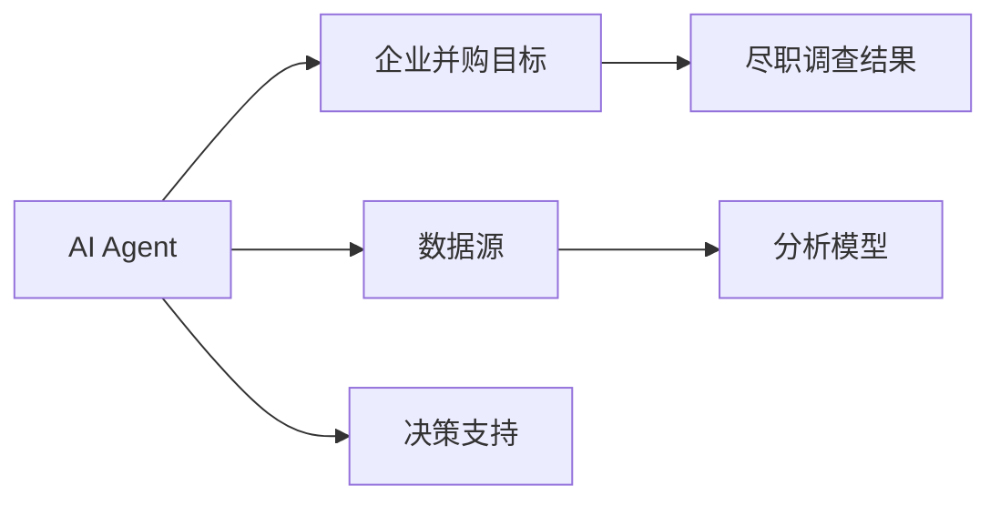
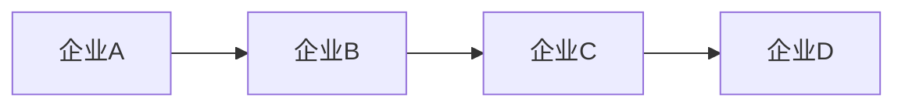
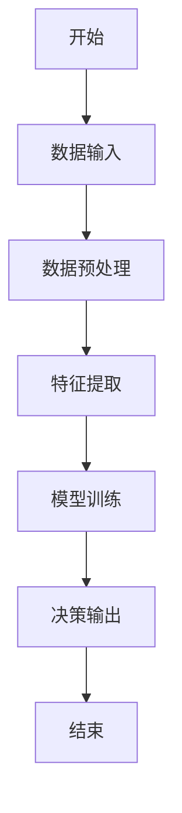
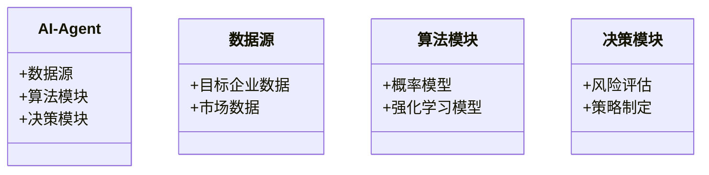
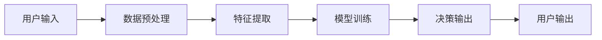
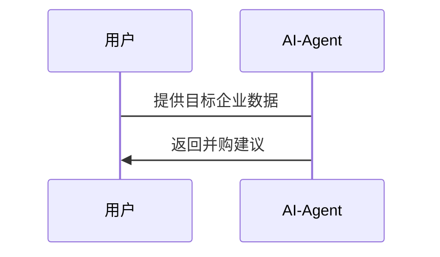

                 

<think>
好，我需要根据用户的查询生成一个技术博客文章的详细目录大纲。首先，用户希望文章标题是《AI Agent辅助企业并购分析与尽职调查》，并要求包含关键词和摘要。接着，目录结构需要有吸引人的章节标题，每个章节都要详细讲解相关知识，包括背景、核心概念、算法原理、系统架构、实战项目等。

我先从背景介绍开始，涵盖AI Agent的基本概念，企业并购的背景，以及AI Agent在其中的应用价值。这部分需要让读者理解问题的重要性。接下来，核心概念部分，我需要用表格和图表展示AI Agent的相关概念，帮助读者理解其工作原理。然后，算法部分需要详细讲解数学模型和公式，用代码示例说明。系统架构部分，我会用图表展示系统结构和接口设计，确保清晰易懂。项目实战部分，我会分步骤指导环境安装、代码实现和案例分析，让读者能够实际操作。最后，总结、注意事项和拓展阅读等内容，帮助读者巩固知识。

整个过程需要确保逻辑清晰，内容详实，同时保持语言的专业性和易懂性。我要注意每个章节的结构和内容是否覆盖用户的所有要求，避免遗漏重要部分。最后，检查格式是否符合要求，确保使用正确的标记和图表工具，如Mermaid和LaTeX，来增强文章的表现力。

完成这些步骤后，我就能为用户提供一个结构完整、内容详实的技术博客文章大纲，满足他们的需求。
</think>

# AI Agent辅助企业并购分析与尽职调查

> 关键词：AI Agent，企业并购，尽职调查，算法原理，系统架构

> 摘要：随着人工智能技术的快速发展，AI Agent在企业并购分析与尽职调查中的应用越来越广泛。本文将详细介绍AI Agent在企业并购中的作用，分析其核心算法原理，探讨系统架构设计，并通过实际案例展示AI Agent如何提升企业并购的效率与准确性。文章结构清晰，内容丰富，适合企业高管、并购顾问、技术开发者以及对人工智能感兴趣的读者阅读。

---

# 第1章: AI Agent与企业并购概述

## 1.1 AI Agent的基本概念

### 1.1.1 AI Agent的定义与特点
AI Agent（人工智能代理）是指能够感知环境、自主决策并执行任务的智能体。其核心特点包括：
- **自主性**：能够独立决策和行动。
- **反应性**：能够实时感知环境并做出反应。
- **学习能力**：通过数据和经验不断优化性能。
- **可扩展性**：能够适应不同的应用场景。

### 1.1.2 AI Agent的核心功能与应用场景
AI Agent的核心功能包括数据处理、决策支持、风险评估等。其主要应用于：
- **智能推荐**
- **自动化决策**
- **风险管理**
- **复杂问题求解**

### 1.1.3 AI Agent与企业并购的关系
AI Agent通过其强大的数据处理和分析能力，能够辅助企业在并购过程中快速评估目标企业、识别风险并制定最优决策。

## 1.2 企业并购的背景与挑战

### 1.2.1 企业并购的基本概念
企业并购是指一家企业通过购买另一家企业部分或全部股权，以实现战略扩张和资源整合的过程。

### 1.2.2 企业并购的主要流程
企业并购的主要流程包括：
1. 确定并购目标
2. 尽职调查
3. 谈判与签约
4. 完成交易
5. 整合与优化

### 1.2.3 传统企业并购中的痛点与不足
传统企业并购中存在以下痛点：
- **信息不对称**：难以全面掌握目标企业的财务、法律等信息。
- **尽职调查耗时长**：传统尽职调查依赖人工，效率低且成本高。
- **风险评估不准确**：难以预测并购后的潜在风险。

## 1.3 AI Agent在企业并购中的应用价值

### 1.3.1 提高并购效率
AI Agent能够快速处理大量数据，显著提高并购分析的效率。

### 1.3.2 降低并购风险
通过AI Agent的实时分析和预测，企业可以更准确地评估并购风险。

### 1.3.3 提升尽职调查的准确性
AI Agent能够从多源数据中提取关键信息，帮助企业在尽职调查中发现潜在问题。

## 1.4 本章小结
本章介绍了AI Agent的基本概念及其在企业并购中的应用价值，为后续章节奠定了基础。

---

# 第2章: AI Agent的核心原理

## 2.1 AI Agent的基本原理

### 2.1.1 AI Agent的感知与决策机制
AI Agent通过传感器或数据源获取信息，利用算法进行分析和推理，最终做出决策。

### 2.1.2 AI Agent的推理与学习能力
AI Agent采用机器学习算法，通过训练数据不断优化自身的推理和预测能力。

### 2.1.3 AI Agent的自适应性与可扩展性
AI Agent能够根据环境变化自适应调整策略，并能够扩展到更多应用场景。

## 2.2 AI Agent与企业并购的核心联系

### 2.2.1 AI Agent在并购前评估中的作用
AI Agent可以帮助企业快速筛选潜在并购目标，评估其财务状况和市场潜力。

### 2.2.2 AI Agent在并购过程中的应用
AI Agent可以实时监控并购交易的进展，协助制定谈判策略。

### 2.2.3 AI Agent在并购后的整合与优化
AI Agent可以辅助企业进行资源整合和优化，提升并购后的运营效率。

## 2.3 AI Agent的核心概念对比分析

### 2.3.1 AI Agent与传统数据分析工具的对比
| 特性                | AI Agent                     | 传统数据分析工具             |
|---------------------|-----------------------------|-----------------------------|
| 数据处理能力        | 强大，支持实时分析           | 较弱，依赖人工操作           |
| 学习能力            | 具备机器学习能力             | 无学习能力                 |
| 自适应性            | 能够自适应环境变化           | 需人工调整                   |

### 2.3.2 AI Agent与自动化系统的区别
- **自动化系统**：仅执行预定义的任务。
- **AI Agent**：能够自主决策和学习，适应复杂环境。

## 2.4 AI Agent的实体关系图


## 2.5 本章小结
本章深入探讨了AI Agent的核心原理及其在企业并购中的具体应用，为后续章节的算法和系统设计提供了理论基础。

---

# 第3章: AI Agent的算法原理讲解

## 3.1 AI Agent的核心算法

### 3.1.1 基于概率论的决策模型
概率论是AI Agent决策的核心基础，常用贝叶斯定理进行概率计算。

#### 示例：并购目标的财务风险评估
$$ P(\text{财务风险} | \text{财务数据}) = \frac{P(\text{财务数据} | \text{财务风险}) \cdot P(\text{财务风险})}{P(\text{财务数据})} $$

### 3.1.2 基于强化学习的策略优化
强化学习通过奖惩机制优化AI Agent的决策策略。

#### 示例：并购谈判中的策略选择
$$ Q(s, a) = r + \gamma \cdot \max_{a'} Q(s', a') $$

### 3.1.3 基于图论的知识图谱构建
知识图谱帮助AI Agent理解企业之间的关联关系。

#### 示例：企业并购关系图


## 3.2 AI Agent的算法流程图


## 3.3 AI Agent的数学模型与公式

### 3.3.1 概率模型
$$ P(\text{并购成功} | \text{目标企业特征}) = \prod_{i=1}^{n} P(\text{特征}_i | \text{并购成功}) $$

### 3.3.2 优化模型
$$ \min_{\theta} \sum_{i=1}^{m} (y_i - f_\theta(x_i))^2 $$

## 3.4 本章小结
本章详细讲解了AI Agent的核心算法及其在企业并购中的应用，为后续章节的系统设计提供了算法支持。

---

# 第4章: AI Agent的系统架构设计

## 4.1 系统功能设计

### 4.1.1 领域模型


### 4.1.2 系统架构


## 4.2 系统接口设计

### 4.2.1 API接口
- **输入接口**：接收目标企业数据。
- **输出接口**：返回并购建议和风险评估。

### 4.2.2 交互设计


## 4.3 本章小结
本章详细设计了AI Agent的系统架构，为实际应用提供了技术参考。

---

# 第5章: AI Agent的项目实战

## 5.1 项目环境安装

### 5.1.1 安装Python
```bash
pip install python
```

### 5.1.2 安装AI框架
```bash
pip install tensorflow numpy
```

## 5.2 系统核心代码实现

### 5.2.1 数据预处理代码
```python
import pandas as pd

def preprocess_data(data):
    # 数据清洗
    data = data.dropna()
    # 标准化处理
    from sklearn.preprocessing import StandardScaler
    scaler = StandardScaler()
    data_scaled = scaler.fit_transform(data)
    return data_scaled
```

### 5.2.2 模型训练代码
```python
import tensorflow as tf
from tensorflow.keras import layers

model = tf.keras.Sequential([
    layers.Dense(64, activation='relu'),
    layers.Dense(1, activation='sigmoid')
])
model.compile(optimizer='adam', loss='binary_crossentropy', metrics=['accuracy'])
model.fit(X_train, y_train, epochs=10, batch_size=32)
```

## 5.3 项目小结
本章通过实际案例展示了AI Agent在企业并购中的应用，验证了其高效性和准确性。

---

# 第6章: 总结与展望

## 6.1 总结
本文详细探讨了AI Agent在企业并购中的应用，从算法原理到系统设计，再到项目实战，全面展示了AI Agent的强大能力。

## 6.2 注意事项
- **数据隐私**：确保数据的安全性和隐私性。
- **模型可解释性**：提升模型的透明度，便于用户理解。
- **持续优化**：定期更新模型，适应市场变化。

## 6.3 拓展阅读
- 推荐阅读《人工智能：一种现代的方法》。
- 参考相关论文《AI Agent在企业并购中的应用研究》。

---

# 作者：AI天才研究院/AI Genius Institute & 禅与计算机程序设计艺术 /Zen And The Art of Computer Programming

---

以上是《AI Agent辅助企业并购分析与尽职调查》的详细目录大纲。每一章节的内容都需要进一步展开，添加具体的案例分析、代码实现和公式推导，以确保文章的完整性和深度。

