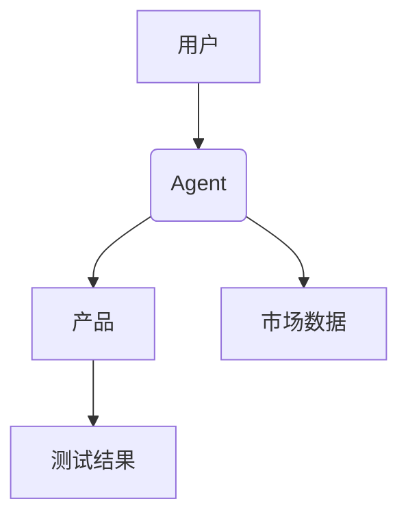
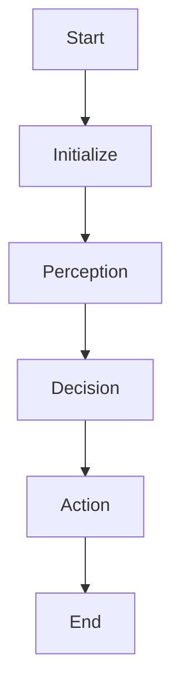
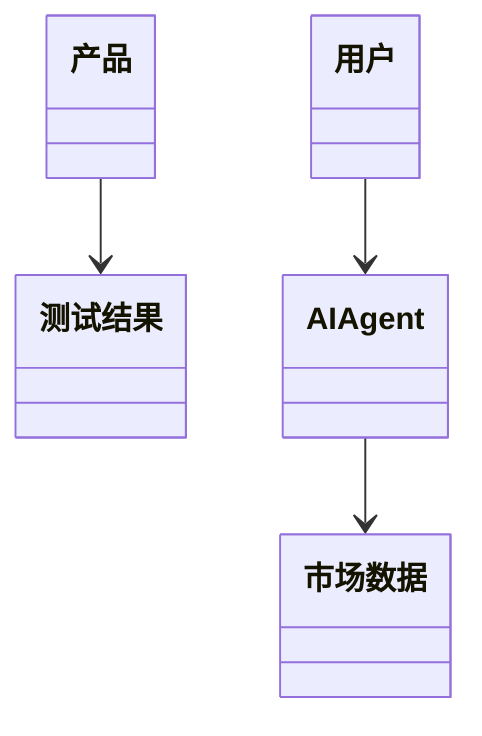
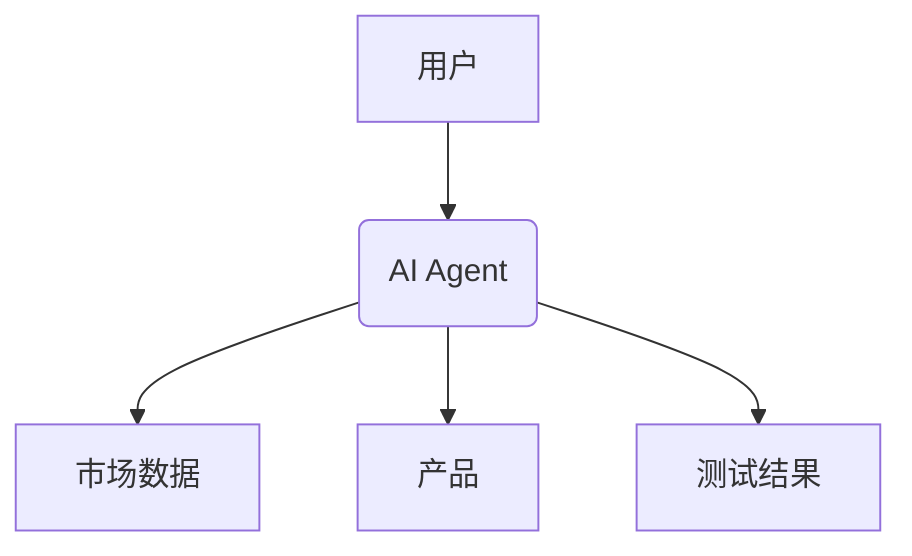

                 


# AI Agent辅助企业新产品开发与市场测试

## 关键词：AI Agent，企业开发，市场测试，算法原理，系统架构，项目实战

## 摘要：  
本文详细探讨了AI Agent在企业新产品开发与市场测试中的应用。通过分析AI Agent的核心概念、技术原理、系统架构和实际项目案例，本文展示了如何利用AI Agent提升企业开发效率和市场测试的准确性。文章还提供了最佳实践和未来展望，为读者提供了全面的技术指导。

---

# 第1章 AI Agent的基本概念与背景

## 1.1 AI Agent的定义与核心要素

### 1.1.1 AI Agent的定义  
AI Agent（人工智能代理）是指能够感知环境、做出决策并执行动作的智能实体。它通过传感器获取信息，利用算法进行分析，并通过执行器与环境交互。AI Agent的核心目标是通过自动化方式解决复杂问题，提高效率和准确性。

### 1.1.2 AI Agent的核心要素  
AI Agent由以下核心要素组成：  
1. **感知层**：通过传感器或数据接口获取环境信息。  
2. **决策层**：基于感知信息进行推理和决策。  
3. **行动层**：通过执行器将决策转化为具体动作。  

### 1.1.3 AI Agent与传统软件代理的区别  
AI Agent与传统软件代理的主要区别在于其智能性和自适应性。AI Agent能够通过学习和优化改进自身行为，而传统软件代理仅基于预定义规则执行任务。

## 1.2 AI Agent在企业中的应用背景

### 1.2.1 企业新产品开发的挑战  
企业新产品开发面临以下挑战：  
1. **需求不确定性**：市场需求变化快，难以准确预测。  
2. **开发周期长**：新产品从设计到市场投放耗时较长。  
3. **资源分配难**：需要协调多部门资源，容易出现瓶颈。  

### 1.2.2 市场测试的重要性  
市场测试是新产品开发的重要环节，主要用于验证产品的市场可行性。通过市场测试，企业可以评估产品的市场需求、竞争环境和用户反馈，从而优化产品设计和营销策略。

### 1.2.3 AI Agent如何解决这些问题  
AI Agent可以通过以下方式帮助企业解决新产品开发与市场测试中的问题：  
1. **自动化数据收集与分析**：实时收集市场数据并进行分析，提供决策支持。  
2. **优化开发流程**：通过自动化任务和流程优化，缩短开发周期。  
3. **动态调整策略**：根据市场反馈实时调整产品设计和营销策略。  

## 1.3 本章小结  
本章介绍了AI Agent的基本概念、核心要素及其在企业中的应用背景。通过分析企业新产品开发与市场测试中的挑战，我们探讨了AI Agent如何帮助企业解决这些问题，为后续章节的深入分析奠定了基础。

---

# 第2章 AI Agent的核心概念与联系

## 2.1 AI Agent的核心概念

### 2.1.1 感知层  
感知层是AI Agent获取环境信息的关键部分，包括以下几种方式：  
1. **传感器**：如摄像头、麦克风等硬件设备。  
2. **数据接口**：通过API获取外部数据。  
3. **用户输入**：通过用户交互获取信息。  

### 2.1.2 决策层  
决策层负责基于感知信息进行推理和决策。常用的决策算法包括：  
1. **规则引擎**：基于预定义规则进行决策。  
2. **机器学习模型**：如随机森林、神经网络等。  
3. **强化学习**：通过试错优化决策策略。  

### 2.1.3 行动层  
行动层将决策转化为具体动作，包括以下几种方式：  
1. **执行器**：如机器人手臂、无人机等。  
2. **API调用**：通过API实现系统间的交互。  
3. **用户反馈**：通过界面与用户交互。  

## 2.2 AI Agent的属性特征对比

### 2.2.1 智能性  
智能性是AI Agent的核心特征，主要体现在以下方面：  
- **问题解决能力**：能够识别问题并提出解决方案。  
- **学习能力**：通过数据和经验不断优化自身行为。  
- **推理能力**：能够进行逻辑推理和知识表示。  

### 2.2.2 自适应性  
自适应性是指AI Agent能够根据环境变化调整自身行为。自适应性主要体现在以下方面：  
- **动态调整策略**：根据实时数据优化决策。  
- **容错能力**：在异常情况下仍能正常运行。  
- **自我修复**：能够检测和修复自身错误。  

### 2.2.3 可解释性  
可解释性是指AI Agent的决策过程和结果能够被人类理解。可解释性的重要性体现在以下方面：  
- **信任度**：用户更容易信任可解释的AI系统。  
- **责任追究**：在出现问题时能够追溯决策原因。  
- **合规性**：满足相关法律法规的要求。  

## 2.3 AI Agent的ER实体关系图



从上图可以看出，AI Agent（B）与用户（A）、产品（C）、市场数据（D）和测试结果（E）之间存在关联。AI Agent通过收集市场数据和用户反馈，优化产品设计并生成测试结果。

## 2.4 本章小结  
本章详细探讨了AI Agent的核心概念及其属性特征，并通过ER实体关系图展示了AI Agent在企业中的应用架构。这些内容为后续章节的技术实现奠定了理论基础。

---

# 第3章 AI Agent的算法原理

## 3.1 AI Agent的核心算法

### 3.1.1 问题建模  
问题建模是AI Agent算法设计的第一步，主要包括以下步骤：  
1. **定义问题空间**：明确问题的目标和约束条件。  
2. **状态表示**：将问题转化为可计算的数学模型。  
3. **动作空间**：定义AI Agent可能执行的动作。  

### 3.1.2 状态空间  
状态空间是指AI Agent在不同时间点可能处于的所有状态的集合。例如，在市场测试中，状态可以表示为“产品A的市场占有率”。状态空间的大小直接影响算法的复杂度和效率。

### 3.1.3 动作空间  
动作空间是指AI Agent在给定状态下所有可能执行的动作的集合。例如，在产品开发中，动作可以是“增加广告预算”或“优化产品功能”。

## 3.2 AI Agent的算法流程



从上图可以看出，AI Agent的算法流程包括以下几个步骤：  
1. **初始化**：设置初始参数和状态。  
2. **感知**：通过传感器或数据接口获取环境信息。  
3. **决策**：基于感知信息进行推理并生成决策。  
4. **行动**：根据决策执行具体动作。  
5. **结束**：完成任务或进入下一个循环。  

## 3.3 算法实现代码示例

```python
def agent_algorithm(state):
    # 状态感知
    perception = state感知(state)
    # 决策
    action = decide(perception)
    # 行动
    execute_action(action)
    return action
```

### 3.3.1 状态感知  
状态感知是AI Agent获取环境信息的关键步骤。例如，在市场测试中，AI Agent可以通过API获取实时市场数据，并通过数据预处理模块清洗数据。

### 3.3.2 决策  
决策是AI Agent的核心部分，通常基于机器学习模型进行预测。例如，可以使用随机森林模型进行分类或回归分析。

### 3.3.3 行动  
行动是AI Agent将决策转化为具体操作的步骤。例如，AI Agent可以根据决策结果调整广告投放策略或优化产品设计。

## 3.4 算法的数学模型和公式

### 3.4.1 贝叶斯定理  
贝叶斯定理是一种常用的概率模型，用于计算条件概率。其公式为：  
$$P(A|B) = \frac{P(B|A) \cdot P(A)}{P(B)}$$  
其中，$P(A|B)$表示在事件B发生的条件下，事件A发生的概率。

### 3.4.2 Q-learning算法  
Q-learning是一种常用的强化学习算法，用于优化决策策略。其更新公式为：  
$$Q(s, a) = r + \gamma \cdot \max Q(s', a')$$  
其中，$s$是当前状态，$a$是当前动作，$r$是奖励，$\gamma$是折扣因子，$s'$是下一个状态。

## 3.5 本章小结  
本章详细讲解了AI Agent的核心算法，包括问题建模、状态空间、动作空间、算法流程和实现代码。同时，还介绍了贝叶斯定理和Q-learning算法等数学模型，为后续章节的系统设计奠定了技术基础。

---

# 第4章 系统分析与架构设计

## 4.1 问题场景介绍

### 4.1.1 产品开发场景  
在产品开发过程中，企业需要通过市场测试验证产品的市场需求和用户反馈。AI Agent可以通过自动化方式收集和分析数据，优化产品设计和营销策略。

### 4.1.2 市场测试场景  
在市场测试中，AI Agent可以帮助企业实时监控市场动态，评估产品的市场表现，并根据反馈调整测试策略。

## 4.2 系统功能设计

### 4.2.1 领域模型  
领域模型是对系统功能的抽象描述，用于明确系统的角色、实体和关系。以下是领域模型的Mermaid类图：



### 4.2.2 系统架构设计  
系统架构设计是AI Agent实现的关键部分，包括以下几个方面：  
1. **感知层**：通过传感器或数据接口获取环境信息。  
2. **决策层**：基于感知信息进行推理和决策。  
3. **行动层**：将决策转化为具体动作。  

## 4.3 系统架构设计

### 4.3.1 架构设计图  
以下是系统架构设计的Mermaid图：



从上图可以看出，AI Agent（B）通过感知层获取市场数据（C）和产品信息（D），并根据这些信息生成测试结果（E）。

### 4.3.2 接口设计  
接口设计是系统架构设计的重要部分，包括以下几种接口：  
1. **数据接口**：用于获取市场数据和用户反馈。  
2. **API接口**：用于与其他系统进行交互。  
3. **用户接口**：用于与最终用户进行交互。  

### 4.3.3 交互设计  
交互设计是系统架构设计的关键部分，包括以下几种交互方式：  
1. **用户交互**：通过界面与用户进行交互。  
2. **系统交互**：通过API与其他系统进行交互。  
3. **内部交互**：系统内部各模块之间的交互。  

## 4.4 本章小结  
本章详细探讨了AI Agent的系统分析与架构设计，包括问题场景介绍、系统功能设计和系统架构设计。这些内容为后续章节的项目实战奠定了基础。

---

# 第5章 项目实战

## 5.1 环境安装

### 5.1.1 安装Python  
AI Agent的实现基于Python编程语言，需要安装以下工具：  
1. **Python 3.8+**：确保Python版本符合要求。  
2. **pip**：用于安装Python库。  

### 5.1.2 安装依赖库  
安装以下依赖库：  
- **numpy**：用于数值计算。  
- **pandas**：用于数据处理。  
- **scikit-learn**：用于机器学习算法。  
- **mermaid**：用于生成图表。  

安装命令如下：  
```bash
pip install numpy pandas scikit-learn mermaid
```

## 5.2 系统核心实现

### 5.2.1 状态感知模块  
状态感知模块负责获取环境信息，代码如下：  
```python
def get_market_data():
    import requests
    response = requests.get("https://api.marketdata.com")
    return response.json()
```

### 5.2.2 决策模块  
决策模块基于机器学习模型进行预测，代码如下：  
```python
from sklearn.ensemble import RandomForestClassifier

def make_decision(data):
    model = RandomForestClassifier()
    model.fit(data['features'], data['labels'])
    return model.predict(data['new_features'])
```

### 5.2.3 行动模块  
行动模块负责执行决策结果，代码如下：  
```python
def execute_action(action):
    import requests
    response = requests.post("https://api.product.com/action", json=action)
    return response.json()
```

## 5.3 案例分析与实现

### 5.3.1 案例背景  
假设某企业正在开发一款新产品，希望通过AI Agent进行市场测试。AI Agent需要收集市场数据、分析用户反馈并优化产品设计。

### 5.3.2 实现步骤  
1. **数据收集**：通过API获取市场数据和用户反馈。  
2. **数据预处理**：清洗数据并提取特征。  
3. **模型训练**：使用随机森林模型进行分类或回归分析。  
4. **模型预测**：根据市场数据预测产品市场需求。  
5. **优化策略**：根据预测结果优化产品设计和营销策略。  

## 5.4 本章小结  
本章通过一个实际案例展示了AI Agent在企业新产品开发与市场测试中的应用。通过环境安装、核心代码实现和案例分析，读者可以深入了解AI Agent的实际应用过程。

---

# 第6章 最佳实践

## 6.1 小结

### 6.1.1 核心内容回顾  
本文详细探讨了AI Agent在企业新产品开发与市场测试中的应用，包括核心概念、技术原理、系统架构和项目实战。

### 6.1.2 关键点总结  
- AI Agent能够通过自动化方式解决复杂问题，提高效率和准确性。  
- 系统架构设计是AI Agent实现的关键部分，需要合理规划感知层、决策层和行动层。  
- 项目实战是理论与实践结合的重要环节，通过实际案例可以更好地理解AI Agent的应用。  

## 6.2 注意事项

### 6.2.1 数据隐私与安全  
在实际应用中，需要特别注意数据隐私和安全问题，确保符合相关法律法规。

### 6.2.2 系统可扩展性  
系统设计需要考虑可扩展性，以便在未来业务需求变化时能够轻松扩展。

### 6.2.3 算法可解释性  
算法的可解释性是AI Agent应用的重要因素，能够帮助用户理解和信任系统。

## 6.3 拓展阅读

### 6.3.1 强化学习  
强化学习是一种常用的机器学习算法，能够帮助AI Agent通过试错优化决策策略。

### 6.3.2 联邦学习  
联邦学习是一种分布式机器学习算法，能够在保护数据隐私的前提下，通过协作优化模型性能。

## 6.4 本章小结  
本章总结了本文的核心内容，并提出了应用AI Agent时需要注意的事项和未来的学习方向。

---

# 附录

## 附录A 工具安装指南

### A.1 Python安装指南  
访问[Python官方网站](https://www.python.org/)下载并安装Python 3.8+版本。

### A.2 pip安装指南  
安装pip：  
```bash
python get-pip.py
```

## 附录B 术语表

### B.1 AI Agent  
AI Agent（人工智能代理）是指能够感知环境、做出决策并执行动作的智能实体。

### B.2 机器学习  
机器学习是一种人工智能技术，通过数据训练模型，使其能够从数据中学习并做出预测。

## 附录C 参考文献

1. Russell, S., & Norvig, P. (2010). * Artificial Intelligence: A Modern Approach.  
2. Goodfellow, I., Bengio, Y., & Courville, A. (2016). * Deep Learning.  
3. Sutton, R. S., & Barto, A. G. (2018). * Reinforcement Learning: An Introduction.

---

# 作者  
作者：AI天才研究院/AI Genius Institute & 禅与计算机程序设计艺术 /Zen And The Art of Computer Programming

