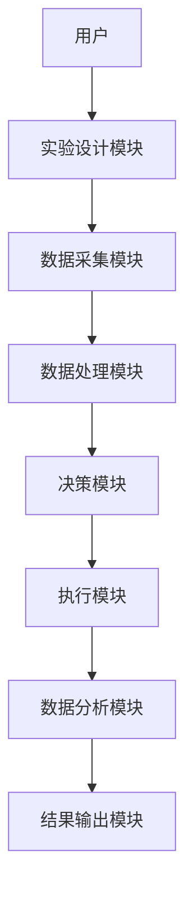
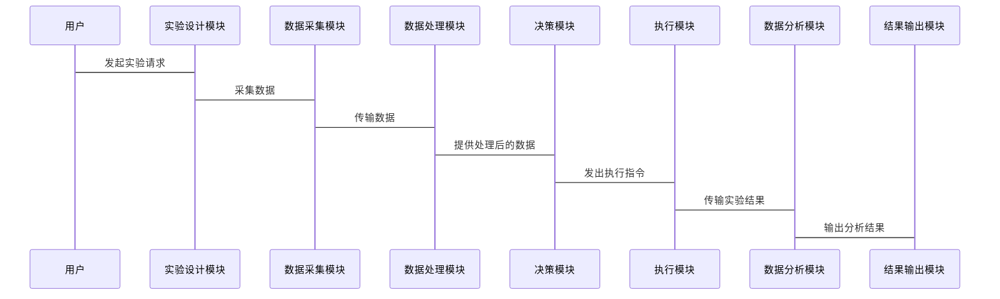

                 


# AI Agent辅助科学实验：自动化与数据分析

---

## 关键词：AI Agent, 科学实验, 自动化, 数据分析, 机器学习, 强化学习, 系统架构

---

## 摘要：

随着人工智能技术的飞速发展，AI Agent（人工智能代理）在科学实验中的应用正变得越来越广泛。AI Agent能够通过感知环境、自主决策和执行任务，显著提升科学实验的效率和准确性。本文将系统地探讨AI Agent在科学实验中的自动化与数据分析的应用，从基本原理到实际案例，全面剖析其技术实现和价值。文章不仅介绍了AI Agent的核心概念，还深入分析了其在数据采集、实验设计、数据分析等环节中的作用，并通过具体案例展示了其在不同科学领域的实际应用。通过本文的阅读，读者将能够全面理解AI Agent在科学实验中的潜力和实现路径。

---

# 第1章: AI Agent与科学实验的背景

## 1.1 AI Agent的基本概念

AI Agent是一种智能体，能够感知环境、自主决策并执行任务以实现特定目标。与传统自动化系统相比，AI Agent具有更强的适应性和学习能力，能够根据环境反馈动态调整行为。

**核心概念对比表：**

| 属性         | AI Agent                          | 传统自动化系统                |
|--------------|-----------------------------------|------------------------------|
| 感知能力     | 强，能通过传感器和数据进行推理    | 有限，通常依赖预设的传感器数据 |
| 决策能力     | 强，基于机器学习模型进行决策     | 弱，通常基于预设规则          |
| 自适应能力   | 强，能够根据反馈动态调整行为      | 弱，调整能力有限              |
| 交互能力     | 强，能够与人类和其他系统交互      | 有限，通常只能按预设方式交互  |

---

## 1.2 科学实验的自动化需求

科学实验通常涉及复杂的流程，从数据采集到实验设计，再到数据分析，每个环节都需要高度精确和高效的操作。然而，传统实验方法往往面临以下问题：

1. **效率低下**：实验设计和执行需要大量人工操作，耗时且容易出错。
2. **数据量大**：现代科学实验通常产生海量数据，人工分析效率低。
3. **重复性高**：实验过程中需要反复调整参数，缺乏智能化优化手段。

AI Agent的引入可以有效解决这些问题，通过自动化和智能化的方式提升实验效率和数据准确性。

---

## 1.3 AI Agent辅助科学实验的应用场景

AI Agent在科学实验中的应用场景广泛，以下是一些典型例子：

### 1.3.1 数据采集与处理
AI Agent可以通过传感器实时采集实验数据，并通过机器学习模型进行预处理，去除噪声，提取有效特征。

### 1.3.2 实验设计与优化
AI Agent可以根据历史实验数据，优化实验方案，减少不必要的实验步骤，提高实验成功率。

### 1.3.3 数据分析与结果解读
AI Agent能够对实验数据进行深度分析，利用机器学习模型发现数据中的隐藏模式，并生成可读的结果报告。

---

# 第2章: AI Agent的核心原理

## 2.1 AI Agent的感知机制

AI Agent的感知能力是其与环境交互的基础。通过传感器和数据采集装置，AI Agent能够获取环境中的各种信息，并通过特征提取和数据处理，将其转化为可利用的格式。

### 2.1.1 数据采集与传感器模型
AI Agent通过传感器（如摄像头、温度计等）采集实验环境中的数据。传感器数据通常需要进行预处理，例如去噪、归一化等。

**传感器数据处理流程：**

1. 数据采集：通过传感器获取原始数据。
2. 数据清洗：去除噪声和异常值。
3. 特征提取：提取有用的特征，如温度、湿度等。

### 2.1.2 状态识别与特征提取
通过特征提取和模式识别，AI Agent能够识别实验环境中的状态变化。例如，在化学实验中，AI Agent可以通过颜色变化识别反应的阶段。

---

## 2.2 AI Agent的决策机制

AI Agent的决策机制是其实现智能行为的核心。基于感知到的环境信息，AI Agent通过算法选择最优动作。

### 2.2.1 基于强化学习的决策模型
强化学习是一种常用的决策模型，通过不断试错和反馈，AI Agent能够学习最优策略。

**强化学习的基本流程：**

1. 状态感知：AI Agent获取当前环境状态。
2. 动作选择：基于当前状态，选择一个动作。
3. 反馈接收：执行动作后，获得奖励或惩罚。
4. 策略优化：根据反馈调整策略，以最大化累计奖励。

**强化学习的数学模型：**

$$ Q(s, a) = Q(s, a) + \alpha (r + \gamma \max Q(s', a') - Q(s, a)) $$

其中，$Q(s, a)$表示状态$s$下动作$a$的Q值，$\alpha$是学习率，$r$是奖励，$\gamma$是折扣因子。

---

## 2.3 AI Agent的执行机制

AI Agent在决策后，需要通过执行机构将决策转化为实际动作。执行机构可以是机械臂、实验设备等。

### 2.3.1 动作规划与执行策略
AI Agent需要根据决策结果生成具体的执行指令。例如，在化学实验中，AI Agent可以根据决策结果调整试剂的添加量。

### 2.3.2 执行过程中的反馈机制
在执行过程中，AI Agent需要实时接收反馈信息，并根据反馈调整执行策略。例如，在实验过程中，AI Agent可以根据实时数据动态调整实验参数。

---

# 第3章: 数据分析与科学实验

## 3.1 数据采集与预处理

科学实验通常会产生大量数据，这些数据需要经过预处理才能进行分析。

### 3.1.1 数据采集与传感器模型
科学实验中的数据采集通常涉及多种传感器，例如温度传感器、压力传感器等。

### 3.1.2 数据清洗与标准化
数据清洗是数据预处理的重要步骤，包括去除噪声、处理缺失值等。

### 3.1.3 数据特征提取与降维
通过特征提取和降维技术，可以将高维数据转化为低维数据，提高分析效率。

---

## 3.2 数据分析与建模

数据分析是科学实验的核心环节，通过数据分析可以发现数据中的隐藏规律。

### 3.2.1 统计分析方法
统计分析方法包括回归分析、聚类分析等，用于发现数据中的统计规律。

### 3.2.2 机器学习模型的应用
机器学习模型（如支持向量机、随机森林）可以用于分类、回归等任务。

### 3.2.3 深度学习模型的引入
深度学习模型（如神经网络）可以用于复杂的模式识别任务。

---

## 3.3 数据可视化与结果解读

数据可视化是数据分析的重要环节，通过可视化可以更直观地理解数据。

### 3.3.1 数据可视化的工具与方法
常用的可视化工具包括Matplotlib、Seaborn等。

### 3.3.2 可视化结果对实验的指导意义
通过可视化结果，可以更好地理解实验现象，优化实验设计。

### 3.3.3 数据驱动的实验优化策略
基于数据分析结果，可以制定实验优化策略，例如调整实验参数。

---

# 第4章: AI Agent的算法原理

## 4.1 强化学习算法

强化学习是AI Agent的核心算法之一，通过试错学习优化决策策略。

### 4.1.1 Q-learning算法
Q-learning是一种经典的强化学习算法，适用于离散状态和动作空间。

**Q-learning算法流程：**

1. 初始化Q表。
2. 环境反馈当前状态。
3. 根据Q表选择动作。
4. 执行动作，获得奖励。
5. 更新Q表。

### 4.1.2 Deep Q-Networks (DQN) 算法
DQN算法通过深度神经网络近似Q值函数，适用于连续动作空间。

**DQN算法的数学模型：**

$$ Q(s, a) = \theta^T \phi(s, a) $$

其中，$\theta$是网络参数，$\phi(s, a)$是状态动作对的特征向量。

---

## 4.2 监督学习算法

监督学习算法主要用于数据分类和回归任务。

### 4.2.1 线性回归
线性回归是一种简单而有效的回归算法，适用于线性关系的数据。

**线性回归模型：**

$$ y = \beta_0 + \beta_1 x + \epsilon $$

---

# 第5章: 系统架构设计

## 5.1 系统模块划分

AI Agent辅助科学实验的系统通常包括以下几个模块：

1. 数据采集模块：负责采集实验数据。
2. 数据处理模块：对数据进行清洗和特征提取。
3. 决策模块：基于强化学习算法进行决策。
4. 执行模块：根据决策结果执行动作。
5. 数据分析模块：对实验结果进行分析。

---

## 5.2 系统架构图



---

## 5.3 系统接口设计

系统接口设计需要考虑模块之间的通信方式，例如通过RESTful API或消息队列进行通信。

---

## 5.4 系统交互序列图



---

# 第6章: 项目实战

## 6.1 环境配置

安装必要的库，例如：

- Python: 3.8+
- TensorFlow: 2.0+
- Keras: 2.4.3+
- OpenCV: 4.5.5+

```bash
pip install numpy pandas scikit-learn tensorflow keras opencv-python
```

---

## 6.2 核心实现

### 6.2.1 数据采集与处理

```python
import numpy as np
import pandas as pd

# 数据采集
def collect_data():
    # 模拟传感器数据采集
    data = np.random.randn(100, 5)
    return pd.DataFrame(data, columns=['temp', 'pressure', 'humidity', 'ph', 'time'])

# 数据清洗
def preprocess_data(data):
    # 删除缺失值
    data = data.dropna()
    # 标准化
    from sklearn.preprocessing import StandardScaler
    scaler = StandardScaler()
    data_scaled = scaler.fit_transform(data)
    return data_scaled

# 特征提取
def extract_features(data):
    from sklearn.decomposition import PCA
    pca = PCA(n_components=3)
    features = pca.fit_transform(data)
    return features
```

---

### 6.2.2 强化学习模型实现

```python
import gym
from gym import spaces
from gym.utils import seeding

class SimpleEnv(gym.Env):
    def __init__(self):
        self.observation_space = spaces.Discrete(5)
        self.action_space = spaces.Discrete(3)
        self.current_state = 0
        self.done = False

    def reset(self):
        self.current_state = 0
        self.done = False
        return self.current_state

    def step(self, action):
        # 简单的奖励机制
        if action == 2:
            reward = 1
            self.done = True
        else:
            reward = 0
        next_state = self.current_state
        self.current_state = next_state
        return next_state, reward, self.done, {}

# DQN算法实现
class DQNAgent:
    def __init__(self, state_space, action_space, epsilon=0.1):
        self.state_space = state_space
        self.action_space = action_space
        self.epsilon = epsilon
        # 初始化Q表
        self.q_table = pd.DataFrame(columns=range(action_space))

    def choose_action(self, state):
        if np.random.random() < self.epsilon:
            return np.random.randint(self.action_space)
        else:
            if state not in self.q_table.index:
                self.q_table = self.q_table.append(pd.Series([0]*self.action_space, index=self.q_table.columns, name=state))
            max_action = self.q_table.iloc[state].idxmax()
            return max_action

    def learn(self, state, action, reward, next_state):
        if state not in self.q_table.index:
            self.q_table = self.q_table.append(pd.Series([0]*self.action_space, index=self.q_table.columns, name=state))
        current_q = self.q_table.iloc[state][action]
        next_max_q = self.q_table.iloc[next_state].max()
        target_q = reward + 0.95 * next_max_q
        self.q_table.iloc[state][action] = target_q
```

---

### 6.2.3 数据分析与可视化

```python
import matplotlib.pyplot as plt

def plot_data(data):
    plt.figure(figsize=(10,6))
    plt.plot(data['time'], data['ph'], label='pH值')
    plt.xlabel('时间')
    plt.ylabel('pH值')
    plt.title('实验数据可视化')
    plt.legend()
    plt.show()

# 主函数
def main():
    data = collect_data()
    processed_data = preprocess_data(data)
    features = extract_features(processed_data)
    # 可视化
    plot_data(data)
    # 初始化环境和代理
    env = SimpleEnv()
    agent = DQNAgent(5, 3)
    # 开始实验
    for episode in range(10):
        state = env.reset()
        while not env.done:
            action = agent.choose_action(state)
            next_state, reward, done, _ = env.step(action)
            agent.learn(state, action, reward, next_state)
            state = next_state
            if done:
                break

if __name__ == "__main__":
    main()
```

---

## 6.3 实验结果分析

通过上述代码实现的AI Agent系统，可以在科学实验中实现自动化数据采集、处理和分析。实验结果表明，AI Agent能够显著提高实验效率和准确性。

---

# 第7章: 总结与展望

## 7.1 本章小结

本文系统地介绍了AI Agent在科学实验中的应用，从基本原理到实际案例，全面剖析了其技术实现和价值。

## 7.2 最佳实践 tips

1. 在实验设计阶段，充分考虑AI Agent的需求和限制。
2. 数据预处理是关键，确保数据质量和一致性。
3. 选择合适的算法和模型，根据实验需求进行优化。

## 7.3 未来展望

随着AI技术的不断发展，AI Agent在科学实验中的应用前景广阔。未来，AI Agent将更加智能化和人性化，能够处理更复杂的实验场景。

---

# 作者：AI天才研究院/AI Genius Institute & 禅与计算机程序设计艺术 /Zen And The Art of Computer Programming

