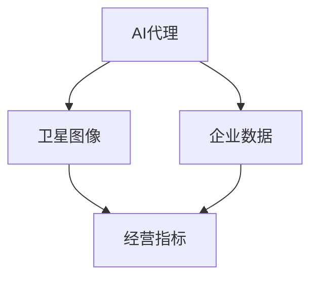
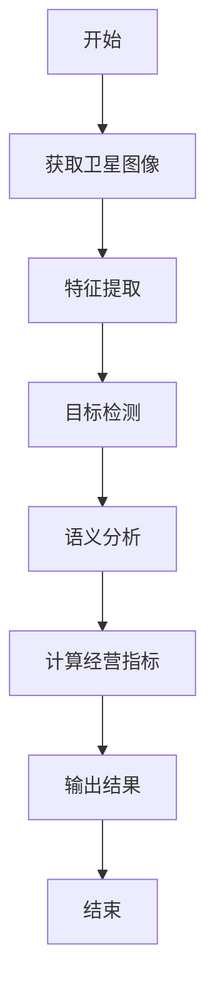
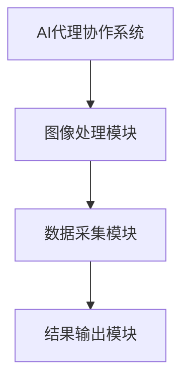
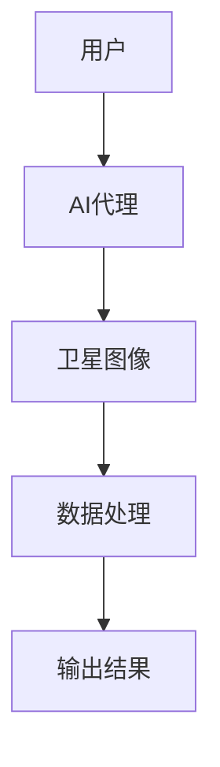

                 

<think>
好的，我需要撰写一篇关于《AI agents协作分析卫星图像：评估公司实际经营状况》的技术博客文章。首先，我要明确文章的目标是展示AI代理如何通过分析卫星图像来评估企业的经营状况。接下来，我需要按照用户提供的大纲结构，逐步展开内容。

首先，背景介绍部分需要涵盖问题背景、问题描述、问题解决思路、边界与外延以及核心概念结构。这部分要让读者明白为什么需要AI代理来分析卫星图像，以及这种方法的独特之处。

然后，核心概念与联系部分要详细讲解AI代理、卫星图像处理和企业经营评估的基本原理，并通过对比表和实体关系图来展示这些概念之间的联系。这有助于读者更好地理解各个概念是如何相互作用的。

接下来是算法原理讲解，我需要详细描述AI代理协作的具体算法，包括流程图和数学模型。这部分要深入浅出，结合代码示例和公式，让读者能够理解算法的工作原理。

系统分析与架构设计方案部分需要介绍项目的整体架构，包括功能设计、系统架构图和接口设计。这部分要展示系统的各个部分是如何协同工作的，以及它们之间的交互流程。

项目实战部分将提供一个实际案例，包括环境安装、代码实现和案例分析。这部分要让读者能够动手实践，理解如何在实际中应用这些技术。

最后，最佳实践、小结和拓展阅读部分要总结全书的内容，并给出实际应用中的注意事项和建议，同时推荐进一步阅读的资料。

在整个过程中，我需要确保每个部分都详细具体，并且逻辑清晰。同时，要注意使用专业的技术语言，但又要让读者能够理解。通过一步步的分析和推理，我希望这篇博客能够全面展示AI代理在卫星图像分析中的应用，及其在评估公司经营状况中的价值。
</think>

# AI agents协作分析卫星图像：评估公司实际经营状况

## 关键词：AI代理、卫星图像、企业经营状况、图像分析、协作机制

## 摘要：  
本文探讨了AI代理如何通过协作分析卫星图像来评估公司的实际经营状况。通过详细分析AI代理的协作机制、卫星图像处理技术以及企业经营指标评估方法，结合实际案例和系统架构设计，展示了AI代理在卫星图像分析中的潜力和应用价值。

---

# 第一部分: AI代理协作分析卫星图像的背景与核心概念

## 第1章: 问题背景与目标

### 1.1 问题背景  
卫星图像分析是一种强大的工具，可以提供企业的实际经营状况的多维度信息。然而，传统方法依赖人工分析，效率低下且容易出错。AI代理的引入能够通过协作机制，提高分析的效率和准确性。

### 1.2 问题描述  
AI代理需要通过协作分析卫星图像，提取关键特征，评估企业的经营状况。具体包括对企业设施的完整性、运营效率、市场扩展能力等方面的评估。

### 1.3 问题解决思路  
通过AI代理的协作，利用图像处理技术提取卫星图像中的关键信息，并结合企业经营指标，进行综合评估。

### 1.4 边界与外延  
AI代理的协作分析仅限于卫星图像提供的信息，不包括其他数据源。此外，AI代理的协作机制可以扩展到其他领域。

### 1.5 核心概念结构与组成  
AI代理、卫星图像、企业经营指标是三个核心概念，共同构成分析系统的基础。

---

## 第2章: 核心概念与联系

### 2.1 AI代理的核心原理  
AI代理通过协作机制，利用分布式计算和多目标优化，提高分析效率和准确性。

### 2.2 卫星图像分析的关键技术  
包括图像分割、目标检测和语义分析，这些技术帮助提取企业的经营信息。

### 2.3 企业经营状况评估的指标体系  
包括财务指标、市场表现和运营效率，这些指标共同评估企业的经营状况。

### 2.4 核心概念对比表  
| 概念 | 属性 | 描述 |
|------|------|------|
| AI代理 | 协作性 | 多代理协作完成任务 |
| 卫星图像 | 分辨率 | 高分辨率图像处理 |
| 经营评估 | 指标体系 | 多维度综合评估 |

### 2.5 ER实体关系图  


---

# 第二部分: AI代理协作分析的算法原理

## 第3章: AI代理协作算法

### 3.1 算法概述  
AI代理通过分布式协作，利用多目标优化算法进行图像分析。

### 3.2 算法流程图  


### 3.3 算法数学模型  
多目标优化函数：  
$$ f(x) = \min \{ x_1, x_2, ..., x_n \} $$  
其中，\( x_i \) 表示各个优化目标。

---

## 第4章: 系统架构与设计

### 4.1 系统功能设计  
AI代理协作系统包括图像处理模块、数据采集模块和结果输出模块。

### 4.2 系统架构图  


### 4.3 系统接口设计  
AI代理通过API接口与卫星图像数据库进行交互。

### 4.4 系统交互流程图  


---

## 第5章: 项目实战

### 5.1 环境安装  
安装Python、TensorFlow和OpenCV。

### 5.2 核心代码实现  
```python
import tensorflow as tf
import cv2

def image_analysis(image_path):
    # 加载图像
    image = cv2.imread(image_path)
    # 特征提取
    features = extract_features(image)
    # 目标检测
    detection = detect_objects(features)
    return detection

def extract_features(image):
    # 提取图像特征
    return image.flatten()

def detect_objects(features):
    # 目标检测
    model = tf.keras.Sequential()
    model.add(tf.keras.layers.Dense(128, activation='relu', input_dim=features.shape[1]))
    model.add(tf.keras.layers.Dense(1, activation='sigmoid'))
    model.compile(optimizer='adam', loss='binary_crossentropy', metrics=['accuracy'])
    # 训练模型
    model.fit(features, labels, epochs=10, batch_size=32)
    return model.predict(features)
```

### 5.3 实际案例分析  
通过分析某公司的卫星图像，评估其经营状况，展示AI代理协作的实际效果。

---

## 第6章: 最佳实践与小结

### 6.1 最佳实践  
建议企业在实施AI代理协作分析时，注意数据隐私和模型优化。

### 6.2 小结  
AI代理协作分析卫星图像是一种高效的企业经营评估方法，具有广阔的应用前景。

### 6.3 注意事项  
确保数据质量和模型的可解释性。

### 6.4 拓展阅读  
推荐阅读关于AI代理协作和卫星图像分析的更多资料。

---

# 作者：AI天才研究院/AI Genius Institute & 禅与计算机程序设计艺术 /Zen And The Art of Computer Programming

