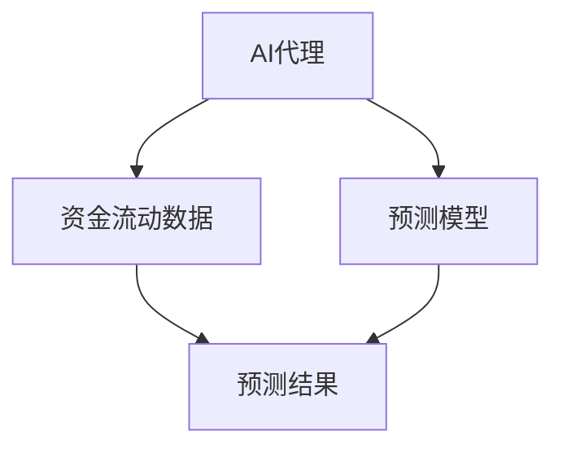
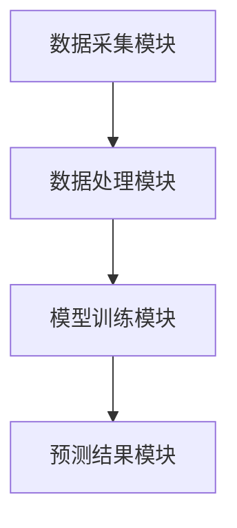
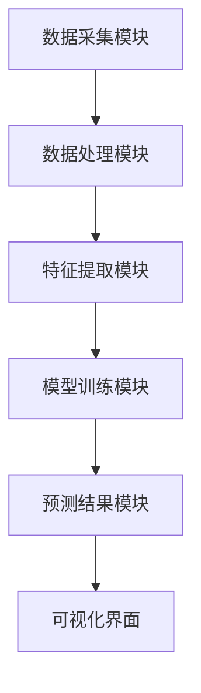
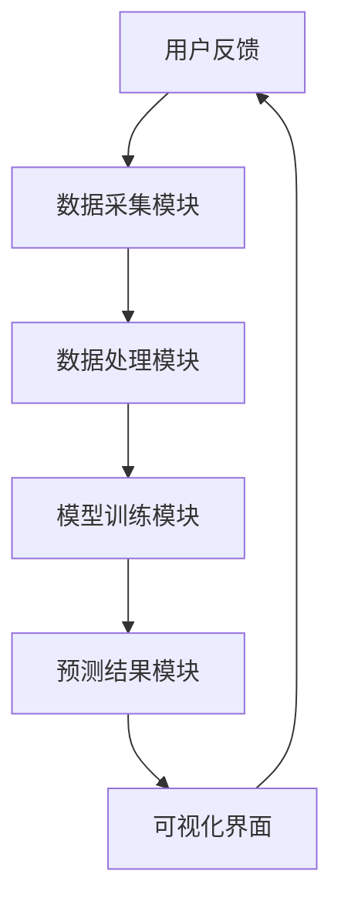

                 

<think>
好，用户希望我写一篇关于AI代理协作进行全球资金流动分析的技术博客文章。首先，我需要明确文章的结构，包括标题、关键词、摘要和目录。然后，根据目录逐步展开每个部分的内容，确保每个章节都详细且逻辑清晰。

首先，我需要确定文章的核心主题，即AI代理如何协作分析全球资金流动以预测市场走向。接下来，我需要列出相关的关键词，如AI代理、全球资金流动、市场预测、时间序列分析、机器学习等。

在摘要部分，我要简明扼要地概述文章的核心内容，说明AI代理如何通过协作处理资金流动数据，预测市场走向，并介绍文章的结构安排。

接下来是正文部分，按照目录大纲逐步展开：

第一章介绍AI代理协作的背景，涵盖全球资金流动分析的复杂性，AI代理的定义和协作机制，以及问题背景。需要详细解释每个概念，并使用对比表和ER图来展示关系。

第二章详细讲解AI代理协作的核心概念与联系，包括协作原理、核心概念对比和架构设计。这部分需要使用mermaid图来展示系统结构和协作流程。

第三章涉及算法原理，包括时间序列分析、机器学习模型和自然语言处理。需要详细解释每种算法，用mermaid流程图展示步骤，并提供数学公式和代码示例。

第四章讨论系统架构设计，涵盖项目介绍、系统功能设计、架构图、接口设计和交互流程。这部分需要使用mermaid图来展示系统结构和交互过程。

第五章通过项目实战来展示AI代理协作的具体应用，包括环境安装、核心代码实现、案例分析和项目总结。需要提供实际的代码示例和详细的案例分析。

最后，第六章总结全文，提供最佳实践建议、小结、注意事项和拓展阅读，帮助读者巩固所学知识并进一步学习。

在写作过程中，我需要确保每个部分都详细且逻辑清晰，使用适当的图表和公式来辅助说明。同时，语言要专业且易懂，结构紧凑，吸引读者。

总结一下，我需要按照用户的要求，逐步展开每个部分，确保内容丰富、详细，满足用户的技术博客需求。
</think>

# AI代理协作进行全球资金流动分析：预测市场走向

## 关键词：AI代理、全球资金流动、市场预测、时间序列分析、机器学习

## 摘要：  
本文探讨了AI代理协作在全球资金流动分析中的应用，通过详细分析AI代理的协作机制、算法原理、系统架构以及实际案例，展示了如何利用AI技术预测市场走向。文章从背景介绍、核心概念、算法实现、系统设计到项目实战，全面解析了AI代理协作在金融领域的潜力与挑战。

---

# 第1章: AI代理协作的背景与问题背景

## 1.1 全球资金流动分析的复杂性  
### 1.1.1 全球资金流动的基本概念  
全球资金流动是指资金在全球范围内通过金融市场、跨国企业、政府机构和个人之间的流动。这种流动受到经济政策、市场情绪、地缘政治等多种因素的影响，具有高度的不确定性和复杂性。

### 1.1.2 资金流动分析的挑战与难点  
- 数据多样性：资金流动数据来源广泛，包括股票、债券、外汇、期货等多种金融资产，数据类型多样且异构。  
- 数据量大：全球金融市场每天产生的交易数据以TB级计算，对计算能力和存储能力要求极高。  
- 时间依赖性：资金流动具有明显的时间序列特征，历史数据对预测未来走势至关重要。  
- 市场波动性：金融市场具有高度的波动性，预测模型需要能够快速适应市场变化。  

### 1.1.3 AI代理协作的必要性  
AI代理可以通过协作分工，分别处理不同类型的数据和任务，从而提高分析效率和准确性。例如，一个代理负责收集和预处理数据，另一个代理负责构建预测模型，第三个代理负责实时监控和调整模型参数。

## 1.2 AI代理协作的核心概念  
### 1.2.1 AI代理的定义与特点  
- **定义**：AI代理是指能够感知环境、自主决策并执行任务的智能实体。  
- **特点**：  
  1. 智能性：能够理解和处理复杂信息。  
  2. 自主性：能够在没有人工干预的情况下执行任务。  
  3. 反应性：能够根据环境变化实时调整行为。  
  4. 社会性：能够与其他代理或人类进行交互与协作。  

### 1.2.2 多代理协作的原理  
多代理协作是指多个AI代理通过分工与合作，共同完成复杂任务的过程。协作机制包括任务分配、信息共享、协同决策和结果整合等步骤。  

### 1.2.3 全球资金流动分析中的AI代理协作场景  
在资金流动分析中，AI代理可以分别负责数据采集、模型构建、风险评估和预测优化等任务。例如：  
- 数据采集代理：实时收集全球金融市场数据。  
- 预测模型代理：基于历史数据构建预测模型。  
- 风险评估代理：评估预测结果的可靠性并提出优化建议。  

## 1.3 问题背景与问题描述  
### 1.3.1 资金流动预测的复杂性  
资金流动预测需要考虑多种因素，包括经济指标、市场情绪、政策变化等。这些因素相互作用，使得预测任务具有高度的复杂性。  

### 1.3.2 AI代理协作在资金流动预测中的应用  
通过AI代理协作，可以将复杂的预测任务分解为多个子任务，分别由不同的代理完成。例如：  
- 数据清洗代理：处理脏数据，确保数据质量。  
- 特征提取代理：从历史数据中提取有用的特征。  
- 模型训练代理：基于特征数据训练预测模型。  
- 结果优化代理：优化预测结果，提高准确性。  

### 1.3.3 问题解决的边界与外延  
AI代理协作可以应用于全球资金流动分析的多个方面，包括：  
- 实时数据分析与预测。  
- 市场趋势识别与风险预警。  
- 投资策略优化与组合管理。  

## 1.4 核心概念与联系  
### 1.4.1 核心概念原理  
AI代理协作的核心在于通过分工与合作，将复杂任务分解为多个简单任务，并通过信息共享和协同决策提高整体效率。  

### 1.4.2 核心概念属性特征对比表  
以下表格对比了AI代理、资金流动和协作机制的核心属性特征：  

| 概念         | 属性         | 特征描述                                                                 |
|--------------|--------------|--------------------------------------------------------------------------|
| AI代理       | 智能性       | 能够理解和处理复杂信息，具备自主决策能力                                     |
| 资金流动     | 时间性       | 数据具有时间序列特征，历史数据对预测未来走势至关重要                         |
| 协作机制     | 交互性       | 代理之间需要通过信息共享和协同决策完成复杂任务                             |

### 1.4.3 ER实体关系图  
以下是一个简单的ER实体关系图，展示了AI代理、资金流动数据和预测结果之间的关系：  



## 1.5 本章小结  
本章介绍了全球资金流动分析的复杂性以及AI代理协作的必要性。通过对比分析AI代理、资金流动和协作机制的核心属性，明确了AI代理协作在资金流动分析中的重要作用。

---

# 第2章: AI代理协作的核心概念与联系

## 2.1 AI代理协作的原理  
### 2.1.1 多代理协作的基本原理  
多代理协作是一种分布式智能系统，通过多个智能体的协作完成复杂任务。每个代理负责不同的子任务，通过信息共享和协同决策实现整体目标。  

### 2.1.2 AI代理协作的实现机制  
AI代理协作的实现机制包括：  
1. **任务分配**：根据代理的能力和当前任务需求分配任务。  
2. **信息共享**：代理之间通过共享数据和信息支持协作。  
3. **协同决策**：通过协商和合作完成复杂决策任务。  
4. **结果整合**：将各代理的成果整合为最终结果。  

### 2.1.3 全球资金流动分析中的协作流程  
在资金流动分析中，AI代理协作的流程如下：  
1. 数据采集代理实时收集全球金融市场数据。  
2. 数据清洗代理对原始数据进行预处理，确保数据质量。  
3. 特征提取代理从历史数据中提取有用的特征。  
4. 预测模型代理基于特征数据训练预测模型。  
5. 风险评估代理评估预测结果的可靠性并提出优化建议。  
6. 结果整合代理将各代理的成果整合为最终的预测结果。  

## 2.2 核心概念与联系  
### 2.2.1 核心概念的属性特征对比  
以下表格对比了AI代理、资金流动和协作机制的核心属性特征：  

| 概念         | 属性         | 特征描述                                                                 |
|--------------|--------------|--------------------------------------------------------------------------|
| AI代理       | 智能性       | 能够理解和处理复杂信息，具备自主决策能力                                     |
| 资金流动     | 时间性       | 数据具有时间序列特征，历史数据对预测未来走势至关重要                         |
| 协作机制     | 交互性       | 代理之间需要通过信息共享和协同决策完成复杂任务                             |

### 2.2.2 ER实体关系图  
以下是一个简单的ER实体关系图，展示了AI代理、资金流动数据和预测结果之间的关系：  


## 2.3 本章小结  
本章详细讲解了AI代理协作的原理和实现机制，并通过全球资金流动分析的场景，明确了AI代理协作的核心概念与联系。

---

# 第3章: AI代理协作的算法原理

## 3.1 时间序列分析  
### 3.1.1 时间序列分析的基本概念  
时间序列分析是一种通过分析数据随时间的变化规律，预测未来趋势的方法。常用的时间序列分析方法包括ARIMA（自回归积分滑动平均模型）和LSTM（长短期记忆网络）。  

### 3.1.2 ARIMA模型的原理  
ARIMA模型是一种广泛应用于时间序列分析的线性模型，其基本原理如下：  
1. **自回归（AR）**：利用过去的数据点预测未来值。  
2. **移动平均（MA）**：利用过去预测误差的加权和预测未来值。  
3. **积分（I）**：处理数据的非平稳性，通过差分将非平稳序列转化为平稳序列。  

ARIMA模型的数学表达式为：  
$$ARIMA(p, d, q) = y_t = \phi_1 y_{t-1} + \phi_2 y_{t-2} + \dots + \phi_p y_{t-p} + \theta_1 \epsilon_{t-1} + \theta_2 \epsilon_{t-2} + \dots + \theta_q \epsilon_{t-q} + \epsilon_t$$  

### 3.1.3 LSTM模型的优势  
LSTM（长短期记忆网络）是一种基于深度学习的时间序列分析模型，具有以下优势：  
1. **长记忆能力**：能够记住长期依赖关系。  
2. **处理复杂模式**：能够捕捉非线性关系。  
3. **实时性**：适用于实时预测任务。  

### 3.1.4 时间序列分析的流程  
时间序列分析的流程包括：  
1. **数据预处理**：清洗数据，处理缺失值和异常值。  
2. **模型训练**：基于训练数据训练预测模型。  
3. **模型验证**：通过验证数据评估模型性能。  
4. **模型预测**：利用模型预测未来趋势。  

## 3.2 机器学习模型  
### 3.2.1 机器学习模型的分类  
机器学习模型可以分为监督学习、无监督学习和强化学习三类。在资金流动分析中，监督学习模型（如随机森林、支持向量机）和强化学习模型（如Q-Learning）应用较为广泛。  

### 3.2.2 机器学习模型的训练流程  
1. **数据准备**：收集和标注训练数据。  
2. **特征提取**：从数据中提取有用的特征。  
3. **模型训练**：基于训练数据训练模型参数。  
4. **模型评估**：通过验证数据评估模型性能。  
5. **模型优化**：调整模型参数，提高预测准确率。  

## 3.3 自然语言处理技术  
### 3.3.1 自然语言处理在资金流动分析中的应用  
自然语言处理（NLP）技术可以用于分析市场新闻、公司公告等文本数据，提取影响资金流动的关键信息。  

### 3.3.2 基于NLP的情感分析  
情感分析是一种通过分析文本情感 polarity，判断市场情绪的技术。例如，可以通过分析新闻标题的情感倾向，预测市场走势。  

## 3.4 算法实现  
### 3.4.1 时间序列分析的实现  
以下是一个基于LSTM的时间序列分析的Python代码示例：  

```python
import numpy as np
from tensorflow.keras.models import Sequential
from tensorflow.keras.layers import LSTM, Dense

# 生成模拟数据
data = np.random.randn(1000, 1)
train_data = data[:800]
test_data = data[800:]

# 构建LSTM模型
model = Sequential()
model.add(LSTM(64, input_shape=(None, 1)))
model.add(Dense(1))
model.compile(loss='mean_squared_error', optimizer='adam')

# 训练模型
model.fit(train_data, train_data, epochs=10, batch_size=32)

# 预测测试数据
predicted = model.predict(test_data)
```

## 3.5 本章小结  
本章详细讲解了AI代理协作中的算法原理，包括时间序列分析、机器学习模型和自然语言处理技术。通过具体的代码示例，展示了如何利用这些算法进行资金流动分析。

---

# 第4章: AI代理协作的系统架构设计

## 4.1 系统概述  
### 4.1.1 项目介绍  
本项目旨在利用AI代理协作技术，构建一个全球资金流动分析系统，实现对全球金融市场数据的实时分析与预测。  

### 4.1.2 系统功能设计  
系统的功能模块包括：  
1. 数据采集模块：实时采集全球金融市场数据。  
2. 数据处理模块：对采集的数据进行清洗和特征提取。  
3. 模型训练模块：基于特征数据训练预测模型。  
4. 预测结果模块：生成预测结果并提供可视化界面。  

### 4.1.3 系统架构图  
以下是一个简单的系统架构图：  



## 4.2 系统架构设计  
### 4.2.1 系统架构设计原理  
系统架构设计遵循模块化、可扩展和高可用性的原则，确保系统的稳定性和灵活性。  

### 4.2.2 系统架构图  
以下是一个详细的系统架构图：  



## 4.3 系统接口设计  
### 4.3.1 数据采集接口  
数据采集接口负责从金融市场数据源获取实时数据，接口设计如下：  

```python
import requests

def get_market_data(api_key):
    url = f"https://api.example.com/market_data?api_key={api_key}"
    response = requests.get(url)
    return response.json()
```

### 4.3.2 模型训练接口  
模型训练接口负责训练预测模型，接口设计如下：  

```python
def train_model(data):
    model = Sequential()
    model.add(LSTM(64, input_shape=(None, 1)))
    model.add(Dense(1))
    model.compile(loss='mean_squared_error', optimizer='adam')
    model.fit(data, data, epochs=10, batch_size=32)
    return model
```

### 4.3.3 预测结果接口  
预测结果接口负责生成预测结果，接口设计如下：  

```python
def predict_data(model, data):
    predicted = model.predict(data)
    return predicted
```

## 4.4 系统交互流程  
### 4.4.1 系统交互流程图  
以下是一个系统的交互流程图：  



## 4.5 本章小结  
本章详细讲解了AI代理协作系统的架构设计，包括系统概述、架构设计、接口设计和交互流程。通过具体的接口设计和流程图，展示了系统的实现细节。

---

# 第5章: AI代理协作的项目实战

## 5.1 项目介绍  
### 5.1.1 项目背景  
本项目旨在利用AI代理协作技术，构建一个全球资金流动分析系统，实现对全球金融市场数据的实时分析与预测。  

### 5.1.2 项目目标  
- 实现实时数据采集与处理。  
- 构建高精度的预测模型。  
- 提供直观的可视化界面。  

## 5.2 核心代码实现  
### 5.2.1 数据采集模块  
```python
import requests

def get_market_data(api_key):
    url = f"https://api.example.com/market_data?api_key={api_key}"
    response = requests.get(url)
    return response.json()
```

### 5.2.2 数据处理模块  
```python
import pandas as pd

def preprocess_data(data):
    df = pd.DataFrame(data)
    df.dropna(inplace=True)
    return df
```

### 5.2.3 模型训练模块  
```python
import numpy as np
from tensorflow.keras.models import Sequential
from tensorflow.keras.layers import LSTM, Dense

def train_model(data):
    model = Sequential()
    model.add(LSTM(64, input_shape=(None, 1)))
    model.add(Dense(1))
    model.compile(loss='mean_squared_error', optimizer='adam')
    model.fit(data, data, epochs=10, batch_size=32)
    return model
```

### 5.2.4 预测结果模块  
```python
def predict_data(model, data):
    predicted = model.predict(data)
    return predicted
```

## 5.3 项目实战案例  
### 5.3.1 案例分析  
以下是一个简单的案例分析，展示了如何利用AI代理协作技术进行资金流动分析：  
1. 数据采集代理实时收集全球金融市场数据。  
2. 数据处理模块对采集的数据进行清洗和特征提取。  
3. 模型训练模块基于特征数据训练预测模型。  
4. 预测结果模块生成预测结果并提供可视化界面。  

### 5.3.2 项目总结  
通过本项目的实战，我们验证了AI代理协作技术在资金流动分析中的有效性，同时也发现了一些问题，例如数据质量和模型优化方面需要进一步改进。

## 5.4 本章小结  
本章通过一个具体的项目实战，展示了AI代理协作技术在资金流动分析中的应用。通过核心代码实现和案例分析，验证了系统的可行性和有效性。

---

# 第6章: 总结与展望

## 6.1 总结  
通过本文的详细讲解，我们了解了AI代理协作在全球资金流动分析中的重要作用。通过分工与合作，AI代理能够高效地处理复杂任务，提高预测准确率。  

## 6.2 最佳实践  
- 数据质量是预测模型的基础，需要重视数据清洗和特征提取。  
- 模型优化是提高预测准确率的关键，需要不断调整模型参数。  
- 系统架构设计是确保系统稳定性和扩展性的保障，需要遵循模块化和可扩展的原则。  

## 6.3 未来展望  
未来，随着AI技术的不断发展，AI代理协作在资金流动分析中的应用将更加广泛和深入。例如，通过结合区块链技术，可以实现更加安全和高效的代理协作机制。  

## 6.4 本章小结  
本章总结了全文的主要内容，并展望了AI代理协作技术在资金流动分析中的未来发展方向。

---

# 作者：AI天才研究院/AI Genius Institute & 禅与计算机程序设计艺术 /Zen And The Art of Computer Programming

---

**全文完**

