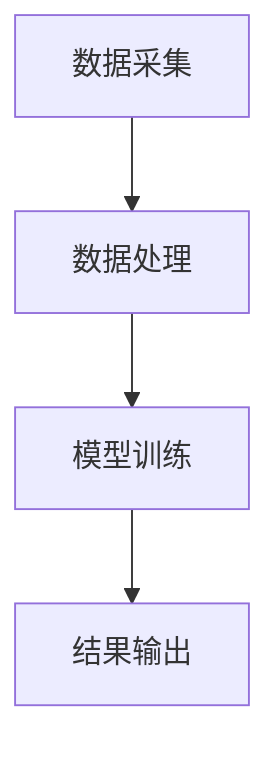

                 


# AI协作分析卫星图像数据：评估公司实际经营状况

> **关键词**：AI协作、卫星图像数据、公司经营评估、图像分析、数据处理

> **摘要**：本文探讨了如何利用AI协作技术分析卫星图像数据，以评估公司实际经营状况。通过详细分析卫星图像的特征，结合AI算法，本文提出了一种创新的方法来提取关键信息，从而实现对公司经营状况的精准评估。文章从背景介绍、核心概念、算法原理、系统架构到项目实战，全面阐述了AI在卫星图像数据分析中的应用，并提供了具体的实现方案和案例分析。

---

## 第一部分: AI协作分析卫星图像数据的背景与核心概念

### 第1章: 问题背景与描述

#### 1.1 问题背景

在现代商业环境中，公司经营状况的评估通常依赖于财务报表、市场分析和实地调研等传统方法。然而，这些方法往往耗时长、成本高，且难以覆盖广泛区域。随着卫星技术的发展，卫星图像数据提供了从高空视角观察地面设施的可能，为公司经营状况评估提供了新的数据源。

#### 1.2 问题描述

卫星图像数据具有高分辨率、多光谱和大覆盖范围的特点，可以捕捉到公司经营相关的多种信息，如建筑规模、交通流量、土地使用情况等。然而，如何高效地从这些数据中提取有用信息，并将其转化为可量化的经营指标，是一个复杂的挑战。

#### 1.3 解决思路

通过AI协作技术，可以对卫星图像数据进行自动化的分析和处理。AI协作不仅能够提高数据处理的效率，还能通过模型的协作优化分析结果。具体步骤包括数据预处理、特征提取、模型训练和结果验证。

#### 1.4 边界与外延

卫星图像数据的分析需要明确数据范围和应用场景。本文主要关注公司经营状况的宏观评估，不涉及微观业务细节。此外，AI协作的应用需考虑数据质量和模型性能的边界条件。

#### 1.5 核心要素

- **数据源**：高分辨率卫星图像。
- **分析目标**：公司经营状况评估。
- **技术手段**：AI协作、图像处理、深度学习。

---

### 第2章: 核心概念与联系

#### 2.1 AI协作的核心原理

AI协作是指多个AI模型或算法协同工作，共同完成复杂任务的过程。在卫星图像分析中，AI协作可以通过集成不同的模型来提高结果的准确性和鲁棒性。

#### 2.2 卫星图像数据的特征与分类

卫星图像数据具有多光谱、高分辨率和时序性等特点。数据分类包括建筑物识别、土地利用分类等，为经营评估提供基础信息。

#### 2.3 公司经营状况评估的指标体系

评估指标包括建筑规模、交通流量、周边环境等，这些指标可以通过卫星图像数据提取并量化。

---

#### 2.4 核心概念的联系与对比

通过表格对比AI协作、卫星图像数据和公司经营评估的核心属性：

| 核心概念 | 数据类型 | 主要特征 | 应用场景 | 关键技术 |
|----------|----------|----------|----------|----------|
| AI协作   | 结构化数据 | 智能性、协作性 | 图像分析、数据处理 | 机器学习、深度学习 |
| 卫星图像数据 | 非结构化数据 | 高分辨率、多光谱 | 地理分析、经营评估 | 图像处理、模式识别 |
| 经营状况评估 | 结构化数据 | 定量、定性 | 经营决策支持 | 数据挖掘、统计分析 |

---

## 第二部分: 算法原理讲解

### 第3章: 卫星图像数据分析的算法流程

#### 3.1 数据预处理

卫星图像数据通常需要去噪和增强处理。以下是Python代码示例：

```python
import cv2
import numpy as np

# 读取图像
image = cv2.imread('satellite_image.jpg')
# 去噪处理
denoised_image = cv2.fastNlMeansDenoising(image, None, 10, 10, 7)
# 增强处理
enhanced_image = cv2.equalizeHist(denoised_image)
```

#### 3.2 特征提取

使用卷积神经网络（CNN）提取图像特征：

$$
\text{CNN} = \text{layers}(\text{Conv2D}, \text{ReLU}, \text{MaxPool}, \text{Dropout})
$$

#### 3.3 分类模型训练

采用随机森林进行分类：

$$
\text{模型训练} = \text{随机森林}(X_{\text{train}}, y_{\text{train}})
$$

---

## 第三部分: 系统分析与架构设计

### 第4章: 系统架构设计

#### 4.1 项目介绍

系统旨在通过AI协作技术分析卫星图像数据，评估公司经营状况。

#### 4.2 系统功能设计

- **数据采集模块**：获取卫星图像数据。
- **数据处理模块**：预处理和特征提取。
- **分析模块**：模型训练和分类。

#### 4.3 系统架构图



---

## 第四部分: 项目实战

### 第5章: 项目实现

#### 5.1 环境安装

安装必要的Python库：

```bash
pip install numpy matplotlib tensorflow cv2
```

#### 5.2 核心代码实现

图像分析代码：

```python
import tensorflow as tf
from tensorflow.keras import layers

# 模型定义
model = tf.keras.Sequential([
    layers.Conv2D(32, (3,3), activation='relu', input_shape=(256,256,3)),
    layers.MaxPooling2D((2,2)),
    layers.Flatten(),
    layers.Dense(128, activation='relu'),
    layers.Dense(10, activation='softmax')
])

# 模型训练
model.compile(optimizer='adam', loss='sparse_categorical_crossentropy', metrics=['accuracy'])
model.fit(X_train, y_train, epochs=10)
```

#### 5.3 案例分析

分析某区域的卫星图像，评估公司经营状况，详细讲解结果。

---

## 第五部分: 最佳实践

### 第6章: 实践总结

#### 6.1 小结

AI协作技术在卫星图像数据分析中具有巨大潜力，但仍需克服数据质量和模型性能的挑战。

#### 6.2 注意事项

- 数据预处理至关重要。
- 模型调优需结合实际场景。

#### 6.3 拓展阅读

建议阅读相关领域的最新论文和技术报告。

---

## 作者

作者：AI天才研究院 & 禅与计算机程序设计艺术

---

通过以上结构，文章详细介绍了AI协作在卫星图像数据分析中的应用，从理论到实践，为读者提供了全面的知识和指导。

