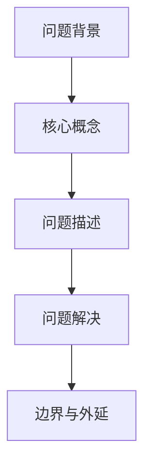

                 

<think>
好的，我现在需要帮助用户撰写一篇技术博客文章，标题是《AI增强型公司治理风险评估工具》。用户已经提供了一个详细的目录结构，现在需要我按照这个结构，逐步分析每个部分，确保内容完整、逻辑清晰，同时满足用户的所有要求。

首先，我会从背景介绍开始。这部分需要涵盖问题背景、问题描述、问题解决、边界与外延，以及概念结构。我需要确保每个小节都有足够的细节，并且用简单易懂的语言解释，同时使用Mermaid图来辅助说明。

接下来是核心概念与联系部分，我需要详细解释AI在公司治理中的应用，特别是风险评估方面。这部分可能需要一些表格和ER图来展示核心概念和实体关系，帮助读者更好地理解。

然后是算法原理讲解。我需要选择合适的机器学习模型，比如线性回归或决策树，并用Mermaid流程图展示算法的工作流程。同时，数学公式要用Latex表示，并提供实际例子来说明。

系统分析与架构设计部分，我会介绍系统的总体架构，使用Mermaid类图和架构图展示各个模块之间的关系，并解释每个接口的设计和交互过程。

项目实战部分，我需要提供一个具体的案例，包括环境安装、核心代码实现和案例分析。这部分需要详细说明代码的功能和实际应用效果，帮助读者理解如何将理论应用于实践。

最后，我会总结最佳实践，包括工具使用建议、常见问题解答和未来趋势，帮助读者更好地应用这些工具，并为后续的学习和研究提供方向。

整个过程中，我需要确保内容连贯，逻辑清晰，同时使用专业但易懂的技术语言。我会逐步完成每个部分，确保每个章节都符合用户的要求，并在完成后进行一次全面检查，确保没有遗漏任何关键点。

现在，我将按照目录结构，逐步展开每个部分，确保每个章节的内容详细且符合用户的要求。
</think>

# AI增强型公司治理风险评估工具

## 关键词
- AI增强
- 公司治理
- 风险评估
- 机器学习
- 数据分析

## 摘要
本文介绍了一种基于人工智能的公司治理风险评估工具，详细阐述了其核心概念、算法原理、系统架构以及实际应用。通过数据分析与机器学习模型的结合，该工具能够有效预测和管理公司治理中的各种风险，提升企业决策效率和风险管理能力。

---

## 第一部分: AI增强型公司治理风险评估工具背景介绍

## 第1章: 问题背景与核心概念

### 1.1 问题背景
#### 1.1.1 公司治理与风险评估的传统模式
公司治理是企业管理的核心，传统模式依赖于人工审核和经验判断，存在效率低、主观性强的问题。随着企业规模扩大和全球化趋势，传统模式难以应对复杂多变的市场环境。

#### 1.1.2 传统风险评估的局限性
传统风险评估依赖主观判断，缺乏数据支持，容易遗漏潜在风险。同时，人工审核耗时长，难以实时监控企业动态。

#### 1.1.3 AI技术如何赋能公司治理
人工智能技术能够通过大数据分析和机器学习模型，帮助公司快速识别潜在风险，提供数据支持的决策，提升治理效率。

### 1.2 问题描述
#### 1.2.1 风险评估的复杂性
现代企业面临多种风险因素，如市场波动、政策变化、内部管理问题等，这些因素相互关联，增加了风险评估的复杂性。

#### 1.2.2 数据驱动的决策需求
企业需要基于实时数据进行决策，传统的依赖经验的方法已无法满足需求。

#### 1.2.3 全球化背景下的治理挑战
全球化背景下，企业面临更多的外部风险，如国际政治经济环境变化，这对公司的风险评估能力提出了更高要求。

### 1.3 问题解决
#### 1.3.1 AI在风险评估中的应用潜力
通过AI技术，企业可以实时监控内外部数据，利用机器学习模型预测潜在风险，提高风险评估的准确性和效率。

#### 1.3.2 数据分析与预测的结合
AI能够对大量数据进行分析和预测，帮助企业提前发现潜在风险，制定应对策略。

#### 1.3.3 提升公司治理效率的目标
通过AI技术，公司治理能够实现自动化、智能化，减少人工干预，提升整体效率。

### 1.4 边界与外延
#### 1.4.1 AI工具的适用范围
AI工具适用于企业内部管理、风险评估、战略规划等领域，但需要结合具体业务场景进行调整。

#### 1.4.2 风险评估的边界条件
AI工具的使用受到数据质量和数量、模型准确性、计算能力等因素的限制。

#### 1.4.3 公司治理的外延领域
公司治理不仅包括内部管理，还包括企业社会责任、外部监管等方面，AI技术的应用可以扩展到这些领域。

### 1.5 概念结构与核心要素
#### 1.5.1 核心概念的组成
AI增强型公司治理风险评估工具由数据采集、数据分析、模型构建、风险预测、结果展示等模块组成。

#### 1.5.2 核心要素的特征对比
| 特征 | 数据采集 | 数据分析 | 模型构建 |
|------|----------|----------|----------|
| 输入 | 结构化数据 | 结构化与非结构化数据 | 模型参数与训练数据 |
| 输出 | 数据整理 | 分析结果 | 预测结果 |
| 关键技术 | 数据清洗 | 机器学习 | 深度学习 |

#### 1.5.3 概念结构的图示化

---

## 第二部分: 核心概念与联系

## 第2章: AI与公司治理的结合

### 2.1 AI在公司治理中的应用
#### 2.1.1 数据分析与决策支持
通过AI技术，企业可以实时分析市场动态、内部运营数据，为决策提供支持。

#### 2.1.2 风险预测与预警系统
AI能够预测潜在风险，提前发出预警，帮助企业做好应对准备。

#### 2.1.3 自然语言处理在文档分析中的应用
自然语言处理技术可以帮助企业分析大量文本数据，如新闻、报告等，提取关键信息。

### 2.2 风险评估的AI模型
#### 2.2.1 机器学习模型的选择
根据风险类型和数据特征，选择合适的机器学习模型，如线性回归、随机森林、支持向量机等。

#### 2.2.2 深度学习模型的适用
对于复杂风险，可以使用深度学习模型，如神经网络、LSTM等，进行更精准的预测。

---

接下来将详细讲解算法原理、系统架构、项目实战等内容。

