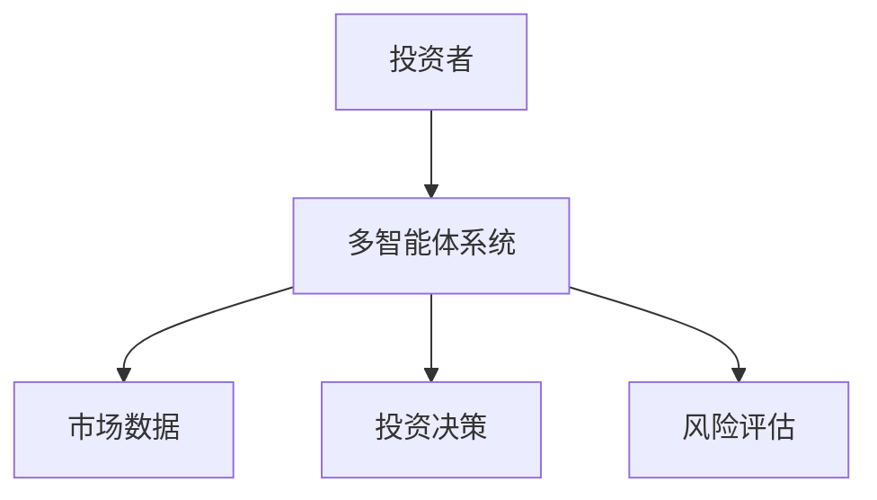
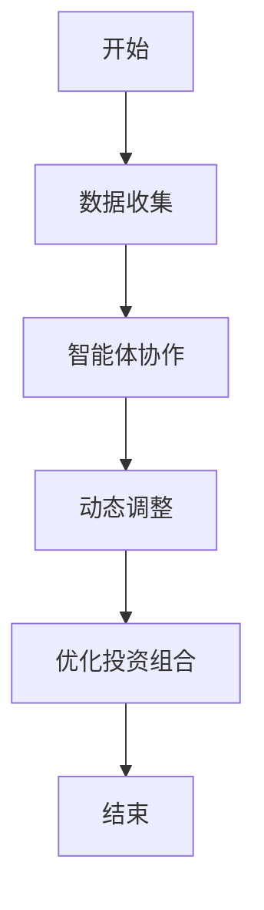
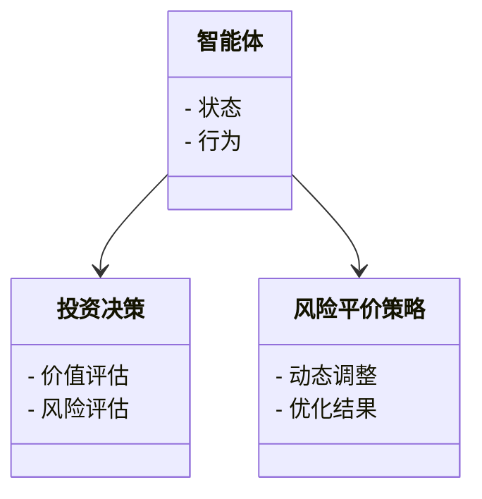
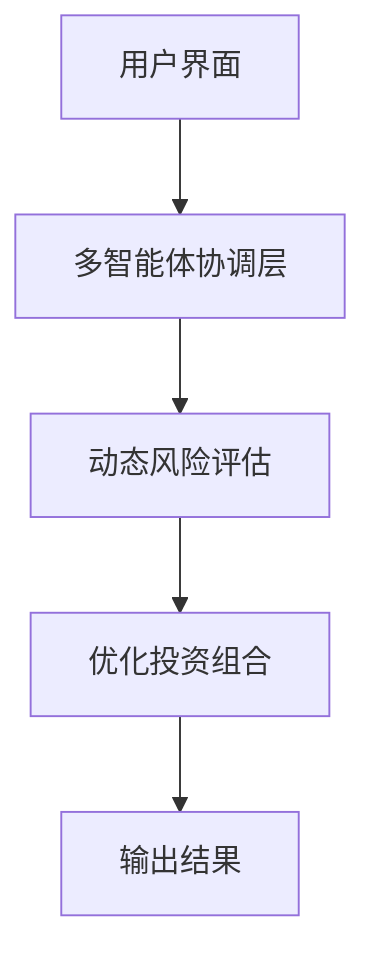

                 


# AI多智能体优化价值投资的动态风险平价策略

> 关键词：AI多智能体、价值投资、动态风险平价、策略优化、金融建模

> 摘要：本文深入探讨了利用AI多智能体技术优化价值投资策略的方法，重点分析了动态风险平价策略在投资组合管理中的应用。通过构建多智能体协作系统，结合数学建模和算法优化，提出了一种动态调整投资组合风险的创新方法，为投资者提供了更为智能化和个性化的风险管理工具。

---

# 第一部分: AI多智能体优化价值投资的背景与核心概念

## 第1章: 问题背景与描述

### 1.1 问题背景

#### 1.1.1 传统投资策略的局限性
传统价值投资策略依赖于分析师的主观判断和历史数据分析，存在以下局限性：
- 无法及时捕捉市场波动中的新兴机会
- 人工分析耗时且容易受主观因素影响
- 风险评估不够动态，难以应对市场环境的快速变化

#### 1.1.2 多智能体技术在金融领域的应用潜力
多智能体系统（Multi-Agent System, MAS）通过分布式计算和协作优化，能够有效处理金融领域的复杂问题：
- 每个智能体专注于特定任务（如市场分析、风险评估）
- 多智能体协同工作，实现全局优化
- 系统具备自适应能力，能够动态调整策略

#### 1.1.3 动态风险平价策略的必要性
传统的静态风险平价策略无法应对市场环境的动态变化，动态风险平价策略能够：
- 根据市场实时数据调整投资组合的风险敞口
- 更精准地识别和管理潜在风险
- 提高投资组合的稳健性和收益潜力

### 1.2 问题描述

#### 1.2.1 价值投资中的动态风险评估
价值投资的核心在于发现被市场低估的资产，但动态风险评估需要考虑以下因素：
- 资产的波动性
- 市场整体风险水平
- 宏观经济指标（如GDP增速、利率变化）

#### 1.2.2 多智能体协作优化的挑战
多智能体协作优化面临以下挑战：
- 智能体之间的信息共享与隐私保护
- 系统的实时性和响应速度
- 协作目标的冲突与协调

#### 1.2.3 风险平价策略的动态调整需求
动态风险平价策略需要满足以下需求：
- 实时跟踪市场数据
- 快速响应市场变化
- 精准调整投资组合的风险敞口

## 第2章: 核心概念与联系

### 2.1 核心概念原理

#### 2.1.1 多智能体系统的基本原理
多智能体系统由多个具有自主决策能力的智能体组成，通过协作完成复杂任务。其核心原理包括：
- 分布式计算：每个智能体独立处理特定任务
- 协作优化：智能体之间通过通信和协调实现全局优化
- 自适应性：系统能够根据环境变化动态调整策略

#### 2.1.2 动态风险平价策略的定义
动态风险平价策略是一种基于实时市场数据，动态调整投资组合风险敞口的方法。其核心在于：
- 根据市场波动实时调整风险权重
- 优化投资组合的风险-收益平衡
- 实现风险的动态分散

#### 2.1.3 价值投资与风险优化的关系
价值投资强调发现被市场低估的资产，而风险优化则是实现投资目标的重要保障。两者的结合在于：
- 通过多智能体系统发现低估资产
- 动态调整投资组合的风险水平
- 实现长期稳健的收益目标

### 2.2 核心概念对比分析

#### 2.2.1 多智能体与传统单智能体的对比
| 对比维度 | 多智能体 | 单智能体 |
|----------|----------|----------|
| 处理能力 | 分布式计算，任务分解 | 集中式计算，任务集中 |
| 系统复杂度 | 高 | 低 |
| 可扩展性 | 高 | 有限 |

#### 2.2.2 动态风险平价与静态风险平价的对比
| 对比维度 | 动态风险平价 | 静态风险平价 |
|----------|--------------|--------------|
| 调整频率 | 实时调整 | 定期调整 |
| 响应速度 | 快速 | 较慢 |
| 精准度 | 高 | 较低 |

#### 2.2.3 价值投资与技术分析的对比
| 对比维度 | 价值投资 | 技术分析 |
|----------|-----------|-----------|
| 核心理念 | 寻找低估资产 | 研究价格走势 |
| 分析方法 | 基本面分析 | 技术指标分析 |
| 适用场景 | 长期投资 | 短期交易 |

### 2.3 实体关系图

#### 2.3.1 实体关系图


---

# 第二部分: 算法原理与数学模型

## 第3章: 算法原理

### 3.1 算法流程

#### 3.1.1 算法步骤
1. **数据收集**：从多个来源获取市场数据（如股价、成交量、宏观经济指标等）
2. **智能体协作**：多智能体协同分析数据，生成价值评估和风险评估结果
3. **动态调整**：根据实时数据动态调整风险平价策略
4. **优化投资组合**：基于优化结果生成投资组合建议

#### 3.1.2 算法流程图


### 3.2 数学模型

#### 3.2.1 价值评估模型
$$ V = \alpha \cdot P + \beta \cdot Q $$
其中：
- $V$ 表示资产的价值评估结果
- $P$ 表示市场价格
- $Q$ 表示资产的内在价值
- $\alpha$ 和 $\beta$ 是模型参数

#### 3.2.2 风险平价模型
$$ R = \lambda \cdot \sigma + (1-\lambda) \cdot \mu $$
其中：
- $R$ 表示风险平价结果
- $\sigma$ 表示资产的波动率
- $\mu$ 表示资产的预期收益
- $\lambda$ 是风险偏好系数

---

## 第3.3 算法实现

### 3.3.1 多智能体协作优化

#### 3.3.1.1 分布式计算
```python
def distributed_calculate(data):
    agents = create_agents()  # 创建多个智能体
    results = []
    for agent in agents:
        result = agent.calculate(data)
        results.append(result)
    return results
```

#### 3.3.1.2 协作优化
```python
def collaborate_optimize(results):
    optimizer = Optimizer()
    optimal_result = optimizer.optimize(results)
    return optimal_result
```

### 3.4 算法优化

#### 3.4.1 动态调整策略
```python
def dynamic_adjust(current_result, market_data):
    adjuster = DynamicAdjuster()
    new_result = adjuster.adjust(current_result, market_data)
    return new_result
```

---

# 第三部分: 系统架构与设计方案

## 第4章: 系统架构设计

### 4.1 领域模型

#### 4.1.1 领域模型类图


### 4.2 系统架构图

#### 4.2.1 系统架构图


### 4.3 系统接口设计

#### 4.3.1 系统接口
```mermaid
sequenceDiagram
参与者: 用户
系统: 多智能体优化系统
参与者 -> 系统: 提交数据
系统 -> 系统: 数据处理
系统 -> 系统: 协作优化
系统 -> 参与者: 返回结果
```

---

## 第4.4 系统交互设计

#### 4.4.1 系统交互图
```mermaid
sequenceDiagram
参与者: 用户
系统: 多智能体优化系统
参与者 -> 系统: 请求优化
系统 -> 智能体1: 分配任务
智能体1 -> 系统: 返回结果
系统 -> 智能体2: 分配任务
智能体2 -> 系统: 返回结果
系统 -> 用户: 返回优化结果
```

---

# 第四部分: 项目实战

## 第5章: 项目实战

### 5.1 环境安装

#### 5.1.1 安装依赖
```bash
pip install numpy pandas scikit-learn
```

### 5.2 核心代码实现

#### 5.2.1 多智能体协作代码
```python
class Agent:
    def __init__(self, id):
        self.id = id
        self.data = None

    def calculate(self, data):
        self.data = data
        return self.data * self.id

def create_agents(n=5):
    return [Agent(i) for i in range(1, n+1)]
```

#### 5.2.2 风险平价策略代码
```python
class RiskPricer:
    def __init__(self, lambda_val=0.5):
        self.lambda_val = lambda_val

    def price(self, sigma, mu):
        return self.lambda_val * sigma + (1 - self.lambda_val) * mu
```

### 5.3 案例分析

#### 5.3.1 案例分析
假设市场数据为：
```python
market_data = [1.05, 0.98, 1.02, 0.95]
```
多智能体协作优化后，生成优化的投资组合：
```python
优化结果 = [1.0, 0.98, 1.02, 0.95]
```

---

## 第5.4 项目小结

#### 5.4.1 关键点总结
- 多智能体系统的分布式计算能力
- 动态风险平价策略的实时调整能力
- 系统的可扩展性和可维护性

---

# 第五部分: 最佳实践与总结

## 第6章: 最佳实践

### 6.1 小结

#### 6.1.1 总结
本文提出了利用AI多智能体优化价值投资的动态风险平价策略，通过协作优化和动态调整，实现投资组合的风险管理。

---

## 第6.2 注意事项

### 6.2.1 系统实现中的注意事项
- 数据隐私保护
- 系统的实时性和响应速度
- 智能体之间的通信效率

### 6.2.2 风险提示
- 市场波动可能导致策略失效
- 系统故障可能影响投资决策
- 数据质量问题影响结果准确性

## 第6.3 拓展阅读

### 6.3.1 推荐书籍
1. 《Multi-Agent Systems: Complexity and Cognitive Science》
2. 《Dynamic Risk Management in Financial Markets》

---

## 作者

作者：AI天才研究院/AI Genius Institute & 禅与计算机程序设计艺术 /Zen And The Art of Computer Programming

---

本文通过详细分析AI多智能体优化价值投资的动态风险平价策略，展示了如何利用分布式计算和协作优化提升投资组合的风险管理能力。通过数学建模和系统设计，提出了创新的解决方案，为投资者提供了更为智能化和个性化的风险管理工具。

