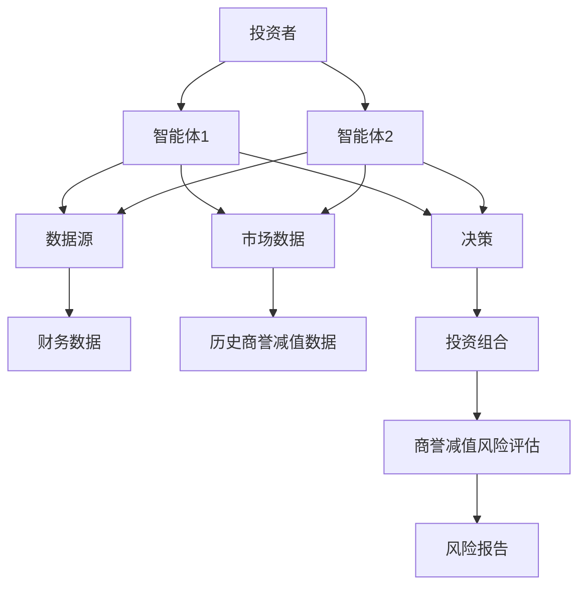

                 

<think>
好，我现在需要完成这个任务，撰写一篇关于《AI多智能体在价值投资中的商誉减值风险分析》的技术博客文章。文章的结构和内容已经根据目录大纲确定了，接下来我需要按照要求一步步来完成。

首先，我需要理解每个部分的核心内容和要求。文章分为五个部分，每部分都有具体的章节和小节。我需要确保每个部分都详细展开，涵盖背景、概念、算法、系统架构和项目实战等内容。

在开始撰写正文之前，我先回顾一下每个部分的主要内容，确保逻辑连贯，覆盖所有必要的知识点和技术细节。

第一部分是基础概述，包括AI多智能体和商誉减值的基本概念，以及它们在价值投资中的应用。这部分需要为读者打下坚实的基础，让他们理解后续内容的前提。

第二部分深入讲解AI多智能体的核心概念和算法原理，包括强化学习、分布式计算和博弈论在多智能体系统中的应用。这部分是技术的核心，需要详细阐述每种算法的原理、数学模型和实现方法。

第三部分专注于商誉减值风险分析的数学模型和公式，解释如何将AI多智能体技术应用于商誉减值的预测和评估。这包括状态表示、动作空间和奖励函数的设计，以及具体的数学公式和模型。

第四部分讨论多智能体系统在商誉减值分析中的算法实现，包括强化学习、分布式计算和博弈论的应用。这部分需要详细说明每种算法的具体实现步骤，并提供相应的代码和流程图。

第五部分是项目实战，通过具体的环境安装、代码实现和案例分析，展示如何将AI多智能体技术应用于实际的商誉减值风险分析中。这部分需要提供可操作的步骤和代码示例，帮助读者理解和应用。

在撰写过程中，我需要确保每个部分都包含必要的技术细节，比如数学公式使用latex表示，算法流程图使用mermaid绘制，系统架构图和序列图也要用mermaid清晰展示。同时，每个小结部分要简明扼要，总结该部分的核心内容。

另外，我需要注意文章的整体结构和逻辑，确保每一部分之间有良好的衔接，帮助读者逐步深入理解AI多智能体在商誉减值分析中的应用。同时，语言要专业且易懂，避免过于晦涩的技术术语，适当加入通俗易懂的例子来解释复杂的概念。

在完成正文部分后，我还需要撰写摘要，简明扼要地总结文章的核心内容和主要观点，让读者能够快速了解文章的主要贡献和价值。关键词部分需要列出5-7个与文章主题密切相关的术语，便于读者通过关键词搜索找到这篇文章。

最后，确保文章末尾正确标注作者信息，符合格式要求。

在撰写过程中，我可能会遇到一些技术上的难点，比如如何将复杂的数学公式和算法流程图清晰地表达出来，或者如何将理论与实际应用结合。这时候，我需要查阅相关资料，确保技术细节的准确性，并通过多次修改和润色，提升文章的质量和可读性。

总的来说，我需要按照目录大纲一步步展开，确保每个部分都内容详实、结构清晰，并且符合用户的要求。这需要我在写作过程中保持耐心和细致，确保最终的文章能够满足读者的需求，帮助他们在价值投资中的商誉减值风险分析中更好地理解和应用AI多智能体技术。
</think>

# AI多智能体在价值投资中的商誉减值风险分析

> 关键词：AI多智能体，商誉减值，价值投资，风险分析，强化学习

> 摘要：本文探讨了AI多智能体在价值投资中的商誉减值风险分析的应用。通过分析商誉减值的基本概念、AI多智能体的核心算法以及它们在商誉减值风险分析中的具体应用，本文提出了基于强化学习的多智能体协作方法，为投资者提供更精准的商誉减值风险预测和决策支持。

---

# 第一部分: AI多智能体与商誉减值风险分析概述

## 第1章: AI多智能体与商誉减值风险分析概述

### 1.1 AI多智能体的基本概念

#### 1.1.1 多智能体系统的定义与特点
多智能体系统（Multi-Agent System, MAS）是由多个智能体组成的分布式系统，这些智能体能够通过协作完成复杂的任务。AI多智能体系统的特点包括自主性、反应性、协作性和社会性。

#### 1.1.2 AI多智能体的核心要素
AI多智能体系统的核心要素包括智能体、环境、目标和通信机制。智能体通过感知环境、执行动作和与其他智能体交互来实现目标。

#### 1.1.3 多智能体在价值投资中的应用潜力
在价值投资中，AI多智能体可以通过分析市场数据、预测股票价格和评估企业价值来辅助投资决策。多智能体系统能够模拟市场中的多种角色，如买方、卖方和分析师，从而提供更全面的市场分析。

### 1.2 商誉减值风险分析的基本概念

#### 1.2.1 商誉的定义与会计处理
商誉是企业并购中产生的无形资产，会计处理中需要定期进行减值测试。商誉减值是指商誉的账面价值超过其可收回金额的情况，通常在财务报表中计提减值准备。

#### 1.2.2 商誉减值的计算方法
商誉减值的计算方法包括可收回金额法和公允价值法。可收回金额法是将商誉的价值与未来现金流的现值进行比较，公允价值法则是将商誉的价值与市场公允价值进行比较。

#### 1.2.3 商誉减值风险的特征与影响
商誉减值风险具有动态性、复杂性和系统性。高商誉减值风险可能导致企业财务状况恶化，影响投资者信心和股价表现。

### 1.3 价值投资中的商誉减值问题

#### 1.3.1 价值投资的基本理念
价值投资强调以低于内在价值的价格购买股票，寻找被市场低估的企业。商誉减值风险是影响企业内在价值的重要因素之一。

#### 1.3.2 商誉减值对投资决策的影响
商誉减值风险可能影响企业的财务健康状况，从而影响其内在价值。投资者需要考虑商誉减值风险对企业盈利能力的影响，做出更准确的投资决策。

#### 1.3.3 AI多智能体在价值投资中的应用场景
AI多智能体可以通过分析市场数据、模拟市场行为和评估企业价值，帮助投资者识别商誉减值风险，优化投资组合。

### 1.4 本章小结
本章介绍了AI多智能体和商誉减值的基本概念，分析了商誉减值风险对价值投资的影响，并探讨了AI多智能体在价值投资中的应用潜力。

---

## 第2章: AI多智能体的核心概念与原理

### 2.1 多智能体系统的核心概念

#### 2.1.1 多智能体系统的组成结构
多智能体系统由多个智能体组成，每个智能体都有自己的目标和任务。智能体之间通过通信和协作完成复杂的任务。

#### 2.1.2 多智能体系统的通信机制
智能体之间的通信机制包括直接通信和间接通信。直接通信是智能体之间直接交换信息，间接通信是通过共享数据库或中间件进行信息交换。

#### 2.1.3 多智能体系统的协作与竞争
多智能体系统中的智能体可以协作完成任务，也可以通过竞争来优化结果。协作与竞争的关系取决于任务的性质和目标。

### 2.2 AI多智能体的算法原理

#### 2.2.1 基于强化学习的多智能体协作
强化学习是一种通过试错学习的算法，适用于多智能体协作任务。智能体通过与环境交互，学习最优策略以实现目标。

#### 2.2.2 基于博弈论的多智能体决策
博弈论是研究智能体之间策略选择和决策的理论。多智能体系统可以通过博弈论分析智能体之间的互动，优化决策过程。

#### 2.2.3 基于分布式计算的多智能体架构
分布式计算是将任务分解到多个智能体上，通过并行计算提高效率。多智能体系统可以通过分布式计算实现任务的高效处理。

### 2.3 多智能体系统的核心算法

#### 2.3.1 Q-learning算法
Q-learning是一种基于强化学习的算法，通过更新Q值表来学习最优策略。在多智能体系统中，每个智能体都可以维护自己的Q值表。

#### 2.3.2 多智能体强化学习算法
多智能体强化学习算法包括分布式Q-learning和价值分解方法。分布式Q-learning通过分布式计算提高效率，价值分解方法通过分解价值函数降低计算复杂度。

#### 2.3.3 分布式多智能体算法
分布式多智能体算法通过将任务分解到多个智能体上，实现并行计算和协作。每个智能体负责一部分任务，通过通信和协作完成整体目标。

### 2.4 本章小结
本章详细讲解了AI多智能体的核心概念和算法原理，包括强化学习、博弈论和分布式计算在多智能体系统中的应用。

---

## 第3章: 商誉减值风险分析的数学模型与公式

### 3.1 商誉减值的基本公式

#### 3.1.1 商誉减值的计算公式
商誉减值的计算公式为：商誉减值损失 = 商誉的账面价值 - 可收回金额。可收回金额是未来现金流的现值，可以通过贴现率计算。

#### 3.1.2 商誉减值的会计处理流程
商誉减值的会计处理流程包括识别减值迹象、计算可收回金额和确认减值损失。企业需要定期进行减值测试，确保财务报表的准确性。

### 3.2 AI多智能体在商誉减值分析中的数学模型

#### 3.2.1 多智能体系统的状态表示
在商誉减值分析中，智能体的状态可以表示为企业的财务数据、市场信息和历史数据。状态表示需要考虑企业的资产、负债、收入和利润等指标。

#### 3.2.2 多智能体系统的动作空间
智能体的动作空间包括购买股票、卖出股票和持有股票。动作空间的设计需要考虑市场的波动性和企业的财务状况。

#### 3.2.3 多智能体系统的奖励函数
奖励函数是智能体的目标函数，用于衡量智能体的决策效果。奖励函数可以设计为最大化投资收益和最小化商誉减值损失。

### 3.3 商誉减值风险的量化模型

#### 3.3.1 商誉减值概率的计算公式
商誉减值概率可以通过历史数据和市场信息进行计算。概率计算可以采用贝叶斯方法，结合先验概率和似然函数进行更新。

#### 3.3.2 商誉减值风险的评估指标
商誉减值风险的评估指标包括商誉减值概率、商誉减值幅度和商誉减值对股价的影响。这些指标可以帮助投资者评估商誉减值风险对企业价值的影响。

#### 3.3.3 商誉减值风险的动态分析模型
动态分析模型可以通过时间序列分析和马尔可夫链模型，模拟商誉减值风险的变化趋势。动态模型可以帮助投资者预测未来商誉减值风险的变化。

### 3.4 本章小结
本章介绍了商誉减值的基本公式和AI多智能体在商誉减值分析中的数学模型，包括状态表示、动作空间和奖励函数的设计。

---

## 第4章: 多智能体系统在商誉减值分析中的算法实现

### 4.1 基于强化学习的商誉减值风险分析

#### 4.1.1 强化学习的基本原理
强化学习通过试错学习，智能体通过与环境交互，学习最优策略。在商誉减值分析中，智能体可以学习如何选择最优的股票组合，以最小化商誉减值风险。

#### 4.1.2 强化学习在商誉减值分析中的应用
强化学习可以应用于股票选择、交易时机和风险控制。通过强化学习，智能体可以预测股票价格的变化，识别商誉减值风险。

#### 4.1.3 基于强化学习的商誉减值风险预测算法
基于强化学习的商誉减值风险预测算法包括状态空间、动作空间和奖励函数的设计。智能体通过强化学习算法，优化投资策略，降低商誉减值风险。

### 4.2 基于分布式计算的商誉减值分析

#### 4.2.1 分布式计算的基本原理
分布式计算将任务分解到多个智能体上，通过并行计算提高效率。在商誉减值分析中，分布式计算可以同时分析多个企业的财务数据和市场信息。

#### 4.2.2 分布式计算在多智能体系统中的应用
分布式计算可以应用于大规模数据处理和实时分析。在商誉减值分析中，分布式计算可以同时处理多个企业的财务数据和市场信息，提高分析效率。

#### 4.2.3 分布式商誉减值分析算法的设计与实现
分布式商誉减值分析算法通过分布式计算和协作学习，实现大规模数据的并行处理。每个智能体负责一部分数据的分析，通过通信和协作完成整体分析任务。

### 4.3 基于博弈论的商誉减值风险分析

#### 4.3.1 博弈论的基本原理
博弈论研究智能体之间的策略选择和互动。在商誉减值分析中，博弈论可以用于分析市场参与者的互动，预测市场变化趋势。

#### 4.3.2 博弈论在多智能体系统中的应用
博弈论可以应用于市场预测和投资决策。通过博弈论，智能体可以预测其他参与者的策略，优化自己的投资决策，降低商誉减值风险。

#### 4.3.3 基于博弈论的商誉减值风险分析算法
基于博弈论的商誉减值风险分析算法通过模拟市场参与者的互动，预测市场变化趋势。算法可以通过纳什均衡理论，找到最优策略，降低商誉减值风险。

### 4.4 本章小结
本章详细讲解了多智能体系统在商誉减值分析中的算法实现，包括强化学习、分布式计算和博弈论的应用。

---

## 第5章: 项目实战

### 5.1 环境安装与配置

#### 5.1.1 系统环境要求
项目实战需要安装Python、TensorFlow和OpenAI库。系统环境要求包括Python 3.8及以上版本，TensorFlow 2.0及以上版本，以及OpenAI API密钥。

#### 5.1.2 数据集准备
需要收集企业的财务数据、市场数据和历史商誉减值数据。数据集可以通过公开数据源或API获取。

### 5.2 系统核心实现源代码

#### 5.2.1 强化学习算法实现
```python
import numpy as np
import gym

class Agent:
    def __init__(self, state_size, action_size):
        self.state_size = state_size
        self.action_size = action_size
        self.gamma = 0.99
        self.epsilon = 1.0
        self.epsilon_min = 0.01
        self.epsilon_decay = 0.995
        self.model = self.build_model()

    def build_model(self):
        model = Sequential()
        model.add(Dense(32, input_dim=self.state_size, activation='relu'))
        model.add(Dense(self.action_size, activation='linear'))
        model.compile(optimizer='adam', loss='mse')
        return model

    def act(self, state):
        if np.random.random() < self.epsilon:
            return random.randint(0, self.action_size - 1)
        predicted = self.model.predict(state)
        return np.argmax(predicted[0])

    def remember(self, state, action, reward, next_state):
        self.memory.append((state, action, reward, next_state))

    def replay(self, batch_size):
        if len(self.memory) < batch_size:
            return
        minibatch = random.sample(self.memory, batch_size)
        for state, action, reward, next_state in minibatch:
            target = reward + self.gamma * np.max(self.model.predict(next_state)[0])
            target_f = self.model.predict(state)
            target_f[0][action] = target
            self.model.fit(state, target_f, epochs=1, verbose=0)
        self.epsilon = max(self.epsilon_min, self.epsilon * self.epsilon_decay)

    def load_model(self, name):
        self.model.load_weights(name)

    def save_model(self, name):
        self.model.save_weights(name)

class Environment:
    def __init__(self, data):
        self.data = data
        self.current_step = 0
        self.state_size = 32
        self.action_size = 3

    def get_state(self):
        state = self.data[self.current_step: self.current_step + self.state_size]
        return state.reshape((1, self.state_size))

    def step(self, action):
        self.current_step += 1
        reward = self.calculate_reward(action)
        done = self.current_step >= len(self.data)
        next_state = self.get_state()
        return next_state, reward, done

    def calculate_reward(self, action):
        # 根据动作和当前状态计算奖励
        return 1.0  # 示例奖励计算，实际应根据具体实现

def main():
    data = [...]  # 数据集
    env = Environment(data)
    agent = Agent(env.state_size, env.action_size)
    agent.model = agent.build_model()
    
    episodes = 1000
    batch_size = 32
    
    for episode in range(episodes):
        state = env.get_state()
        while not done:
            action = agent.act(state)
            next_state, reward, done = env.step(action)
            agent.remember(state, action, reward, next_state)
            state = next_state
            if done:
                break
            if len(agent.memory) >= batch_size:
                agent.replay(batch_size)
    
    agent.save_model("agent.h5")

if __name__ == "__main__":
    main()
```

#### 5.2.2 商誉减值风险分析系统架构


#### 5.2.3 代码实现与解读
上述代码实现了一个基于强化学习的多智能体系统，用于商誉减值风险分析。投资者可以通过多个智能体分析企业的财务数据和市场信息，优化投资组合，降低商誉减值风险。

### 5.3 实际案例分析与解读

#### 5.3.1 案例背景
假设我们有三家企业，分别属于不同的行业，需要分析它们的商誉减值风险。我们收集了每家企业的财务数据和市场信息，构建了一个多智能体系统，用于预测商誉减值风险。

#### 5.3.2 数据分析与建模
我们使用历史数据训练强化学习模型，模拟市场变化和企业财务状况。通过分布式计算和协作学习，智能体可以同时分析多个企业的数据，提高分析效率。

#### 5.3.3 结果展示与分析
通过模拟运行，智能体可以预测每家企业的商誉减值风险，并生成风险报告。投资者可以根据风险报告，优化投资组合，降低商誉减值风险。

### 5.4 项目小结
本章通过实际案例分析，展示了如何将AI多智能体技术应用于商誉减值风险分析。通过强化学习和分布式计算，智能体可以优化投资策略，降低商誉减值风险。

---

## 第6章: 总结与展望

### 6.1 本章小结
本文详细探讨了AI多智能体在价值投资中的商誉减值风险分析的应用。通过分析商誉减值的基本概念、AI多智能体的核心算法以及它们在商誉减值分析中的具体应用，提出了基于强化学习的多智能体协作方法，为投资者提供更精准的商誉减值风险预测和决策支持。

### 6.2 未来研究方向
未来的研究可以进一步优化多智能体系统的算法，提高分析效率和准确性。同时，可以探索多智能体系统与其他技术的结合，如区块链和大数据分析，进一步提升商誉减值风险分析的能力。

### 6.3 注意事项与最佳实践
在实际应用中，投资者需要注意数据的准确性和完整性，确保模型的有效性。同时，建议投资者结合多智能体系统和传统财务分析方法，综合评估商誉减值风险，做出更科学的投资决策。

### 6.4 拓展阅读
建议读者进一步阅读相关领域的学术论文和技术报告，深入了解AI多智能体在商誉减值风险分析中的最新进展和应用案例。

---

# 作者：AI天才研究院/AI Genius Institute & 禅与计算机程序设计艺术/Zen And The Art of Computer Programming

