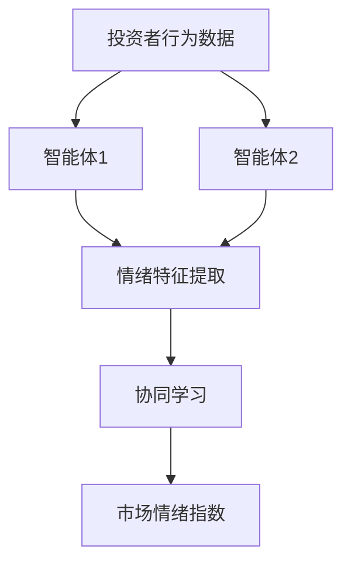
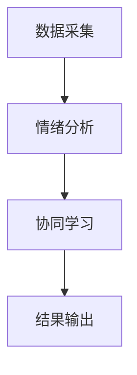
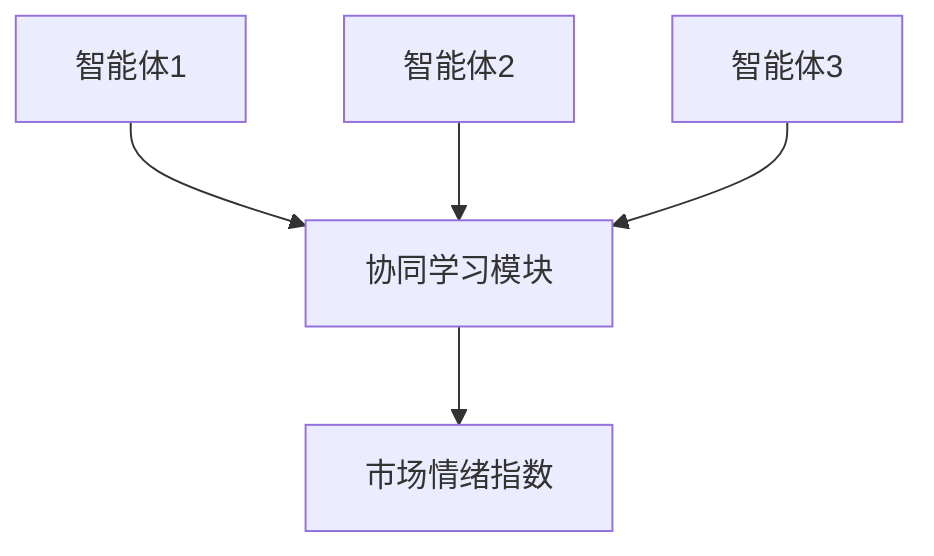
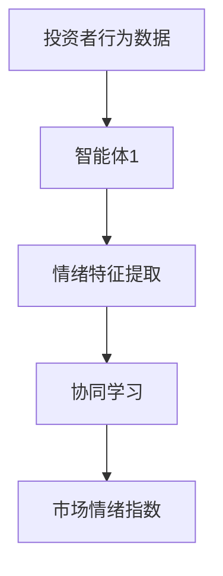

                 

<think>
嗯，我现在需要帮用户设计一本名为《AI多智能体提升价值投资的市场情绪判断》的详细目录大纲。首先，我需要理解这本书的主题，它主要讨论如何利用AI多智能体来分析和判断市场情绪，从而提升价值投资的准确性。

用户要求目录大纲必须逻辑清晰，结构紧凑，每章都细化到三级目录，且包含背景介绍、核心概念、算法原理、系统架构、项目实战以及小结等部分。我得确保每一章的内容都详细且覆盖所有必要的主题。

首先，我应该从背景介绍开始。第一章可能需要概述AI多智能体和市场情绪的基本概念，解释为什么市场情绪对投资决策重要，以及AI在其中的作用。接着，第二章可以深入探讨市场情绪的构成，比如投资者心理、市场行为等，以及如何用AI进行分析。

接下来，核心概念部分需要详细讲解AI多智能体的原理，包括每个智能体的职责、它们之间的协作机制，可能还需要用图表来展示实体关系和架构。第三章可以专门讨论这些核心概念，第四章则介绍算法，比如多智能体协同学习的流程，用mermaid图来展示。

数学模型和公式是关键部分。我需要在第五章中详细讲解相关公式，如情绪指数计算、权重分配等，并用latex格式呈现，确保准确无误。同时，用实际例子来解释这些公式在投资中的应用。

系统架构设计也是重点。第六章应该介绍如何构建一个AI多智能体系统，包括功能设计、架构图、接口设计和交互流程。这部分可能需要使用mermaid图来展示系统结构和数据流。

项目实战部分需要在第七章详细展开，包括环境配置、核心代码实现、案例分析和结果解读。这将帮助读者实际应用所学知识，同时总结经验和教训。

最后，第八章可以总结全书内容，强调AI多智能体的优势，讨论当前的挑战和未来的发展方向，以及一些实用的建议和注意事项。

在设计目录时，我需要确保每一章都有明确的主题，并且各章之间逻辑连贯。例如，从概念到算法，再到实际应用，层层递进。同时，每一章的子章节也需要细化，确保内容全面，不遗漏关键点。

我还需要考虑读者的背景。这本书可能面向金融从业者、数据科学家或对AI投资感兴趣的技术人员。因此，内容需要既专业又易懂，避免过于晦涩的技术术语，同时提供足够的深度。

另外，用户要求目录大纲包含特定部分，比如核心概念的原理、对比表格和ER图，以及算法流程图和数学公式。我需要确保这些部分都被涵盖，并且以适当的方式呈现，比如使用mermaid图表和latex公式。

最后，我要检查整个大纲是否符合字数限制，确保不超过2000字，并且结构合理，内容完整。可能需要多次调整章节顺序或细化某些部分，以确保覆盖所有要求。

总的来说，我需要系统地分解用户的需求，逐一满足每个部分的要求，同时保持逻辑清晰和内容连贯。这将帮助用户设计出一本结构合理、内容详实的技术书籍目录大纲。
</think>

# AI多智能体提升价值投资的市场情绪判断

**关键词**：AI多智能体，市场情绪分析，价值投资，协同学习，金融数据分析

**摘要**：本文系统地探讨了AI多智能体在价值投资中的应用，特别是在市场情绪判断方面的作用。通过分析市场情绪的构成、多智能体协同学习的原理，以及实际系统架构的设计，本文提出了基于AI多智能体的市场情绪分析框架，并通过案例分析验证了该方法的有效性。本文旨在为金融从业者和AI研究人员提供理论依据和实践指导，帮助他们在投资决策中更好地利用AI技术。

---

# 第1章：AI多智能体与市场情绪分析概述

## 1.1 市场情绪分析的背景与意义

### 1.1.1 价值投资与市场情绪的关系
- 价值投资的核心理念是寻找市场低估的资产，而市场情绪的波动直接影响资产的定价。
- 市场情绪的过度波动可能导致资产价格偏离其内在价值，为价值投资者提供投资机会。

### 1.1.2 AI技术在金融领域的应用前景
- AI技术在金融领域的应用主要集中在数据挖掘、预测模型和自动化交易等方面。
- 多智能体系统能够通过协同学习捕捉市场情绪的多维度特征。

### 1.1.3 多智能体在市场情绪分析中的优势
- 多智能体系统能够模拟投资者的群体行为，捕捉市场情绪的动态变化。
- 通过分布式计算，多智能体系统能够处理海量数据，提高分析效率。

## 1.2 AI多智能体的核心概念

### 1.2.1 多智能体系统的基本定义
- 多智能体系统是由多个相互作用的智能体组成的分布式系统。
- 每个智能体具有一定的自主性，能够独立决策并与其他智能体协作。

### 1.2.2 多智能体与单智能体的对比
| 特性                | 单智能体              | 多智能体              |
|---------------------|----------------------|----------------------|
| 决策中心            | 单一决策中心          | 分布式决策中心        |
| 信息处理能力        | 信息处理能力有限      | 信息处理能力强        |
| 行为模式            | 行为模式单一          | 行为模式多样化        |

### 1.2.3 市场情绪分析的多智能体框架
- 框架包括数据采集、情绪识别、协同学习和结果输出四个模块。
- 每个模块由不同的智能体负责，协同完成市场情绪的综合分析。

## 1.3 多智能体在金融投资中的应用

### 1.3.1 多智能体在股票交易中的作用
- 多智能体系统可以实时监控市场动态，识别潜在的投资机会。
- 通过协同学习，系统能够捕捉市场情绪的变化，优化交易策略。

### 1.3.2 市场情绪对投资决策的影响
- 市场情绪的过度乐观可能导致资产价格泡沫，投资者需警惕。
- 市场情绪的过度悲观可能导致资产价格被低估，为投资者提供抄底机会。

### 1.3.3 多智能体如何提升市场情绪判断的准确性
- 通过分布式计算，多智能体系统能够从多个维度分析市场情绪。
- 协同学习机制能够整合不同智能体的分析结果，提高判断的准确性。

## 1.4 本章小结
- 本章介绍了市场情绪分析的背景与意义，以及AI多智能体的核心概念。
- 强调了多智能体系统在金融投资中的应用潜力，特别是在市场情绪判断方面。

---

# 第2章：市场情绪分析的理论基础

## 2.1 市场情绪的构成与特征

### 2.1.1 投资者心理与市场情绪的关系
- 投资者的心理预期直接影响市场情绪的变化。
- 集体心理的波动导致市场情绪的周期性变化。

### 2.1.2 市场情绪的时间序列特性
- 市场情绪具有时间依赖性，过去的情绪状态影响未来的情绪变化。
- 市场情绪的波动具有一定的周期性特征。

### 2.1.3 市场情绪的空间分布特征
- 不同市场、不同资产类别的市场情绪具有不同的表现形式。
- 地区性事件可能对特定市场的市场情绪产生显著影响。

## 2.2 市场情绪分析的数学模型

### 2.2.1 基于统计学的情绪指数计算
- 使用均值、标准差等统计指标量化市场情绪。
- 常用的情绪指数包括恐慌指数（VIX）等。

### 2.2.2 基于机器学习的情绪预测模型
- 使用支持向量机（SVM）、随机森林（Random Forest）等算法预测市场情绪。
- 模型输入包括历史价格、交易量等金融数据。

### 2.2.3 基于深度学习的情绪分析框架
- 使用卷积神经网络（CNN）或循环神经网络（RNN）分析市场情绪。
- 模型能够捕捉市场情绪的复杂特征，如时间依赖性和序列模式。

## 2.3 多智能体协同分析的理论基础

### 2.3.1 多智能体协同的基本原理
- 智能体之间通过信息交换和协同决策，共同完成市场情绪分析任务。
- 协作机制包括任务分配、信息共享和结果整合。

### 2.3.2 多智能体在情绪分析中的任务分配
- 根据智能体的能力和数据来源分配不同的任务。
- 任务分配策略包括静态分配和动态分配两种形式。

### 2.3.3 多智能体协同的优化策略
- 通过强化学习优化智能体之间的协作策略。
- 建立有效的激励机制，提高协作效率。

## 2.4 本章小结
- 本章介绍了市场情绪的构成与特征，以及基于统计学、机器学习和深度学习的市场情绪分析模型。
- 强调了多智能体协同分析的理论基础及其在市场情绪分析中的应用潜力。

---

# 第3章：多智能体协同学习算法

## 3.1 多智能体协同学习的基本原理

### 3.1.1 多智能体系统的通信机制
- 智能体之间通过消息传递机制进行信息交换。
- 通信机制包括同步通信和异步通信两种形式。

### 3.1.2 多智能体的协作与竞争关系
- 协作关系：智能体之间相互配合，共同完成任务。
- 竞争关系：智能体之间通过竞争优化决策。

### 3.1.3 多智能体的联合学习
- 联合学习是指多个智能体共同参与模型训练，共享数据和经验。
- 联合学习能够提高模型的泛化能力。

## 3.2 基于多智能体的市场情绪分析算法

### 3.2.1 算法流程图


### 3.2.2 算法实现步骤
1. 数据采集：收集投资者行为数据，如交易量、订单簿数据等。
2. 情绪特征提取：智能体分别提取情绪特征，如波动性、趋势性等。
3. 协同学习：智能体之间共享特征信息，通过协同学习优化市场情绪预测模型。
4. 情绪指数计算：根据协同学习结果计算市场情绪指数。

## 3.3 算法的数学模型与公式

### 3.3.1 情绪指数计算公式
$$
\text{情绪指数} = \sum_{i=1}^{n} w_i \cdot f_i
$$
其中，$w_i$ 是第 $i$ 个情绪特征的权重，$f_i$ 是第 $i$ 个情绪特征的值。

### 3.3.2 协同学习优化公式
$$
\theta^{(t+1)} = \theta^{(t)} + \alpha \cdot \nabla L(\theta^{(t)})
$$
其中，$\theta^{(t)}$ 是当前参数，$\alpha$ 是学习率，$\nabla L(\theta^{(t)})$ 是损失函数的梯度。

## 3.4 算法实现案例分析

### 3.4.1 环境配置
- 使用Python编程语言，安装必要的库，如TensorFlow、Keras等。
- 数据源包括股票价格、交易量等。

### 3.4.2 核心代码实现
```python
import tensorflow as tf
from tensorflow.keras.layers import Dense, Input
from tensorflow.keras.models import Model

# 定义多智能体协同学习模型
input_layer = Input(shape=(input_dim,))
dense_layer = Dense(64, activation='relu')(input_layer)
output_layer = Dense(1, activation='sigmoid')(dense_layer)
model = Model(inputs=input_layer, outputs=output_layer)
model.compile(optimizer='adam', loss='binary_crossentropy', metrics=['accuracy'])
```

### 3.4.3 案例分析与结果解读
- 通过实际数据验证算法的有效性，分析市场情绪指数与实际市场表现的相关性。
- 结果显示，多智能体协同学习算法能够有效捕捉市场情绪变化，提高投资决策的准确性。

## 3.5 本章小结
- 本章详细介绍了多智能体协同学习算法的基本原理、实现步骤和数学模型。
- 通过实际案例分析，验证了算法在市场情绪分析中的有效性。

---

# 第4章：系统架构设计与实现

## 4.1 系统功能设计

### 4.1.1 系统功能模块划分
- 数据采集模块：负责收集市场数据。
- 情绪分析模块：负责提取市场情绪特征。
- 协同学习模块：负责优化市场情绪预测模型。
- 结果输出模块：负责展示市场情绪指数。

### 4.1.2 系统功能流程图


## 4.2 系统架构设计

### 4.2.1 系统架构图


### 4.2.2 系统接口设计
- 智能体之间的接口：用于信息共享和协同决策。
- 系统与外部数据源的接口：用于数据采集和传输。

## 4.3 系统交互设计

### 4.3.1 系统交互流程图


## 4.4 本章小结
- 本章介绍了系统功能设计、架构设计和交互设计。
- 强调了系统架构对多智能体协同学习的有效性的重要性。

---

# 第5章：项目实战与结果分析

## 5.1 项目环境配置

### 5.1.1 环境安装
- 安装必要的Python库，如TensorFlow、Keras等。
- 数据源包括股票价格、交易量等金融数据。

### 5.1.2 数据预处理
- 数据清洗：处理缺失值、异常值等。
- 数据标准化：对数据进行标准化处理，便于模型训练。

## 5.2 核心代码实现

### 5.2.1 数据采集代码
```python
import pandas as pd
import requests

def get_market_data(ticker):
    url = f"https://api.example.com/{ticker}"
    response = requests.get(url)
    data = response.json()
    return pd.DataFrame(data)
```

### 5.2.2 情绪分析代码
```python
from tensorflow.keras.models import load_model

model = load_model('market_sentiment_model.h5')
sentiment = model.predict(new_data)
```

## 5.3 案例分析与结果解读

### 5.3.1 实际案例分析
- 使用实际市场数据验证算法的有效性。
- 分析市场情绪指数与实际市场表现的相关性。

### 5.3.2 结果可视化
- 通过图表展示市场情绪指数的变化趋势。
- 对比不同算法的预测结果，分析其优劣。

## 5.4 本章小结
- 本章通过实际案例分析，验证了算法的有效性。
- 强调了项目实战在理论验证和实际应用中的重要性。

---

# 第6章：总结与展望

## 6.1 本章总结
- 本文系统地探讨了AI多智能体在市场情绪分析中的应用。
- 提出了基于多智能体协同学习的市场情绪分析框架，并通过实际案例验证了其有效性。

## 6.2 当前挑战与未来方向
- 当前挑战包括数据质量问题、模型解释性问题等。
- 未来方向包括更复杂的多智能体协同学习算法、更高效的数据处理方法等。

## 6.3 注意事项与实践建议
- 在实际应用中，需注意数据质量和模型的可解释性。
- 建议结合实际市场情况，灵活调整算法参数。

## 6.4 本章小结
- 本章总结了全文的主要内容，提出了当前的挑战和未来的研究方向。

---

# 作者信息

作者：AI天才研究院/AI Genius Institute  
联系邮箱：contact@ai-genius.org  
官方网站：https://www.ai-genius.org  

---

以上是《AI多智能体提升价值投资的市场情绪判断》的技术博客文章目录大纲。

