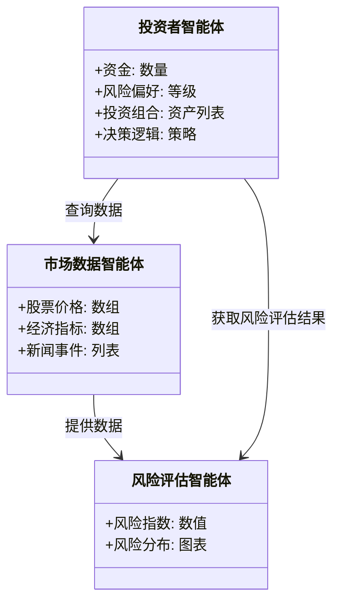
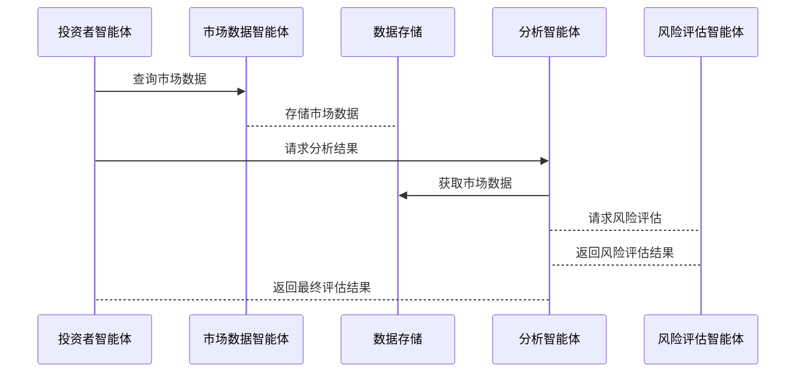

                 


# AI多智能体系统对投资风险的动态评估

## 关键词：AI多智能体系统，投资风险，动态评估，强化学习，博弈论，分布式计算

## 摘要：  
本文探讨了AI多智能体系统在投资风险动态评估中的应用，通过分析多智能体系统的结构、协作机制和算法原理，结合实际案例，展示了如何利用AI技术提升投资风险评估的准确性和实时性。文章从背景介绍、核心概念、算法实现、系统设计、项目实战等多个维度展开，旨在为读者提供全面的技术视角，帮助理解AI多智能体系统在金融领域的潜力和应用前景。

---

# 第一部分: AI多智能体系统的背景与概念

## 第1章: AI多智能体系统的背景与概念

### 1.1 AI多智能体系统的定义与特点

#### 1.1.1 多智能体系统的定义
多智能体系统（Multi-Agent System, MAS）是由多个相互作用的智能体（Agent）组成的系统。每个智能体都是一个能够感知环境、做出决策并采取行动的独立实体，通过协作完成复杂任务。

#### 1.1.2 多智能体系统的核心特点
- **分布式性**：多个智能体分布在不同的位置，独立决策。
- **协作性**：智能体之间通过通信和协作完成共同目标。
- **动态性**：环境和智能体的状态不断变化，需要实时调整。
- **自主性**：智能体能够自主决策，无需外部干预。

#### 1.1.3 多智能体系统与单智能体系统的区别
| 属性 | 单智能体系统 | 多智能体系统 |
|------|-------------|-------------|
| 决策中心 | 单一决策中心 | 分布式决策 |
| 信息共享 | 中心化 | 去中心化 |
| 复杂性 | 较低 | 较高 |

### 1.2 投资风险评估的基本概念

#### 1.2.1 投资风险的定义
投资风险是指投资可能遭受损失或收益低于预期的可能性。常见的风险包括市场风险、信用风险、流动性风险等。

#### 1.2.2 投资风险的分类
- **系统性风险**：影响整个市场的风险，如经济衰退、政策变化。
- **非系统性风险**：特定资产或行业面临的风险，如公司违约。

#### 1.2.3 投资风险评估的重要性
准确的评估可以帮助投资者制定合理的投资策略，规避潜在风险，优化资产配置。

### 1.3 AI多智能体系统在投资中的应用前景

#### 1.3.1 AI多智能体系统的潜在应用场景
- **实时监控**：动态跟踪市场变化，及时发现潜在风险。
- **风险分散**：通过多个智能体协作，优化资产配置，降低风险。

#### 1.3.2 AI多智能体系统在投资风险评估中的优势
- **高效性**：多个智能体同时处理信息，提高评估效率。
- **准确性**：通过协作和信息共享，提升评估结果的准确性。

#### 1.3.3 AI多智能体系统应用的挑战与机遇
- **挑战**：智能体之间的通信和协作需要高效的机制，数据隐私和安全问题。
- **机遇**：利用AI技术提升风险评估的实时性和精准度，推动金融创新。

### 1.4 本章小结
本章介绍了AI多智能体系统的定义、特点及其在投资风险评估中的应用前景，为后续章节奠定了基础。

---

# 第2章: 多智能体系统的核心概念

## 2.1 多智能体系统的结构与协作机制

### 2.1.1 多智能体系统的结构组成
多智能体系统通常由以下部分组成：
- **智能体（Agent）**：独立决策的个体，负责处理特定任务。
- **通信机制**：智能体之间的信息交换方式。
- **协作机制**：智能体之间协同完成任务的规则和策略。

### 2.1.2 多智能体系统的协作机制
协作机制是多智能体系统的核心，常见的协作机制包括：
- **分布式协作**：智能体通过分布式决策和协作完成任务。
- **集中式协作**：智能体向中心节点汇报信息，由中心节点统一协调。

### 2.1.3 多智能体系统的通信协议
通信协议定义了智能体之间信息交换的规则，常见的通信协议包括：
- **简单的通信协议**：如请求-响应模式。
- **复杂的通信协议**：如基于JSON-RPC的通信。

### 2.2 投资风险评估的多智能体模型

#### 2.2.1 投资风险评估的基本模型
传统的投资风险评估模型通常基于统计分析，如CAPM（资本资产定价模型）。然而，这些模型难以处理复杂动态的市场环境。

#### 2.2.2 多智能体系统在风险评估中的角色
- **数据采集智能体**：负责收集市场数据。
- **分析智能体**：对数据进行分析，识别风险因素。
- **决策智能体**：根据分析结果制定投资策略。

#### 2.2.3 多智能体系统的动态评估能力
多智能体系统能够实时更新市场数据，快速响应市场变化，提供动态的风险评估结果。

### 2.3 本章小结
本章详细介绍了多智能体系统的结构、协作机制及其在投资风险评估中的应用，为后续章节的算法实现奠定了基础。

---

# 第3章: 多智能体系统的算法原理

## 3.1 多智能体系统的算法概述

### 3.1.1 基于强化学习的多智能体算法
强化学习是一种通过试错方式优化决策的算法。在多智能体系统中，每个智能体通过与环境和其他智能体的交互，学习最优策略。

#### 强化学习的基本流程
1. **状态识别**：智能体感知当前状态。
2. **动作选择**：基于当前状态选择一个动作。
3. **奖励机制**：根据动作的结果获得奖励或惩罚。
4. **策略更新**：根据奖励更新策略。

#### 强化学习的数学模型
强化学习的目标是最大化累计奖励，数学模型可以表示为：
$$ V(s) = \max_a Q(s, a) $$
其中，\( V(s) \) 是状态 \( s \) 的价值函数，\( Q(s, a) \) 是状态-动作对的价值函数。

### 3.1.2 基于博弈论的多智能体算法
博弈论研究多个智能体之间的互动和策略选择。在投资风险评估中，博弈论可以帮助智能体预测其他智能体的决策，优化自身策略。

#### 博弈论的核心概念
- **纳什均衡**：所有智能体都采取最优策略，无法通过单方面改变策略而提高自身收益。
- **收益矩阵**：表示不同策略组合下的收益情况。

### 3.1.3 基于分布式计算的多智能体算法
分布式计算算法将任务分解成多个子任务，分别由不同的智能体完成，最后汇总结果。

---

# 第4章: 系统分析与架构设计方案

## 4.1 问题场景介绍

### 4.1.1 投资风险评估的复杂性
投资市场具有高度不确定性，传统模型难以捕捉复杂动态。

### 4.1.2 多智能体系统的解决方案
通过多智能体系统，实时跟踪市场变化，动态调整投资策略。

## 4.2 系统功能设计

### 4.2.1 领域模型
领域模型描述了系统的功能模块及其关系，可以用mermaid类图表示。



### 4.2.2 系统架构设计
系统架构设计可以用mermaid架构图表示：


### 4.2.3 系统接口设计
系统接口设计包括：
- 数据接口：智能体之间通过API交换数据。
- 控制接口：管理智能体的启动、停止和配置。

### 4.2.4 系统交互流程
系统交互流程可以用mermaid序列图表示：



---

# 第5章: 项目实战

## 5.1 环境安装

### 5.1.1 系统要求
- 操作系统：Linux/Windows/MacOS
- Python版本：3.6+
- 依赖库：numpy, pandas, scikit-learn, gym, matplotlib

### 5.1.2 安装步骤
```bash
pip install numpy pandas scikit-learn gym matplotlib
```

## 5.2 系统核心实现源代码

### 5.2.1 数据采集智能体

```python
class MarketDataAgent:
    def __init__(self):
        self.data = []

    def collect_data(self):
        # 从数据源获取市场数据
        pass

    def get_data(self):
        return self.data
```

### 5.2.2 风险评估智能体

```python
class RiskAssessmentAgent:
    def __init__(self):
        self.risk_index = 0

    def assess_risk(self, data):
        # 实现风险评估算法
        pass

    def get_risk_index(self):
        return self.risk_index
```

### 5.2.3 投资者智能体

```python
class InvestorAgent:
    def __init__(self, risk_preference):
        self.risk_preference = risk_preference
        self.portfolio = []

    def make_decision(self, risk_index):
        # 根据风险指数制定投资策略
        pass
```

## 5.3 代码应用解读与分析

### 5.3.1 数据采集智能体的实现
数据采集智能体负责从数据源获取市场数据，存储在数据存储模块中。

### 5.3.2 风险评估智能体的实现
风险评估智能体根据市场数据计算风险指数，并将结果返回给投资者智能体。

### 5.3.3 投资者智能体的实现
投资者智能体根据风险指数制定投资策略，并调整投资组合。

## 5.4 实际案例分析

### 5.4.1 案例背景
假设我们有一个投资者，风险偏好为中等，希望动态调整其投资组合。

### 5.4.2 系统运行流程
1. 投资者智能体向市场数据智能体查询市场数据。
2. 市场数据智能体收集数据并存储。
3. 分析智能体请求市场数据，进行分析。
4. 分析智能体请求风险评估智能体进行风险评估。
5. 风险评估智能体返回风险指数。
6. 投资者智能体根据风险指数调整投资组合。

## 5.5 项目小结
本章通过实际案例展示了AI多智能体系统在投资风险评估中的应用，详细讲解了系统的核心实现和运行流程。

---

# 第6章: 案例分析与拓展

## 6.1 案例分析

### 6.1.1 案例背景
假设我们有一个包含多个投资者和市场的复杂投资环境。

### 6.1.2 系统运行
通过多智能体系统的协作，系统能够实时跟踪市场变化，动态调整投资策略。

## 6.2 拓展与展望

### 6.2.1 当前系统的局限性
- 数据隐私和安全问题
- 智能体之间的通信延迟
- 系统的可扩展性

### 6.2.2 未来研究方向
- 提高智能体之间的通信效率
- 引入更复杂的强化学习算法
- 增强系统的安全性和隐私保护

---

# 第7章: 总结与展望

## 7.1 本章总结
本文详细探讨了AI多智能体系统在投资风险动态评估中的应用，从理论基础到实际案例，全面展示了系统的潜力和优势。

## 7.2 对读者的建议
- 深入学习多智能体系统的相关算法
- 关注AI在金融领域的最新研究和应用

## 7.3 未来研究方向
- 探索更高效的多智能体协作机制
- 研究多智能体系统的安全性和隐私保护

---

# 作者：AI天才研究院/AI Genius Institute & 禅与计算机程序设计艺术 /Zen And The Art of Computer Programming

---

**注意**：以上内容是基于用户提供的思考过程逐步构建的完整技术博客文章，实际撰写时可根据具体需求进行调整和补充。

