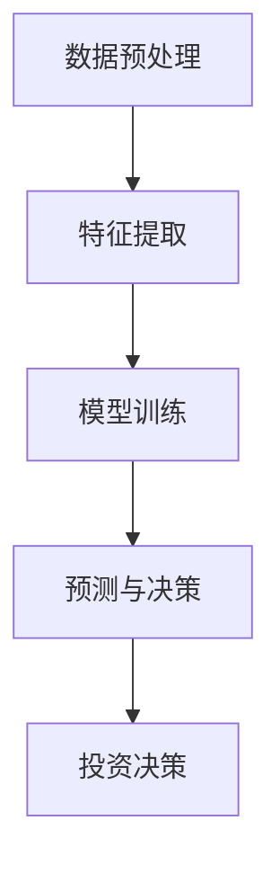
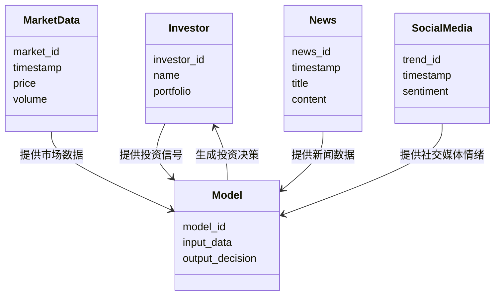
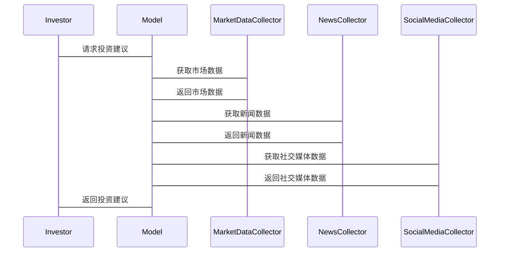

                 


# AI如何实现马克斯的逆向投资理念

> 关键词：AI，逆向投资，马克斯，投资策略，数据驱动

> 摘要：本文探讨了如何利用人工智能技术实现逆向投资理念，结合马克斯的投资理论，通过数据驱动的方法，构建AI驱动的投资系统，实现对市场非理性行为的识别和预测，从而在投资决策中获得超额收益。

---

# 第一部分：AI与逆向投资理念的结合

## 第1章：逆向投资与AI的结合概述

### 1.1 逆向投资的核心理念
逆向投资是一种与市场情绪相反的投资策略，其核心思想是在市场恐慌时买入，在市场狂热时卖出。这一理念强调利用市场的非理性行为，寻找被市场低估或高估的资产。

#### 1.1.1 逆向投资的定义与特点
- **定义**：逆向投资是一种通过反向操作市场情绪的投资策略，强调在市场低点买入，在市场高点卖出。
- **特点**：
  - 利用市场非理性行为
  - 逆市场趋势操作
  - 需要较高的市场洞察力和耐心

#### 1.1.2 马克斯逆向投资理论的核心思想
马克斯在其著作《投资的四大原则》中提出，成功的投资需要逆市场情绪而行，关注长期价值，而不是短期波动。

#### 1.1.3 AI技术在投资领域的潜力
人工智能技术可以通过处理大量数据，识别市场规律，预测市场情绪，从而为逆向投资提供技术支持。

### 1.2 AI在金融投资中的应用背景
#### 1.2.1 传统投资分析的局限性
- 依赖个人经验和主观判断
- 市场波动难以预测
- 数据处理能力有限

#### 1.2.2 数据驱动投资的优势
- 利用大数据分析市场趋势
- 通过机器学习模型预测市场行为
- 实现自动化交易

#### 1.2.3 逆向投资与数据驱动投资的结合点
- 利用AI识别市场非理性行为
- 通过数据预测市场拐点
- 实现自动化逆向交易策略

### 1.3 逆向投资AI化的核心价值
#### 1.3.1 提高投资决策的效率
- 通过AI快速处理海量数据
- 自动化生成投资建议
- 实现实时市场监控

#### 1.3.2 降低投资风险
- 通过模型预测市场风险
- 识别市场拐点
- 实现风险预警

#### 1.3.3 发现市场非理性行为的规律
- 通过NLP分析市场情绪
- 识别市场周期性波动
- 发现市场异常现象

## 1.4 本章小结
本章介绍了逆向投资的核心理念和AI在金融投资中的应用背景，强调了AI技术在逆向投资中的潜力和价值，为后续章节的深入分析奠定了基础。

---

## 第2章：逆向投资的核心概念与AI的联系

### 2.1 逆向投资的核心概念
#### 2.1.1 市场情绪分析
- 定义：通过对市场参与者的言论、交易行为等进行分析，判断市场的整体情绪。
- 分类：贪婪、恐惧、乐观、悲观等情绪。

#### 2.1.2 市场周期理论
- 经济周期的波动对市场的影响
- 逆向投资在经济周期不同阶段的应用策略

#### 2.1.3 非理性决策的规律
- 市场参与者的行为偏差
- 群体性决策的特征

### 2.2 AI在逆向投资中的应用
#### 2.2.1 数据分析与模式识别
- 数据来源：历史价格、交易量、市场新闻、社交媒体等
- 数据处理：清洗、特征提取、数据标注
- 模式识别：通过机器学习模型发现市场规律

#### 2.2.2 市场情绪预测
- NLP技术在情绪分析中的应用
- 时间序列预测模型
- 基于深度学习的情绪识别模型

#### 2.2.3 风险评估与预警
- 风险因子分析
- 基于聚类分析的市场状态识别
- 风险预警系统

### 2.3 逆向投资与AI的结合模型
#### 2.3.1 数据流与模型输入
- 数据预处理流程
- 特征选择策略
- 模型输入格式

#### 2.3.2 模型输出与投资决策
- 预测结果解释
- 投资信号生成
- 交易策略优化

#### 2.3.3 模型优化与反馈机制
- 模型调优方法
- 回测分析与策略验证
- 反馈机制设计

### 2.4 核心概念对比表格
| **概念**         | **传统投资**                     | **AI驱动投资**                  |
|------------------|----------------------------------|---------------------------------|
| 数据来源         | 市场价格、财务报表               | 历史数据、实时数据、非结构化数据 |
| 分析方法         | 基本面分析、技术分析             | 数据挖掘、机器学习、NLP         |
| 决策依据         | 人工经验、市场情绪               | 数据驱动、模型预测              |
| 决策效率         | 较低，依赖人工判断               | 高，自动化决策                  |

### 2.5 ER实体关系图
```mermaid
erd
  investor(investor_id, name, portfolio)
  market(market_id, timestamp, price, volume)
  news(news_id, timestamp, title, content)
  social_media(trend_id, timestamp, sentiment)
  model_run(run_id, timestamp, input_data, output_decision)
```

---

## 第3章：AI实现逆向投资的算法原理

### 3.1 逆向投资AI算法的核心原理
#### 3.1.1 数据预处理与特征提取
- 数据清洗：去除缺失值、异常值
- 特征提取：从价格、交易量、新闻、社交媒体等数据中提取有意义的特征
- 特征工程：构建复合特征，如动量、相对强弱指数（RSI）等

#### 3.1.2 模型训练与优化
- 算法选择：回归、分类、聚类等
- 模型优化：参数调优、交叉验证
- 模型评估：准确率、召回率、F1分数等

#### 3.1.3 预测与决策生成
- 模型预测：生成投资信号（买入、卖出、持有）
- 决策规则：基于模型预测结果制定交易策略
- 风险控制：设置止损、止盈点

### 3.2 市场情绪预测算法
#### 3.2.1 基于NLP的情感分析算法
- 分词：将文本分割成词语或短语
- 词嵌入：将词语映射到低维向量空间（如Word2Vec、GloVe）
- 情感分类：使用机器学习或深度学习模型对文本进行情感分类（如LSTM、Transformer）

#### 3.2.2 基于时间序列的预测算法
- ARIMA模型：自回归积分滑动平均模型
- LSTM网络：长短期记忆网络，适合处理时间序列数据
- Prophet模型：Facebook开源的时间序列预测模型

#### 3.2.3 基于深度学习的市场情绪识别
- CNN模型：卷积神经网络，用于处理图像和序列数据
- Transformer模型：用于处理长序列数据，如BERT、GPT

### 3.3 风险评估与预警算法
#### 3.3.1 基于聚类分析的市场状态识别
- 数据标准化：将数据归一化处理
- 聚类算法：K-means、DBSCAN等
- 市场状态分类：正常、上涨、下跌、危机等

#### 3.3.2 基于回归分析的风险因子评估
- 回归模型：线性回归、逻辑回归
- 风险因子：市场波动率、VaR（在险价值）、信用风险等

#### 3.3.3 基于神经网络的风险预警模型
- RNN模型：循环神经网络，适合处理时间序列数据
- CNN模型：卷积神经网络，用于处理图像和序列数据
- 深度学习模型：如LSTM、Transformer等

### 3.4 算法流程图（Mermaid）


### 3.5 数学模型与公式
#### 3.5.1 情感分析模型
$$ P(\text{positive} | \text{text}) = \frac{1}{1 + e^{- (w_1 x_1 + w_2 x_2 + \dots + w_n x_n)}} $$

#### 3.5.2 时间序列预测模型
$$ \hat{y}_t = \alpha \hat{y}_{t-1} + (1-\alpha) y_{t-1} $$

#### 3.5.3 风险预警模型
$$ R = \sigma^2 = \frac{1}{N}\sum_{i=1}^{N} (x_i - \bar{x})^2 $$

---

## 第4章：系统分析与架构设计

### 4.1 问题场景介绍
- 投资者希望通过AI技术实现逆向投资策略，构建一个自动化投资系统，实时监控市场动态，识别市场拐点，制定投资决策。

### 4.2 项目介绍
- 项目目标：构建一个基于AI的逆向投资系统
- 项目范围：涵盖数据采集、分析、决策生成和交易执行
- 项目利益相关者：投资者、数据科学家、交易员、系统工程师

### 4.3 系统功能设计
#### 4.3.1 领域模型（Mermaid类图）


#### 4.3.2 系统架构设计（Mermaid架构图）


#### 4.3.3 系统接口设计
- 数据接口：API用于数据采集和传输
- 模型接口：API用于模型调用和结果获取
- 交易接口：API用于执行交易指令

#### 4.3.4 系统交互（Mermaid序列图）


---

## 第5章：项目实战

### 5.1 环境安装
- 安装Python、Jupyter Notebook、Pandas、NumPy、Scikit-learn、TensorFlow、Keras、NLTK、Financedata downloaded、Yahoo Finance API

### 5.2 系统核心实现源代码
```python
import numpy as np
import pandas as pd
from sklearn.preprocessing import MinMaxScaler
from keras.models import Sequential
from keras.layers import LSTM, Dense
import requests
from bs4 import BeautifulSoup

# 数据预处理
def preprocess_data(data):
    data = data.dropna()
    scaler = MinMaxScaler()
    scaled_data = scaler.fit_transform(data)
    return scaled_data, scaler

# LSTM模型构建
def build_model(input_shape):
    model = Sequential()
    model.add(LSTM(units=50, return_sequences=True, input_shape=input_shape))
    model.add(LSTM(units=50, return_sequences=False))
    model.add(Dense(1))
    model.compile(loss='mean_squared_error', optimizer='adam')
    return model

# 数据获取
def get_market_data(symbol='AAPL'):
    url = f"https://finance.yahoo.com/quote/{symbol}"
    response = requests.get(url)
    soup = BeautifulSoup(response.text, 'html.parser')
    price = soup.find('div', {'class': 'quote-header'})

