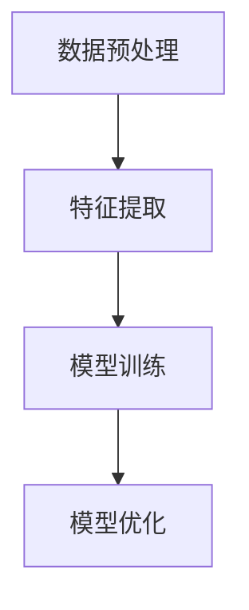
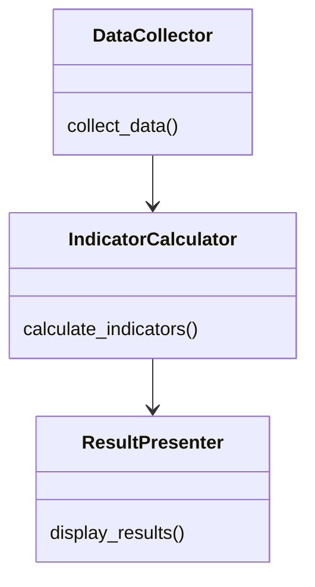
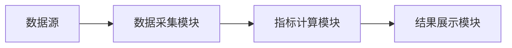
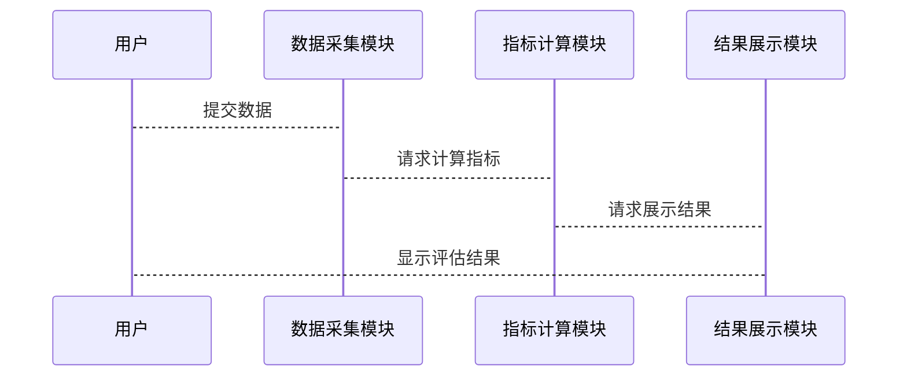

                 


# AI辅助企业创新文化评估：定量与定性指标分析

**关键词：** AI，企业创新文化，定量分析，定性分析，指标体系，机器学习，企业评估

**摘要：**  
本文探讨了如何利用人工智能技术对企业创新文化进行评估，结合定量和定性指标分析，为企业创新管理提供科学依据。文章从企业创新文化的定义、AI技术的应用背景出发，详细分析了创新文化评估的核心概念、算法原理、系统架构设计，并通过实际案例展示了AI辅助评估的实现过程。最终，文章总结了研究的成果，并展望了未来的发展方向。

---

# 第1章 AI辅助企业创新文化评估的背景与意义

## 1.1 企业创新文化的定义与重要性

### 1.1.1 企业创新文化的定义  
企业创新文化是指企业在经营过程中形成的一种鼓励创新、支持变革的价值观和行为准则。它不仅包括技术创新，还包括管理创新、制度创新等多个方面，是企业持续发展的核心驱动力。

### 1.1.2 创新文化对企业发展的核心作用  
创新文化是企业保持竞争力的关键。通过鼓励员工提出新想法、优化流程、引入新技术，企业可以不断提高效率、降低成本，并在市场中占据领先地位。

### 1.1.3 数字化时代下创新文化的演变  
随着数字化技术的普及，企业创新文化逐渐从单纯的技术创新向全维度创新转变，涵盖了产品、服务、商业模式等多个层面。

---

## 1.2 AI技术在企业创新评估中的应用背景

### 1.2.1 AI技术的快速发展与企业创新的关系  
人工智能技术的快速发展为企业创新提供了新的工具和方法。通过AI，企业可以更高效地分析数据、识别趋势、优化决策，从而推动创新。

### 1.2.2 传统企业创新评估的局限性  
传统的创新评估方法往往依赖主观判断，缺乏客观性和系统性。例如，员工满意度调查和管理层反馈虽然重要，但难以量化创新的实际效果。

### 1.2.3 AI辅助评估的优势与潜力  
AI技术可以通过大数据分析和机器学习算法，量化创新文化的各项指标，帮助企业更全面、更精准地评估创新效果。

---

## 1.3 定量与定性指标分析的必要性

### 1.3.1 定量分析在企业评估中的作用  
定量分析通过数据测量，帮助企业量化创新成果、创新效率等关键指标，为管理层提供可操作的决策依据。

### 1.3.2 定性分析的独特价值  
定性分析关注创新文化的氛围、员工态度等难以量化的因素，能够揭示企业创新的深层次问题。

### 1.3.3 综合分析的重要性  
将定量和定性分析相结合，可以全面、立体地评估企业创新文化，为企业制定创新战略提供科学依据。

---

# 第2章 AI辅助企业创新文化评估的核心概念

## 2.1 企业创新文化的指标体系

### 2.1.1 创新能力指标  
创新能力指标包括员工的创新意识、技术开发能力、研发投入比例等，反映了企业创新的潜力和能力。

### 2.1.2 创新环境指标  
创新环境指标包括企业内部的沟通效率、组织结构灵活性、企业文化氛围等，反映了企业创新的支持条件。

### 2.1.3 创新成果指标  
创新成果指标包括新产品数量、专利申请数量、市场占有率等，反映了企业创新的实际效果。

---

## 2.2 定量与定性指标的对比分析

### 2.2.1 定量指标的特征与应用场景  
定量指标具有可测量、可比较的特点，适用于对创新成果的量化评估。例如，专利数量、研发投入比例等。

### 2.2.2 定性指标的特征与应用场景  
定性指标关注创新文化的氛围和员工态度，适用于评估企业创新环境和员工满意度。

### 2.2.3 定量与定性指标的结合方式  
通过加权评分模型，将定量和定性指标结合起来，既考虑了数据的客观性，又兼顾了文化的主观性。

---

## 2.3 AI技术在指标分析中的应用原理

### 2.3.1 数据采集与预处理  
AI技术需要收集企业的相关数据，包括员工反馈、销售数据、研发投入等，并进行清洗和标准化处理。

### 2.3.2 指标权重的计算方法  
通过机器学习算法，计算各指标对创新文化评估的重要程度，确定权重。

### 2.3.3 综合评估模型的构建  
将各指标按照权重进行加权计算，构建综合评估模型，得出企业的创新文化评分。

---

## 2.4 本章小结

---

# 第3章 AI辅助企业创新文化评估的算法原理

## 3.1 算法概述

### 3.1.1 常见的评估算法介绍  
常用的算法包括线性回归、支持向量机（SVM）、随机森林等，适用于不同的数据场景。

### 3.1.2 算法选择的依据  
根据数据特征、计算复杂度和评估目标选择合适的算法。

---

## 3.2 算法实现步骤

### 3.2.1 数据预处理  
包括数据清洗、特征选择、数据标准化等步骤，确保数据质量。

### 3.2.2 特征提取  
从原始数据中提取有助于评估的关键特征，如员工满意度、研发投入比例等。

### 3.2.3 模型训练与优化  
使用训练数据训练模型，并通过交叉验证优化模型参数，提高评估精度。

---

## 3.3 算法流程图



---

## 3.4 算法实现代码示例

```python
import pandas as pd
from sklearn.model_selection import train_test_split
from sklearn.ensemble import RandomForestRegressor
from sklearn.metrics import mean_squared_error

# 数据加载与预处理
data = pd.read_csv('innovation.csv')
data = data.dropna()  # 删除缺失值
data = (data - data.min()) / (data.max() - data.min())  # 数据标准化

# 特征提取与数据分割
features = data.drop('score', axis=1)
target = data['score']
X_train, X_test, y_train, y_test = train_test_split(features, target, test_size=0.2)

# 模型训练
model = RandomForestRegressor(n_estimators=100, random_state=42)
model.fit(X_train, y_train)

# 模型预测与评估
y_pred = model.predict(X_test)
print('均方误差:', mean_squared_error(y_test, y_pred))
```

---

## 3.5 数学模型与公式

### 3.5.1 加权评分模型  
$$ \text{总评分} = \sum (\text{指标权重}_i \times \text{指标值}_i) $$

### 3.5.2 机器学习模型的损失函数  
$$ \text{损失函数} = \sum (y_i - \hat{y}_i)^2 $$

---

## 3.6 本章小结

---

# 第4章 AI辅助企业创新文化评估的系统分析与架构设计

## 4.1 系统功能设计

### 4.1.1 数据采集模块  
负责采集企业的各项数据，包括员工反馈、财务数据、销售数据等。

### 4.1.2 指标计算模块  
根据采集的数据，计算各项创新指标，并进行加权评分。

### 4.1.3 结果展示模块  
以可视化的方式展示评估结果，帮助企业管理者直观了解创新文化现状。

---

## 4.2 系统架构设计

### 4.2.1 领域模型类图  


### 4.2.2 系统架构图  


---

## 4.3 系统接口设计

### 4.3.1 数据接口  
定义数据格式和接口协议，确保数据采集模块与指标计算模块之间的数据传输顺畅。

### 4.3.2 用户界面  
设计友好的用户界面，方便企业管理者查看评估结果。

---

## 4.4 系统交互流程图



---

## 4.5 本章小结

---

# 第5章 项目实战：AI辅助企业创新文化评估的实现

## 5.1 环境配置与数据准备

### 5.1.1 环境安装  
安装必要的Python库，如Pandas、Scikit-learn、Plotly等。

### 5.1.2 数据获取  
从企业内部数据库或公开数据集获取相关数据，确保数据的完整性和准确性。

---

## 5.2 核心代码实现

### 5.2.1 数据预处理代码  
```python
import pandas as pd
import numpy as np

data = pd.read_csv('innovation.csv')
data = data.dropna()
data = (data - data.min()) / (data.max() - data.min())
```

### 5.2.2 指标计算代码  
```python
from sklearn.ensemble import RandomForestRegressor
from sklearn.metrics import mean_squared_error

X_train, X_test, y_train, y_test = train_test_split(features, target, test_size=0.2)
model = RandomForestRegressor(n_estimators=100, random_state=42)
model.fit(X_train, y_train)
y_pred = model.predict(X_test)
print('均方误差:', mean_squared_error(y_test, y_pred))
```

---

## 5.3 案例分析与结果解读

### 5.3.1 案例背景  
以一家科技公司为例，分析其创新文化评估结果。

### 5.3.2 实施过程  
从数据采集到模型训练，详细描述项目的实施步骤。

### 5.3.3 结果分析  
解读评估结果，提出改进建议。

---

## 5.4 经验总结与注意事项

### 5.4.1 经验总结  
项目实施过程中需要注意数据质量、模型选择和结果解读等问题。

### 5.4.2 注意事项  
建议企业在实施过程中充分考虑数据隐私和模型的可解释性。

---

## 5.5 本章小结

---

# 第6章 总结与展望

## 6.1 研究总结

### 6.1.1 核心成果  
本文提出了结合定量与定性指标的AI辅助评估方法，并通过实际案例验证了其有效性。

### 6.1.2 研究不足  
当前方法在模型的可解释性和实时性方面仍有改进空间。

---

## 6.2 未来展望

### 6.2.1 技术进步  
随着AI技术的不断发展，创新文化评估将更加精准和智能化。

### 6.2.2 应用场景拓展  
未来可以将AI辅助评估应用于更多领域，如教育、医疗等。

---

## 6.3 实践建议

### 6.3.1 企业建议  
企业应结合自身特点，选择适合的AI评估方法。

### 6.3.2 技术建议  
技术开发者应注重模型的可解释性和用户体验，提升工具的易用性。

---

## 6.4 本章小结

---

# 作者：AI天才研究院 & 禅与计算机程序设计艺术

