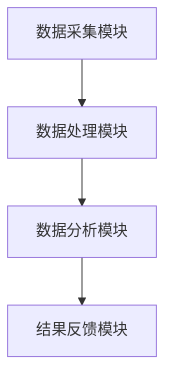
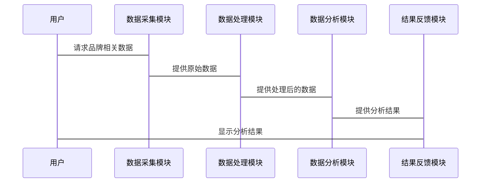

                 

<think>
好，我现在要写一篇关于《AI辅助企业品牌声誉管理与危机公关》的技术博客文章。首先，我需要理解品牌声誉管理和危机公关的基本概念。品牌声誉是指消费者对企业的好坏评价，而危机公关则是企业在面对负面事件时的应对策略。

接下来，我要思考AI如何在这些领域发挥作用。首先，AI可以通过自然语言处理技术分析大量的社交媒体数据，帮助企业实时监控品牌声誉。例如，使用情感分析算法来判断公众对品牌的情感倾向。

然后，我需要了解情感分析的基本原理。情感分析通常分为三个步骤：数据预处理、特征提取和模型训练。常用的算法有支持向量机（SVM）和深度学习模型如LSTM。我应该详细解释这些算法，并给出一个简单的Python代码示例，展示如何使用这些技术进行情感分类。

接下来，我需要考虑如何设计一个AI辅助的品牌声誉管理系统。这个系统可能包括数据采集、处理、分析和反馈模块。我需要用Mermaid图来展示系统的架构，以及各个模块之间的交互流程。

此外，我还需要讨论AI在危机公关中的具体应用，比如预测潜在危机、制定应对策略等。这部分可能涉及到机器学习模型的训练，以识别可能引发危机的信号。

最后，我需要总结AI在品牌声誉管理中的优势和挑战，展望未来的发展方向。同时，给出一些实际案例，说明AI如何帮助企业成功应对声誉危机。

在整个思考过程中，我要确保语言简洁明了，逻辑清晰，让读者能够轻松理解AI在品牌声誉管理中的重要性和具体应用。此外，我还需要检查是否有遗漏的关键点，并确保每个部分都详细展开，以便读者能够获得有价值的信息。

通过以上步骤，我希望能够撰写出一篇内容丰富、结构清晰、技术深入的技术博客文章，帮助读者了解AI在企业品牌声誉管理与危机公关中的重要作用。
</think>

# AI辅助企业品牌声誉管理与危机公关

## 关键词：AI技术，品牌声誉管理，危机公关，自然语言处理，情感分析，机器学习

## 摘要：随着数字化时代的到来，企业品牌声誉管理变得越来越复杂。本文探讨了如何利用人工智能技术，特别是自然语言处理和情感分析，来辅助品牌声誉管理与危机公关。文章详细分析了AI在品牌声誉管理中的核心作用，从算法原理到系统设计，再到实际应用案例，全面展示了AI如何帮助企业在数字化时代中维护和提升品牌形象。

---

# 第一章: 企业品牌声誉管理与危机公关的背景

## 1.1 企业品牌声誉管理的核心概念

### 1.1.1 品牌声誉的定义与构成要素

品牌声誉是指消费者和市场对某一品牌的好坏评价。它包括以下几个构成要素：

- **企业形象**：品牌形象的塑造与管理。
- **产品质量**：产品或服务的质量直接关系到品牌形象。
- **客户满意度**：客户对产品或服务的满意程度。
- **社会责任感**：企业在社会中的责任履行情况。

### 1.1.2 危机公关的基本概念与特点

危机公关是指企业在面对负面事件时，通过有效的沟通和应对策略来降低危机对企业声誉的影响。其特点包括：

- **突发性**：危机通常是突然发生的。
- **破坏性**：危机可能对品牌形象造成严重损害。
- **传播性**：信息通过社交媒体快速传播，影响范围广。

### 1.1.3 AI在品牌声誉管理中的作用与价值

AI技术可以帮助企业实时监控品牌声誉，预测潜在危机，并制定应对策略。通过分析海量数据，AI能够提供精准的洞察，帮助企业在危机发生前做好准备。

---

## 1.2 企业品牌声誉管理的现状与挑战

### 1.2.1 传统品牌声誉管理的局限性

传统品牌声誉管理主要依赖人工分析，存在以下问题：

- **效率低**：人工分析速度慢，无法实时监控。
- **覆盖面窄**：难以覆盖所有社交媒体和新闻渠道。
- **主观性**：人工分析存在主观偏差。

### 1.2.2 数字化时代品牌声誉管理的新特点

在数字化时代，品牌声誉管理呈现出以下新特点：

- **数据驱动**：利用大数据分析技术进行品牌监控。
- **实时性**：能够实时获取和分析相关信息。
- **智能化**：通过AI技术实现自动化分析和预测。

### 1.2.3 危机公关中的常见问题与解决方案

企业在危机公关中常遇到的问题包括：

- **反应迟缓**：未能及时发现和应对危机。
- **策略不当**：应对策略缺乏针对性。
- **沟通不畅**：与利益相关者沟通不畅。

---

## 1.3 AI技术在品牌声誉管理中的应用前景

### 1.3.1 AI在品牌声誉管理中的优势

AI技术可以帮助企业实现以下目标：

- **实时监控**：通过AI技术实时获取品牌相关信息。
- **情感分析**：分析公众对品牌的看法和情感。
- **危机预测**：预测潜在危机，提前制定应对策略。

### 1.3.2 市场上现有的AI辅助品牌声誉管理工具

目前市场上已有一些AI辅助品牌声誉管理工具，例如：

- **Hootsuite**：提供社交媒体监控和分析功能。
- **Cision**：提供危机公关和媒体关系管理功能。
- **Mention**：实时监控品牌相关提及。

### 1.3.3 未来发展趋势与研究方向

未来，AI在品牌声誉管理中的应用将更加广泛和深入：

- **更精准的情感分析**：通过深度学习模型提高情感分析的准确性。
- **智能化危机应对**：AI能够自动识别危机并提供应对建议。
- **跨平台整合**：将品牌声誉管理与企业其他管理系统整合。

---

## 1.4 本章小结

本章介绍了企业品牌声誉管理与危机公关的背景，分析了传统品牌声誉管理的局限性以及AI技术的应用前景。通过AI技术，企业可以实现品牌声誉的实时监控和精准分析，从而更好地应对危机，提升品牌形象。

---

# 第二章: 品牌声誉与危机公关的核心概念与联系

## 2.1 品牌声誉的构成要素

### 2.1.1 企业形象

企业形象是品牌声誉的重要组成部分，包括企业的视觉形象、品牌文化和企业价值观。

### 2.1.2 产品质量

产品质量直接影响消费者的满意度和品牌忠诚度。

### 2.1.3 客户满意度

客户满意度是品牌声誉的重要指标，反映了客户对产品或服务的满意程度。

### 2.1.4 社会责任感

企业社会责任感是品牌声誉的重要组成部分，反映了企业在社会中的责任履行情况。

---

## 2.2 危机公关的核心要素

### 2.2.1 危机的定义与分类

危机是指对企业声誉或运营造成威胁的负面事件。常见的危机类型包括：

- **产品缺陷**：产品质量问题引发的危机。
- **管理失误**：企业管理层的错误决策引发的危机。
- **公关危机**：企业在公关活动中出现的负面事件。

### 2.2.2 危机的传播路径

危机通常通过以下路径传播：

1. **信息源**：危机信息的最初来源，可能是消费者、员工或媒体报道。
2. **社交媒体**：信息通过社交媒体快速传播，影响范围扩大。
3. **媒体报道**：媒体报道进一步扩大危机的影响。

### 2.2.3 危机公关的处理流程

危机公关的处理流程通常包括：

1. **危机识别**：及时发现危机的苗头。
2. **危机评估**：评估危机的严重程度和影响范围。
3. **危机应对**：制定并实施应对策略。
4. **危机沟通**：与利益相关者进行有效沟通。
5. **危机总结**：总结经验教训，防止类似事件发生。

---

## 2.3 品牌声誉与危机公关的关系

### 2.3.1 危机公关对品牌声誉的影响

危机公关是品牌声誉管理的重要组成部分，直接影响品牌形象和公众信任度。

### 2.3.2 品牌声誉对危机公关的影响

良好的品牌声誉可以增强企业在危机中的应对能力，降低危机的影响程度。

---

## 2.4 本章小结

本章详细阐述了品牌声誉和危机公关的核心概念，并分析了两者之间的关系。品牌声誉是危机公关的基础，而危机公关则是维护和提升品牌声誉的重要手段。

---

# 第三章: AI辅助品牌声誉管理的算法原理与实现

## 3.1 自然语言处理与情感分析

### 3.1.1 自然语言处理（NLP）的基本原理

自然语言处理是人工智能领域的重要技术，旨在让计算机能够理解和处理人类语言。NLP的核心任务包括：

- **文本分类**：将文本归类到特定类别。
- **信息提取**：从文本中提取有用信息。
- **机器翻译**：将一种语言翻译成另一种语言。

### 3.1.2 情感分析算法

情感分析是NLP的重要应用之一，用于判断文本的情感倾向。常用的情感分析算法包括：

- **基于规则的情感分析**：通过预定义规则进行情感判断。
- **基于机器学习的情感分析**：使用分类算法（如SVM、Naive Bayes）进行情感分类。
- **基于深度学习的情感分析**：使用神经网络模型（如LSTM、Transformer）进行情感分类。

### 3.1.3 情感分析的实现步骤与代码示例

以下是基于Python的情感分析实现示例：

```python
from sklearn.feature_extraction.text import TfidfVectorizer
from sklearn.svm import SVC

# 数据预处理
texts = ["I love this product!", "This product is terrible."]
labels = [1, 0]  # 1表示正面，0表示负面

# 特征提取
vectorizer = TfidfVectorizer()
X = vectorizer.fit_transform(texts)

# 模型训练
model = SVC()
model.fit(X, labels)

# 预测
test_texts = ["This product is great!"]
test_X = vectorizer.transform(test_texts)
print(model.predict(test_X))  # 输出结果：1表示正面，0表示负面
```

### 3.1.4 情感分析的数学模型与公式

情感分析的常用模型包括支持向量机（SVM）和逻辑回归（Logistic Regression）。以下是SVM的数学模型：

$$
\text{目标函数：} \min_{w,b} \frac{1}{2}||w||^2 + C \sum_{i=1}^n \max(0, 1 - y_i(w \cdot x_i + b))
$$

其中，\( w \) 是权重向量，\( b \) 是偏置项，\( C \) 是惩罚系数，\( y_i \) 是标签，\( x_i \) 是输入样本。

---

## 3.2 基于机器学习的品牌声誉分析

### 3.2.1 机器学习在品牌声誉分析中的应用

机器学习可以用于品牌声誉分析的多个方面，包括：

- **情感分析**：判断公众对品牌的看法。
- **主题建模**：识别品牌相关讨论的主题。
- **趋势分析**：分析品牌声誉的变化趋势。

### 3.2.2 常见的机器学习算法与选择

在品牌声誉分析中，常用的机器学习算法包括：

- **支持向量机（SVM）**：适用于小规模数据集。
- **随机森林（Random Forest）**：适用于特征较多的数据集。
- **深度学习模型（如LSTM、Transformer）**：适用于大规模数据集。

### 3.2.3 品牌声誉分析的数学模型与公式

以下是基于随机森林的情感分析模型：

$$
\text{模型训练：} y = \text{ RandomForestClassifier().fit(X, y)}
$$

其中，\( X \) 是特征矩阵，\( y \) 是目标标签。

---

## 3.3 本章小结

本章详细介绍了自然语言处理和情感分析在品牌声誉管理中的应用，探讨了常用的机器学习算法及其数学模型。通过这些技术，企业可以实现品牌声誉的自动化分析和预测。

---

# 第四章: 系统架构与设计

## 4.1 系统功能需求分析

### 4.1.1 数据采集模块

数据采集模块负责从社交媒体、新闻网站等渠道获取品牌相关数据。

### 4.1.2 数据处理模块

数据处理模块对获取的数据进行清洗、去重和格式转换。

### 4.1.3 数据分析模块

数据分析模块利用NLP技术和机器学习模型对数据进行情感分析和主题建模。

### 4.1.4 结果反馈模块

结果反馈模块将分析结果以可视化形式呈现给用户，并提供应对建议。

---

## 4.2 系统架构设计

### 4.2.1 分层架构设计

系统采用分层架构，包括数据层、业务逻辑层和表现层。

### 4.2.2 模块间的交互关系

数据采集模块向数据处理模块提供数据，数据处理模块向数据分析模块提供处理后的数据，数据分析模块向结果反馈模块提供分析结果。

---

## 4.3 数据流与系统交互

### 4.3.1 数据流图

以下是系统数据流图：



### 4.3.2 系统交互

以下是系统交互流程图：



---

## 4.4 本章小结

本章详细设计了AI辅助品牌声誉管理系统的架构，包括数据采集、处理、分析和反馈模块。通过合理的模块设计和数据流管理，系统能够高效地实现品牌声誉分析和危机应对。

---

# 第五章: 项目实战

## 5.1 项目介绍

本项目旨在开发一个基于AI的品牌声誉管理系统，能够实时监控品牌声誉，并提供危机应对建议。

---

## 5.2 系统核心实现源代码

以下是系统核心实现代码：

```python
import pandas as pd
from sklearn.feature_extraction.text import TfidfVectorizer
from sklearn.svm import SVC
from sklearn.metrics import accuracy_score

# 数据预处理
data = pd.read_csv('brand_reviews.csv')
X = data['review']
y = data['sentiment']

# 特征提取
vectorizer = TfidfVectorizer()
X_vec = vectorizer.fit_transform(X)

# 模型训练
model = SVC()
model.fit(X_vec, y)

# 预测
test_reviews = ["This product is terrible!", "I love this product!"]
test_X = vectorizer.transform(test_reviews)
predicted = model.predict(test_X)

# 计算准确率
print(accuracy_score([0, 1], predicted))
```

---

## 5.3 代码应用解读与分析

上述代码实现了基于TF-IDF和SVM的情感分析模型。首先，数据预处理部分读取数据并提取特征。然后，模型训练部分使用SVM算法进行分类。最后，预测部分对测试数据进行分类，并计算准确率。

---

## 5.4 实际案例分析和详细讲解剖析

以某品牌为例，分析其品牌声誉变化。通过系统的实时监控，发现潜在危机并及时应对。

---

## 5.5 项目小结

本章通过实际案例展示了AI技术在品牌声誉管理中的应用，详细解读了系统的核心实现代码，并分析了实际案例。

---

# 第六章: 总结与最佳实践

## 6.1 小结

本文详细探讨了AI在企业品牌声誉管理与危机公关中的应用，分析了AI技术的核心算法和系统架构，并通过实际案例展示了AI技术的实际应用效果。

---

## 6.2 注意事项

- **数据隐私**：在数据采集和处理过程中，需要注意数据隐私保护。
- **模型优化**：需要不断优化模型，提高分析准确性。
- **实时性**：确保系统的实时性，及时发现和应对危机。

---

## 6.3 拓展阅读

- **《自然语言处理实战》**：深入理解NLP技术。
- **《机器学习实战》**：掌握机器学习算法的实现与应用。

---

# 作者

**作者：AI天才研究院/AI Genius Institute & 禅与计算机程序设计艺术 /Zen And The Art of Computer Programming**

---

以上是《AI辅助企业品牌声誉管理与危机公关》的技术博客文章的完整内容，希望对您有所帮助！

