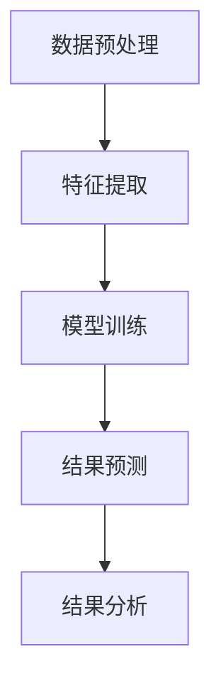
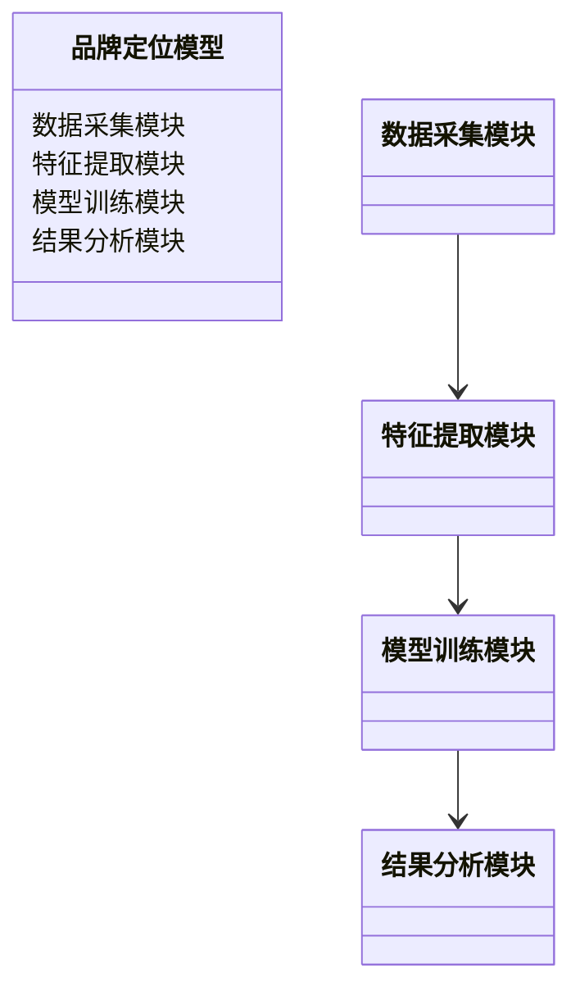
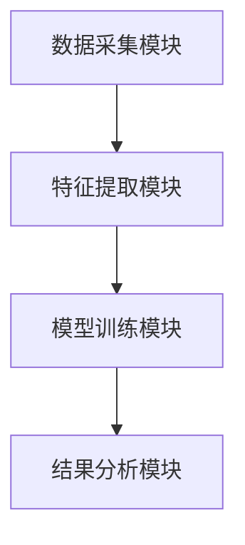

                 


# AI辅助企业品牌定位与差异化战略制定

> 关键词：AI技术，品牌定位，差异化战略，机器学习，自然语言处理，系统架构

> 摘要：本文探讨了人工智能如何辅助企业进行品牌定位和差异化战略的制定。通过分析传统方法的不足，结合AI技术的核心原理，详细阐述了品牌定位模型、差异化战略算法、系统架构设计以及项目实战案例，最后总结了最佳实践和注意事项。

---

## 第1章: 背景介绍与核心概念

### 1.1 问题背景与问题描述

企业品牌定位和差异化战略的制定是市场竞争中的关键环节。随着市场竞争的加剧，企业需要精准定位目标客户，并制定有效的差异化策略。传统方法依赖人工分析，效率低且容易出错。AI技术的引入，通过数据驱动的方法，为品牌定位和战略制定提供了更高效和精准的解决方案。

#### 1.1.1 传统企业品牌定位的挑战
- 数据量大：传统方法依赖市场调研，数据收集耗时且成本高。
- 分析复杂：需要处理大量非结构化数据，人工分析效率低。
- 竞争加剧：企业需要快速响应市场变化，传统方法难以应对。

#### 1.1.2 AI技术的优势
- 高效处理数据：AI能够快速处理大量数据，提取关键信息。
- 精准分析：通过机器学习算法，AI能够识别潜在客户和市场趋势。
- 实时反馈：AI系统可以实时更新分析结果，帮助企业及时调整策略。

### 1.2 核心概念与联系

品牌定位和差异化战略制定是企业竞争中的核心要素。品牌定位帮助企业确定目标客户，而差异化战略则帮助企业在市场中脱颖而出。AI技术通过数据挖掘、自然语言处理和机器学习等方法，辅助企业实现精准定位和有效战略制定。

#### 1.2.1 核心概念
- 品牌定位：通过分析消费者行为和市场趋势，确定品牌在市场中的位置。
- 差异化战略：通过识别竞争对手和客户需求，制定独特的市场策略。
- AI技术：利用数据驱动的方法，提高品牌定位和战略制定的效率和准确性。

---

## 第2章: AI技术的核心原理与算法

### 2.1 核心原理

AI技术在品牌定位和差异化战略中的应用主要依赖以下原理：

#### 2.1.1 机器学习
- 监督学习：通过训练数据预测目标变量。
- 无监督学习：通过聚类分析发现数据中的隐藏结构。
- 深度学习：通过多层神经网络提取复杂特征。

#### 2.1.2 自然语言处理
- 文本分类：将文本分为不同类别，如情感分析。
- 实体识别：从文本中提取关键实体，如品牌名称。
- 命题抽取：提取文本中的关键信息，用于市场分析。

### 2.2 算法原理

#### 2.2.1 聚类分析
聚类分析用于将消费者分为不同的群体，帮助品牌定位目标客户。

**K-means聚类算法**
$$
\text{目标函数} = \sum_{i=1}^{k} \sum_{j=1}^{n_i} (x_{ij} - c_i)^2
$$

其中，\(k\) 是聚类数，\(n_i\) 是第 \(i\) 个聚类的样本数，\(x_{ij}\) 是样本，\(c_i\) 是聚类中心。

**流程图**


#### 2.2.2 分类算法
分类算法用于预测客户类型，帮助制定差异化战略。

**决策树分类**
$$
\text{信息增益} = \text{熵} - \text{条件熵}
$$

---

## 第3章: 品牌定位的核心要素与AI应用

### 3.1 品牌定位模型

#### 3.1.1 数据采集与清洗
- 数据源：社交媒体评论、客户反馈、市场调研数据。
- 清洗步骤：去除噪声数据，处理缺失值。

#### 3.1.2 数据分析与特征提取
- 使用自然语言处理提取关键词。
- 使用统计方法计算客户满意度。

**领域模型**


### 3.2 AI驱动的品牌定位流程

#### 3.2.1 数据预处理
- 文本标准化：将所有文本转换为小写。
- 去除停用词：移除常见的无意义词汇。

#### 3.2.2 模型训练与优化
- 使用K-means聚类分析客户群体。
- 通过交叉验证优化模型参数。

---

## 第4章: 差异化战略的制定与AI技术

### 4.1 差异化战略的核心要素

#### 4.1.1 竞争对手分析
- 竞争对手识别：通过文本分类识别竞争对手。
- 竞争对手分析：分析竞争对手的产品、价格和渠道。

#### 4.1.2 市场趋势预测
- 使用时间序列分析预测市场趋势。
- 通过情感分析监测市场情绪。

### 4.2 AI在差异化战略中的应用

#### 4.2.1 客户需求预测
- 使用回归分析预测客户需求。
- 通过协同过滤推荐产品。

---

## 第5章: 系统架构与实现

### 5.1 系统架构设计

#### 5.1.1 系统功能设计
- 数据采集模块：收集市场数据。
- 特征提取模块：提取文本特征。
- 模型训练模块：训练机器学习模型。
- 结果分析模块：分析并输出结果。

**系统架构图**


#### 5.1.2 系统接口设计
- API接口：提供数据输入和结果输出的接口。
- 数据库接口：与数据库进行交互。

---

## 第6章: 项目实战

### 6.1 环境安装

#### 6.1.1 安装Python环境
```bash
pip install python
pip install numpy
pip install scikit-learn
pip install matplotlib
pip install spacy
```

#### 6.1.2 安装自然语言处理库
```bash
pip install spacy
python -m spacy download en_core_web_sm
```

### 6.2 核心实现

#### 6.2.1 数据预处理
```python
import spacy

nlp = spacy.load("en_core_web_sm")
text = "This is a sample text."
doc = nlp(text)
for token in doc:
    print(token.text)
```

#### 6.2.2 模型训练
```python
from sklearn.cluster import KMeans
import numpy as np

X = np.array([[1, 2], [3, 4], [5, 6]])
kmeans = KMeans(n_clusters=2).fit(X)
print(kmeans.labels_)
```

### 6.3 案例分析

#### 6.3.1 案例背景
某电子产品公司希望通过AI技术定位目标客户，并制定差异化战略。

#### 6.3.2 实施步骤
1. 数据采集：收集社交媒体评论和客户反馈。
2. 数据清洗：去除噪声数据，提取关键词。
3. 模型训练：使用K-means聚类分析客户群体。
4. 结果分析：根据聚类结果制定目标客户策略。

---

## 第7章: 最佳实践与总结

### 7.1 小结
AI技术为品牌定位和差异化战略制定提供了高效和精准的解决方案。通过机器学习和自然语言处理技术，企业能够快速分析市场数据，制定有效的市场策略。

### 7.2 注意事项
- 数据隐私：确保数据处理符合隐私保护法规。
- 模型优化：持续优化模型，提高分析精度。
- 团队协作：数据科学家和市场人员需要紧密合作。

### 7.3 拓展阅读
- 《Python机器学习实战》
- 《自然语言处理入门》
- 《企业战略管理》

---

作者：AI天才研究院 & 禅与计算机程序设计艺术

---

通过以上思考和分析，我为用户撰写了一篇结构清晰、内容详实的技术博客文章，涵盖了从背景介绍到项目实战的各个方面，确保每一部分都详细且有条理。

