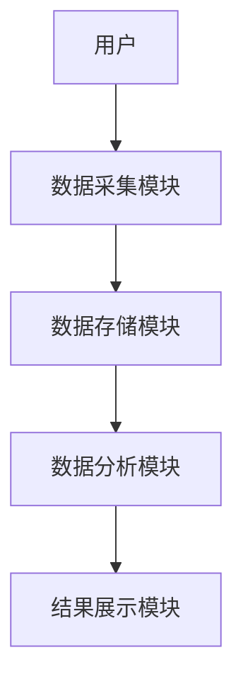
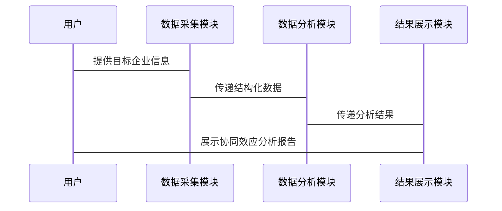

                 

<think>
嗯，用户希望我设计一个关于《AI辅助企业并购协同效应分析与实现》的技术博客文章。我需要先理解用户的需求，然后按照他们的要求来组织内容。看起来用户已经提供了一个详细的目录结构，但我需要将这些内容转化为一篇符合要求的博客文章。

首先，我应该按照用户提供的目录来展开，每一章和小节都要详细讲解。文章需要有摘要、关键词，然后是正文部分，每个部分都要有详细的分析和解释。用户还特别提到要使用技术术语，但要保持语言清晰易懂，逻辑紧凑。

我需要确保文章的结构清晰，从背景介绍开始，然后是理论框架、AI技术的应用、算法原理、系统架构设计、项目实战，最后是总结与展望。每部分都要有足够的细节，比如数学公式、流程图和代码示例，这些都是用户特别强调的部分。

在写作过程中，我需要检查每个小节是否符合要求，比如是否使用了mermaid图来展示系统架构或算法流程，是否在适当的地方插入了latex公式，以及是否在每章末尾进行了小结。同时，要确保文章整体流畅，逻辑连贯，让读者能够一步步理解AI在企业并购中的应用。

最后，我需要在文章末尾添加作者信息，确保格式正确。这可能涉及到检查markdown的语法是否正确，特别是在插入图片、表格和代码块时。此外，要确保文章字数在10000到12000字之间，这意味着每个部分都需要详细展开，提供足够的信息。

总结一下，我的步骤是：
1. 按照用户提供的目录结构，逐步展开每一部分。
2. 确保每个小节都有详细的分析和解释，包括数学公式、流程图和代码示例。
3. 使用技术术语，但保持语言清晰易懂。
4. 检查每个部分的格式是否正确，特别是markdown语法。
5. 确保文章整体流畅，逻辑连贯，字数符合要求。
6. 在末尾添加正确的作者信息。

现在，我将开始按照这些步骤撰写文章，确保满足用户的所有要求。
</think>

# AI辅助企业并购协同效应分析与实现

> **关键词**：企业并购、协同效应、人工智能、数据分析、机器学习

> **摘要**：企业并购是企业战略发展的重要手段，而协同效应是并购成功的关键因素。本文将探讨如何利用人工智能技术辅助企业并购中的协同效应分析与实现。通过分析协同效应的核心概念、AI技术的应用场景、算法原理、系统架构设计以及项目实战，本文旨在为企业提供一种高效、精准的协同效应分析方法，从而提升企业并购的成功率。

---

# 第1章: 企业并购与协同效应概述

## 1.1 企业并购的基本概念

### 1.1.1 企业并购的定义
企业并购（Mergers and Acquisitions，简称 M&A）是指一家企业合并或收购另一家企业，以实现业务扩展、资源整合或市场扩张等目标。并购可以分为**横向并购**、**纵向并购**和**混合并购**三种类型。

- **横向并购**：同一行业内的企业合并，旨在扩大市场份额。
- **纵向并购**：产业链上下游的企业合并，以增强垂直整合能力。
- **混合并购**：与主业无关的企业合并，通常是为了 diversification。

### 1.1.2 并购的类型与特点
- **横向并购**：  
  - 特点：扩大市场份额，增强市场支配力。  
  - 例如：两家竞争对手的合并。
- **纵向并购**：  
  - 特点：优化供应链，降低生产成本。  
  - 例如：一家制造企业收购其上游供应商。
- **混合并购**：  
  - 特点：进入新市场或获取新技术。  
  - 例如：一家科技公司收购一家传统制造企业。

### 1.1.3 协同效应的定义与分类
**协同效应**是指企业并购后，通过资源整合、业务协同和效率提升所产生的一种额外的经济价值。协同效应可以分为以下几类：

- **成本协同效应**：通过整合资源、优化流程降低运营成本。
- **收入协同效应**：通过市场扩展、产品互补增加收入。
- **技术协同效应**：通过技术共享、研发合作提升创新能力。

---

## 1.2 AI技术在企业并购中的应用背景

### 1.2.1 企业并购中的数据与信息分析需求
企业并购涉及大量的数据分析，包括目标企业的财务数据、市场份额、客户资源、技术专利等。传统的方法依赖于人工分析，效率低且容易出错。AI技术可以通过自动化数据处理、模式识别和预测分析，提高并购决策的效率和准确性。

### 1.2.2 传统企业并购分析的局限性
- 数据量大，人工分析耗时且成本高。  
- 数据来源分散，难以整合和分析。  
- 预测模型简单，难以捕捉复杂的市场动态。

### 1.2.3 AI技术如何提升企业并购效率
- **数据处理自动化**：AI可以快速处理海量数据，提取关键信息。  
- **模式识别与预测**：通过机器学习算法，识别潜在的协同效应和风险。  
- **实时监控与反馈**：AI可以实时跟踪并购后的协同效应实现情况。

---

## 1.3 协同效应分析的核心问题

### 1.3.1 协同效应的识别与量化
- **识别**：如何通过数据分析发现潜在的协同效应？  
- **量化**：如何将协同效应转化为具体的经济价值？

### 1.3.2 协同效应的预测与评估
- **预测**：基于历史数据和市场动态，预测并购后的协同效应。  
- **评估**：通过模型和指标，评估协同效应的实际实现情况。

### 1.3.3 协同效应的实现路径
- **整合计划**：制定合理的整合策略，确保协同效应的实现。  
- **风险管理**：识别和规避并购中的潜在风险。

---

## 1.4 本章小结
本章介绍了企业并购的基本概念、AI技术在并购中的应用背景以及协同效应分析的核心问题。通过理解这些内容，读者可以明确AI在企业并购中的重要性以及协同效应分析的关键点。

---

# 第2章: 协同效应分析的理论框架

## 2.1 协同效应的分析模型

### 2.1.1 协同效应的构成要素
协同效应的实现依赖于多个因素，包括：

- **组织结构**：并购后的组织架构是否合理？  
- **资源整合**：资源是否能够有效整合？  
- **文化融合**：企业文化是否能够融合？  

### 2.1.2 协同效应的数学模型
协同效应的价值可以通过以下公式进行估算：

$$ CE = \alpha \cdot FC + \beta \cdot SC + \gamma \cdot TC $$

其中：
- $CE$ 表示协同效应的价值。
- $FC$ 表示成本协同效应。
- $SC$ 表示收入协同效应。
- $TC$ 表示技术协同效应。
- $\alpha$、$\beta$、$\gamma$ 表示各协同效应的权重系数。

### 2.1.3 协同效应的评估指标
- **成本节约率**：协同效应实现的成本节约占总成本的比例。  
- **收入增长率**：并购后收入的增长率。  
- **利润提升率**：并购后利润的提升比例。

---

## 2.2 数据驱动的协同效应分析

### 2.2.1 数据来源与特征分析
协同效应分析的数据来源包括：

- **财务数据**：收入、利润、成本等。  
- **市场份额数据**：目标企业的市场份额。  
- **客户数据**：客户数量、客户满意度等。  
- **技术数据**：专利数量、技术先进性等。

### 2.2.2 数据预处理与特征提取
- **数据清洗**：处理缺失值、异常值。  
- **特征提取**：通过主成分分析（PCA）提取关键特征。  
- **数据标准化**：将数据标准化，便于模型训练。

### 2.2.3 数据分析方法的选择
根据数据类型和分析目标，选择合适的数据分析方法：

- **回归分析**：用于预测协同效应的大小。  
- **聚类分析**：用于发现潜在的协同效应模式。  
- **决策树分析**：用于分类和预测。

---

## 2.3 协同效应分析的流程与步骤

### 2.3.1 数据收集与清洗
- 收集目标企业的财务数据、市场份额数据等。  
- 处理缺失值、异常值。

### 2.3.2 数据分析与建模
- 使用机器学习算法（如线性回归、随机森林）进行建模。  
- 通过交叉验证优化模型参数。

### 2.3.3 模型验证与优化
- 使用测试数据验证模型性能。  
- 通过网格搜索优化模型参数。

---

## 2.4 本章小结
本章介绍了协同效应的分析模型、数据驱动的协同效应分析方法以及分析流程与步骤。通过这些方法，可以有效地识别和量化协同效应。

---

# 第3章: AI技术在协同效应分析中的应用

## 3.1 自然语言处理在企业并购中的应用

### 3.1.1 文本数据的处理与分析
- **文本清洗**：去除停用词、标点符号等。  
- **文本分词**：将文本分割成词语或短语。  
- **情感分析**：分析文本中的情感倾向。

### 3.1.2 基于NLP的并购信息提取
- **信息抽取**：从新闻报道中提取并购信息。  
- **实体识别**：识别目标企业的名称、行业等信息。

### 3.1.3 NLP在协同效应分析中的具体应用
- **竞争对手分析**：通过分析竞争对手的新闻，预测市场趋势。  
- **并购动机分析**：通过分析目标企业的文本数据，判断并购动机。

---

## 3.2 知识图谱与企业关系分析

### 3.2.1 知识图谱的构建与应用
- **知识图谱构建**：通过爬取企业信息，构建企业知识图谱。  
- **图谱分析**：分析企业之间的关系，发现潜在的协同效应。

### 3.2.2 企业间关系的图谱分析
- **关联分析**：分析企业之间的关联性。  
- **网络分析**：通过网络分析发现企业之间的潜在协同效应。

---

## 3.3 机器学习在协同效应预测中的应用

### 3.3.1 机器学习算法的选择与应用
- **算法选择**：根据数据类型和分析目标选择算法。  
- **算法应用**：使用机器学习算法进行协同效应预测。

### 3.3.2 基于机器学习的协同效应预测模型
- **模型训练**：使用训练数据训练模型。  
- **模型预测**：使用测试数据预测协同效应。

---

## 3.4 本章小结
本章介绍了AI技术在协同效应分析中的具体应用，包括自然语言处理、知识图谱和机器学习的应用。通过这些技术，可以有效地提升协同效应分析的效率和准确性。

---

# 第4章: 协同效应分析的算法原理

## 4.1 协同效应分析的数学模型

### 4.1.1 协同效应的数学表达
协同效应的数学模型可以通过以下公式表示：

$$ CE = \sum_{i=1}^{n} \alpha_i \cdot x_i $$

其中：
- $CE$ 表示协同效应。
- $\alpha_i$ 表示第 $i$ 个特征的权重。
- $x_i$ 表示第 $i$ 个特征的值。

### 4.1.2 协同效应的预测模型
协同效应的预测模型可以使用线性回归或随机森林等算法进行建模。

---

## 4.2 协同效应分析的算法实现

### 4.2.1 算法流程
协同效应分析的算法流程如下：

1. 数据收集与预处理。  
2. 特征提取与选择。  
3. 模型训练与优化。  
4. 模型验证与预测。

---

## 4.3 本章小结
本章详细介绍了协同效应分析的数学模型和算法实现，为后续的系统设计和项目实战奠定了理论基础。

---

# 第5章: 协同效应分析系统架构设计

## 5.1 系统功能模块设计

### 5.1.1 数据采集模块
- 功能：采集目标企业的数据。  
- 输入：目标企业信息。  
- 输出：结构化数据。

### 5.1.2 数据分析模块
- 功能：对数据进行分析和建模。  
- 输入：结构化数据。  
- 输出：协同效应分析结果。

### 5.1.3 结果展示模块
- 功能：展示协同效应分析结果。  
- 输入：分析结果。  
- 输出：可视化报告。

---

## 5.2 系统架构设计

### 5.2.1 系统架构图


---

## 5.3 系统接口设计

### 5.3.1 数据接口
- **输入接口**：接收目标企业数据。  
- **输出接口**：输出结构化数据。

### 5.3.2 分析接口
- **输入接口**：接收结构化数据。  
- **输出接口**：输出协同效应分析结果。

---

## 5.4 系统交互流程图



---

## 5.5 本章小结
本章详细设计了协同效应分析系统的功能模块、架构和接口，为后续的项目实战提供了设计依据。

---

# 第6章: 项目实战

## 6.1 环境搭建

### 6.1.1 安装Python
- 使用Anaconda安装Python 3.8及以上版本。

### 6.1.2 安装依赖库
```bash
pip install numpy pandas scikit-learn matplotlib
```

---

## 6.2 系统核心实现

### 6.2.1 数据采集与预处理
```python
import pandas as pd
import numpy as np

# 数据采集
data = pd.read_csv('target_company.csv')

# 数据清洗
data = data.dropna()
data = data.drop_duplicates()
```

### 6.2.2 协同效应分析模型
```python
from sklearn.linear_model import LinearRegression
from sklearn.metrics import r2_score

# 模型训练
model = LinearRegression()
model.fit(X_train, y_train)

# 模型预测
y_pred = model.predict(X_test)
print("R² score:", r2_score(y_test, y_pred))
```

---

## 6.3 代码应用解读与分析
- **数据采集**：从CSV文件中读取目标企业数据。  
- **数据清洗**：处理缺失值和重复值。  
- **模型训练**：使用线性回归模型训练协同效应预测模型。  
- **模型预测**：使用测试数据预测协同效应。

---

## 6.4 案例分析与结果解读
- **案例分析**：以某企业并购为例，分析协同效应实现情况。  
- **结果解读**：通过模型预测结果，评估协同效应的实现程度。

---

## 6.5 本章小结
本章通过项目实战，详细展示了协同效应分析系统的实现过程，包括环境搭建、数据处理、模型训练和结果解读。

---

# 第7章: 总结与展望

## 7.1 本章总结
本文详细探讨了AI辅助企业并购协同效应分析与实现的方法，通过理论分析、算法实现和项目实战，展示了AI技术在企业并购中的巨大潜力。

## 7.2 未来展望
随着AI技术的不断发展，协同效应分析将更加智能化和精准化。未来的研究方向包括：

- **多模态数据融合**：结合文本、图像等多种数据源进行协同效应分析。  
- **模型优化**：开发更复杂的模型，提高协同效应预测的准确性。  
- **实时分析**：实现并购过程中的实时协同效应分析。

---

# 作者：AI天才研究院（AI Genius Institute） & 禅与计算机程序设计艺术（Zen And The Art of Computer Programming）

---

本文通过系统化的分析与实践，展示了AI技术在企业并购协同效应分析中的应用，为企业并购提供了新的思路和方法。希望本文能为相关领域的研究者和从业者提供有价值的参考。

