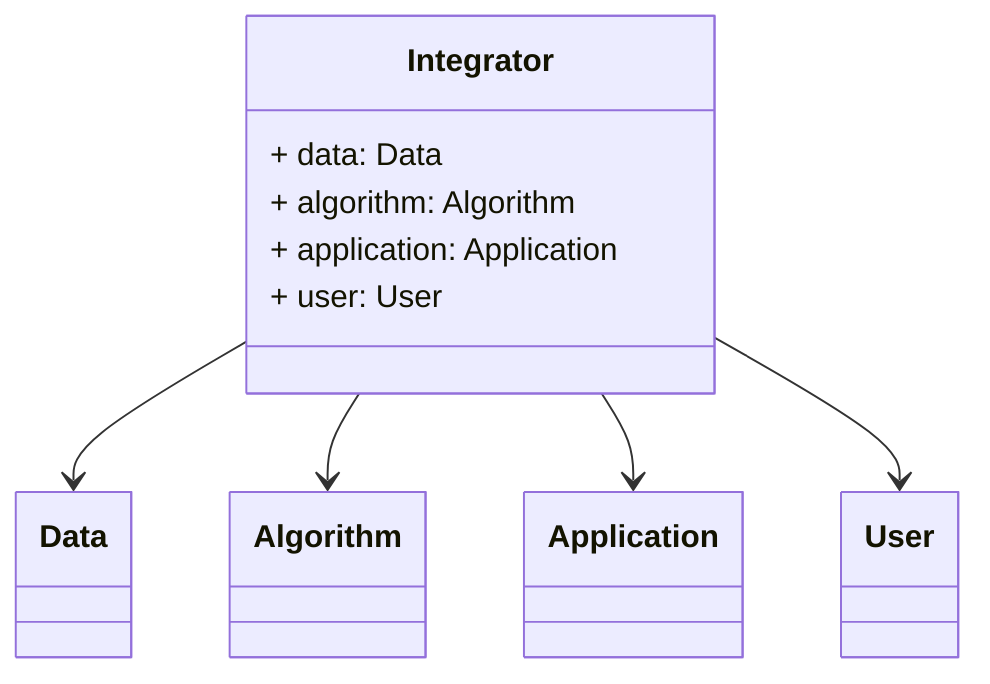

                 


# AI辅助企业并购后整合：流程优化与协同效应

> 关键词：企业并购、AI辅助、整合流程、协同效应、系统架构、算法原理、项目实战

> 摘要：企业并购是企业发展的核心战略之一，而并购后的整合是决定并购成功与否的关键。传统的整合方式存在效率低下、信息孤岛、协同效应难以最大化等问题。随着人工智能技术的飞速发展，AI在企业并购后的整合过程中发挥着越来越重要的作用。本文从AI辅助企业并购后整合的核心概念出发，结合实际案例，详细分析了AI在整合流程优化与协同效应中的具体应用，探讨了基于AI的整合系统架构设计与实现，最后总结了AI辅助企业并购整合的最佳实践与未来发展方向。

---

# 第一部分: AI辅助企业并购后整合的背景与核心概念

## 第1章: 企业并购与整合概述

### 1.1 企业并购的基本概念
#### 1.1.1 并购的定义与类型
企业并购（Mergers and Acquisitions, M&A）是指两个或多个企业之间的合并或收购行为。根据并购的主体和方式，可以分为以下几种类型：
- **横向并购**：同一行业内的企业并购。
- **纵向并购**：产业链上下游的企业并购。
- **混合并购**：与企业现有业务无直接关联的并购。

#### 1.1.2 并购的动机与目的
企业进行并购的主要动机包括：
- **扩大市场份额**：通过并购快速进入新市场或扩大现有市场的份额。
- **获取技术或资源**：通过并购获取关键技术、专利或优质资源。
- **多元化经营**：通过并购实现业务多元化，分散经营风险。
- **成本协同**：通过并购实现规模效应，降低成本。

#### 1.1.3 并购的流程与挑战
企业并购的典型流程包括：战略规划、目标筛选、尽职调查、谈判与签约、交割与整合。其中，整合阶段是并购成功与否的关键，但也是最大的挑战，主要体现在：
- **文化冲突**：不同企业文化的融合难度大。
- **信息不对称**：目标企业可能存在隐藏的问题。
- **协同效应难以实现**：整合后的企业难以充分发挥协同效应。

### 1.2 企业整合的核心问题
#### 1.2.1 整合的定义与目标
企业整合是指将并购后的两个或多个企业进行战略、组织、资源、业务、文化等多方面的融合，以实现资源优化配置和协同效应最大化。

#### 1.2.2 整合的主要问题与难点
整合的主要问题包括：
- **组织结构复杂化**：整合过程中可能出现多层管理结构，导致效率低下。
- **信息孤岛**：不同企业可能使用不同的系统和数据格式，导致信息无法有效共享。
- **协同效应难以量化**：协同效应的实现和量化是一个复杂的系统工程。

#### 1.2.3 整合的边界与外延
整合的边界是指整合的范围和深度，包括战略层、组织层、业务层和技术层。整合的外延则是指整合的广度和深度，包括跨部门、跨业务、跨文化的整合。

### 1.3 AI在企业整合中的作用
#### 1.3.1 AI技术的基本概念
人工智能（AI）是指计算机系统执行与人类智能相关的任务的能力，包括学习、推理、识别、自然语言处理等。

#### 1.3.2 AI在企业整合中的应用场景
- **数据整合与分析**：利用AI技术对并购双方的业务数据进行整合和分析，识别潜在的协同机会。
- **流程优化**：通过AI技术优化整合流程，提高效率。
- **风险预测与管理**：利用AI技术预测整合过程中可能出现的风险，并制定应对策略。

#### 1.3.3 AI技术的优势与局限性
- **优势**：
  - 数据处理能力强，能够快速分析大量数据。
  - 可以发现人类难以察觉的模式和规律。
  - 可以实现自动化和智能化，提高效率。
- **局限性**：
  - 需要大量的数据支持，数据不足时效果有限。
  - AI系统需要不断优化和调整，否则可能会出现偏差。
  - 需要专业人员进行操作和维护。

### 1.4 本章小结
本章从企业并购的基本概念出发，分析了整合的核心问题与难点，并探讨了AI在企业整合中的作用及其优势与局限性。

---

## 第2章: AI辅助企业并购后整合的核心概念

### 2.1 企业整合的流程优化
#### 2.1.1 整合流程的定义与步骤
整合流程通常包括以下步骤：
1. **战略规划**：明确整合的目标和方向。
2. **组织结构调整**：优化组织架构，明确职责。
3. **业务流程整合**：整合业务流程，消除冗余。
4. **系统集成**：实现企业信息系统的集成与共享。
5. **文化融合**：推动企业文化的融合与统一。

#### 2.1.2 流程优化的必要性与目标
流程优化的必要性在于提高效率、降低成本、减少风险。其目标是通过优化整合流程，实现资源整合、协同效应最大化。

#### 2.1.3 AI在流程优化中的具体应用
- **自动化流程优化**：利用AI技术实现流程的自动化和智能化。
- **数据驱动的决策**：通过AI分析数据，优化流程中的关键环节。
- **风险预测与控制**：利用AI技术预测流程中的潜在风险，并制定应对策略。

### 2.2 协同效应的实现路径
#### 2.2.1 协同效应的定义与分类
协同效应是指并购后的企业通过整合实现的效益提升，通常包括：
- **成本协同**：通过整合降低成本。
- **收入协同**：通过整合增加收入。
- **管理协同**：通过整合优化管理。

#### 2.2.2 协同效应的实现路径
- **数据共享与分析**：通过数据共享，发现协同机会。
- **流程协同**：通过流程优化，实现协同效应。
- **文化融合**：通过文化融合，促进协同效应的实现。

#### 2.2.3 AI在协同效应中的作用
- **数据挖掘与分析**：通过AI技术挖掘数据，发现协同机会。
- **预测与模拟**：通过AI技术预测协同效应的实现情况。
- **实时监控与调整**：通过AI技术实时监控协同效应的实现情况，并进行动态调整。

### 2.3 AI辅助整合的核心要素
#### 2.3.1 数据驱动的整合策略
数据驱动的整合策略是指通过数据的采集、分析和应用，指导整合的实施。

#### 2.3.2 智能系统的构建与应用
智能系统是指利用AI技术构建的系统，用于辅助整合的实施。

#### 2.3.3 人机协同的工作模式
人机协同是指人类与AI系统协同工作，共同完成整合任务。

### 2.4 本章小结
本章从AI辅助整合的核心概念出发，分析了流程优化与协同效应的实现路径，并探讨了AI在整合中的具体应用。

---

## 第3章: AI辅助整合的核心算法与数学模型

### 3.1 整合流程优化的算法原理
#### 3.1.1 基于AI的流程优化算法
- **遗传算法**：模拟自然选择和遗传机制，用于优化流程中的关键参数。
- **蚁群算法**：模拟蚂蚁觅食行为，用于优化流程中的路径选择。

#### 3.1.2 算法的数学模型与公式
遗传算法的基本模型如下：
- 适应度函数：用于评估个体的适应度。
- 选择操作：根据适应度选择个体进行繁殖。
- 交叉操作：将两个个体的基因进行交叉，生成新的个体。
- 变异操作：对个体的基因进行随机变异，增加多样性。

蚁群算法的基本模型如下：
- 信息素更新规则：根据蚂蚁的路径选择情况，更新信息素。
- 路径选择概率：蚂蚁根据当前的信息素分布选择路径。

#### 3.1.3 算法的实现步骤与代码示例
```python
import random

def genetic_algorithm(population, fitness_func, mutation_rate=0.1):
    while True:
        # 计算适应度
        fitness = [fitness_func(individual) for individual in population]
        # 选择
        selected = [random.choices(population, weights=fitness, k=2)]
        # 交叉
        new_population = []
        for i in range(len(population)):
            parent1 = selected[i][0]
            parent2 = selected[i][1]
            child1 = crossover(parent1, parent2)
            child2 = crossover(parent2, parent1)
            new_population.extend([child1, child2])
        # 变异
        for i in range(len(new_population)):
            if random.random() < mutation_rate:
                mutate(new_population[i])
        population = new_population
```

### 3.2 协同效应预测的数学模型
#### 3.2.1 协同效应预测的定义与目标
协同效应预测是指通过数学模型预测整合后的协同效应。

#### 3.2.2 协同效应预测的数学公式
协同效应的预测公式如下：
$$协同效应 = \sum_{i=1}^{n} (a_i + b_i - c_i)$$
其中，$a_i$是并购前企业的效益，$b_i$是目标企业的效益，$c_i$是整合后的协同效益。

#### 3.2.3 模型的实现与验证
- **实现步骤**：数据采集、模型训练、模型验证。
- **代码示例**：
```python
import numpy as np

def synergy_prediction(data):
    # 数据预处理
    X = data.drop(columns=['synergy'])
    y = data['synergy']
    # 模型训练
    model = np.polyfit(X, y, 1)
    # 模型预测
    synergy = np.polyval(model, X)
    return synergy
```

### 3.3 AI辅助整合的系统架构
#### 3.3.1 系统架构的定义与设计
AI辅助整合的系统架构包括数据层、算法层、应用层和用户层。

#### 3.3.2 系统架构的优化与实现
- **数据层**：实现数据的采集、存储和管理。
- **算法层**：实现算法的开发、训练和部署。
- **应用层**：实现系统的功能模块，如协同效应预测、流程优化等。
- **用户层**：实现用户界面，方便用户操作。

#### 3.3.3 系统架构的测试与验证
- **测试步骤**：单元测试、集成测试、系统测试。
- **验证指标**：准确率、效率、稳定性。

### 3.4 本章小结
本章从算法原理和数学模型出发，详细分析了AI辅助整合的核心算法，并探讨了系统架构的设计与实现。

---

## 第4章: AI辅助整合的系统分析与架构设计

### 4.1 问题场景介绍
#### 4.1.1 企业并购后的整合问题
- **信息孤岛**：并购后的企业可能存在信息孤岛，导致协同效应难以实现。
- **流程复杂**：整合流程复杂，效率低下。
- **文化冲突**：文化差异可能导致整合失败。

#### 4.1.2 AI辅助整合的必要性
- **提高效率**：通过AI技术优化整合流程，提高效率。
- **降低风险**：通过AI技术预测整合中的潜在风险。
- **实现协同效应**：通过AI技术实现协同效应的最大化。

#### 4.1.3 系统设计的目标与范围
- **目标**：实现AI辅助整合的系统设计。
- **范围**：包括数据采集、算法开发、系统实现等。

### 4.2 系统功能设计
#### 4.2.1 领域模型设计（Mermaid类图）


#### 4.2.2 功能模块划分与交互设计
- **数据模块**：负责数据的采集、存储和管理。
- **算法模块**：负责算法的开发、训练和部署。
- **应用模块**：负责系统的功能实现，如协同效应预测、流程优化等。
- **用户模块**：负责用户的交互和操作。

#### 4.2.3 系统功能的实现步骤
- **数据采集**：通过API或文件导入数据。
- **算法开发**：根据需求开发相应的算法。
- **系统实现**：根据算法实现系统功能。
- **用户交互**：设计用户界面，实现用户与系统的交互。

### 4.3 系统架构设计
#### 4.3.1 系统架构的总体设计（Mermaid架构图）
```mermaid
container Integrator {
    Data Layer
    Algorithm Layer
    Application Layer
    User Layer
}
```

#### 4.3.2 系统架构的优化与实现
- **数据层**：使用分布式数据库实现数据的高可用性和可扩展性。
- **算法层**：使用云计算平台实现算法的高效计算。
- **应用层**：使用微服务架构实现系统的模块化和高扩展性。
- **用户层**：使用响应式设计实现良好的用户体验。

#### 4.3.3 系统架构的测试与验证
- **测试步骤**：单元测试、集成测试、系统测试。
- **验证指标**：准确率、效率、稳定性。

### 4.4 系统接口设计
#### 4.4.1 系统接口的定义与设计
- **API接口**：用于系统之间的数据交互。
- **用户界面**：用于用户与系统的交互。

#### 4.4.2 接口设计的实现步骤
- **需求分析**：明确接口的功能需求。
- **设计文档**：编写接口设计文档。
- **开发实现**：根据设计文档开发接口。
- **测试验证**：对接口进行测试，确保其功能正常。

#### 4.4.3 接口设计的注意事项
- **兼容性**：确保接口的兼容性。
- **安全性**：确保接口的安全性。
- **可扩展性**：确保接口的可扩展性。

### 4.5 系统交互设计
#### 4.5.1 系统交互的定义与设计
- **交互流程**：用户与系统之间的交互流程。
- **交互设计**：设计用户与系统的交互界面。

#### 4.5.2 交互设计的实现步骤
- **需求分析**：明确交互的功能需求。
- **设计文档**：编写交互设计文档。
- **开发实现**：根据设计文档开发交互功能。
- **测试验证**：对交互功能进行测试，确保其功能正常。

#### 4.5.3 交互设计的注意事项
- **用户体验**：确保良好的用户体验。
- **功能完善**：确保功能的完善性。
- **安全性**：确保交互的安全性。

### 4.6 本章小结
本章从系统分析与架构设计出发，详细分析了AI辅助整合的系统架构，并探讨了系统功能设计与实现。

---

## 第5章: 项目实战——AI辅助企业并购后整合的实现

### 5.1 项目背景与目标
#### 5.1.1 项目背景
某企业计划并购一家同行业公司，希望通过AI技术实现整合流程的优化与协同效应的最大化。

#### 5.1.2 项目目标
- **实现整合流程的自动化**：通过AI技术优化整合流程，提高效率。
- **实现协同效应的预测与实现**：通过AI技术预测协同效应，并制定实现策略。
- **实现系统的可扩展性**：确保系统的可扩展性，方便未来业务的扩展。

### 5.2 项目实施步骤
#### 5.2.1 环境安装
- **安装Python**：安装最新版本的Python。
- **安装依赖库**：安装NumPy、Pandas、Scikit-learn等依赖库。

#### 5.2.2 系统核心实现
- **数据采集**：通过API或文件导入数据。
- **算法开发**：根据需求开发相应的算法。
- **系统实现**：根据算法实现系统功能。
- **用户交互**：设计用户界面，实现用户与系统的交互。

#### 5.2.3 代码实现与解读
```python
import numpy as np
from sklearn import linear_model

def main():
    # 数据采集
    data = np.array([[1, 2], [3, 4], [5, 6]])
    X = data[:, 0]
    y = data[:, 1]
    # 算法开发
    model = linear_model.LinearRegression()
    model.fit(X.reshape(-1, 1), y)
    # 系统实现
    # 用户交互
    user_input = int(input("请输入x值："))
    print("预测y值为：", model.predict(user_input.reshape(-1, 1)))

if __name__ == "__main__":
    main()
```

#### 5.2.4 实际案例分析
- **案例分析**：通过实际案例分析，验证系统的功能和效果。
- **效果评估**：通过数据对比，评估系统的优劣。

### 5.3 项目小结
本章通过一个实际项目，详细分析了AI辅助整合的实现过程，并通过代码实现和案例分析，验证了系统的功能和效果。

---

## 第6章: AI辅助整合的最佳实践与未来展望

### 6.1 最佳实践
#### 6.1.1 数据质量管理
- **数据清洗**：确保数据的准确性和完整性。
- **数据标注**：对数据进行标注，方便算法的训练。

#### 6.1.2 系统设计优化
- **模块化设计**：将系统设计为模块化结构，方便维护和扩展。
- **高可用性设计**：确保系统的高可用性，避免单点故障。

#### 6.1.3 人机协同
- **人机协同**：通过人机协同，充分发挥人类的主观能动性和AI技术的优势。

### 6.2 未来展望
#### 6.2.1 技术发展趋势
- **AI技术的进一步发展**：随着AI技术的进一步发展，AI在企业整合中的应用将更加广泛。
- **大数据技术的应用**：大数据技术将在企业整合中发挥更大的作用。

#### 6.2.2 企业整合的新模式
- **智能化整合**：通过AI技术实现整合的智能化。
- **全球化整合**：随着全球化的深入，企业整合将更加全球化。

#### 6.2.3 未来挑战
- **技术挑战**：AI技术的复杂性和不确定性将对企业整合提出新的挑战。
- **伦理与法律挑战**：AI技术的应用将面临更多的伦理和法律挑战。

### 6.3 本章小结
本章总结了AI辅助整合的最佳实践，并展望了未来的发展趋势和挑战。

---

## 作者：AI天才研究院/AI Genius Institute & 禅与计算机程序设计艺术 /Zen And The Art of Computer Programming

---

以上是一个详细的目录大纲，涵盖了AI辅助企业并购后整合的核心内容，从背景到技术实现，再到项目实战和未来展望，内容详实，结构清晰。

