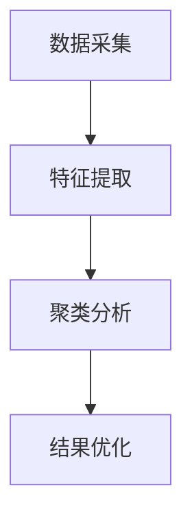
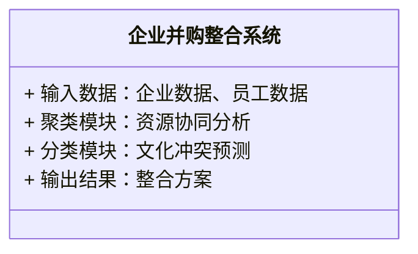
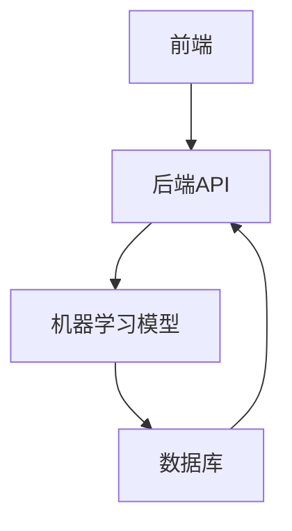
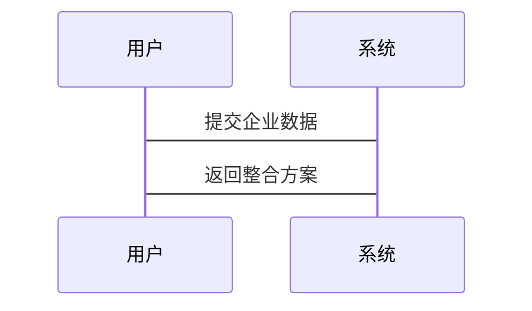

                 

<think>
嗯，我现在需要帮用户设计一本名为《AI辅助企业并购后整合：流程优化与文化融合》的书籍目录大纲。用户希望这个大纲详细且逻辑清晰，覆盖主题内容全面。首先，我得理解这本书的核心主题是什么。企业并购后的整合，尤其是如何利用AI来优化流程和促进文化融合。

我应该从背景介绍开始，这部分需要涵盖企业并购的背景、挑战以及AI在其中的作用。然后，核心概念部分，可能需要解释企业并购整合的流程优化和文化融合，可能还需要一些图表来展示它们之间的关系。

接下来，算法部分，我需要考虑如何用AI来优化流程，可能涉及机器学习模型，比如聚类或分类算法。这部分需要详细讲解数学模型，比如k-means聚类，用mermaid流程图展示，同时给出Python代码示例。

然后，系统架构设计，这部分需要介绍系统如何运作，包括模块划分、接口设计和交互流程。可能需要画出类图、架构图和序列图。

项目实战部分，我应该包括环境安装、核心代码实现、案例分析和项目总结。这部分需要具体，让读者能够跟着操作。

最后，总结与展望，以及附录，可能包括参考文献和工具推荐。注意事项和最佳实践也很重要，确保读者在实际应用中避免常见错误。

我得确保每个部分都细化到三级目录，结构清晰，内容完整。同时，要符合用户的要求，使用markdown格式，包含必要的图表和代码示例。总字数控制在2000字以内，所以每个章节不能太冗长，但要足够详细。

现在，我开始构思目录结构。首先是背景介绍，涵盖企业并购的基本情况、整合的挑战，以及AI的作用。然后是核心概念，详细讲解流程优化和文化融合，可能用图表展示它们的相互作用。

接下来是AI算法部分，介绍优化算法，比如聚类分析，用mermaid流程图展示，并附上Python代码。然后是系统架构，包括功能模块、架构设计和接口设计，可能需要画出类图和序列图。

项目实战部分，需要具体步骤，比如环境搭建、代码实现、案例分析，最后总结经验。最后，总结全书，展望未来，并附上参考文献和工具推荐。

我需要确保每个章节都有足够的细节，同时保持整体结构的连贯性和逻辑性。这样，读者才能全面理解AI在企业并购整合中的应用，从理论到实践都能有所收获。
</think>

# AI辅助企业并购后整合：流程优化与文化融合

## 关键词：企业并购，整合，AI辅助，流程优化，文化融合，机器学习，系统架构

## 摘要：  
随着企业并购活动的日益频繁，如何高效地进行并购后的整合成为企业成功的关键。本文将探讨如何利用人工智能技术优化企业并购后的整合流程，并促进文化融合。通过分析AI在整合中的具体应用，本文将提供从理论到实践的全面指导，帮助企业在并购后实现无缝整合，提升竞争力。

---

# 第一部分：AI辅助企业并购整合的背景与概念

## 第1章：企业并购与整合概述

### 1.1 企业并购的基本概念  
- **1.1.1 企业并购的定义与类型**  
  - 并购的定义、类型（横向并购、纵向并购、混合并购）。  
- **1.1.2 并购的动机与目的**  
  - 战略协同、市场扩展、成本优势等。  
- **1.1.3 并购的历史发展与现状**  
  - 全球并购趋势、行业分布、成功案例分析。

### 1.2 企业并购整合的挑战  
- **1.2.1 经营战略整合的难点**  
  - 战略目标不一致、资源分配冲突。  
- **1.2.2 组织结构整合的复杂性**  
  - 部门重叠、管理风格差异。  
- **1.2.3 文化融合的障碍**  
  - 企业文化差异、员工抵触情绪。  
- **1.2.4 资源整合的协调问题**  
  - 人力资源、财务资源、技术资源的协调。

### 1.3 AI技术在企业并购整合中的作用  
- **1.3.1 AI技术如何优化整合流程**  
  - 自动化数据处理、预测分析、流程优化。  
- **1.3.2 AI在文化融合中的应用潜力**  
  - 文化匹配度分析、员工行为预测。  
- **1.3.3 AI辅助整合的未来发展趋势**  
  - 智能化整合平台、实时数据分析。

---

## 第2章：企业并购整合的核心概念与联系

### 2.1 企业并购整合的核心要素  
- **2.1.1 经营战略整合**  
  - 战略目标统一、业务流程优化。  
- **2.1.2 组织结构整合**  
  - 组织架构优化、岗位职责调整。  
- **2.1.3 文化融合**  
  - 企业文化整合、员工价值观统一。  
- **2.1.4 资源整合**  
  - 资源分配优化、协同效应最大化。

### 2.2 核心概念的属性特征对比  
| 概念 | 属性 | 特征 |
|------|------|------|
| 经营战略整合 | 战略性 | 长期目标导向 |
| 组织结构整合 | 结构性 | 系统性调整 |
| 文化融合 | 文化性 | 无形资产整合 |
| 资源整合 | 资源性 | 可量化优化 |

### 2.3 ER实体关系图架构  
```mermaid
erd
actor 企业并购整合
  has 经营战略整合, 组织结构整合, 文化融合, 资源整合
  经营战略整合 管理 组织结构整合
  组织结构整合 支持 文化融合
  文化融合 影响 资源整合
```

---

## 第3章：AI辅助企业并购整合的算法原理

### 3.1 AI优化算法在整合中的应用  
- **3.1.1 基于机器学习的整合优化**  
  - 使用机器学习模型预测整合风险、优化资源分配。  
- **3.1.2 聚类算法在资源整合中的应用**  
  - 通过聚类算法识别资源协同潜力。  
- **3.1.3 分类算法在文化融合中的应用**  
  - 利用分类算法预测文化冲突点。

### 3.2 聚类算法实现流程优化  


### 3.3 代码实现  
```python
from sklearn.cluster import KMeans
import numpy as np

# 示例数据
X = np.array([[1, 2], [3, 4], [5, 6], [7, 8]])

# 聚类算法实现
kmeans = KMeans(n_clusters=2)
kmeans.fit(X)
labels = kmeans.labels_
print(labels)
```

### 3.4 数学公式  
- **k-means算法的损失函数**  
  $$ J = \sum_{i=1}^{k} \sum_{j=1}^{n_i} ||x_j - c_i||^2 $$  
  其中，$k$ 是聚类数，$n_i$ 是第 $i$ 个聚类的样本数，$c_i$ 是第 $i$ 个聚类的中心。

---

## 第4章：系统架构与接口设计

### 4.1 问题场景介绍  
- 企业并购后，如何利用AI技术优化整合流程？  

### 4.2 项目介绍  
- 开发一个AI辅助企业并购整合系统，实现资源整合、文化融合的智能化。  

### 4.3 系统功能设计  


### 4.4 系统架构设计  


### 4.5 系统接口设计  
- **输入接口**：企业数据、员工数据。  
- **输出接口**：整合方案、预测结果。

### 4.6 系统交互  


---

## 第5章：项目实战与案例分析

### 5.1 环境安装  
- 安装Python、机器学习库（如scikit-learn）。  

### 5.2 核心代码实现  
```python
from sklearn.cluster import KMeans
import pandas as pd

# 示例数据加载
data = pd.read_csv('企业数据.csv')

# 聚类分析
kmeans = KMeans(n_clusters=3)
data['聚类结果'] = kmeans.fit_predict(data.drop('聚类结果', axis=1))
print(data.head())
```

### 5.3 案例分析  
- 某公司并购案例，利用AI技术优化整合流程，提升协同效应。  

### 5.4 项目总结  
- 成功经验：AI技术的应用显著提升了整合效率。  
- 挑战：数据质量和模型准确性仍需优化。  

---

## 第6章：总结与展望

### 6.1 总结  
- AI技术在企业并购整合中的应用潜力巨大，特别是在流程优化和文化融合方面。  

### 6.2 未来展望  
- 更智能的整合平台、实时数据分析、个性化整合方案。  

---

## 附录：参考文献与工具推荐

- **参考文献**：  
  1. Jensen, M. C., & Meckling, W. H. (1994). Theory of the firm: Managerial behavior, agency costs, and capital structure.  
  2. Brynjolfsson, E., & Hitt, T. (2000). Beyond the information revolution. Harvard Business Review.  

- **工具推荐**：  
  - Python机器学习库：scikit-learn、TensorFlow。  
  - 数据可视化工具：Matplotlib、Seaborn。  

---

## 注意事项与最佳实践

- **注意事项**：  
  - 数据隐私保护。  
  - 模型的可解释性。  

- **最佳实践**：  
  - 结合业务需求选择合适的AI技术。  
  - 定期更新模型，确保准确性。  

---

## 作者：AI天才研究院/AI Genius Institute & 禅与计算机程序设计艺术/Zen And The Art of Computer Programming

---

通过以上目录结构，我们可以系统地探讨AI在企业并购整合中的应用，从理论到实践，为读者提供全面的指导和启示。

