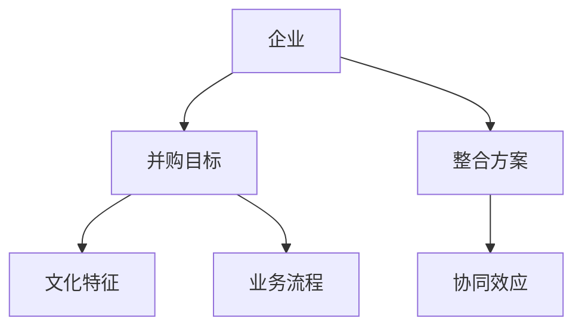
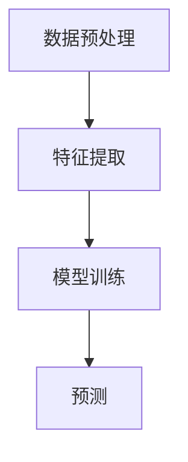
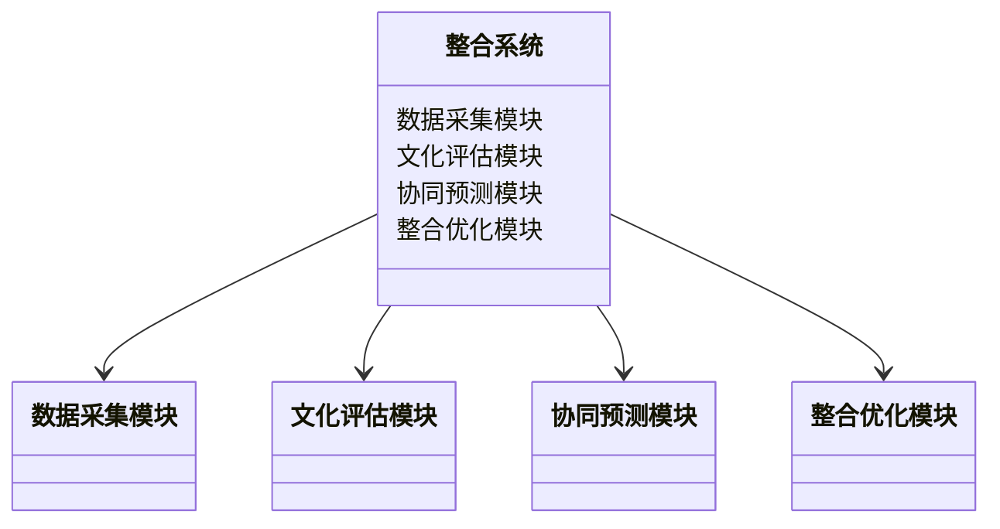
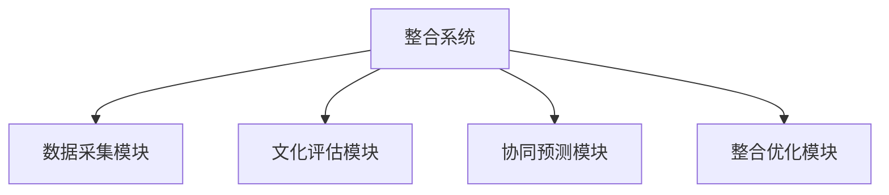

                 


# AI辅助企业并购整合规划：文化融合与业务协同路径设计

> 关键词：企业并购，AI技术，文化融合，业务协同，整合规划，协同效应预测

> 摘要：本文详细探讨了在企业并购过程中，如何利用人工智能技术辅助整合规划，特别关注文化融合与业务协同的关键路径设计。通过分析企业并购的核心挑战，结合AI技术的应用前景，提出了一套基于协同效应预测模型的整合规划方案，并通过实际案例验证了该方案的有效性。

---

## 第1章: 企业并购与整合概述

### 1.1 企业并购的基本概念

#### 1.1.1 企业并购的定义与类型
企业并购（Mergers and Acquisitions, M&A）是指一家企业合并或收购另一家企业，以实现资源优化配置和业务扩展。并购可以分为以下几种类型：
- **横向并购**：同一行业内的企业合并，旨在扩大市场份额。
- **纵向并购**：产业链上下游的企业合并，以增强垂直整合能力。
- **混合并购**：与自身业务无直接关联的企业合并，通常是为了 diversification。

#### 1.1.2 并购的动机与目的
企业并购的主要动机包括：
- **市场扩展**：快速进入新市场。
- **成本协同效应**：通过规模效应降低成本。
- **技术获取**：获取关键技术或专利。
- **管理协同效应**：整合管理团队和资源。

#### 1.1.3 并购的历史发展与现状
企业并购的历史可以追溯到19世纪末，但真正的发展始于20世纪。近年来，随着全球经济一体化和科技的进步，并购活动日益频繁，尤其是跨国并购和科技型企业的并购。

---

### 1.2 企业整合的内涵与挑战

#### 1.2.1 整合的定义与范围
企业整合是指在并购完成后，将被并购企业的资源、业务、文化和组织结构与并购方进行深度融合的过程。整合范围包括：
- **业务整合**：生产、销售、供应链等。
- **组织整合**：管理结构、部门设置。
- **文化整合**：企业文化的融合与统一。

#### 1.2.2 整合的主要挑战
整合过程中常见的挑战包括：
- **文化冲突**：不同企业文化的摩擦。
- **组织协调**：部门间协作不畅。
- **员工适应**：员工对并购的抵触情绪。

#### 1.2.3 整合的典型失败案例分析
以美国在线（AOL）收购时代华纳为例，由于文化冲突和管理不善，导致整合失败，最终引发企业裁员和市值暴跌。

---

### 1.3 AI技术在企业整合中的应用前景

#### 1.3.1 AI技术的基本概念与发展趋势
人工智能（AI）是指计算机系统执行人类智能任务的能力，如学习、推理和问题解决。AI技术近年来快速发展，特别是在大数据和深度学习的推动下。

#### 1.3.2 AI在企业整合中的潜在价值
AI可以帮助企业通过数据分析优化整合策略，预测协同效应，降低整合风险。

#### 1.3.3 当前AI在企业整合中的应用现状与不足
目前，AI在企业整合中的应用还处于初级阶段，主要集中在数据分析和预测领域，但在实际整合过程中仍面临数据不足和模型不够精准的问题。

---

## 第2章: 企业并购中的文化融合与业务协同

### 2.1 企业文化融合的重要性

#### 2.1.1 企业文化的定义与特征
企业文化是企业在长期经营中形成的独特价值观、行为规范和企业精神。其特征包括独特性、动态性和渗透性。

#### 2.1.2 文化冲突对企业整合的影响
文化冲突可能导致员工抵触情绪，影响整合效果。

#### 2.1.3 文化融合的必要性与实现路径
文化融合是确保企业长期稳定发展的关键。实现路径包括：
- **文化评估**：分析双方的文化差异。
- **文化培训**：加强文化融合的宣传和培训。
- **文化融合**：制定文化融合的具体措施。

---

### 2.2 业务协同的关键因素

#### 2.2.1 业务协同的定义与类型
业务协同是指企业在整合过程中，通过协调资源和流程，实现业务目标的优化。

#### 2.2.2 业务协同的核心要素
包括资源共享、流程优化和协同效应最大化。

#### 2.2.3 业务协同的实现策略
- **资源共享**：整合供应链、销售渠道等。
- **流程优化**：优化生产流程和管理流程。
- **协同效应最大化**：通过协同效应提升整体竞争力。

---

### 2.3 文化融合与业务协同的关系

#### 2.3.1 文化融合对业务协同的影响
良好的文化融合可以促进业务协同，增强员工的归属感和积极性。

#### 2.3.2 业务协同对文化融合的反作用
业务协同的成功可以反过来促进文化融合，增强企业的凝聚力。

#### 2.3.3 两者协同发展的实现路径
- **战略规划**：制定文化融合和业务协同的战略目标。
- **组织协调**：加强部门间协作，确保战略的实施。
- **持续优化**：根据实际情况不断优化整合方案。

---

## 第3章: AI辅助企业并购整合的核心概念与联系

### 3.1 AI在企业整合中的核心概念

#### 3.1.1 数据驱动的整合分析
AI通过数据分析，帮助企业识别整合中的潜在问题和机会。

#### 3.1.2 AI算法在整合决策中的应用
AI算法可以帮助企业预测整合后的协同效应，优化整合策略。

#### 3.1.3 AI辅助整合的系统架构
AI辅助整合系统包括数据采集、模型构建、结果分析等模块。

---

### 3.2 AI辅助整合的核心要素

#### 3.2.1 数据采集与处理
数据采集包括企业财务数据、业务数据和文化数据。

#### 3.2.2 模型构建与训练
使用机器学习算法训练协同效应预测模型。

#### 3.2.3 结果分析与优化
通过模型预测协同效应，优化整合方案。

---

### 3.3 核心概念的ER实体关系图



---

## 第4章: 协同效应预测模型的构建与实现

### 4.1 协同效应预测模型的算法原理



#### 4.1.1 数据预处理
- 数据清洗：处理缺失值和异常值。
- 数据归一化：将数据标准化。

#### 4.1.2 特征提取
选择对企业协同效应影响较大的特征，如收入增长率、成本降低率等。

#### 4.1.3 模型训练
使用机器学习算法（如随机森林、支持向量机）训练协同效应预测模型。

#### 4.1.4 预测评估
通过验证集评估模型的准确性和稳定性。

---

### 4.2 协同效应预测模型的数学公式

协同效应预测模型的公式如下：

$$
\text{协同效应} = \beta_0 + \beta_1x_1 + \beta_2x_2 + \dots + \beta_nx_n + \epsilon
$$

其中：
- $\beta_i$ 是特征 $x_i$ 的系数。
- $\epsilon$ 是误差项。

---

## 第5章: 系统分析与架构设计方案

### 5.1 问题场景介绍
企业A并购企业B，希望通过AI技术优化整合过程，预测协同效应，制定整合策略。

### 5.2 系统功能设计



### 5.3 系统架构设计



### 5.4 系统接口设计
系统接口包括数据输入接口、模型调用接口和结果输出接口。

---

## 第6章: 项目实战

### 6.1 环境安装
- 安装Python和相关库（如scikit-learn、pandas）。
- 安装Jupyter Notebook用于代码开发。

### 6.2 核心代码实现

```python
import pandas as pd
from sklearn.ensemble import RandomForestRegressor
from sklearn.metrics import mean_squared_error

# 数据加载
data = pd.read_csv('merger_data.csv')

# 特征提取
features = ['revenue_growth', 'cost_reduction', 'market_share']
target = 'synergy'

# 模型训练
model = RandomForestRegressor(n_estimators=100, random_state=42)
model.fit(data[features], data[target])

# 预测协同效应
predictions = model.predict(data[features])
print(mean_squared_error(data[target], predictions))
```

### 6.3 实际案例分析
以企业A并购企业B为例，通过代码实现协同效应预测，并根据结果优化整合策略。

---

## 第7章: 最佳实践与小结

### 7.1 最佳实践
- 数据质量是协同效应预测的关键。
- 模型选择和调优是确保预测准确性的核心。
- 文化融合与业务协同需要企业内部的持续努力。

### 7.2 小结
本文详细探讨了AI在企业并购整合中的应用，提出了基于协同效应预测模型的整合规划方案，并通过实际案例验证了其有效性。

---

## 参考文献

（此处可根据需要添加相关文献）

---

作者：AI天才研究院/AI Genius Institute & 禅与计算机程序设计艺术/Zen And The Art of Computer Programming

