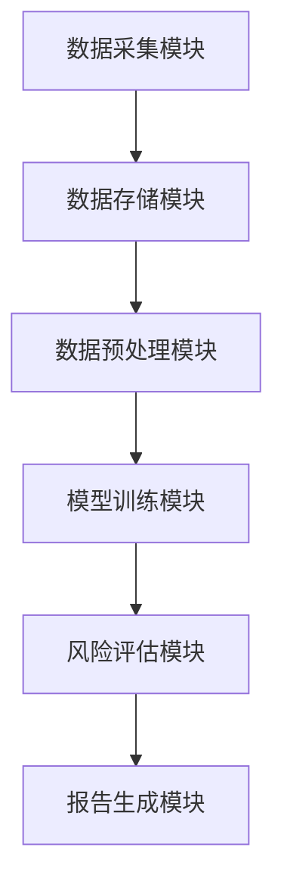
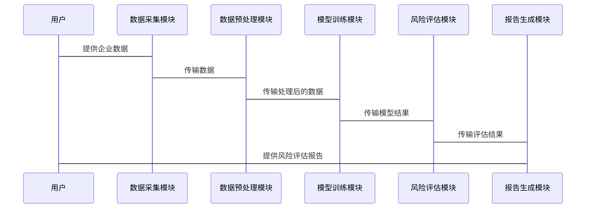

                 

# AI辅助企业并购风险评估与缓解策略

> 关键词：企业并购，AI，风险评估，机器学习，自然语言处理

> 摘要：随着企业并购活动的日益频繁，风险评估成为并购成功与否的关键因素。本文将探讨如何利用人工智能技术，特别是机器学习和自然语言处理，来辅助企业并购的风险评估与缓解策略。文章将详细分析并购风险的类型，介绍AI技术的核心原理，构建风险评估模型，并通过实际案例展示AI在并购中的应用效果。

---

# 第1章: 企业并购风险评估的背景介绍

## 1.1 企业并购的定义与特点

### 1.1.1 企业并购的基本概念
企业并购（Mergers and Acquisitions，M&A）是指两个或多个企业之间的合并或收购行为。并购可以是吸收合并、新设合并或控股合并等形式，其目的是为了实现资源优化配置、扩大市场份额或进入新领域。

### 1.1.2 并购的类型与特点
并购可以分为横向并购、纵向并购和混合并购：
- **横向并购**：在同一行业内部的并购，旨在扩大市场份额。
- **纵向并购**：在产业链上下游的并购，以增强垂直整合能力。
- **混合并购**：在不同行业之间的并购，通常是为了 diversification。

### 1.1.3 并购的动机与目标
企业进行并购的动机多种多样，主要包括：
- **市场扩张**：进入新市场或扩大现有市场。
- **资源获取**：获取技术、品牌、渠道或其他资源。
- **成本节约**：通过规模效应降低成本。
- **战略防御**：防止竞争对手的扩张。

## 1.2 企业并购中的风险概述

### 1.2.1 并购风险的定义
并购风险是指在并购过程中或完成后，由于内外部因素导致企业价值损失或经营不善的风险。

### 1.2.2 常见的并购风险类型
- **财务风险**：如高负债、现金流不稳定。
- **市场风险**：如市场竞争加剧、市场需求变化。
- **整合风险**：如文化冲突、管理不善。
- **法律风险**：如合规问题、知识产权纠纷。
- **技术风险**：如技术落后或无法整合。

### 1.2.3 并购风险的影响
并购失败可能导致企业损失资金、声誉和市场份额，甚至引发财务危机。因此，有效的风险评估与管理是并购成功的关键。

## 1.3 AI技术在企业并购中的应用潜力

### 1.3.1 AI技术的基本概念
人工智能（AI）是指计算机系统执行人类智能任务的能力，如学习、推理、问题解决和自然语言处理。

### 1.3.2 AI在企业并购中的应用场景
- **数据挖掘**：分析历史并购案例，识别风险因素。
- **预测分析**：预测并购后的财务表现和市场风险。
- **文本分析**：分析并购相关的新闻、报告和合同。

### 1.3.3 AI辅助并购的优势与挑战
- **优势**：提高效率、降低成本、提供数据支持的决策。
- **挑战**：数据质量、模型的可解释性、技术的复杂性。

---

# 第2章: 企业并购风险评估的核心概念

## 2.1 并购风险评估的理论基础

### 2.1.1 风险评估的基本原理
风险评估是通过分析潜在风险因素，预测其发生概率和影响程度，从而制定应对策略。

### 2.1.2 并购风险的分类与特征
并购风险可以分为系统性风险和非系统性风险：
- **系统性风险**：影响整个市场的风险，如经济衰退。
- **非系统性风险**：特定于企业的风险，如管理问题。

### 2.1.3 并购风险评估的框架
一个典型的并购风险评估框架包括以下几个步骤：
1. **识别风险因素**：列出可能影响并购的所有风险因素。
2. **评估风险概率**：分析每个风险发生的可能性。
3. **评估风险影响**：确定每个风险对并购的影响程度。
4. **制定缓解策略**：根据评估结果制定应对措施。

## 2.2 AI辅助风险评估的关键技术

### 2.2.1 机器学习在风险评估中的应用
机器学习可以通过历史数据训练模型，预测并购后的风险。

### 2.2.2 自然语言处理在并购文本分析中的应用
自然语言处理（NLP）可以分析并购相关的文本，提取关键信息。

### 2.2.3 数据挖掘在风险识别中的作用
数据挖掘技术可以从大量数据中发现潜在的模式和关联。

## 2.3 并购风险评估的核心要素

### 2.3.1 企业基本面分析
包括企业的财务状况、盈利能力、管理团队等。

### 2.3.2 财务风险评估
分析企业的资产负债表、利润表和现金流量表，评估财务健康状况。

### 2.3.3 市场风险与竞争环境分析
评估目标企业在市场中的地位、竞争对手情况和市场趋势。

---

# 第3章: 机器学习在并购风险评估中的应用

## 3.1 机器学习的基本原理

### 3.1.1 机器学习的定义与分类
机器学习是一种人工智能技术，通过数据训练模型，使其能够进行预测或分类。

### 3.1.2 监督学习与无监督学习的对比
- **监督学习**：有标签的数据进行训练，如分类和回归。
- **无监督学习**：无标签的数据进行训练，如聚类和降维。

### 3.1.3 常见的机器学习算法
- **线性回归**：用于预测连续型变量。
- **决策树**：用于分类和回归。
- **随机森林**：基于决策树的集成学习方法。
- **支持向量机（SVM）**：用于分类和回归。

## 3.2 基于机器学习的并购风险评估模型

### 3.2.1 数据特征提取与选择
- **财务指标**：如利润 margins、负债率。
- **市场指标**：如股价波动、行业趋势。
- **管理指标**：如高管稳定性、董事会结构。

### 3.2.2 模型训练与优化
- **数据预处理**：处理缺失值、异常值和标准化。
- **特征工程**：选择重要的特征并进行特征变换。
- **模型训练**：使用训练数据训练模型。
- **模型优化**：通过交叉验证调整模型参数。

### 3.2.3 模型评估与验证
- **训练集评估**：评估模型在训练数据上的表现。
- **验证集评估**：评估模型在未见数据上的表现。
- **测试集评估**：评估模型的最终性能。

## 3.3 机器学习在并购风险预测中的案例分析

### 3.3.1 案例背景与数据来源
假设我们有一家科技公司计划收购一家人工智能初创公司。我们收集了两家公司的财务数据、市场数据和新闻报道。

### 3.3.2 模型构建与训练
- **数据预处理**：清洗数据，处理缺失值。
- **特征选择**：选择重要的财务和市场指标。
- **模型选择**：选择随机森林作为分类器。
- **模型训练**：使用训练数据训练模型。

### 3.3.3 模型预测与结果分析
- **预测结果**：模型预测并购后的风险等级为中高风险。
- **结果分析**：模型认为主要风险来自市场竞争和整合问题。

---

# 第4章: 自然语言处理在并购文本分析中的应用

## 4.1 自然语言处理的基本原理

### 4.1.1 什么是自然语言处理
NLP 是研究如何让计算机理解和生成人类语言的技术。

### 4.1.2 NLP的核心任务
- **文本分类**：将文本分为不同类别，如正面、负面。
- **信息抽取**：从文本中提取结构化信息，如日期、地点。
- **情感分析**：分析文本中的情感倾向。

### 4.1.3 常见的NLP算法
- **分词**：将文本分割成单词或短语。
- **词性标注**：标注每个词的词性。
- **句法分析**：分析句子的语法结构。

## 4.2 NLP在并购文本分析中的应用

### 4.2.1 并购相关的文本数据
- **新闻报道**：分析媒体对并购的报道，提取情感倾向。
- **公司财报**：分析财务报告中的关键词。
- **法律文件**：分析并购合同中的法律条款。

### 4.2.2 基于NLP的风险识别
- **情感分析**：分析媒体对并购的正面或负面情绪。
- **关键词提取**：提取与风险相关的关键词，如“竞争”、“整合”。

### 4.2.3 文本摘要
- **自动摘要**：生成并购相关的文本摘要，帮助快速了解关键信息。

## 4.3 NLP在并购风险评估中的案例分析

### 4.3.1 案例背景
某公司计划并购一家竞争对手，我们分析新闻报道和行业报告。

### 4.3.2 文本分析
- **情感分析**：媒体报道对并购持负面态度，认为市场竞争加剧。
- **关键词提取**：提取关键词如“竞争”、“市场份额”。

### 4.3.3 结果分析
NLP分析表明，并购可能导致市场竞争加剧，增加市场风险。

---

# 第5章: AI辅助企业并购风险评估的系统设计

## 5.1 系统架构设计

### 5.1.1 系统功能模块
- **数据采集模块**：收集企业财务数据、市场数据和文本数据。
- **模型训练模块**：训练机器学习和NLP模型。
- **风险评估模块**：结合模型结果，评估并购风险。
- **报告生成模块**：生成风险评估报告和缓解策略。

### 5.1.2 系统架构图

## 5.2 系统功能设计

### 5.2.1 数据采集模块
- **功能**：从数据库、API和网络爬虫获取数据。
- **工具**：使用Python的requests库和BeautifulSoup进行网页抓取。

### 5.2.2 数据预处理模块
- **功能**：清洗数据，处理缺失值和异常值。
- **工具**：使用Pandas库进行数据清洗。

### 5.2.3 模型训练模块
- **功能**：训练机器学习和NLP模型。
- **工具**：使用Scikit-learn和spaCy进行模型训练。

### 5.2.4 风险评估模块
- **功能**：结合模型结果，评估并购风险。
- **工具**：使用自定义脚本进行风险评估。

### 5.2.5 报告生成模块
- **功能**：生成风险评估报告和缓解策略。
- **工具**：使用Word或Markdown生成报告。

## 5.3 系统接口设计

### 5.3.1 数据接口
- **输入接口**：接收企业数据和文本数据。
- **输出接口**：输出风险评估结果和报告。

### 5.3.2 模型接口
- **输入接口**：接收预处理后的数据。
- **输出接口**：输出模型预测结果。

## 5.4 系统交互设计

### 5.4.1 交互流程

---

# 第6章: AI辅助企业并购风险评估的案例分析

## 6.1 案例背景

### 6.1.1 案例介绍
某大型企业计划收购一家科技公司，我们需要评估并购风险。

## 6.2 数据收集与处理

### 6.2.1 数据来源
- **财务数据**：目标公司的财务报表。
- **市场数据**：行业趋势和竞争对手信息。
- **文本数据**：新闻报道和公司公告。

## 6.3 模型训练与评估

### 6.3.1 模型训练
- **特征选择**：选择重要的财务和市场指标。
- **模型训练**：使用随机森林进行分类。

### 6.3.2 模型评估
- **准确率**：模型在测试数据上的准确率为85%。
- **召回率**：模型对高风险的识别率为90%。

## 6.4 风险评估与缓解策略

### 6.4.1 风险评估结果
模型预测并购后的市场风险较高，整合风险中等。

### 6.4.2 缓解策略
- **市场风险**：加强市场调研，制定应对竞争的策略。
- **整合风险**：制定详细的整合计划，确保管理团队的稳定性。

## 6.5 案例总结
通过AI技术，我们可以更准确地评估并购风险，并制定有效的缓解策略，提高并购成功的概率。

---

# 第7章: AI辅助企业并购风险评估的最佳实践与总结

## 7.1 最佳实践

### 7.1.1 数据质量的重要性
确保数据的完整性和准确性，是模型准确的前提。

### 7.1.2 模型选择的策略
根据具体问题选择合适的算法，避免盲目使用复杂模型。

### 7.1.3 模型的可解释性
选择可解释的模型，便于企业理解和制定策略。

## 7.2 注意事项

### 7.2.1 数据隐私保护
确保数据的合法性和隐私性，遵守相关法律法规。

### 7.2.2 模型的可扩展性
设计可扩展的系统，方便未来的数据更新和模型优化。

## 7.3 拓展阅读

### 7.3.1 推荐书籍
- 《机器学习实战》
- 《自然语言处理入门》

### 7.3.2 推荐博客
- Medium上的AI相关博客
- Towards Data Science上的并购分析文章

---

# 作者：AI天才研究院（AI Genius Institute） & 禅与计算机程序设计艺术（Zen And The Art of Computer Programming）

---

以上是《AI辅助企业并购风险评估与缓解策略》的完整目录大纲和详细内容，涵盖从背景介绍到系统设计再到案例分析的全过程。通过结合机器学习和自然语言处理技术，企业可以更高效地进行并购风险评估，制定有效的缓解策略，提高并购成功的概率。

