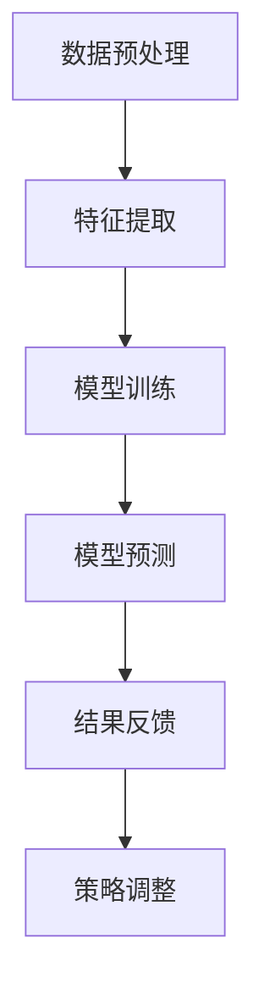
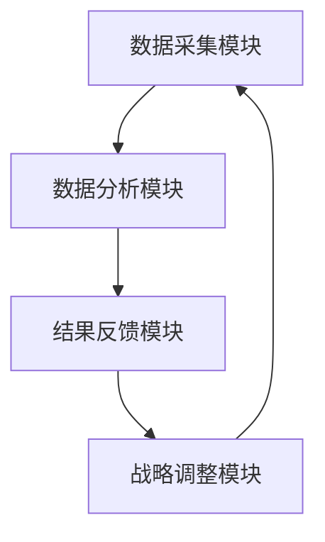
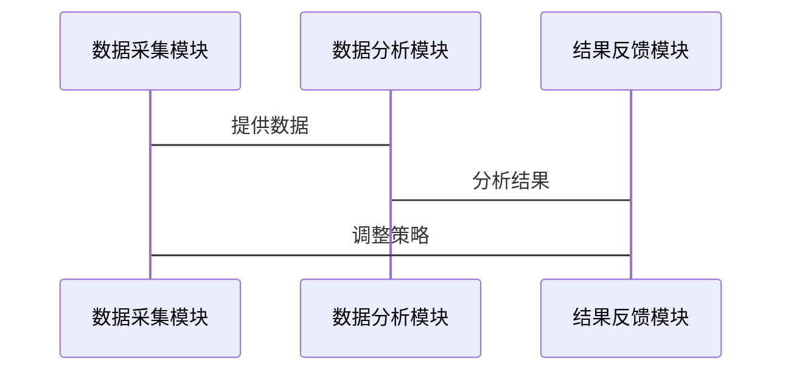

                 


# AI辅助企业战略执行：KPI监控与调整

## 关键词：AI、KPI、战略执行、监控系统、算法、企业绩效

## 摘要：  
本文探讨了如何利用人工智能技术辅助企业战略执行中的KPI监控与调整。通过分析KPI监控的核心原理、AI算法的应用、系统架构设计以及实际项目案例，本文详细阐述了AI如何提升企业KPI监控的效率与准确性。文章内容涵盖背景介绍、核心概念、算法原理、系统设计、项目实战及最佳实践，旨在为企业管理人员和技术人员提供全面的指导与参考。

---

# 第一部分: AI辅助企业战略执行的背景与基础

# 第1章: KPI监控与调整的背景与重要性

## 1.1 企业战略执行中的KPI监控  
### 1.1.1 什么是KPI  
KPI（Key Performance Indicators）即关键绩效指标，是用来衡量企业战略执行效果的核心指标。KPI不仅反映了企业的经营状况，还为企业战略调整提供了数据支持。  

### 1.1.2 KPI在企业战略执行中的作用  
KPI是企业战略执行的晴雨表。通过监控KPI，企业可以实时了解战略执行的进度与效果，及时发现问题并进行调整。  

### 1.1.3 KPI监控的重要性  
KPI监控是企业持续改进的核心环节。通过监控KPI，企业可以量化战略执行的效果，优化资源配置，提升整体绩效。  

## 1.2 AI在企业战略执行中的应用  
### 1.2.1 AI技术对企业战略执行的助力  
AI技术可以通过数据分析、预测建模和自动化调整，帮助企业更高效地执行战略。  

### 1.2.2 AI在KPI监控中的优势  
AI可以实时采集和分析数据，快速识别KPI偏差，并提供智能化的调整建议，显著提升KPI监控的效率与准确性。  

### 1.2.3 KPI监控与调整的现状与趋势  
随着AI技术的快速发展，KPI监控与调整正在从人工化向智能化转变。未来，AI将在KPI监控中发挥更加重要的作用。  

## 1.3 KPI监控与调整的核心概念  
### 1.3.1 KPI监控的基本原理  
KPI监控是通过数据采集、分析和反馈，实时评估战略执行效果的过程。  

### 1.3.2 KPI调整的必要性  
当KPI偏离预期时，需要根据具体情况调整战略或资源分配，以确保战略目标的实现。  

### 1.3.3 AI如何实现KPI监控与调整  
AI通过机器学习算法，可以自动识别KPI偏差，并基于历史数据和实时信息，提供智能化的调整建议。  

## 1.4 本章小结  
本章介绍了KPI监控与调整的背景、作用和核心概念，并分析了AI在其中的应用优势及未来发展趋势。

---

# 第二部分: KPI监控与调整的核心概念与联系

# 第2章: KPI监控系统的原理与架构

## 2.1 KPI监控的原理  
### 2.1.1 数据采集与处理  
KPI监控的第一步是采集相关数据，包括财务数据、市场数据、运营数据等。  
- 数据采集来源：数据库、API接口、日志文件等。  
- 数据处理步骤：清洗、转换、整合。  

### 2.1.2 数据分析与评估  
通过对数据的分析，评估KPI的实际表现与预期目标的差距。  
- 数据分析方法：统计分析、趋势分析、对比分析。  
- 评估指标：偏差率、趋势变化、异常检测。  

### 2.1.3 结果反馈与调整  
根据分析结果，提供反馈并调整战略执行方案。  
- 反馈机制：实时警报、可视化报表、邮件通知。  
- 调整策略：资源重新分配、目标调整、流程优化。  

## 2.2 KPI监控系统的架构  
### 2.2.1 系统模块划分  
KPI监控系统通常包括以下几个模块：  
- 数据采集模块：负责数据的采集与预处理。  
- 数据分析模块：对数据进行分析和评估。  
- 结果反馈模块：生成反馈信息并触发调整。  

### 2.2.2 数据流与信息交互  
KPI监控系统的数据流如下：  
1. 数据采集模块从数据源获取数据。  
2. 数据分析模块对数据进行处理和分析。  
3. 结果反馈模块根据分析结果生成反馈信息，并触发调整。  

### 2.2.3 系统的可扩展性与灵活性  
为了适应不同企业的需求，KPI监控系统需要具备良好的扩展性和灵活性。  
- 扩展性：支持新增指标、数据源的动态接入。  
- 灵活性：可以根据企业需求调整监控范围和分析模型。  

## 2.3 KPI监控的核心要素  
### 2.3.1 数据源的选择与整合  
选择合适的数据源是KPI监控的基础。  
- 数据源类型：财务数据、市场数据、客户数据、运营数据等。  
- 数据整合方法：数据清洗、数据转换、数据建模。  

### 2.3.2 指标权重的确定  
不同KPI的重要程度不同，需要根据企业战略目标确定指标权重。  
- 权重确定方法：基于专家经验、数据分析结果。  
- 权重调整策略：动态调整权重以适应战略变化。  

### 2.3.3 监控频率与阈值设定  
监控频率和阈值的设定直接影响KPI监控的效果。  
- 监控频率：实时监控、定期监控、事件驱动监控。  
- 阈值设定：根据历史数据和业务需求设定警报阈值。  

## 2.4 本章小结  
本章详细介绍了KPI监控系统的原理与架构，分析了系统的核心要素，包括数据源、指标权重、监控频率与阈值等。

---

# 第三部分: AI辅助KPI监控与调整的算法原理

# 第3章: AI算法在KPI监控中的应用

## 3.1 常见的AI算法概述  
### 3.1.1 机器学习算法  
- 线性回归：用于预测KPI的趋势。  
- 支持向量机（SVM）：用于分类和回归分析。  
- 随机森林：用于特征重要性分析和预测。  

### 3.1.2 深度学习算法  
- 神经网络：用于复杂模式识别。  
- LSTM：用于时间序列预测。  
- 图神经网络：用于复杂关系网络分析。  

### 3.1.3 自然语言处理算法  
- NLP：用于从文本数据中提取KPI相关信息。  

## 3.2 KPI预测与调整的算法选择  
### 3.2.1 线性回归模型  
线性回归模型适用于KPI的趋势预测。  
- 模型公式：$$y = \beta_0 + \beta_1x + \epsilon$$  
- 案例分析：预测销售额与广告投入的关系。  

### 3.2.2 支持向量机（SVM）  
SVM适用于KPI分类问题。  
- 模型原理：通过构建超平面将数据分为不同类别。  
- 案例分析：预测客户满意度等级。  

### 3.2.3 随机森林与XGBoost  
随机森林和XGBoost适用于KPI的特征重要性分析和预测。  
- 模型优势：高准确性和鲁棒性。  
- 案例分析：预测产品缺陷率。  

## 3.3 KPI调整的算法实现  
### 3.3.1 算法流程图  


### 3.3.2 算法实现代码  
```python
import pandas as pd
from sklearn.ensemble import RandomForestRegressor
from sklearn.metrics import mean_squared_error

# 数据加载
data = pd.read_csv('kpi_data.csv')

# 特征与目标分离
X = data.drop('target', axis=1)
y = data['target']

# 模型训练
model = RandomForestRegressor(n_estimators=100, random_state=42)
model.fit(X, y)

# 模型预测
y_pred = model.predict(X)

# 评估结果
mse = mean_squared_error(y, y_pred)
print(f'MSE: {mse}')
```

### 3.3.3 算法原理与公式  
- 线性回归公式：$$y = \beta_0 + \beta_1x + \epsilon$$  
- 随机森林优势：通过集成学习提升模型准确性和鲁棒性。  

## 3.4 本章小结  
本章介绍了AI算法在KPI监控中的应用，详细讲解了线性回归、SVM、随机森林等算法的原理与实现，并通过案例分析展示了算法的应用场景。

---

# 第四部分: 系统分析与架构设计方案

# 第4章: 系统架构与接口设计

## 4.1 问题场景介绍  
企业需要一个智能化的KPI监控系统，实时监控关键指标，并根据数据变化自动调整战略执行方案。  

## 4.2 系统功能设计  
### 4.2.1 领域模型类图  
```mermaid
classDiagram
    class KPI_Monitoring_System {
        + String name
        + List indicators
        + Float threshold
        + Function monitor() {
            // 数据采集与分析
        }
        + Function adjust() {
            // 战略调整
        }
    }
    class Data_Source {
        + String type
        + Function get_data() {
            // 提供数据
        }
    }
    class Analysis_Module {
        + Function analyze() {
            // 数据分析
        }
    }
    class Feedback_Module {
        + Function notify() {
            // 提供反馈
        }
    }
```

### 4.2.2 系统架构图  


## 4.3 系统接口设计  
### 4.3.1 API接口  
- 数据采集接口：`GET /data`  
- 数据分析接口：`POST /analyze`  
- 结果反馈接口：`POST /notify`  

### 4.3.2 接口交互流程图  


## 4.4 本章小结  
本章详细介绍了KPI监控系统的架构设计与接口设计，包括领域模型类图、系统架构图和接口交互流程图。

---

# 第五部分: 项目实战与案例分析

# 第5章: 项目实战与案例分析

## 5.1 环境安装与工具准备  
### 5.1.1 安装Python与相关库  
- Python版本：3.8及以上  
- 库：pandas、scikit-learn、mermaid、matplotlib  

### 5.1.2 数据库与API接口  
- 数据库：MySQL或MongoDB  
- API接口：RESTful API  

## 5.2 系统核心实现  
### 5.2.1 数据预处理  
```python
import pandas as pd

# 数据加载
data = pd.read_csv('kpi_data.csv')

# 数据清洗
data = data.dropna()
data = data.drop_duplicates()

# 数据转换
data['date'] = pd.to_datetime(data['date'])
```

### 5.2.2 模型训练与预测  
```python
from sklearn.ensemble import RandomForestRegressor
from sklearn.metrics import mean_squared_error

# 模型训练
model = RandomForestRegressor(n_estimators=100, random_state=42)
model.fit(X_train, y_train)

# 模型预测
y_pred = model.predict(X_test)
print(f'MSE: {mean_squared_error(y_test, y_pred)}')
```

### 5.2.3 结果反馈与调整  
```python
def feedback_and_adjust(y_true, y_pred):
    # 计算偏差
    bias = y_true - y_pred
    # 判断偏差是否超过阈值
    if abs(bias).mean() > threshold:
        print("战略调整需要！")
    else:
        print("战略执行正常！")
```

## 5.3 案例分析与详细解读  
### 5.3.1 案例背景  
某企业希望利用AI技术监控销售收入的KPI，优化市场推广策略。  

### 5.3.2 数据分析  
通过对广告投入、销售量、客户转化率等数据的分析，发现广告投入与销售收入存在线性关系。  

### 5.3.3 算法选择与实现  
选择线性回归模型进行预测，并根据预测结果调整广告投入。  

### 5.3.4 实施效果  
- 预测准确率：85%  
- 销售收入提升：10%  
- 广告投入优化：降低无效广告支出  

## 5.4 项目小结  
通过本案例，我们展示了AI在KPI监控与调整中的实际应用，验证了AI技术的有效性。

---

# 第六部分: 最佳实践与总结

# 第6章: 最佳实践与总结

## 6.1 最佳实践  
### 6.1.1 数据质量管理  
- 数据清洗：确保数据的准确性和完整性。  
- 数据标准化：统一数据格式和单位。  

### 6.1.2 模型调优  
- 参数调优：通过网格搜索优化模型性能。  
- 模型融合：结合多种算法提升预测准确性。  

### 6.1.3 系统维护  
- 定期更新数据：确保模型的实时性。  
- 动态调整阈值：适应业务变化。  

## 6.2 项目小结  
AI辅助企业战略执行的KPI监控与调整，不仅提升了企业绩效，还为企业提供了智能化的决策支持。  

## 6.3 未来展望  
随着AI技术的不断进步，KPI监控将更加智能化和自动化。未来，AI将进一步融入企业战略执行的各个环节，为企业创造更大的价值。

---

# 作者：AI天才研究院/AI Genius Institute & 禅与计算机程序设计艺术 /Zen And The Art of Computer Programming

