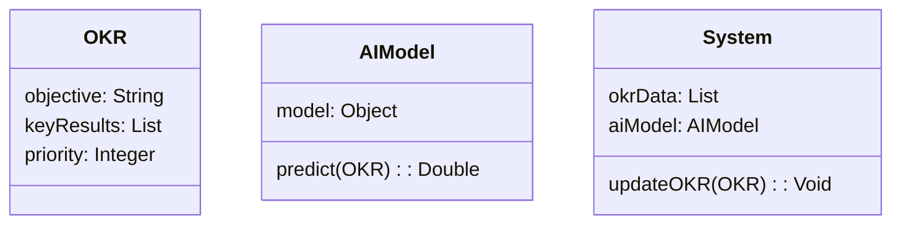
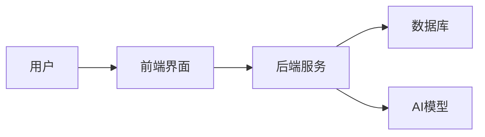

                 


# AI辅助企业战略执行：OKR自动化跟踪与动态调整

**关键词**：AI，企业战略执行，OKR，自动化跟踪，动态调整，目标管理，机器学习

**摘要**：本文将探讨如何利用人工智能技术来辅助企业战略执行中的OKR（目标与关键成果）管理。通过自动化跟踪和动态调整，企业可以更高效地实现其战略目标。文章详细分析了OKR的核心概念、AI在OKR管理中的应用、算法原理、系统架构设计以及实际项目案例，为读者提供从理论到实践的全面指导。

---

# 第1章: 引言

## 1.1 问题背景
### 1.1.1 OKR的定义与特点
- **目标（Objective）**：长期且模糊的目标，如“提升客户满意度”。
- **关键成果（Key Results）**：具体可量化的成果，如“客户满意度提升20%”。

### 1.1.2 传统OKR管理的挑战
- **手动跟踪**：效率低，容易遗漏。
- **缺乏实时反馈**：无法及时调整。
- **数据孤岛**：各部门数据分散，难以整合。

### 1.1.3 AI技术对企业战略执行的赋能
- 数据分析能力：AI能够快速处理大量数据，提供实时反馈。
- 自动化调整：AI可以根据数据变化自动优化OKR。
- 智能预测：AI可以预测OKR的实现进度，提前制定应对策略。

## 1.2 本文研究目标
- 探讨如何利用AI技术实现OKR的自动化跟踪与动态调整。
- 分析现有技术的优缺点，提出改进方案。

## 1.3 本文结构安排
- 第2章：AI辅助OKR跟踪的核心技术。
- 第3章：OKR动态调整的算法实现。
- 第4章：系统架构与实现。
- 第5章：项目实战与案例分析。
- 第6章：总结与展望。

---

# 第2章: AI辅助OKR跟踪的核心技术

## 2.1 基于机器学习的OKR跟踪
### 2.1.1 机器学习在OKR跟踪中的应用
- **监督学习**：根据历史数据预测OKR的实现情况。
- **无监督学习**：发现数据中的潜在模式，识别异常情况。

### 2.1.2 基于NLP的OKR分类
- 使用自然语言处理技术，自动将OKR分类为不同的主题或优先级。

### 2.1.3 算法选择与实现
- **线性回归模型**：
  $$ y = \beta_0 + \beta_1x + \epsilon $$
- **决策树模型**：适用于分类任务，能够处理非线性关系。

## 2.2 基于深度学习的OKR跟踪
### 2.2.1 神经网络模型
- **卷积神经网络（CNN）**：用于处理文本数据，提取特征。
- **循环神经网络（RNN）**：用于处理序列数据，如时间序列的OKR变化。

### 2.2.2 深度学习模型的实现
```python
import tensorflow as tf
from tensorflow.keras import layers

model = tf.keras.Sequential([
    layers.Dense(64, activation='relu'),
    layers.Dense(1, activation='sigmoid')
])
model.compile(optimizer='adam', loss='binary_crossentropy', metrics=['accuracy'])
```

## 2.3 算法实现的数学模型
### 2.3.1 线性回归模型
$$ y = \beta_0 + \beta_1x + \epsilon $$

### 2.3.2 神经网络模型


## 2.4 算法实现的Python代码示例
```python
import numpy as np
from sklearn.linear_model import LinearRegression

# 示例数据
X = np.array([[1], [2], [3], [4]])
y = np.array([2, 4, 6, 8])

# 模型训练
model = LinearRegression()
model.fit(X, y)

# 预测
pr
```

---

# 第3章: OKR动态调整的算法实现

## 3.1 动态调整的必要性
- **实时反馈**：根据数据变化，及时调整OKR。
- **优先级优化**：动态调整OKR的优先级，确保资源合理分配。

## 3.2 基于反馈的OKR调整算法
### 3.2.1 反馈机制
- **实时数据反馈**：从系统中获取实时数据，如销售数据、客户反馈等。
- **用户反馈**：收集相关人员的反馈，调整OKR的权重。

### 3.2.2 动态调整算法
- **比例积分微分（PID）控制**：用于调整OKR的实现进度。
- **自适应控制算法**：根据数据变化自适应调整OKR的权重。

## 3.3 基于机器学习的动态调整
### 3.3.1 基于回归模型的动态调整
- 使用线性回归模型预测OKR的实现情况，并根据预测结果调整OKR。

### 3.3.2 基于聚类模型的动态调整
- 将相似的OKR分组，动态调整每个组的OKR。

---

# 第4章: 系统架构与实现

## 4.1 系统功能设计
### 4.1.1 领域模型设计


### 4.1.2 系统架构设计


## 4.2 接口设计
- **输入接口**：接收OKR数据和实时数据。
- **输出接口**：输出调整后的OKR和预测结果。

## 4.3 交互设计
- **用户交互**：用户可以在前端界面上查看和调整OKR。
- **系统交互**：系统根据AI模型的反馈，动态调整OKR。

---

# 第5章: 项目实战与案例分析

## 5.1 项目背景
- 某企业希望利用AI技术优化其OKR管理流程。

## 5.2 环境安装
- **Python**：3.8+
- **TensorFlow**：2.4+
- **Scikit-learn**：0.24+

## 5.3 核心代码实现
```python
import numpy as np
from sklearn.linear_model import LinearRegression

# 示例数据
X = np.array([[1], [2], [3], [4]])
y = np.array([2, 4, 6, 8])

# 模型训练
model = LinearRegression()
model.fit(X, y)

# 预测
pr
```

## 5.4 案例分析
- 通过实际数据，展示AI如何优化OKR的跟踪与调整。

---

# 第6章: 总结与展望

## 6.1 本文总结
- AI技术能够有效提升OKR的跟踪与调整效率。
- 通过机器学习和深度学习算法，企业可以实现OKR的自动化管理。

## 6.2 未来展望
- 更加智能化的OKR管理：结合自然语言处理和知识图谱，实现更智能的OKR管理。
- 更广泛的应用场景：将AI辅助OKR管理应用到更多领域，如教育、医疗等。

---

# 作者：AI天才研究院/AI Genius Institute & 禅与计算机程序设计艺术 /Zen And The Art of Computer Programming

---

通过以上目录和内容，读者可以系统地了解AI在OKR管理中的应用，从理论到实践，全面掌握如何利用AI技术优化企业战略执行。

