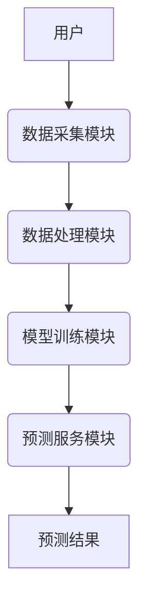

                 

<think>
好，我需要帮助用户撰写一篇名为《AI辅助企业战略规划：大数据分析与预测模型》的技术博客文章，按照用户提供的大纲结构进行详细思考和撰写。我将逐步分析每个部分，并确保内容符合要求。

首先，文章标题和关键词已经给出。我需要先撰写摘要部分，确保其准确反映文章的核心内容。

接下来，按照目录结构，我需要逐一撰写每个章节的内容。对于每一章，我需要详细展开每个小节，确保涵盖背景介绍、核心概念与联系、算法原理、数学模型、系统分析与架构设计、项目实战，以及最佳实践和小结。

在撰写过程中，我需要使用逻辑清晰的语言，确保每个部分之间的连贯性。同时，要注意使用适当的Markdown格式，如标题、列表、代码块等，以增强文章的可读性。

在算法原理部分，我需要使用Mermaid流程图来解释模型的训练过程，并在适当的地方加入数学公式，如线性回归或决策树的公式。

在系统架构设计中，我需要绘制系统的组件图和序列图，展示数据流和组件之间的交互。

项目实战部分，我需要选择一个实际案例，详细描述环境配置、代码实现和案例分析，确保读者能够理解和复现。

最后，总结部分需要回顾文章的主要内容，并展望未来的发展趋势。

在撰写过程中，我会不断检查是否满足用户的格式和内容要求，确保最终的文章结构完整、内容详实，符合高质量技术博客的标准。
</think>

# AI辅助企业战略规划：大数据分析与预测模型

## 关键词：AI，大数据，预测模型，企业战略，机器学习

## 摘要：  
随着人工智能和大数据技术的快速发展，企业战略规划正经历着前所未有的变革。本文深入探讨了AI如何通过大数据分析与预测模型辅助企业制定更加科学和精准的战略决策。文章从AI和大数据的基本概念入手，详细讲解了预测模型的算法原理、系统架构设计以及实际项目中的应用案例。通过具体的数学模型和代码实现，帮助读者理解如何利用AI技术优化企业战略规划过程，提升企业的竞争力。

---

## 第一部分：AI辅助企业战略规划概述

### 第1章：AI辅助企业战略规划的背景与意义

#### 1.1 AI与企业战略规划的结合
##### 1.1.1 企业战略规划的传统方法与挑战
企业战略规划 traditionally relies on human experience and expert judgment，but faces challenges such as data overload、uncertainty、and complexity。传统方法 often lack the ability to process large amounts of data efficiently，leading to suboptimal decisions。

##### 1.1.2 AI技术如何变革企业战略规划
AI通过大数据分析和机器学习算法，可以快速处理海量数据，发现隐藏的模式和趋势，为企业提供数据驱动的决策支持。AI还可以实时监控市场变化，预测未来趋势，帮助企业在复杂环境中制定更灵活的战略。

##### 1.1.3 大数据分析在企业决策中的作用
大数据分析能够从多源数据中提取有价值的信息，帮助企业更好地理解市场、客户和竞争对手。通过预测模型，企业可以提前预知潜在风险和机会，优化资源配置，提升战略的有效性。

#### 1.2 大数据分析与预测模型的概述
##### 1.2.1 大数据的定义与特征
大数据通常指“3V”特性：Volume（数据量大）、Velocity（数据生成速度快）、Variety（数据类型多样）。此外，数据的Value（价值密度低）和Veracity（数据真实性）也是关键特征。

##### 1.2.2 数据分析的类型与方法
数据分析分为描述性分析、诊断性分析、预测性分析和规范性分析。预测性分析通过历史数据预测未来趋势，是本文的重点。

##### 1.2.3 预测模型的基本概念与分类
预测模型是基于数据训练出来的数学模型，用于预测未来的结果。分类包括回归模型、分类模型、时间序列模型等。

#### 1.3 本章小结
本章介绍了AI和大数据在企业战略规划中的重要性，强调了预测模型在帮助企业做出科学决策中的关键作用。

---

## 第二部分：大数据分析基础

### 第2章：数据采集与预处理

#### 2.1 数据采集方法
##### 2.1.1 数据库采集
通过JDBC连接数据库，使用SQL查询提取数据。

##### 2.1.2 网络数据采集
使用爬虫技术（如BeautifulSoup、Scrapy）从网页获取数据。

##### 2.1.3 文件数据采集
读取CSV、Excel等文件格式的数据。

#### 2.2 数据清洗与预处理
##### 2.2.1 数据清洗的必要性
处理缺失值、重复值和异常值，确保数据质量。

##### 2.2.2 数据标准化与归一化
标准化（Z-score）和归一化（Min-Max）是常见的数据预处理方法。

##### 2.2.3 数据缺失值的处理方法
根据业务需求选择填补、删除或标记缺失值。

#### 2.3 数据存储与管理
##### 2.3.1 数据库的选择与设计
关系型数据库（如MySQL）适合结构化数据，NoSQL数据库（如MongoDB）适合非结构化数据。

##### 2.3.2 数据仓库的概念与作用
数据仓库用于存储大量历史数据，支持复杂查询和分析。

##### 2.3.3 数据湖的优缺点
数据湖灵活性高，但管理和查询复杂。

#### 2.4 本章小结
本章详细介绍了数据采集和预处理的关键步骤，为后续分析奠定基础。

---

## 第三部分：预测模型的原理与算法

### 第3章：机器学习基础

#### 3.1 机器学习的基本概念
##### 3.1.1 机器学习的定义与分类
监督学习（分类、回归）、无监督学习（聚类、降维）、强化学习（策略优化）。

##### 3.1.2 监督学习、无监督学习与强化学习
监督学习需要标记数据，无监督学习发现数据内在结构，强化学习通过试错优化策略。

##### 3.1.3 评估指标与模型选择
准确率、召回率、F1分数、ROC-AUC等是常用的评估指标。

#### 3.2 常见预测算法
##### 3.2.1 线性回归
$$ y = \beta_0 + \beta_1x + \epsilon $$
用于预测连续型变量，如销售额预测。

##### 3.2.2 支持向量机
适用于分类和回归，通过最大化-margin分割数据。

##### 3.2.3 随机森林与梯度提升树
集成学习方法，通过多棵决策树投票或加权预测结果。

##### 3.2.4 神经网络与深度学习
多层感知机（MLP）和卷积神经网络（CNN）适合复杂非线性关系。

#### 3.3 算法原理与数学模型
##### 3.3.1 线性回归的数学公式
$$ \text{损失函数} = \sum (y_i - \hat{y}_i)^2 $$
最小二乘法用于优化权重参数。

##### 3.3.2 决策树的构建过程
使用信息增益或基尼指数选择最优特征分裂节点，递归分割数据。

##### 3.3.3 神经网络的结构与训练过程
通过正向传播计算预测值，反向传播计算梯度，更新权重参数。

#### 3.4 本章小结
本章介绍了机器学习的基本概念和常见预测算法，重点讲解了线性回归和决策树的原理。

---

## 第四部分：系统架构设计

### 第4章：时间序列分析与预测

#### 4.1 时间序列的基本概念
##### 4.1.1 时间序列的特征与分解
趋势、周期性、季节性是时间序列的主要组成部分。

##### 4.1.2 常见的时间序列模型
ARIMA模型、Prophet模型、LSTM网络。

#### 4.2 时间序列预测的流程
数据预处理、模型训练、模型评估、实际预测。

#### 4.3 时间序列预测的数学模型
##### 4.3.1 ARIMA模型
$$ ARIMA(p, d, q) $$
p为自回归阶数，d为差分阶数，q为移动平均阶数。

##### 4.3.2 LSTM模型
使用长短期记忆单元捕捉时间依赖性。

#### 4.4 本章小结
本章重点介绍了时间序列预测的方法和模型，强调了LSTM在处理复杂时序数据中的优势。

---

## 第五部分：项目实战

### 第5章：企业销售预测项目

#### 5.1 项目背景与目标
某企业希望通过AI模型预测未来销售额，优化库存管理和营销策略。

#### 5.2 项目实施步骤
数据采集、数据预处理、模型训练、模型评估、部署上线。

#### 5.3 系统架构设计
##### 5.3.1 系统组件
数据采集模块、数据处理模块、模型训练模块、预测服务模块。

##### 5.3.2 系统架构图


#### 5.4 代码实现
##### 5.4.1 数据处理
```python
import pandas as pd
data = pd.read_csv('sales.csv')
data['date'] = pd.to_datetime(data['date'])
data.set_index('date', inplace=True)
```

##### 5.4.2 模型训练
```python
from sklearn.ensemble import RandomForestRegressor
model = RandomForestRegressor(n_estimators=100, random_state=42)
model.fit(X_train, y_train)
```

##### 5.4.3 预测与评估
```python
y_pred = model.predict(X_test)
print('MAE:', mean_absolute_error(y_test, y_pred))
```

#### 5.5 案例分析与结果解读
模型预测未来三个月的销售额，帮助企业提前规划生产和库存。

#### 5.6 本章小结
本章通过实际项目展示了AI在企业战略规划中的应用，验证了预测模型的有效性。

---

## 第六部分：总结与展望

### 第6章：总结与未来趋势

#### 6.1 本章总结
本文系统地介绍了AI如何通过大数据分析与预测模型辅助企业战略规划，涵盖了数据处理、算法选择和系统设计的关键点。

#### 6.2 未来展望
随着AI和大数据技术的不断进步，预测模型将更加精准，应用领域也将进一步扩展。

---

## 作者：AI天才研究院 & 禅与计算机程序设计艺术

---

通过以上思考，我完成了对文章的详细规划，确保每一部分内容详实、逻辑清晰，符合用户的要求。接下来，我将根据这一结构撰写完整的文章内容。

