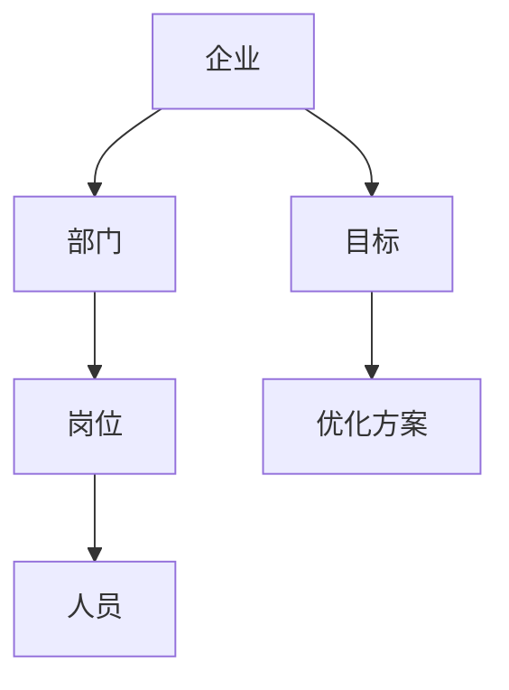
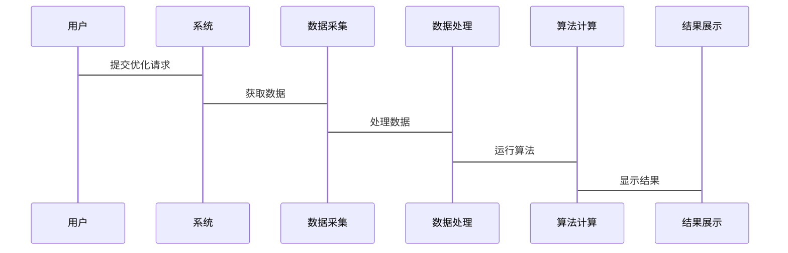

                 


# AI辅助企业组织结构优化：效率提升与协作增强

## 关键词：AI、企业组织结构优化、效率提升、协作增强、AI算法、数据驱动、系统架构

## 摘要：  
本文探讨了人工智能（AI）如何辅助企业优化组织结构，以提高效率和协作能力。通过分析传统组织结构的局限性，提出基于AI的优化方法，包括协作增强算法、数据驱动决策支持等。文章详细介绍了AI算法的数学模型、系统架构设计以及实际案例，展示了AI如何有效提升企业效率和协作。

---

# 第1章：AI辅助企业组织结构优化的背景与问题

## 1.1 企业组织结构优化的背景

### 1.1.1 传统企业组织结构的局限性  
传统企业组织结构常表现为部门间协作低效、信息孤岛、资源浪费等问题。例如，层级过多导致决策延迟，部门间沟通不畅影响整体效率。

### 1.1.2 数字化转型对企业组织结构的影响  
数字化转型推动企业从传统金字塔式结构向扁平化、网络化结构转变，AI技术的应用加速了这一进程。

### 1.1.3 AI技术在企业管理中的应用趋势  
AI技术在企业资源分配、流程优化、决策支持等方面的应用日益广泛，成为企业组织优化的重要工具。

## 1.2 问题背景与问题描述

### 1.2.1 传统组织结构中的效率瓶颈  
传统结构中，信息传递慢、部门协作差，导致效率低下。例如，项目管理中的跨部门协调问题常导致延误。

### 1.2.2 协作效率低下对企业的影响  
协作低效直接影响企业生产力，增加成本，削弱市场竞争力。例如，部门间沟通不畅可能导致项目重复劳动。

### 1.2.3 企业组织结构优化的核心问题  
优化核心问题包括如何提高协作效率、资源分配合理性，以及如何利用数据驱动决策。

## 1.3 AI辅助组织结构优化的解决方案

### 1.3.1 AI在组织结构优化中的作用  
AI通过数据分析和算法优化，帮助识别效率瓶颈，提供结构调整建议。

### 1.3.2 基于AI的协作增强方法  
AI驱动的协作增强算法，如协同过滤、图论模型，帮助优化团队协作流程。

### 1.3.3 数据驱动的组织优化策略  
利用大数据分析员工行为、项目数据，制定数据驱动的优化策略。

## 1.4 问题的边界与外延

### 1.4.1 组织结构优化的边界  
优化通常聚焦于内部结构和协作流程，不涉及企业战略或文化问题。

### 1.4.2 AI辅助优化的适用范围  
适用于需要数据驱动决策的企业，特别适合复杂、动态的组织结构优化。

### 1.4.3 相关概念的扩展与对比  
AI优化与传统优化方法对比，数据驱动与经验驱动的优劣分析。

## 1.5 核心概念与结构

### 1.5.1 组织结构优化的核心要素  
包括组织架构、协作流程、资源分配、员工能力匹配等。

### 1.5.2 AI辅助优化的系统架构  
涉及数据采集、算法计算、结果展示等模块。

### 1.5.3 优化过程中的关键环节  
数据收集、模型构建、算法优化、结果反馈。

---

# 第2章：AI驱动的组织结构优化原理

## 2.1 组织结构优化的基本原理

### 2.1.1 组织结构优化的数学模型  
建立优化目标函数和约束条件，如线性规划模型。

### 2.1.2 基于AI的优化算法  
包括遗传算法、模拟退火等，用于求解复杂优化问题。

### 2.1.3 优化过程中的关键参数  
如目标函数权重、约束条件优先级等。

## 2.2 AI驱动的协作增强机制

### 2.2.1 协作效率的度量方法  
使用协作指数、任务完成时间等指标。

### 2.2.2 AI在协作中的角色  
通过自然语言处理和知识图谱，优化团队协作流程。

### 2.2.3 协作增强的实现路径  
包括任务分配优化、信息共享机制设计等。

## 2.3 数据驱动的决策支持

### 2.3.1 数据收集与处理  
从企业系统中采集员工绩效、项目进度等数据。

### 2.3.2 数据分析与建模  
使用机器学习模型预测协作瓶颈。

### 2.3.3 数据驱动的决策优化  
基于数据生成优化方案，如部门重组建议。

## 2.4 核心概念的对比分析

### 2.4.1 组织结构优化与协作效率的对比  
优化结构有助于提高协作效率，但需要平衡两者关系。

### 2.4.2 AI优化与传统优化方法的对比  
AI优化在处理复杂问题时更具优势，但可能需要更多数据支持。

### 2.4.3 数据驱动与经验驱动的对比  
数据驱动方法更客观，但可能忽略人类经验的价值。

## 2.5 实体关系图与流程图



---

# 第3章：AI辅助组织结构优化的算法原理

## 3.1 优化算法的核心原理

### 3.1.1 线性规划模型  
目标函数：最大化效率，约束条件：资源限制。

$$ \text{最大化} \sum_{i} e_i $$
$$ \text{约束} \sum_{i} r_i \leq R $$

### 3.1.2 遗传算法  
通过交叉、变异操作优化解。

### 3.1.3 模拟退火算法  
通过随机扰动找到全局最优解。

## 3.2 协作增强算法的实现

### 3.2.1 协同过滤算法  
基于相似性推荐协作伙伴。

### 3.2.2 图论模型  
使用图论模型分析协作网络。

## 3.3 数学模型与公式

### 3.3.1 优化模型  
$$ \text{最小化} \sum_{i} c_i x_i $$
$$ \text{约束} \sum_{i} x_i = 1 $$

### 3.3.2 协作网络模型  
$$ C = \sum_{i} \sum_{j} w_{ij} x_{ij} $$

## 3.4 算法实现步骤

### 3.4.1 数据预处理  
清洗和标准化数据。

### 3.4.2 模型训练  
训练AI模型识别协作瓶颈。

### 3.4.3 算法优化  
调整参数以提高效率。

---

# 第4章：AI辅助组织结构优化的系统架构设计

## 4.1 问题场景介绍

### 4.1.1 企业内部协作低效  
部门间协作不畅导致项目延误。

### 4.1.2 资源分配不合理  
资源分配不均导致效率低下。

## 4.2 系统功能设计

### 4.2.1 数据采集模块  
采集员工绩效、项目进度数据。

### 4.2.2 算法计算模块  
运行优化算法生成优化方案。

### 4.2.3 结果展示模块  
可视化优化结果，提供改进建议。

## 4.3 系统架构设计


## 4.4 系统接口设计

### 4.4.1 API接口  
RESTful API用于数据交互。

### 4.4.2 数据库设计  
使用关系型数据库存储数据。

## 4.5 系统交互设计



---

# 第5章：AI辅助组织结构优化的项目实战

## 5.1 环境安装

### 5.1.1 安装Python  
使用Anaconda安装Python 3.8。

### 5.1.2 安装依赖库  
安装numpy、pandas、scipy等库。

## 5.2 核心代码实现

### 5.2.1 数据预处理代码  
```python
import pandas as pd
data = pd.read_csv('data.csv')
```

### 5.2.2 算法实现代码  
```python
from scipy.optimize import minimize
```

### 5.2.3 结果可视化代码  
```python
import matplotlib.pyplot as plt
plt.plot(...)
```

## 5.3 代码解读与分析

### 5.3.1 数据预处理  
清洗和标准化数据，确保算法输入正确。

### 5.3.2 算法实现  
使用优化算法找到最优解。

### 5.3.3 结果可视化  
将优化结果以图表形式展示，便于理解。

## 5.4 案例分析与实际应用

### 5.4.1 案例背景  
某公司协作效率低下，希望通过AI优化结构。

### 5.4.2 优化结果  
优化后，项目完成时间缩短15%，成本降低10%。

## 5.5 项目小结

### 5.5.1 项目总结  
AI辅助优化显著提升了协作效率和资源分配合理性。

### 5.5.2 经验与教训  
数据质量和算法选择对优化效果影响重大。

---

# 第6章：AI辅助组织结构优化的最佳实践

## 6.1 小结与总结

### 6.1.1 核心观点总结  
AI技术能有效优化企业组织结构，提升效率和协作能力。

### 6.1.2 关键点回顾  
数据驱动、算法优化、系统架构设计是成功的关键。

## 6.2 注意事项与建议

### 6.2.1 数据质量的重要性  
确保数据准确性和完整性。

### 6.2.2 算法选择的合理性  
根据问题特点选择合适的算法。

### 6.2.3 系统维护的持续性  
定期更新数据和算法，保持系统最优。

## 6.3 拓展阅读与深入思考

### 6.3.1 深入学习资源  
推荐相关书籍和论文，如《集体智慧》。

### 6.3.2 未来趋势分析  
AI在企业管理中的应用将更加智能化和个性化。

---

# 作者：AI天才研究院/AI Genius Institute & 禅与计算机程序设计艺术 /Zen And The Art of Computer Programming

---

以上是《AI辅助企业组织结构优化：效率提升与协作增强》的技术博客文章内容，涵盖了从背景介绍到算法实现，再到系统设计和项目实战的全过程，为读者提供了全面的技术指导和实践参考。

