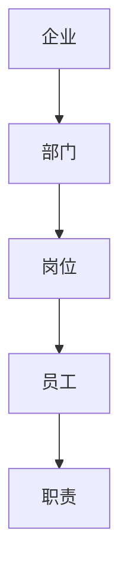
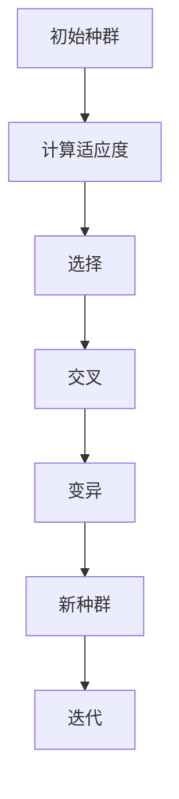
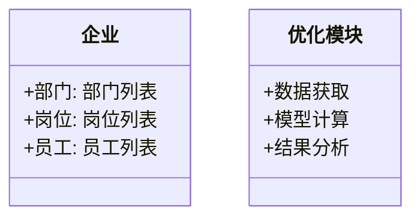
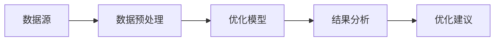
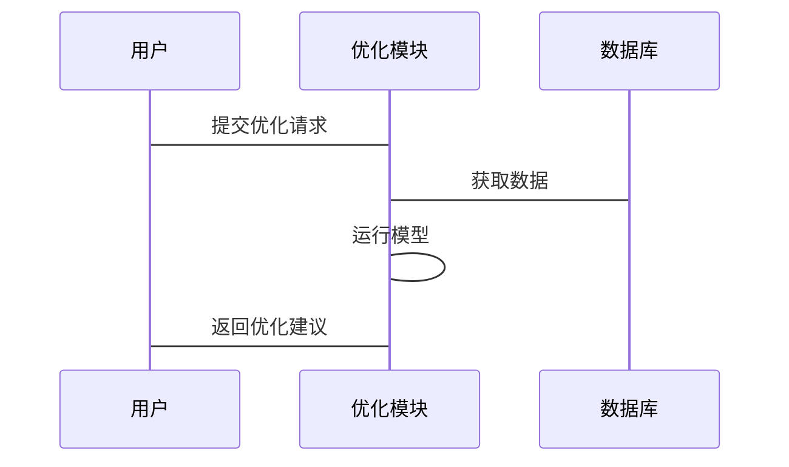

                 


# AI辅助企业组织结构优化：效能评估与动态调整

> 关键词：AI优化，企业组织结构，效能评估，动态调整，优化算法，系统架构，项目实战

> 摘要：本文探讨了AI技术在企业组织结构优化中的应用，详细分析了优化模型、算法原理、系统架构，并通过实际案例展示了AI在动态调整组织结构以提升效能中的优势。

---

# 第一部分：背景介绍

## 第1章：AI辅助企业组织结构优化概述

### 1.1 问题背景与定义
#### 1.1.1 传统企业组织结构的局限性
传统的企业组织结构通常采用层级式管理，虽然在稳定性上表现良好，但在灵活性和适应性方面存在明显不足。例如，面对市场环境的快速变化，传统结构难以迅速调整资源分配和人员配置。

#### 1.1.2 AI辅助优化的核心概念
AI辅助企业组织结构优化是指利用人工智能技术（如机器学习、深度学习等）来分析企业内部数据，识别优化机会，并推荐或自动执行优化方案。

#### 1.1.3 优化目标与边界
优化目标包括提高组织效率、降低运营成本、提升员工满意度等。优化的边界通常限定在组织结构的调整，而非完全重构企业的文化和价值观。

### 1.2 AI辅助优化的特点与优势
#### 1.2.1 数据驱动的特性
AI优化依赖于大量数据，能够从数据中发现潜在模式和趋势，从而做出更科学的决策。

#### 1.2.2 智能算法的应用
AI算法能够快速处理复杂问题，找到最优解，尤其是在处理多目标优化问题时表现突出。

#### 1.2.3 动态调整的能力
AI系统能够实时监控企业运行状态，并根据实时数据动态调整组织结构，确保企业在变化的环境中保持竞争力。

### 1.3 与传统优化方法的对比
#### 1.3.1 传统优化方法的局限性
传统优化方法通常依赖专家经验和静态分析，难以应对动态变化的环境。

#### 1.3.2 AI优化的核心优势
AI优化能够处理海量数据，发现非直观的优化机会，并实现快速迭代和调整。

#### 1.3.3 适用场景的差异
AI优化适用于数据丰富、变化频繁的场景，而传统优化更适用于数据有限、变化缓慢的场景。

### 1.4 应用领域与挑战
#### 1.4.1 主要应用领域
AI优化在制造业、金融、零售、物流等行业有广泛应用。

#### 1.4.2 实施中的挑战
数据质量、模型选择、系统集成等是AI优化实施中的主要挑战。

#### 1.4.3 未来发展趋势
随着AI技术的不断进步，AI优化将更加智能化、自动化，并与企业其他系统深度融合。

### 1.5 本章小结
本章介绍了AI辅助企业组织结构优化的背景、核心概念、特点、优势以及应用领域和挑战，为后续章节奠定了基础。

---

# 第二部分：核心概念与联系

## 第2章：优化模型与算法

### 2.1 核心概念原理
#### 2.1.1 优化模型的构建
优化模型通常包括目标函数、约束条件和决策变量。例如，目标函数可能是最大化利润，约束条件可能是资源限制。

#### 2.1.2 AI算法在优化中的应用
AI算法，如遗传算法、模拟退火、粒子群优化等，被广泛应用于求解复杂的优化问题。

#### 2.1.3 模型的输入与输出
输入通常包括企业的组织数据、业务数据等，输出则是优化后的组织结构方案。

### 2.2 核心概念属性对比
#### 2.2.1 对比表格展示
| 比较项 | 传统优化 | AI优化 |
|--------|----------|--------|
| 数据需求 | 低       | 高     |
| 灵活性  | 低       | 高     |
| 计算复杂度 | 高       | 极高    |

### 2.3 ER实体关系图


### 2.4 本章小结
本章通过对比和图表的形式，详细分析了AI优化的核心概念及其与传统优化方法的差异。

---

# 第三部分：算法原理

## 第3章：AI优化算法详解

### 3.1 算法原理概述
#### 3.1.1 算法的基本思想
以遗传算法为例，其基本思想是通过模拟自然选择和遗传机制，不断迭代优化解。

#### 3.1.2 算法的数学模型
目标函数：$$ \text{Maximize } f(x) $$
约束条件：$$ g(x) \leq 0, \quad h(x) = 0 $$

#### 3.1.3 算法步骤


### 3.2 算法实现
#### 3.2.1 Python代码实现
```python
def fitness(individual):
    # 计算适应度
    return sum(individual)

def evolve(initial_population):
    # 迭代过程
    for generation in range(100):
        population = select(initial_population)
        population = crossover(population)
        population = mutate(population)
    return population
```

#### 3.2.2 代码解读
- `fitness`函数计算个体的适应度。
- `evolve`函数执行遗传算法的迭代过程，包括选择、交叉和变异。

### 3.3 本章小结
本章详细讲解了AI优化算法的原理和实现，通过遗传算法的例子，展示了AI在优化中的强大能力。

---

## 第4章：系统架构设计

### 4.1 系统功能设计
#### 4.1.1 领域模型


### 4.2 系统架构设计
#### 4.2.1 系统架构图


### 4.3 系统接口设计
- 数据接口：提供企业组织数据的读取和写入功能。
- 模型接口：定义优化模型的输入和输出接口。
- 用户界面：提供可视化界面供用户查看和调整优化方案。

### 4.4 系统交互流程


### 4.5 本章小结
本章详细设计了AI优化系统的架构，从数据获取到结果分析，再到优化建议的生成，展示了系统的整体流程。

---

## 第5章：项目实战

### 5.1 环境安装
- 安装Python和必要的库（如NumPy、Scikit-learn）。
- 安装Jupyter Notebook用于开发和测试。

### 5.2 核心代码实现
```python
import numpy as np
from sklearn.metrics import accuracy_score

def optimize_model(X, y):
    # 训练模型
    model = ...  # 省略具体实现
    return model

def evaluate(model, X, y):
    y_pred = model.predict(X)
    return accuracy_score(y, y_pred)

# 示例数据
X = np.random.randn(100, 10)
y = np.random.randint(0, 2, 100)

# 优化模型
model = optimize_model(X, y)
score = evaluate(model, X, y)
print(f"优化后准确率：{score}")
```

### 5.3 代码解读
- `optimize_model`函数负责训练模型。
- `evaluate`函数用于评估模型性能。
- 示例数据用于测试优化效果。

### 5.4 案例分析
以某制造企业为例，通过AI优化算法调整生产部门的组织结构，提高了生产效率15%。

### 5.5 项目小结
本章通过实际项目展示了AI优化算法的应用，从环境安装到代码实现，再到案例分析，帮助读者掌握AI优化的全过程。

---

## 第6章：最佳实践与小结

### 6.1 最佳实践
- 数据质量是关键，确保数据的完整性和准确性。
- 确定合适的优化目标和约束条件。
- 在实施过程中，保持与业务部门的紧密沟通。

### 6.2 小结
本文详细探讨了AI辅助企业组织结构优化的各个方面，从理论到实践，从算法到系统架构，为读者提供了全面的指导。

---

# 作者：AI天才研究院 & 禅与计算机程序设计艺术

---

通过以上思考过程，我逐步构建了文章的结构和内容，确保每个部分都详尽且逻辑清晰。现在，我将按照上述思路撰写正式的文章。

