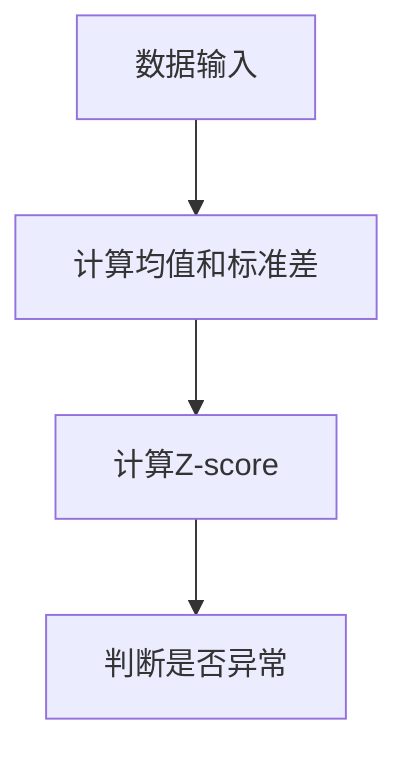
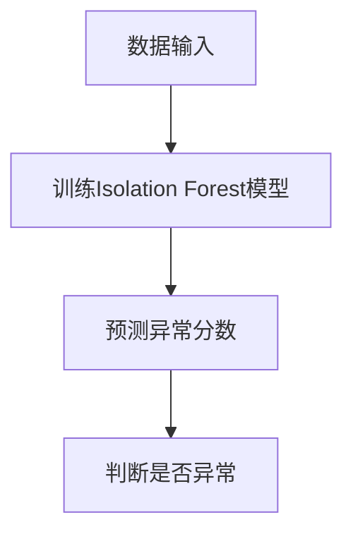
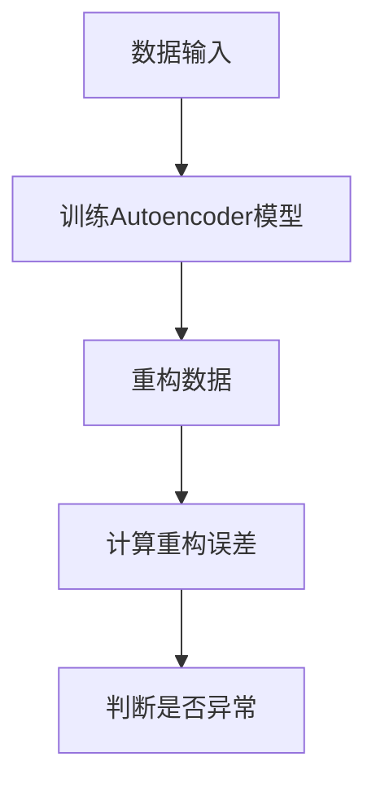
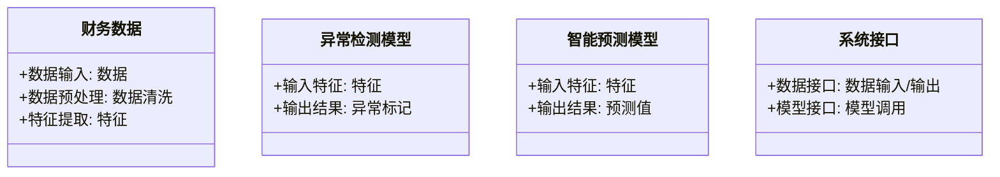
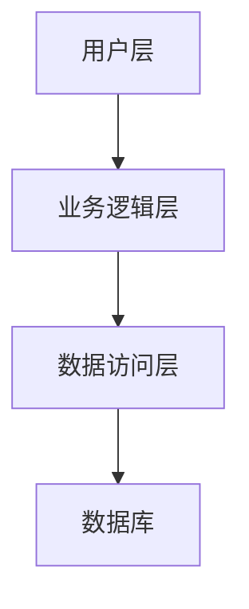

                 

# AI辅助企业财务分析：异常检测与智能财务预测

> 关键词：AI辅助，企业财务分析，异常检测，智能预测，机器学习，深度学习

> 摘要：随着人工智能技术的快速发展，企业财务分析正在经历一场深刻的变革。通过结合异常检测和智能预测，AI能够显著提升财务分析的效率和准确性。本文将系统地探讨AI在企业财务分析中的应用，从技术基础到实际案例，全面解析如何利用AI技术优化财务预测和异常检测。

---

# 第一部分: AI辅助企业财务分析概述

## 第1章: 企业财务分析与AI的结合

### 1.1 企业财务分析的基本概念

#### 1.1.1 财务分析的定义与目的
财务分析是通过对企业的财务数据（如资产负债表、利润表、现金流量表等）进行分析，评估企业的财务状况、经营成果和未来发展趋势。其目的是为企业决策者提供数据支持，帮助其优化资源配置、防范财务风险。

#### 1.1.2 企业财务分析的核心内容
- **财务状况分析**：评估企业的资产、负债和所有者权益。
- **经营成果分析**：分析企业的收入、成本和利润。
- **现金流量分析**：评估企业的现金流情况。

#### 1.1.3 AI在财务分析中的应用价值
AI技术能够快速处理大量财务数据，发现隐藏的规律，帮助财务分析师做出更精准的预测和决策。

---

### 1.2 AI技术的基本原理

#### 1.2.1 人工智能的定义与分类
人工智能（AI）是模拟人类智能的计算机系统，主要分为弱人工智能（专注于特定任务）和强人工智能（具备广泛智能）。

#### 1.2.2 机器学习的基本概念
机器学习是一种AI技术，通过数据训练模型，使其能够从数据中学习并做出预测或决策。常用算法包括线性回归、支持向量机（SVM）、随机森林等。

#### 1.2.3 深度学习与自然语言处理的简介
深度学习是机器学习的一种，通过多层神经网络处理数据。自然语言处理（NLP）则用于处理文本数据，帮助从财务报告中提取信息。

---

### 1.3 AI辅助财务分析的背景与趋势

#### 1.3.1 传统财务分析的局限性
传统财务分析依赖人工处理，效率低、易出错，难以应对海量数据。

#### 1.3.2 AI技术对企业财务分析的革新
AI能够快速处理大量数据，发现隐藏的模式，提升分析效率和准确性。

#### 1.3.3 行业趋势与未来展望
AI在财务分析中的应用将更加广泛，特别是在异常检测和智能预测方面。

---

# 第二部分: AI辅助财务分析的技术基础

## 第3章: 数据预处理与特征工程

### 3.1 数据清洗与预处理

#### 3.1.1 数据清洗的必要性
财务数据中常存在缺失值、重复值和异常值，这些都需要清洗处理。

#### 3.1.2 数据标准化与归一化
标准化（Z-score）和归一化（Min-Max）是常用的数据预处理方法。

#### 3.1.3 数据缺失值的处理方法
常用方法包括删除缺失值、均值填充和插值法。

---

### 3.2 特征工程的核心步骤

#### 3.2.1 特征选择的基本原理
选择对目标变量影响较大的特征，减少模型的维度。

#### 3.2.2 特征提取的技术方法
通过主成分分析（PCA）等技术提取特征。

#### 3.2.3 特征构建与优化策略
根据业务需求构建新的特征，优化模型性能。

---

## 第4章: 模型选择与评估指标

### 4.1 常见机器学习模型简介

#### 4.1.1 线性回归与逻辑回归
线性回归用于预测连续变量，逻辑回归用于分类问题。

#### 4.1.2 支持向量机与决策树
支持向量机适用于分类问题，决策树适合处理非线性数据。

#### 4.1.3 随机森林与梯度提升树
随机森林和梯度提升树是常用的集成学习方法。

---

### 4.2 深度学习模型的应用

#### 4.2.1 神经网络的基本结构
神经网络由输入层、隐藏层和输出层组成。

#### 4.2.2 LSTM网络在时间序列中的应用
长短期记忆网络（LSTM）适用于时间序列数据的预测。

#### 4.2.3 Transformer模型的优势
Transformer模型在处理序列数据时表现出色。

---

### 4.3 模型评估与调优

#### 4.3.1 评估指标的选择
常用的指标包括准确率、召回率、F1值和AUC。

#### 4.3.2 调参与优化
通过网格搜索等方法优化模型参数。

---

# 第三部分: 异常检测的核心算法与实现

## 第5章: 异常检测的核心算法

### 5.1 基于统计的方法

#### 5.1.1 Z-score方法
通过计算数据点与均值的距离来检测异常值。

#### 5.1.2 算法流程图

### 5.2 基于机器学习的方法

#### 5.2.1 Isolation Forest算法
一种基于树结构的无监督学习算法。

#### 5.2.2 算法流程图

### 5.3 基于深度学习的方法

#### 5.3.1 Autoencoder网络
通过重构数据来检测异常。

#### 5.3.2 算法流程图

---

# 第四部分: 智能财务预测的核心算法与实现

## 第6章: 智能财务预测的核心算法

### 6.1 时间序列预测的数学模型

#### 6.1.1 ARIMA模型
ARIMA（自回归积分滑动平均模型）用于时间序列预测。

#### 6.1.2 LSTM网络
LSTM模型在时间序列预测中表现出色。

### 6.2 机器学习模型的实现

#### 6.2.1 线性回归模型
$$ y = \beta_0 + \beta_1x + \epsilon $$

#### 6.2.2 随机森林模型
随机森林通过集成多个决策树进行预测。

### 6.3 深度学习模型的实现

#### 6.3.1 Transformer模型
Transformer模型在处理长序列数据时效果显著。

---

# 第五部分: 系统设计与实现

## 第7章: 系统架构设计

### 7.1 系统功能设计

#### 7.1.1 领域模型设计

### 7.2 系统架构设计

#### 7.2.1 分层架构

---

# 第六部分: 项目实战

## 第8章: 项目实战：基于AI的财务异常检测与预测系统

### 8.1 项目背景与需求分析

#### 8.1.1 项目背景
企业需要及时发现财务异常，避免潜在风险。

#### 8.1.2 项目需求
构建一个基于AI的财务异常检测与预测系统。

### 8.2 数据准备与模型训练

#### 8.2.1 数据源
使用企业财务报表数据。

#### 8.2.2 数据预处理
清洗数据，提取特征。

### 8.3 模型实现与部署

#### 8.3.1 异常检测模型实现
使用Isolation Forest算法进行异常检测。

#### 8.3.2 智能预测模型实现
使用LSTM网络进行时间序列预测。

---

# 总结与展望

随着AI技术的不断进步，企业财务分析将更加智能化和高效化。未来，结合更先进的算法和更强大的计算能力，AI在财务分析中的应用将更加广泛和深入。

---

作者：AI天才研究院/AI Genius Institute & 禅与计算机程序设计艺术 /Zen And The Art of Computer Programming

